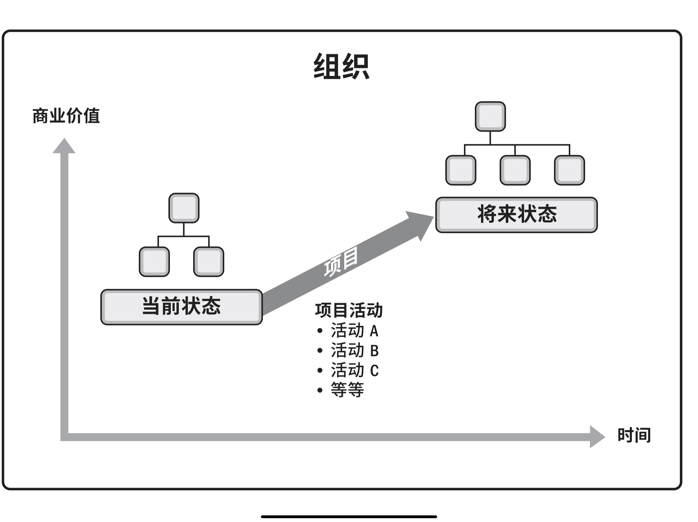
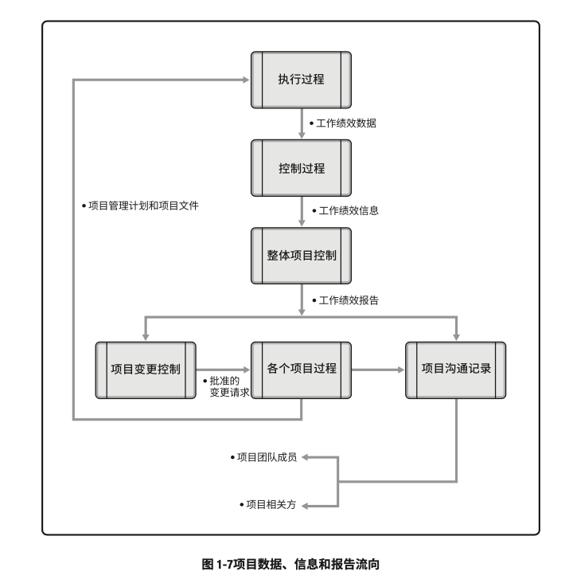

# 引论
## 指南概述和目的

- **项目成果**是**领导者**和**项目经理**在工作中应用**项目管理实践**、**原则**、**过程**、**工具**和**技术**的结果。
- **项目经理**运用一系列**关键技能**和**知识**来满足**客户**和**参与项目**或**受项目影响的其他人**的要求
- PMI:项目管理协会，Project Management Institute
- **项目管理知识体系**（PMBOK，Project Management Body of Knowledge）:描述项目管理专业范围内知识的术语。
	- **项目管理知识体系**包括已被验证并广泛应用的**传统做法**，以及本专业新近涌现的**创新做法**。
- 本《PMBOK<sup>®️</sup>指南》收录项目管理知识体系中被**普遍认可**为“**良好实践**”的那一部分
	- 普遍认可：这些知识和做法在大多数时候适用于大多数项目，并且其价值和有效性已获得一致认可。
	- 良好实践：人们普遍认为，在项目管理过程中使用这些知识、技能、工具和技术，能够达成预期的商业价值和成果，从而提高很多项目成功的可能性。
- 项目经理与项目团队和其他相关方携手合作，共同确定并采用适用于各个项目且被普遍认可的良好实践，确定**过程**、**输入**、**技术**、**输出**和**生命周期阶段的恰当组合**以管理项目的过程，即指本指南所述知识的“裁剪”应用。
- 《PMBOK<sup>®️</sup>指南》与方法论的不同
	- 方法论：由专门的**从业人员采用的**实践、技术、程序和规则所组成的**体系**。
	- 《PMBOK<sup>®️</sup>指南》：组织**制定**实践**项目管理**所需**方法论**、**政策**、**程序**、**规则**、**工具**、**技术**和**生命周期阶段**的**基础**。

1. 项目管理标准

	- 本指南基于《项目管理标准》。
	- 标准：基于权威、惯例或共识而建立并用作模式或范例的文件。
	- 《项目管理标准》
		- 美国国家标准协会（ANSI）的标准。
		- 根据协商一致、开放公开、程序公正和各方平衡等概念予以制定。
		- PMI项目管理专业发展计划和项目管理实践的基本参考资料
	- 由于项目管理需要根据项目需求进行调整，标准和指南均基于描述性实践，而不是规范性实践。
		- 标准确认了大多数时候被大多数项目视作良好实践的过程。
		- 标准确认了通常与这些古城相关的输入和输出。
		- 标准不要求执行任何特定过程或实践。
	- 《项目管理标准》是《项目管理知识体系指南》的第二部分
	- 本指南的范围仅限项目管理领域，而不涉及任何项目组合、项目集和多个项目的领域（仅在与项目有关时才会提及项目组合和项目集）。
	- PMI发布的针对项目组合和项目集的两部标准：
		- 《项目组合管理标准》
		- 《项目集管理标准》

2. 通用词汇

	- 通用词汇：专业学科的基本要素。
	- 《PMI项目管理术语词典》收录了基本的专业词汇，供组织、项目组合、项目集和项目经理及其他项目相关方统一使用。
		- 《术语词典》会随着时间的推移而更改。
	- 本指南的词汇表包含了《术语词典》中的词汇以及其他定义。
	- 项目可能会采用由行业文献定义的相关行业特定的术语。

3. 道德与专业行为规范

	- 《道德与专业行为规范》（由PMI发布）为项目管理专业人员增强了信心并帮助个人做出明智的决策，尤其是在面对被要求违背正直诚信或价值观的困境时。
	- 最重要的价值观：责任、尊重、公正和诚实（由全球项目管理业界定义）
	- 《道德与专业行为规范》包括期望标准和强制标准。
		- 期望标准：描述了身为PMI会员、证书持有者或志愿者的从业者力求遵循的规范。
			- 尽管对期望标准的遵循情况进行衡量并非易事，依照这些标准行事仍是对从业人员专业性的期待，并非可有可无的要求。
		- 强制标准：做出了硬性要求，在某些情况下限制或禁止从业者的某些行为。
			- 身为PMI会员、证书持有者或志愿者以及不依照这些标准行事的从业者将受到PMI道德审查委员会的纪律处罚。
	
## 基本要素

- 描述从事项目管理和了解项目管理领域所需的基本要素

1. 项目

	- 项目：为了创造独特的产品、服务或成果而进行的临时性工作。
		- 项目可以在组织的任何层面上展开。
			- 一个项目可能只涉及一个人，也可能涉及一组人
			- 可能只涉及一个组织单元，也可能涉及多个组织的多个单元
	
	1. 独特的产品、服务或成果
	
		- 开展项目是为了通过可交付成果达成目标
			- 目标：工作所指向的结果，要达到的战略地位，要达到的目的，要取得的成果，要生产的产品，或者准备提供的服务。
			- 可交付成果：在某一过程、阶段或项目完成时，必须产出的任何独特并可核实的产品、成果或服务能力。
				- 可交付成果可能是有形的也可能是无形的。
					1. 一个独特的产品：*可能是其他产品的组成部分、某个产品的升级版或修正版，也可能是其本身就是新的最终产品（例如一个最终产品的缺陷的修正）*
					2. 一个独特的服务或提供某种服务的能力*（如支持生产或配送的业务职能）*
					3. 一项独特的成果：*例如某个结果或文件（如某研究项目所创造的知识，可据此判断某种趋势是否存在，或判断某个新过程是否有益于社会）*
					4. 一个或多个产品、服务或成果的独特组合*（例如一个软件应用程序及其相关文件的帮助中心服务）*
		- 某些项目**可交付成果**和**活动**中可能存在重复的元素，但这种重复并不会改变项目工作本质上的独特性。【如何理解？活动的定义？是项目和项目之间的差异还是同一个项目中的可交付成果与其活动中的元素？】
			- 例如即便采用相同或相似的材料，由相同或不同的团队来建设，但每个建筑项目仍具备独特性（例如位置、设计、环境、情况、参与项目的人员）
	2. 临时性工作
	
		- 项目的“临时性”：项目有明确的起点和终点。（“临时性”并不一定意味着项目的持续时间短）
		- 在以下一种或多种情况下，项目即宣告结束：
			1. 达成项目目标
			2. 不会或不能达到目标
			3. 项目资金缺乏或没有可分配资金
			4. 项目需求不复存在（例如，客户不在要求完成项目，战略或优先级的变更致使项目终止，组织管理层下达种植项目的指示）
			5. 无法获得所需人力或物力资源
			6. 处于法律或便利原因终止项目【如何解释？便利原因】
		- 虽然项目是临时性工作，但其可交付成果可能会在项目的终止后依然存在。
			- 项目可能产生与社会、经济、材料或环境相关的可交付成果。（例如，国家纪念碑建设项目就是要创造一个流传百世的可交付成果）
	
	3. 项目驱动变更
	
		- 项目驱动组织进行变更。
			- 从商业角度来看，项目旨在推动组织从一个状态转到另一个状态，从而达成特定目标。
				
				- 在项目开始之前，通常将此时的组织描述为“当前状态”
				- 项目驱动变更是为了获得期望的结果，即“未来状态”
				- 有些项目可能会创造一个过渡状态，即由多个步骤组成的连续区间，以国度到将来状态。
				- 通过完成项目，组织可以实现将来状态并达成特定目标。
		
	4. 项目创造商业价值
	
		- 商业价值：从商业运作中可获得的可量化净效益。（由PMI定义）
			- 效益可以是有形的、无形的活着两者兼有之。
		- 在商业分析中，商业价值被视为回报，即以某种投入换取时间、资金、货物或无形的回报。
		- 项目的商业价值：特定项目的成果能够为相关方带来的效益。
			- 项目代开的效益可以是有形的、无形的或者两者兼有之
				- 有形效益的例子：
					- 货币资产
					- 股东权益
					- 公共事业
					- 固定设施
					- 工具
					- 市场份额
				- 无形效益的例子：
					- 商誉
					- 品牌认知度
					- 公共利益
					- 商标
					- 战略一致性
					- 声誉
	
	5. 项目启动背景
		
		- 组织领导者启动项目是为了应对影响该组织的因素，这些基本因素说明了项目背景。
		- 基本因素的分类
			1. 符合法规、法律或社会要求
			2. 满足相关方的要求或需求
			3. 执行、变更业务或技术战略
			4. 创造、改进或修复产品、过程或服务
		- 这些因素会影响组织的持续运营和业务战略。领导者应对这些因素，以便组织持续运营。
		- 项目为组织提供一个有效的途径，使其能够成功做出应对这些因素所需的变更。
		- 这些因素最终应与组织的战略目标以及各个项目的商业价值相关联。

2. 项目管理的重要性

	- 项目管理：将知识、技能、工具与技术应用于项目活动，以满足项目的要求。
	- 项目管理的实现方式：项目管理通过合理运用与整合特定项目所需的项目管理过程得以实现。
	- 项目管理的目的：项目管理使组织能够有效且高效地开展项目。
	- 有效的项目管理能够帮助个人、群体以及公共和私人组织：
		- 达成业务目标
		- 满足相关方的期望
		- 提高可预测性
		- 在适当的时间交付正确的产品
		- 解决问题的争议
		- 即使应对风险
		- 优化组织资源的使用
		- 识别、挽救或终止失败项目
		- 管理制约因素（例如范围、质量、进度、成本、资源）
		- 平衡制约因素对项目的影响（例如范围扩大可能会增加成本或延长进度）
		- 以更好的方式管理变更
	- 项目管理不善或缺乏项目管理可能会导致：
		- 超过时限
		- 成本超支
		- 质量低劣
		- 返工
		- 项目范围扩大失控
		- 组织声誉受损
		- 相关方不满意
		- 正在实施的项目无法达成目标
	- 项目是组织创造价值和效益的主要方式。
		- 在当今商业环境下，组织领导者需要应对预算紧缩、时间缩短、资源稀缺以及技术快速变化的情况。
		- 商业环境动荡不定，变化越来越快。
		- 为了在全球经济中保持竞争力，公司日益广泛利用项目管理，来持续创造商业价值。
		- 有效和高效的项目管理应被视为组织的战略能力。它使组织能够：
			- 将项目成果与业务目标联系起来
			- 更有效地展开市场竞争
			- 支持组织发展
			- 通过适当调整项目管理计划，以应对商业环境改变给项目带来的影响

3. 项目、项目集、项目组合以及运营管理之间的关系
	
	1. 概述

		- 项目管理过程、工具和技术的运用为组织达成目的和目标奠定了坚实的基础。
		- 一个项目可以采用三种不同的模式进行管理
			1. 作为一个独立项目（不包括在项目组合或项目集中）
			2. 在项目集内
				- 项目集：一组相互关联且被协调管理的项目、子项目集和项目集活动，以便获得分别管理所无法获得的利益。
					- 项目集不是大项目，规模特别大的项目称为“大型项目”。
						- 大型项目通常需要10亿美元或以上的成本，可能影响上百万人，并且将持续数年。
			3. 在项目组合内
				- 项目组合：为实现战略目标而组合在一起管理的项目、项目集、子项目组合和运营工作。
					- 项目组合的目的：有效管理在任何特定的时间内同时进行的多个项目集和项目。
					- 将项目组合组成部分合为一组能够促进这项工作的有效治理和管理，从而有助于实现组织战略和相关优先级。
					- 项目组合方法有利于追了解战略目标在项目组中的实施情况，还能促进适当项目组合、项目集和项目治理的实施和协调。
						- 这种协调治理方式可为实现预期绩效和效益而分配人力、财力和实物资源。
		- 如果在项目组合或项目集内管理某个项目，则项目经理需要与项目集和项目组合经理互动合作。
			- 例如，为达成组织的一系列目的和目标，可能需要实施多个项目。在这种情况下，项目可能被归入项目集中。
		- 项目集管理和项目组合管理的生命周期、活动、目标、终点和效益都与项目管理不同。但是，项目组合、项目集、项目和运营通常涉及相同的相关方，还可能需要使用同样的资源，而这可能会导致组织内出现冲突。
			- 这种情况促使组织增强内部协调，通过项目组合、项目集和项目管理达成组织内部的有效平衡。
		- 从组织的角度来看项目、项目集和项目组合管理：
			- 项目集和项目管理的重点在于以“正确”的方式开展项目集和项目
			- 项目组合管理则侧重于开展“正确”的项目集和项目k|定义||||mn
	
		||项目|项目集|项目组合|
		|:-:|:-:|:-:|:-:|
		|定义|项目是为创造独特的产品、服务或成果而进行的临时性工作|项目集是一组相互关联且被**协调管理**的项目、子项目集和项目集活动，以便获得分别管理无法获得的利益|项目组合是为**实现战略目标**而组合在一起管理的项目、项目集、子项目组合和运营工作的集合|
		|范围|项目具有明确的目标，范围在整个项目生命周期中是**渐进明细**的|项目集的范围包括其项目集组件的范围。项目集通过确保各个项目集**组件的输出和成果协调互补**，为组织带来效益|项目组合的组织范围**随着组织战略目标的变化而变化**|
		|变更|项目经理对变更和实施过程做出**预期**，实现对**变更**的管理和控制|项目集的管理方法是，随着项目集各个**组件成果或/或输出的交付**，在必要时接受和适应**变更**，优化效益实现|项目组合经理持续监督更**广泛内外部环境的变更**|
		|规划|在整个项目周期，项目经理渐进明细高层级信息，将其转化为详细的计划|项目集的管理利用**高层级计划**，跟踪项目集组件的依赖关系和进展。项目集计划也用于组件层级指导规划|项目组合经理建立并维护与总体项目组合有关的必要过程和沟通|
		|管理|项目经理为实现**项目目标**而管理项目团队|项目集由项目经理管理，起通过协调项目集组件的活动，确保**项目集效益**按预期实现|项目组合经理可**管理或协调**项目组合管理人员或对总体项目组合负有报告职责的项目集和项目人员|
		|监督|项目经理监控项目开展中生产产品、提供服务或成果的工作|项目集经理监督项目集组件的进展，确保整体目标、进度计划、预算和项目集效益的实现|项目组合经理监督战略变更以及总体资源分配、绩效成果和项目组合风险|
		|成功|成功通过产品和项目的**质量、时间表、预算的依从性以及客户满意度水平**进行衡量|项目集的成功通过项目集向组织交付预期效益的能力以及项目集交付所述效益的效率和效果进行衡量|成功通过项目组合的**总投资效果和实现的效益**进行衡量|
		
	2. 项目集管理

		- 项目集管理：在项目集中应用知识、技能与原则来实现项目集的目标，获得分别管理**项目集组成部分**所无法实现的利益和控制。
			- 项目集组成部分：项目集中的项目和其他项目集
		- 项目管理与项目集管理
			- 项目管理：注重项目本身的相互依赖关系，已确定管理项目的最佳方法。
			- 项目集管理：注重作为组成部分的项目与项目集之间的依赖关系，已确定管理这些项目的最佳方法
		- 项目集和项目间依赖关系的具体管理措施可能包括：
			- 调整对项目集和项目的目的和目标的有影响的组织或战略方向
			- 将项目集范围分配到项目集组成部分
			- 管理项目集组成部分之间的依赖关系，从而以最佳方式实施项目集
			- 管理可能影响项目集内多个项目的项目集风险
			- 解决影响项目集内多个项目的制约因素和冲突
			- 解决作为组成部分的项目与项目集之间的问题
			- 在同一个治理框架内管理变更请求
			- 将预算分配到项目集内的多个项目
			- 确保项目集及其包含的项目能够实现效益
		- 建立一个新的通信卫星系统就是项目集的一个实例，其所辖项目包括卫星与地面站的设计和建造、卫星发射以及系统整合
	
	3. 项目组合管理

		- 项目组合：为实现战略目标而组合在一起管理的项目、项目集、子项目组合和运用工作。
		- 项目组合管理：为实现战略目标而对一个或多个项目组合进行的集中管理。
		- 项目组合中的项目集或项目不一定彼此依赖或直接相关。
		- 项目组合管理的目的：
			- 指导组织的投资决策
			- 选择项目集与项目的最佳组合方式，以达成战略目标
			- 提供决策透明度
			- 确定团队和实物资源分配的优先顺序
			- 提高实现预期投资回报的可能性
			- 实现对所有组成部分的综合风险预测的集中式管理
		- 项目组合管理可确定项目组是否符合组织战略
		- 要实现项目组合价值的最大化，需要精心检查项目组合的组成部分。确定组成部分的优先顺序，使最有利于组织战略目标的组成部分拥有所需的财力、人力和实物资源
			- 例如，
			
				```
				1. “以投资回报最大化”为战略目标的某基础设施公司，
				2. 可以把油气、供电、供水、道路、铁路和机场等项目归并成一个项目组合。
				3. 在这些归并的项目中，组织又可以把相互管理的项目作为项目组合来管理。所有供电项目归类成供电项目组合，同理，所有供水项目归类成供水项目组合。
				4. 然而，如果组织的项目是设计和建造发电站并运营发电站，这些相互关联的项目可以归类成一个项目集。
				5. 这样的话供电项目集和类似的供水项目集就是该基础设施公司项目组合中的基本组成部分。
				```
	
	4. 运营管理

		- 运营管理关注产品的持续生产和（或）服务的持续运作。
			- 它使用最优资源满足客户要求，来保证业务运作的持续高效
			- 它重点管理那些把各种输入（如材料、零件、能源和劳力）转变为输出（如产品、商品和（或）服务）的过程。
	
	5. 运营与项目管理

		- 业务或组织运营的改变也许就是某个项目的关注焦点，尤其当项目交付的新产品或新服务将导致业务运营的有实质性改变时。
		- 持续运营不属于项目范畴，但是它们之间存在交叉
			- 项目与运营会在产品生命周期的不同时点交叉，例如：
				- 在新产品开发、产品升级或提高产量时
				- 在改进运营或产品开发流程时
				- 在产品生命周期结束阶段
				- 在每个收尾阶段
			- 在每个交叉点，可交付成果及知识在项目与运营之间转移，以完成工作交接，在这一过程中，将转移项目资源或知识到运营中，或转移运营资源到项目中
	
	6. 组织级项目管理(OPM)和战略

		- 项目组合、项目集和项目均需符合组织战略，或由组织战略驱动，并以不同的方式服务于战略目标的实现：
			- 项目组合管理通过选择适当的项目集或项目，对工作进行优先排序，以及提供所需资源，来与组织战略保持一致。
			- 项目集管理对其组成部分进行协调，对它们之间的依赖关系进行控制，从而实现既定收益。
			- 项目管理使组织的目的和目标得以实现。
		- 作为项目组合或项目集的组成部分，项目是实现组织战略和目标的一种手段，常常应用于作为项目投资主要引导因素的战略规划之中。
		- 为了使项目符合组织的战略业务目标，对项目组合、项目集和项目进行系统化管理，可以应用组织级项目管理（OPM）
		- OPM：为实现战略目标而整合项目组合、项目集和项目管理与组织驱动因素的框架。
			- OPM旨确保组织开展正确的项目并和师弟分配关键资源。
			- OPM有助于确保组织的各个层级都了解组织的战略愿景、支持愿景的举措、目标以及可交付成果。
	
4. 指南的组成部分

	- 项目包含几个关键组成部分，如果有效管理这些组成部分，项目才能成功完成。本指南识别并阐述了这些组成部分，各个组成部分在项目管理期间相互关联。

	|《PMBOK<sup>®️</sup>指南》关键组成部分|简介|
	|:-:|:-:|
	|项目生命周期|项目从开始到结束所经历的一系列阶段|
	|项目阶段|一组具有逻辑关系的项目活动的集合，通常以一个或多个可交付成果的完成为结束|
	|阶段关口|为做出进入下个阶段、进行整改或结束项目集或项目的决定，而展开的阶段末审查|
	|项目管理过程|旨在创造最终结果的系统化系列活动，以便对一个或多个输入进行加工，生成一个或多个输出|
	|项目管理过程组|项目管理输入、工具和技术以及输出的逻辑组合。项目管理过程组包括启动、规划、执行、监控和收尾。项目管理过程组不同于项目阶段|
	|项目管理知识领域|按所需知识内容来定义的项目管理领域，并用其所含过程、做法、输入、输出、工具和技术进行描述|


	1. 项目和开发生命周期

		- 项目生命周期：从启动到完成所经历的一系列阶段
		- 项目生命周期为项目管理体懂了一个基本框架
			- 不论项目涉及的具体工作是什么，这个基本框架都适用
		- 这些阶段之间的关系可以顺序、迭代或交叠进行
			
			- 通用项目生命周期阶段
				- 开始项目
				- 组织与准备
				- 执行项目工作
				- 结束项目
			- 五大过程组（应用于项目的每个生命周期）
				- 启动过程
				- 规划过程
				- 执行过程
				- 监控过程
				- 收尾过程
			- 10大知识领域
			- 项目声明周期阶段中有**阶段关口**
	
		- 项目生命周期可以是预测型或适应型的。
		- 开发生命周期：项目生命周期中与产品、服务或成果的开发相关的阶段。
			- 开发生命周期可以是预测型、迭代型、增量型、适应型或混合型的模式
				- 预测型生命周期：在生命周期的**早期阶段**确定项目范围、时间和成本。
					- 对任何范围的变更都要进行仔细管理。
					- 预测型生命周期也称为瀑布流生命周期。
				- 迭代型生命周期：项目范围通常于项目生命周期的早期确定，但时间及成本估算将随着项目团队对产品理解的不断深入而定期修改。
					- 迭代方法：通过一系列重复的循环活动来开发产品。
					- 增量方法：渐进地增加产品的功能。
				- 增量型生命周期：通过在预定的时间区间内渐进增加产品功能的一系列迭代来产出可交付成果。
					- 只有在最后一次迭代之后。可交付成果具有了必要和足够的能力，才能被视为完整的。
				- 适应型生命周期：属于敏捷型、迭代型或增量型。详细范围在迭代开始之前就得到了定义和批准。
					- 适应型生命周期也被称为敏捷或变更驱动型生命周期。
				- 混合型生命周期：预测型生命周期和适应性生命周期的组合。
					- 充分了解或有确定需求的项目要素遵循预测型开发生命周期。
					- 仍在发展中的要素遵循适应型开发生命周期。
		- 由项目管理团队确定各个项目最适合的生命周期。
			- 项目生命周期需要足够灵活，能够应对项目包含的各种因素。
		- 实现生命周期灵活性的方法：
			- 确定需要在各个阶段实施的一个或多个过程
			- 在合适的阶段实施确定的一个或多个过程
			- 调整阶段的各种属性（例如名称、持续时间、退出标准和准入标准）
		- 项目生命周期于产品生命周期相互独立，后者可能由项目产生。
			- 产品生命周期指一个产品从概念、交付、成长、成熟到衰退的整个演变过程的一系列阶段。
	2. 项目阶段
	
		- 项目阶段：一组具有逻辑关系的项目活动的集合，通常以一个或多个可交付成果的完成为结束。
		- 生命周期的各个阶段可以通过各种不同的属性来描述。对于特定阶段，属性是可测量且独特的。属性可能包括（但不限于）：
			- 名称（例如阶段A、阶段B、阶段1、阶段2、提建议阶段）
			- 数量（例如项目的三个阶段、项目的五个阶段）
			- 持续时间（例如一个星期、一个月、一个季度）
			- 资源需求（例如人力、建筑、设备）
			- 项目进入某一阶段的准入标准（例如已获得特定批准文件、已完成特定文件）
			- 项目完成某一阶段的退出标准（例如已获得批准文件、已完成文件、已达成可交付成果）
		- 项目可以分解为不同的阶段或子组件，这些阶段或子组件的名称通常说明了该阶段完成的工作类型。
		- 阶段名称例子：
			- 概念开发
			- 可行性研究
			- 客户要求
			- 解决方案开发
			- 设计
			- 原型法
			- 建造
			- 测试
			- 转换
			- 试运行
			- 里程碑审查
			- 经验教训
		- 项目阶段可给予各种因素而建立，其中包括（但不限于）：
			- 管理需求
			- 项目性质
			- 组织、行业或技术的独特性
			- 项目的组成要素，包括但不限于技术、工程、业务、过程或法律
			- 决策点（例如资金、继续/终止项目，里程碑审查）
		- 分为多个阶段的方式有助于更好地掌控项目管理，同时还提供了评估项目绩效并在后续阶段采取必要的纠正或预防措施的机会。
		
	3. 阶段关口

		- 阶段关口在项目阶段结束时进行，将项目的绩效和进度与项目和业务文件比较
			- 这些文件包括但不限于：
				- 项目商业论证
				- 项目章程
				- 项目管理计划
				- 效益管理计划
			- 根据比较结果做出决定（例如继续/终止的决定），以便：
				- 进入下个阶段
				- 整改后进入下个阶段
				- 结束项目
				- 停留在当前阶段
				- 重复阶段或某个要素
		- 在不同的组织，行业或工作类型中，阶段关口可能被称为阶段审查、阶段门，关键决策点和阶段入口或阶段出口
		- 组织可以通过这些审查来检查本指南范围之外的其他相关项，例如产品相关文件或模型。
	
	4. 项目管理过程
		
		- 项目生命周期时通过一系列项目管理活动进行的，即项目管理过程。
		- 每个项目管理过程通过合适的项目管理工具和技术将一个或多个输入转化成一个或多个输出。
			- 输出可以是可交付成果
		- 结果是过程的最终成果
		- 项目管理过程适用于全球各个行业
		- 各项目管理过程通过它们所产生的输出建立逻辑联系。
			- 一个过程的输出通常称为以下二者之一
				- 另一个过程的输入
				- 项目或项目阶段的可交付成果
		- 过程可能包含了整个项目期间相互重叠的活动
		- 过程迭代的次数和过程间相互作用因具体项目的需求而不同。
			- 过程的分类
				- 仅开展一次或仅在康姆预定义点开展的过程
					- 例如制定项目章程以及结束项目或阶段
				- 根据需要定期开展的过程
					- 在需要资源时执行获取资源。
					- 在需要采购之前执行实施采购
				- 贯穿项目始终执行的过程
					- 在整个项目生命周期中可能执行的过程定义活动，特别是当项目使用滚动式规划或适应型开发方法时。
					- 从项目开始到项目结束需要持续开展许多监控过程。
		- 项目管理通过合理运用与整合逻辑分组到项目管理过程而得以实现。
		- 过程分类方法有很多种，但《PMBOK<sup>®️</sup>指南》把过程归纳为五大类，即五大过程组。
		
	5. 项目管理过程组

		- 项目管理过程组：对项目管理过程进行逻辑分组，以达成项目的特定目标。
		- 过程组不同于项目阶段。
		- 项目管理过程可分为以下五个项目管理过程组
			- 启动过程组：定义一个新项目或现有项目的一个新阶段，授权开始该项目或阶段的一组过程
			- 规划过程组：明确项目范围，优化目标，为实现目标制定行动方案的一组过程
			- 执行过程组：完成项目管理计划中确定的工作，以满足项目要求的一组过程
			- 监控过程组：跟踪、审查和调整项目进展与绩效，识别必要的计划变更并启动相应变更的一组过程
			- 收尾过程组：正式完成或结束项目、阶段或合同执行的过程
		- 本指南采用流程图。项目管理过程通过具体的输入和输出相互联系，即一个过程的成果或结果可能成为另一个过程（不一定在同一过程组）的输入。
		- 请注意，过程组与项目阶段不同。
	
	6. 项目管理知识领域

		-  除了过程组，过程还可以按指示领域进行分类。
		-  知识领域：按所需知识内容来定义的项目管理领域，并用其所含过程、实践、输入、输出、工具和技术进行描述。
		-  虽然知识领域相互联系，但从项目管理的角度来看，它们是分别定义的。
		-  本指南确定了大多数情况下大部分项目通常使用的十个知识领域。
		-  本指南描述的十个领域包括
			-  项目整合管理：包括为识别、定义、组合、统一和协调各项目管理过程组的各个过程和活动而开展的过程与活动
			-  项目范围管理：包括确保项目做且只做所需的全部工作以成功完成项目的各个过程
			-  项目进度管理：包括为管理项目按时完成所需的各个过程
			-  项目成本管理：包括为使项目在批准的预算内完成而进行规划、估算、预算、融资、筹资、管理和控制的各个过程
			-  项目质量管理：包括把项目组织的质量政策应用于规划、管理、控制项目和产品质量要求，以满足相关方的期望的各个过程
			-  项目资源管理：包括识别、获取和管理所需资源以成功完成项目的各个过程
			-  项目沟通管理：包括为确保项目信息及时恰当规划、收集、生成、发布、存储、检索、管理、控制、监督和最终处置所需的各个过程。
			-  项目风险管理：包括规划风险管理、识别风险、开展风险分析、规划风险应对、实施风险应对和监督风险的各个过程。
			-  项目采购管理：包括从项目团队外部采购或获取所需产品、服务或成果的各个过程
			-  项目相关方管理：包括用于开展下列工作的各个过程
				-  识别影响或受项目影响的人员、团队或组织
				-  分析相关方对项目的期望和影响
				-  制定合适的管理策略来有效调动相关方参与项目决策的执行

		- 某些项目可能需要一个或多个其他的知识领域
			- 例如，建造项目可能需要财务管理或安全与健康管理
				
		|知识领域|项目<br/>启动过程组|管<br/>规划过程组|理<br/>执行过程组|过程<br/>监控过程组|组<br/>收尾过程组|
		|:-:|:-:|:-:|:-:|:-:|:-:|
		|4. 项目整合管理|4.1 制定项目章程|4.2 制定项目管理计划|4.3 指导与管理项目工作<br/>4.4 管理项目知识|4.5 监控项目工作<br/>4.6 实施整体变更控制|4.7 结束项目或阶段|
		|5. 项目范围管理||5.1 规划范围管理<br/>5.2 收集需求<br/>5.3 定义范围<br/>5.4 创建WBS||5.5 确认范围<br/>5.6 控制范围||
		|6. 项目进度管理||6.1 规划进度管理<br/>6.2 定义活动<br/>6.3 排列活动顺序<br/>6.4 估算活动持续时间<br/>制定进度计划||6.6 控制进度||
		|7. 项目成本管理||7.1 规划成本管理<br/>7.2 估算成本<br/>7.3 制定预算||7.4 控制成本||
		|8. 项目质量管理||8.1 规划质量管理|8.2 管理质量|8.3 控制质量||
		|9. 项目资源管理||9.1 规划资源管理<br/>9.2 估算活动资源|9.3 获取资源<br/>9.4 建设团队<br/>9.5 管理团队|9.6 控制资源||
		|10. 项目沟通管理||10.1 规划沟通管理|10.2 管理沟通|10.3 监督沟通||
		|11. 项目风险管理||11.1 规划风险管理<br/>11.2 识别风险<br/>11.3 实施定性风险分析<br/>11.4 实施定量风险分析<br/>11.5规划风险应对|11.6 实施风险应对|11.7 监督风险||
		|12. 项目采购管理||12.1 规划采购管理|12.2 实时采购|12.3 控制采购||
		|13. 项目相关方管理|13.1 识别相关方|13.2 规划相关方参与|13.3 管理相关方参与|13.4 监督相关方参与||
			
		- 该表格列出了项目管理过程组和知识领域
		- 第四章-第十三章详细说明了各个知识领域
		- 该表格概述了4-13章所述的基本过程
	
	7. 项目管理数据和信息

		- 整个项目生命周期需要收集、分析和转化大量的数据。
		- 从各个过程收集项目数据，并在项目团队内共享。
		- 在各个过程中所收集的数据经过结合相关背景分析、汇总，并加工成项目信息
		- 信息通过口头形式进行传达，或以各种格式的报告存储和分发。
		- 在整个项目生命周期中需要定期收集和分析项目数据。
		- 关于项目数据和信息的主要术语定义如下：
			- 工作绩效数据：在执行项目工作的过程中，从每个正在执行的活动中收集到的原始观察结果和测量值
				- 例如包括工作完成百分比、质量和技术绩效测量结果、进度计划活动的开始和结束日期、变更请求的数量、缺陷的数量、实际成本和实际持续时间等。
				- 项目数据通常记录在项目管理信息系统(PMIS)和项目文件中
			- 工作绩效信息：从各控制过程收集，并结合相关背景和跨领域关系进行整合分析而得到的绩效数据
				- 绩效信息的例子包括可交付成果的状态、变更请求的落实情况及预测的完工尚需估算
			- 工作绩效报告：为制定决策、提出问题、采取行动或引起关注，而汇编工作绩效信息所形成的实物或电子项目文件。
				- 例如包括状况报告、备忘录、论证报告、信息札记、电子仪表盘、推荐意见和情况更新
		
		
		
5. 裁剪

	- 项目经理通常将项目管理方法论应用于工作。
	- 方法论：由专门的从业人员所采用的实践、技术、程序和规划所组成的体系。
		- 根据这一定义，本指南本身并不是方法论
	- 建议在裁剪时参考本指南和《项目管理标准》，因为这些标准文件可识别项目管理知识体系中被普遍认可为“良好实践”的那一部分。
		- “良好实践”并不意味着这些知识总是一成不变地应用于所有项目。
	- 本指南不讨论具体的方法论。
	- 项目管理方法论可能：
		- 由组织内的专家开发
		- 从供应商采购而来
		- 从专业协会获取
		- 从政府机构获取
	- 选择恰当的项目管理过程、输入、工具、技术、输出和生命周期阶段以管理项目。这一选择活动即为针对项目裁剪的项目管理。
		- 项目经理与项目团队、发起人或组织管理层合作进行裁剪
		- 在某些情况下，组织可能要求采用特定的项目管理方法论
	- 由于每个项目都是独特的，所以有必要进行裁剪
	- 并非每个项目都需要《PMBOK<sup>®️</sup>指南》所确定的每个过程、工具、技术、输入或输出。
	- 裁剪应处理关于范围、进度、成本、资源、质量和风险的相互竞争的制约因素
	- 各个制约因素对不同项目的重要性不一样，项目经理应根据项目环境、组织文化、相关方需求和其他变量裁剪管理这些制约因素的方法。
	- 在裁剪项目管理时，项目经理还应考虑运行项目所需的各个治理层级，并考虑组织文化。
		- 此外，还需要考虑来自组织内部还是外部的项目客户也可能会影响项目管理的裁剪决定。
	- 合理的项目管理方法论需要考虑项目的独特性，允许项目经理做出一定程度的裁剪。
		- 不过，对某一特定项目而言，方法论中的裁剪法本身可能也需要进行裁剪。

6. 项目管理商业文件

	- 项目经理需要确保项目管理方法紧扣商业文件的意图。

		|项目商业文件|定义|
		|:-:|:-:|
		|项目商业论证|文档化的经济可行性研究报告，用来对尚缺乏充分定义的所选方案的收益进行有效论证，是启动后续项目管理活动的依据|
		|项目效益管理计划|对创造、提高和保持项目效益的过程进行定义的书面文件|
		
		- 在整个项目生命周期中，这两种文件相互依赖并得到反复制定和维护
	- 项目发起人通常负责项目商业论证文件的指定和维护
	- 项目经理负责提供建议和见解，使项目商业论证、项目管理计划、项目章程和项目效益管理计划中的成功标准一致，并与组织的目的和目标保持一致。
	- 项目经理应适当地为项目裁剪上述项目管理文件。
	- 某些组织会维护项目集层面的商业论证和效益管理计划。
		- 项目经理应与项目集经理合作，确保项目管理文件与项目集文件保持一致。
	
		
	
		- 图中说明了这些关键项目管理商业文件与需求评估之间的相互关系
		- 图中展示了项目生命周期内各种文件大概的生命周期

	1. 项目商业论证

		- 项目商业论证：文档化的经济可行性研究报告，用来对尚缺乏充分定义的所选方案的收益进行有效性论证，是启动后续项目管理活动的依据
			- 商业论证列出了项目启动的目标和理由。
			- 它有助于在项目结束时根据项目目标衡量项目是否成功。
			- 商业论证是一种项目商业文件，可在整个项目生命周期中使用。
			- 在项目启动之前通过商业论证，可能会做出继续/终止项目的决策。
		- 需求评估通常是在商业论证之前进行，包括了解业务目的和目标、问题及机会，并提出处理建议。
			- 需求评估可能会在商业论证文件中进行总结
		- 定义业务需要、分析形势、提出建议和定义评估标准的过程，适用于任何组织的项目。
		- 商业论证可能包括（但不限于）记录以下内容：
			- 业务需要
				- 确定促进采取行动的动机
				- 情况说明，记录处理的业务问题或机会，包括能够为组织创造的价值
				- 确定受影响的相关方
				- 确定范围
			- 形势分析
				- 确定组织战略、目的和目标
				- 确定问题的根本原因或机会的触发因素
				- 分析项目所需能力与组织现有能力之间的差距
				- 识别已知风险
				- 识别成功的关键因素
				- 确定可能用于评估各种行动的决策准则
					- 用于形式分析的准则可分为
						- 必须：必须践行的准则，可处理问题或机会
						- 预期：希望践行的准则，可处理问题或机会
						- 可选：非必要的准则。这一准则的践行情况可能成为区分备选行动方案的因素
				- 确定一套方案，用以处理业务问题或机会
					- 可选方案：组织可能采取的备选行动方案
					- 可选方案也可称为商业场景。例如，商业论证可提供以下三种可选方案：
						- 不采取任何行动：亦称为“一切照常”方案。选择这种方案会使项目未被授权
						- 尽最小的努力处理问题或机会：最小的努力可能指确定一系列对处理问题或机会而言极为关键的既定准则
						- 以超过最低限度的努力处理问题或机会：这一方案可满足最低限度的准则以及一些或所有其他在案准则。商业论证可能会提供上述多个方案。
			- 推荐
				- 一种给出了针对项目的建议方案的说明书
				- 说明书的内容可能包括（但不限于）
					- 潜在方案的分析结果
					- 潜在方案的制约因素、假设、风险和依赖关系
					- 成功标准
				- 一种实施方法，可能包括（但不限于）
					- 里程碑
					- 依赖关系
					- 角色与职责
			- 评估
				- 一种描述了衡量项目交付效益的计划的说明书，应包含在初步实施之后，任何持续运营层面的可选方案。
		- 通过将成果与目标和确定的成功标准进行比较，商业论证文件为衡量整个项目周期的成功和进展奠定了基础。
			
	2. 项目效益管理计划

		- 项目效益管理计划：描述了项目实现效益的方式和时间，以及应制定的效益衡量机制。
			- 它描述了效益的关键要素，可能包括（但不限于）记录以下内容：
				- 目标效益（例如预计通过项目实施可以创造的有形价值或无形价值；财务机制体现为净现值）
				- 战略一致性（例如项目效益与组织业务战略的一致程度）
				- 实现效益的时限（例如阶段效益、短期效益、长期效益和持续效益）
				- 效益责任人（例如在计划确定的整个时限内负责监督、记录和报告已实现效益的负责人）
				- 测量指标（例如用于显示已实现效益的直接测量值和间接测量值）
				- 假设（例如预计存在或显而易见的因素）
				- 风险（例如实现效益的风险）
			- 项目效益：为发起组织和项目预期受益方创造价值的行动、行为、产品、服务或成果的结果。
			- 项目生命周期早起应确定目标效益，并据此制定效益管理计划。
		- 制定效益管理计划需要使用商业论证和需求评估中的数据和信息
			- 例如，成本效益分析数据。
				- 在成本效益分析中已经把成本估算与项目拟实现的效益进行了比较
		- 效益管理计划和项目管理计划描述了项目创造的商业价值如何能够为组织持续运营的一部分，包括使用的测量指标。
			- 测量指标可核实商业价值并确认项目是否成功。
		- 项目效益管理计划的指定和维护是一项迭代活动。
			- 它是商业论证、项目章程和项目管理计划的补充性文件。
		- 项目经理与发起人共同确保项目章程、项目管理计划和效益管理计划在整个项目生命周期内始终保持一致。
	
	3. 项目章程和项目管理计划

		- 项目章程：由项目发起人发布的，正式批准项目成立，并授权项目经理动用组织资源开展项目活动的文件。
		- 项目管理计划：描述如何执行、监督和控制项目的一份文件
	
	4. 项目成功标准

		- 确定项目是否成功是项目管理中最常见的挑战之一。
		- 时间、成本、范围和质量等项目管理测量指标历来被视为确定项目是否成功的重要因素
			- 最近，从业者和学者提出，确定项目是否成功还应考虑项目目标的实现情况
		- 关于项目成功的定义和最重要的因素，项目相关方可能有不同的看法。
		- 明确记录项目目标并选择可测量的目标是项目成功的关键。
		- 主要相关方和项目经理应思考以下三个问题
			
			> - 怎样才是项目成功？
			
			> - 如何评估项目成功？
			
			> - 哪些因素会影响项目成功？
			
			- 主要相关方和项目经理应就这些问题达成共识予以记录。
		- 项目成功可能涉及与组织战略和业务成果交付有关的其他标准。
			- 这些项目目标可能包括（但不限于）：
				- 完成项目效益管理计划
				- 达到商业论证中记录的已商定的财务测量指标。
					- 这些财务测量指标可能包括（但不限于）：
						- 净现值（NPV）
						- 投资回报率（ROI）
						- 内部报酬率（IRR）
						- 回收期（PBP）
						- 效益成本比率（BCR）
				- 达到商业轮中的非财务目标
				- 完成组织从“当前状态”转到“将来状态”
				- 履行合同条款和条件
				- 达到组织战略、目的和目标
				- 使相关方满意
				- 可接受的客户/最终用户的采纳度
				- 将可交付成果整合到组织的运营环境中
				- 满足商定的交付质量
				- 遵循治理规则
				- 满足商定的其他成功标准或准则（例如过程产出率）
		- 为了取得项目成功，项目团队必须能够正确评估项目张狂，平衡项目要求，并与相关方保持积极主动的沟通
		- 但在业务环境中，如果项目能够与组织的战略方向持续保持一致，那么项目成功的概率就会显著提高
		- 有可能一个项目从范围/进度/预算来看是成功的，但从商业角度来看并不成功。这是因为业务需要和市场环境在项目完成之前发生了变化。