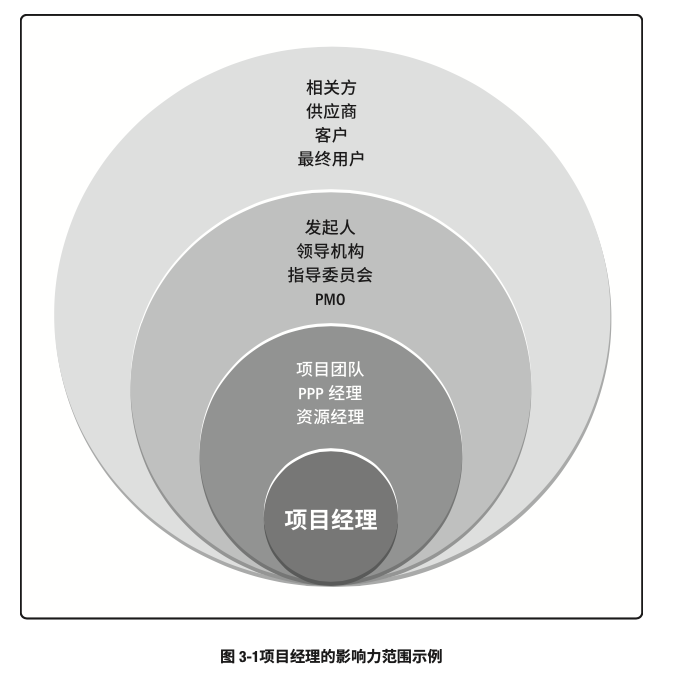
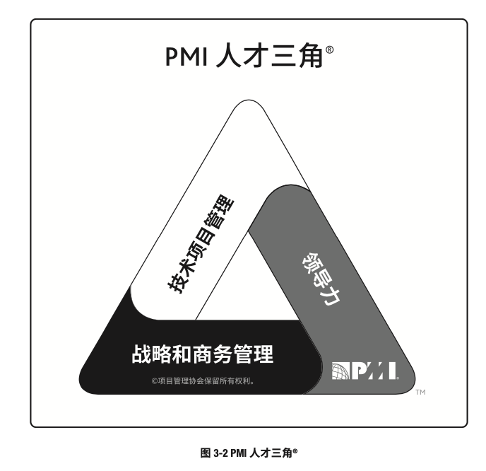

# 项目经理的角色
## 概述

- 项目经理在领导项目团队达成项目目标方面发挥至关重要的作用
- 在整个项目期间，这个角色的作用非常明显
- 很多项目经理从**项目启动**时参与项目，直到**项目结束**
	- 不过，在某些组织内，项目经理可能会在**项目启动之前**就参与评估和分析活动
		- 这些活动可能包括**咨询管理层**的业务部门领导者的想法，以**推进战略目标实现**、**提高组织绩效**，或**满足客户需求**。
		- 某些组织可能还要求项目经理**管理或协助**项目的**商业分析**、**商业论证**的制定以及**项目组合管理**事宜。
	- 项目经理还可能参与**后续跟进活动**，以实现**商业效益**。
- 不同组织对**项目经理的角色**有不同的定义，但本质上它们的**裁剪方式**都一样：项目管理角色需要符合组织需求，如同项目管理过程需要符合项目需求一般。
- 下面将大型项目的项目经理与大型管弦乐队的指挥做比较，以帮助理解项目经理角色：
	- 成员与角色
		- 管弦乐队：
			- 管弦乐队包含了很多成员，每个成员都扮演者不同的角色。
			- 一个大型管弦乐队可能包括由一位指挥带领的上百位演奏者。
			- 这些演奏者需要演奏25种不同的乐器，组成了多个主要乐器组，例如弦乐器、木管乐器、铜管乐器和打击乐器。
			- 演奏者形成管弦乐团队
		- 项目管理：
			- 大型项目包含了很多成员，每个成员都扮演者不同的角色。
			- 一个大型项目可能包括由一位项目经理领导的上百位项目成员
			- 这些团队成员需要承担各种不同的角色，例如设计、制造和实施管理。
			- 项目团队成员也组成了多个业务部门或小组。
			- 项目成员形成项目团队
	- 在团队中的职责
		- 管弦乐队：
			- 指挥需要为团队的交响乐会成果负责
			- 领导者需要从整体的角度来看待团队产品，以便进行规划、协调和完成。
				- 首先，应审查组织的愿景、使命和目标，确保与产品保持一致。
				- 然后，解释与成功完成产品相关的愿景、使命和目标
				- 最后，向团队沟通自己的想法，激励团队成功完成目标。
		- 项目管理：
			- 项目经理需要为团队的项目成果负责
			- 领导者需要从整体的角度来看待团队产品，以便进行规划、协调和完成。
				- 首先，应审查组织的愿景、使命和目标，确保与产品保持一致。
				- 然后，解释与成功完成产品相关的愿景、使命和目标
				- 最后，向团队沟通自己的想法，激励团队成功完成目标。
	- 知识和技能
		- 管弦乐队：
			- 指挥不需要掌握每种乐器，但应具备音乐知识、理解和经验。
			- 指挥通过沟通领导乐队并进行规划和协调，
			- 采用乐谱和排练计划作为书面沟通形式，还通过指挥棒和其他肢体语言与团队进行实时沟通
		- 项目管理：
			- 项目经理无需承担项目中的每个角色，但应具备项目管理知识、技术知识、理解和经验。
			- 项目经理通过沟通领导项目团队进行规划和协调。
			- 项目经理采用书面沟通（文档计划和进度），还通过会议和口头提示或言语提示与团队进行实时沟通。

## 项目经理的定义

- 项目经理的角色不同于职能经理或运营经理。
	- 职能经理：专注于对某个职能领域或业务部门的管理监督。
	- 运营经理：负责保证业务运营的高效性。
	- 项目经理：由执行组织委派，领导团队实现项目目标的个人。

## 项目经理的影响力范围

1. 概述
	- 项目经理在其影响力范围内担任多种角色
		- 这些角色反映了项目经理的能力，体现了项目经理这一职业的价值和作用。
			
2. 项目
	- 项目经理领导项目团队实现项目目标和相关方的期望。
		- 项目经理利用可用资源，以平衡相互竞争的制约因素。
	- 项目经理还充当项目发起人、团队成员与其他相关方之间的沟通者，包括提供指导和和展示项目成功的愿景。
		- 项目经理使用软技能（例如人际关系技能和人员管理技能）来平衡项目相关方之间的相互冲突和竞争的目标，以达成共识。
			- 这种情况下的共识指即便不100%赞同，相关方还会支持项目决定和行动
	- 成功的项目经理可以持续和有效地使用某些基本技能。
		- 在由上级和团队成员指定的项目经理中，排名前2%的项目经理之所以脱颖而出，是因为他们展现出了超凡的人际关系和沟通技能以及积极的态度。
	- 与团队和发起人等相关方沟通的能力适用于项目的各个方面，包括（但不限于）以下各个方面：
		- 通过各种方法（例如口头、书面和非语言）培养完善的技能
		- 创建、维护和遵循沟通计划和进度计划
		- 不断地以可预见的方式进行沟通
		- 寻求了解项目相关方的沟通需求（沟通可能是某些相关方在最终产品或服务实现之前获取信息的唯一渠道）
		- 以简练、清晰、完整、简单、相关和经过裁剪的方式进行沟通
		- 包含重要的正面的负面消息
		- 合并反馈渠道
		- 人际关系技能，即通过项目经理的影响力范围扩展广泛的人际网络。
			- 这些人际网络包括正式的人际网络（例如组织架构图）
			- 但项目经理发展、维护和培养的非正式人际网络更加重要。
				- 非正式人际网络包括与专家和具有影响力的领导者建立的个人人际关系。
			- 通过这些正式和非正式的人际网络，项目经理可以让很多人参与解决问题并探讨项目中遇到的官僚主义障碍。
3. 组织
	- 项目经理需要积极地与其他项目经理互动。其他独立项目或统一项目集的其他项目可能会对项目造成影响，原因包括（但不限于）：
		- 对相同资源的需求
		- 资金分配的优先顺序
		- 可交付成果的接受或发布
		- 项目与组织的目的和目标的一致性
	- 与其他项目经理互动有助于产生积极的影响，以满足项目的各种需求。
		- 这些需求可能是团队为完成项目而需要的人力、技术或财力资源和可交付成果。
		- 项目经理需要寻求各种方法来培养人际关系，从而帮助团队实现项目目的和目标
	- 项目经理在组织内扮演强有力的倡导者角色。
		- 在项目过程中，项目经理积极地与组织中的各位经理互动。
		- 项目经理发起人合作处理内部的政治和战略问题，这些问题可能会影响团队或项目的可行性或质量。
	- 项目经理可以致力于提高自己在组织内的总体项目管理能力，并参与隐性和显性知识的转移或整合计划。
		- 项目经理还应致力于：
			- 展现项目管理的价值
			- 提高组织对项目管理的接受度
			- 提高组织内现有PMO的效率
	- 基于组织结构，项目经理可能向职能经理报告。
		- 而在其他情况下，项目经理可能与其他项目经理一起，向PMO、项目组合或项目集经理报告。
			- 项目组合或项目集经理对整个组织范围内的一个或多个项目承担最终责任。
			- 为了实现项目目标，项目经理需要与所有相关经理紧密合作，确保项目管理计划符合所在项目组合或项目集的计划。
		- 项目经理还需与其他角色紧密协作，如组织经理、主题专家以及商业分析人员。
		- 在某些情况下，项目经理可以是临时管理角色的外部顾问。
4. 行业
	- 项目经理应时刻关注行业的最新发展趋势，获得并思考这一信息对当前项目是否影响或可用。
		- 这些趋势包括（但不限于）：
			- 产品和技术开发
			- 新且正在变化的市场空间
			- 标准（例如项目管理标准、质量管理标准、信息安全管理标准）
			- 技术支持工具
			- 影响当前项目的经济力量
			- 影响项目管理学科的影响力
			- 过程改进和可持续发展战略
5. 专业学科
	- 对项目经理而言，持续的知识传递和整合非常重要。
		- 项目管理专业和项目经理担任主题专家的其他领域都在持续推进相应的专业发展。
		- 知识传递和整合包括（但不限于）：
			- 在当地、全国和全球层面（例如实践社区、国际组织）向其他专业人员分享知识和专业技能。
			- 参与培训、继续教育和发展
				- 项目管理专业（例如大学、PMI）
				- 相关专业（例如系统工程、配置管理）
				- 其他专业（例如信息技术、航空航天）
6. 跨领域
	- 专业的项目经理针对组织的价值可以选择指导和教育其他专业人员项目管理方法。
	- 项目经理还可以担任非正式的宣传大使，让组织了解项目管理在及时性、质量、创新和资源管理方面的优势。

## 项目经理的能力

1. 概述
	- 近期的PMI研究通过PMI人才三角支出了项目经理根据《项目经理能力发展（PMCD）框架》需要具备的技能。
	- 人才三角重点关注三个关键技能组合：
		- 技术项目管理：与项目、项目集和项目组合管理特定领域相关的知识、技能和行为，即角色履行的技术方面。
		- 领导力：指导、激励和带领团队所需的知识、技能和行为，可帮助组织达成业务目标。
		- 战略和商务管理：关于行业和组织的相关知识和专业技能，有助于提高绩效并取得更好的业务成果。
			
	- 虽然技术项目管理技能是项目集和项目管理的核心，但PMI研究指出，当今全球市场越来越复杂，竞争也越来越激烈，只有技术项目管理技能是不够的。
		- 各个组织正在寻求其他有关领导力和商业智慧技能。
		- 来自不同组织的成员均提出，这些能力可以有助于支持更长远的战略目标，以实现赢利。
		- 为发挥最大的效果，项目经理需要平衡这三种技能。
2. 技术项目管理技能
	- 技术项目管理技能：有效运用项目管理知识实现项目集或项目的预期成果的能力。
	- 有很多技术项目管理技能。本指南的知识领域部分描述了很多必要的项目管理技能。
	- 项目经理经常会依赖专家判断来有效开展工作。
	- 要获得成功，重要的是项目经理必须了解个人专长以及如何找到具备所需专业知识的人员。
	- 研究表明，顶尖的项目经理会持续展现出几种关键技能，包括（但不限于）：
		- 重点关注所管理的各个项目的关键技术项目管理要素。
			- 简单来说就是随时准备好合适的材料。最主要的是：
				- 项目成功的关键因素
				- 进度
				- 指定的财务报告
				- 问题日志
		- 针对每个项目裁剪传统和敏捷工具、技术和方法
		- 花时间指定完整的计划并谨慎排定优先顺序
		- 管理项目要素
			- 包括但不限于：
				- 进度
				- 成本
				- 资金
				- 风险
3. 战略和商务管理技能
	- **战略和商务管理技能**包括**纵览组织概况**并有**效协商和执行有利于战略调整和创新的决策和行动**的能力。
		- 这项能力可能涉及其他职能部门的工作知识
			- 例如财务部、市场部和运营部。
		- 战略和商务管理技能可能还包括发展和运用相关的产品和行业专业知识。
			- 这种业务知识也被称为领域知识。
	- 项目经理应掌握足够的业务知识，以：
		- 向其他人解释关于项目的必要商业信息
		- 与项目发起人、团队和主题专家合作制定合适的项目交付策略
		- 以实现项目商业价值最大化的方式执行策略
	- 为制定关于项目成功交付的最佳决策，项目经理咨询具备关于组织运营的专业知识的运营经理。
		- 这些经理应了解组织的工作以及项目计划会对工作造成的影响。
	- 对项目经理而言，对项目主题的了解越多越好，至少能够向其他人说明关于组织的以下方面：
		- 战略
		- 使命
		- 目的和目标
		- 产品和服务
		- 运营（例如位置、类型、技术）
		- 市场和市场条件（例如客户、市场状况（发展或萎缩）和上市时间因素等）
		- 竞争（例如什么、谁、市场地位）
	- 为确保一致性，项目经理应将以下关于组织的知识和信息运用到项目中：
		- 战略
		- 使命
		- 目的和目标
		- 优先级
		- 策略
		- 产品或服务（例如可交付成果）
	- 战略和商业技能有助于项目经理确定应为其项目考虑哪些商业因素
		- 项目经理应确定这些商业和战略因素会对项目造成的影响，同时了解项目与组织之间的相互关系。
			- 这些因素包括（但不限于）：
				- 风险和问题
				- 财务影响
				- 成本效益分析（例如净现值、投资回报率），包括各种可选方案
				- 商业价值
				- 效益预期实现情况和战略
				- 范围、预算、进度和质量
	- 通过运用商务知识，项目经理能够为项目提出合适的决策和建议。
		- 随着条件的变化，项目经理与项目发起人持续合作，使业务战略和项目策略保持一致。
4. 领导力技能

	- 领导力技能包括**指导**、**激励**和**带领团队的能力**。
	- 这些技能可能包括**协商**、**抗压**、**沟通**、**解决问题**、**批判性思考**和**人际关系技能**等基本能力。
	- 随着越来越多的公司通过项目执行战略，项目变得越来越复杂。
	- 项目管理不仅仅涉及数字、模板、图表、图形和计算机系统方面的工作。
		- 人是所有项目中的共同点。人可以计数，但不仅仅是数字。

	1. 人际交往
		- 人际交往占据项目经理工作的很大一部分。
		- 项目经理应研究人的行为和动机，应尽力成为一个好的领导者，因为领导力对组织项目是否成功至关重要。
		- 项目经理需要运用领导力技能和品质与所有的项目相关方合作，包括项目团队、团队指导党和项目发起人。
	2. 领导者的品质和技能
		- 领导者的品质的技能包括（但不限于）：
			- 有远见（例如帮助描述项目的产品、目的和目标；能够有梦想并他人诠释愿景）
			- 积极客观
			- 乐于合作
			- 通过以下方式管理关系和冲突：
				- 建立信任
				- 解决顾虑
				- 平衡相互竞争和对立的目标
				- 运用说服、协商、妥协和解决冲突的技能
				- 发展和培养个人及专业网络
				- 以长远的眼光看待人际关系是与项目同样重要
				- 持续发展和运用政治敏锐性
			- 通过以下方式进行沟通：
				- 花大量的时间沟通（研究显示，顶尖的项目经理投入有90%左右的时间是花在沟通上）
				- 管理期望
				- 诚恳地接受反馈
				- 提出建设性的反馈
				- 询问和倾听
			- 尊重他人（帮助他人保持独立自主）、谦恭有礼、友善待人、诚实可信、忠诚可靠、遵守职业道德
			- 展现出诚信正直和文化敏感性，果断、勇敢，能够解决问题
			- 适当时称赞他人
			- 终身学习，以结果和行动为导向
			- 关注重要的事情，包括：
				- 通过必要的审查和调整，持续优化工作
				- 寻求并采用适用于团队和项目的优先级排序方法
				- 区分高层级战略优先级，尤其是与项目成功的关键因素相关的事项
				- 对项目的主要制约因素保持警惕
				- 能够从大量信息中筛选出最重要的信息
			- 以整体和系统的角度来看待项目，同等对待内部和外部因素
			- 能够运用批判性思维（例如运用分析方法来制定决策）并将自己视为变革推动者
			- 能够创建高效的团队、以服务为导向、展现出幽默的一面，与团队成员有效地分享乐趣。
	3. 权术、权力和办好事情
		- 领导和管理的最终目的是办好事情。
			- 这些技能和品质有助于项目经理实现项目目的和目标。
			- 很多技能和品质归根究底就是处理政治的能力。
			- 政治涉及影响、谈判、自主和权力
		- 政治及其相关要素不局限于“好”与“不好”以及“正面”与“负面”之分
		- 项目经理对组织运行方式的了解越多，就越有可能获得成功。
		- 项目经理应观察并收集有关项目和组织概况的数据，然后从项目、相关人员、组织以及整个环境出发来审查这些数据，从而得出计划和执行大多数行动所需的信息和知识。
		- 这些行动是项目经理运用适当的权力影响他人和进行协商之后的成果，
		- 有了权力就有了职责，项目经理应体察并尊重他人。
		- 项目经理的有效行动保持相关人员的独立自主。
		- 项目经理的行动成果就是让合适的人执行必要的活动来实现项目目标。
		- 权力可能体现个人或组织的特征
		- 人们对领导者的认知通常是因为权力；因此，项目经理应注意自己与他人的关系是非常重要的。
		- 借助人际关系可以让项目相关事项得到落实。
		- 行驶权力的方式有很多，项目经理可以自行决定。
		- 由于权力的性质以及影响项目的各种因素，权力及其运用变得非常复杂。
		- 行使权力的方式包括（但不限于）：
			- 地位（有时称为正式的、权威的、合法的，例如组织或团队授予的正式职位）
			- 信息（例如收集或分发的控制）
			- 参考（例如因为他人的尊重和赞赏，获得的信任）
			- 情境（例如在危机等特殊情况下获得的权利）
			- 个性或魅力（例如魅力、吸引力）
			- 关系（例如参与人际交往、联系和结盟）
			- 专家（例如拥有的技能和信息、经验、培训、教育、证书）
			- 奖励相关的（例如能够给予表扬、金钱或其他奖励）
			- 处罚或强制力（例如给予纪律处分或施加负面后果的能力）
			- 迎合（例如运用顺从或其他常用手段赢得青睐或合作）
			- 施加压力（例如限制选择或活动自由，以符合预期的行动）
			- 出于愧疚（例如强加的义务或责任感）
			- 说服力（例如能够提供论据，使他人执行预期的行动方案）
			- 回避（例如拒绝参与）
		- 在权力方面，顶尖的项目经理积极主动且目的明确。
		- 这些项目经理会在组织政策、协议和程序许可的范围内主动寻求所需的权利和职权，而不是坐等组织授权。
5. 领导力与管理之比较
	
	- “领导力”和“管理”这两个字经常被互换使用，但它们并不是同义词。
		- “管理”更接近于运用一些列已知的预期行为指示另一个人从一个位置到另一个位置。
		- 相反，“领导力”指通过讨论或辩论与他人合作，带领它们从一个位置到另一个位置。
	- 项目经理所选择的方法体现了他们的行为、自我认知和项目路角色方面的显著差异。
	- 管理和领导力的从几个重要的层面上的比较：

		|管理|领导力|
		|:-:|:-:|
		|直接利用职位权力|利用关系的量指导、影响与合作|
		|维护|建设|
		|管理|创新|
		|关注系统和架构|关注人际关系|
		|依赖控制|激发信任|
		|关注近期目标|关注长期愿景|
		|了解方式和时间|了解情况和原因|
		|关注赢利|关注范围|
		|接受现状|挑战现状|
		|做正确的事情|做正确的事情|
		|关注可操作的问题和问题的解决|关注愿景、一致性、动力和激励|
		
	1. 领导力风格
		- 项目经理领导团队的方式可以分为很多种。
		- 项目经理可能会出于个人偏好或在综合考虑了与项目有关的多个因素之后选择领导力风格。
		- 根据作用因素的不同，项目经理可能会改变风格
			- 要考虑的主要因素包括（但不限于）：
				- 领导者的特点（例如态度、心情、需求、价值观、道德观）
				- 团队成员的特点（例如态度、心情、需求、价值观、道德观）
				- 组织的特点（例如目标、结构、工作类型）
				- 环境的特点（例如社会形势、经济状况和政治因素）
		- 研究显示项目经理可以采用多种领导力风格。
			- 在这些风格中，最常见的包括（但不限于）：
				- 放任型领导（例如，允许团队自主决策和设定目标，又被称为“无为而治”）
				- 交易型领导（例如，关注目标、反馈和成就以确定奖励，例外管理）
				- 服务型领导（例如，做出服务承诺，处处先为他人着想；关注他人的成长、学习、发展、自主性和福祉；关注人际关系、团队合作；服务优先于领导）
				- 变革型领导（例如，通过理想化特质和行为、鼓励性激励、促进创新和创造，以及个人关怀提高追随者的能力）
				- 魅力型领导（例如，能够激励他人；精神饱满、热情洋溢、充满自信；说服力强）
				- 交互型领导（例如，结合了交易型、变革型和魅力型领导的特点）
	2. 个性
		- 个性：人与人之间在思维、感情和行为的特征模式方面的差异。
		- 个人性格特点或特征可能包括（但不限于）：
			- 真诚（例如，接受他人不同的个性，表现出包容的态度）
			- 谦恭（例如，能够举止得体、有礼貌）
			- 创造力（例如，抽象思维、不同看法、创新和能力）
			- 文化（例如，具备对其他文化的敏感性，包括价值观、规范和信仰）
			- 情绪（例如，能够感知情绪及其包含的信息并管理情绪，衡量人际关系技能）
			- 智力（例如，以多元智能理论衡量的人的智商）
			- 管理（例如，管理实践和潜力的衡量）
			- 政治（例如，政治智商和把事办好的衡量）
			- 以服务为向导（例如，展现出愿意服务他人的态度）
			- 社会（例如，能够理解和管理他人）
			- 系统化（例如，了解和构建系统的驱动力）
		- 高效的项目经理在上述各个方面都具备一定程度的能力。
		- 每个项目、组织和情况都要求项目经理重视个性的不同方面。

## 执行整合

- 执行项目时，项目经理承担双重角色：
	- 项目经理扮演重要角色，与项目发起人携手合作，既要了解战略目标并确保项目目标和成果与项目组合、项目集以及业务领域保持一致。项目经理以这种方式有助于项目的整合与执行。
	- 在项目层面上，项目经理负责指导团队关注真正重要的事务并协同工作。为此，项目经理需要整合过程、知识和人员。
- 整合是项目经理的一项关键技能。
- 本指南的项目整合管理知识领域对整合更深入地进行了探讨
	- 不同层面发生的整合：过程层面、认知层面和背景层面。
	- 项目整合的复杂性

1. 在过程层面执行整合
	- 项目管理可被看作为实现项目目标而采取的一系列过程和活动。
		- 有些活动可能只会发生一次（例如项目章程的初始创建）
		- 但很多过程在整个项目期间会相互重叠并重复发生多次。
			- 这种重叠和多次出现的过程，比如需求变更，它会影响范围、进度或预算，并需要提出变更请求。
	- 控制范围过程和实施整体变更控制等若干项目管理过程可包括变更请求。
		- 在整个项目期间实施整体变更控制过程是为了整合变更请求。
	- 虽然对项目过程的整合方式没有明确的定义，但如果项目经理无法整合相互作用的项目过程，那么实现项目目标的机会将会很小。
2. 认知层面的整合
	- 管理项目的方法有很多，而方法的选择通常取决于项目的具体特点，包括规模、项目或组织的复杂性，以及执行组织的文化。
	- 显然，项目经理的人际关系技能和能力与其管理项目的方式有紧密的关系。
	- 项目经理应尽量掌握所有项目管理知识领域。
		- 熟练掌握这些知识领域之后，项目经理可以将经验、见解、领导力、技术以及商业管理技能运用到项目管理中。
	- 最后，项目经理需要整合这些知识领域所涵盖的过程才有可能实现预期的项目结果。
3. 背景层面的整合
	- 与几十年前相比，当今企业和项目所处的环境有了很大的变化。
		- 新技术不断涌现。社交网络、多元文化、虚拟团队和新的价值观都是项目索要面临的全新现实。
	- 整合涉及多个与组织的、大规模、跨职能项目实施中的知识和人员便是一例。
		- 项目经理在指导项目团队进行沟通规划和知识管理时需要考虑这个背景所产生的影响。
	- 在管理整合时，项目经理需要意识到项目背景和这些新因素，然后项目经理可以决定如何自项目中最好地利用这些新环境因素，以便获得项目成功。
4. 整合与复杂性
	- 有些项目可能非常复杂，难以管理。
		- “复杂”一字通常被用来描述难以理解或错综复杂的事务。
	- 项目的复杂性来源于组织的系统行为、人类行为以及组织或环境中的不确定性。
	- 《项目复杂性管理：实践指南》将复杂性的是三个维度定义为：
		- 系统行为：组成部分与系统之间的依赖关系
		- 人类行为：不同个体和群体之间的相互作用
		- 不明确性：出现问题、缺乏理解或造成困惑引发的不确定性。
	- 复杂性本身指个体基于自身经验、观察和技能的一种感知
		- 更准确的描述应该是：项目包含复杂性的要素，而不是项目本身复杂。
			- 项目组合、项目集和项目可能包含复杂性的要素
	- 项目整合之前，项目经理应考虑项目内外的要素。
		- 项目经理应检查项目的特征或属性。
	- 复杂性作为项目的一种特征或属性
		- 复杂性通常被定义为：
			- 包含多个部分
			- 不同部分之间存在一系列联系
			- 不同部分之间有动态交互作用
			- 这些交互作用产生的行为远远大于各部分简单的相加（例如突发性行为）
		- 这些因素会增加项目的复杂性，通过检查，有助于项目经理在规划、管理和控制项目时可以识别关键领域，确保完成整合。
 