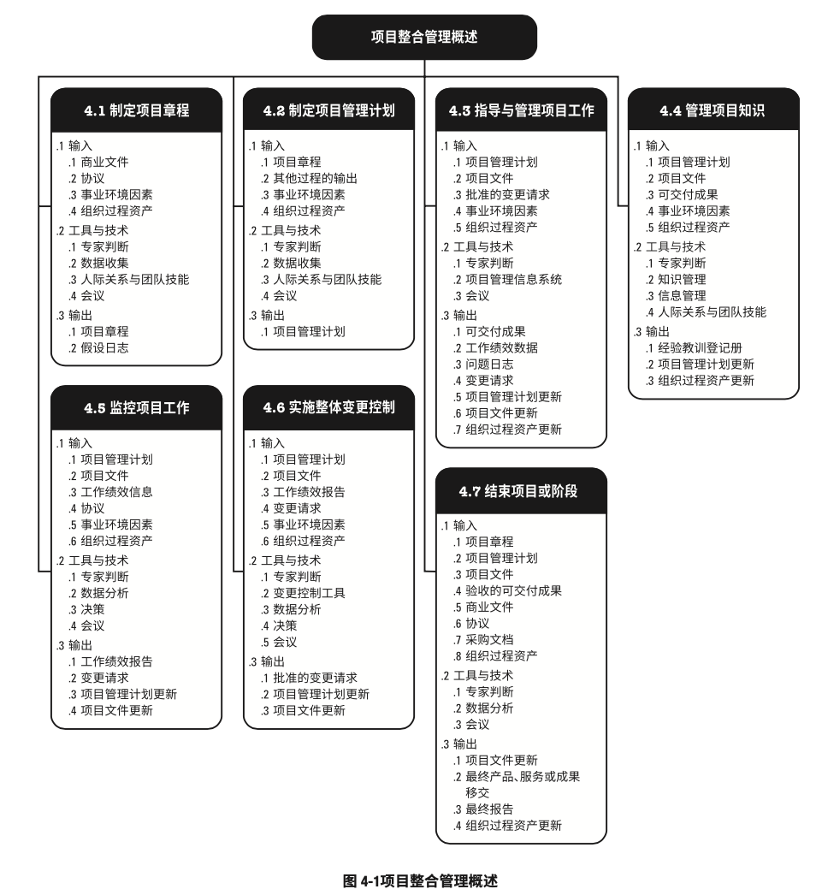
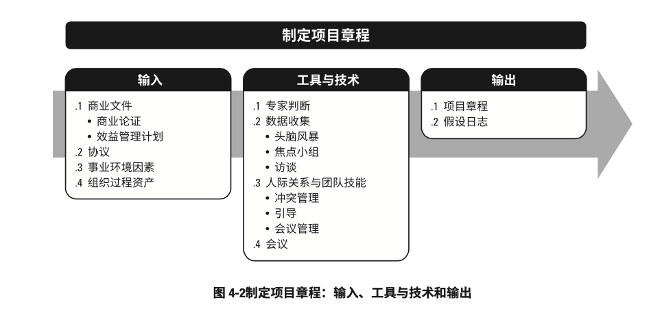

# 项目整合管理
- 项目整合管理包括对隶属于项目管理过程组的各种过程和项目管理活动进行识别、定义、组合、统一协调的各个过程。
- 在项目管理中，整合兼具统一、合并、沟通和建立联系的性质，这些行动应该贯穿项目始终。
- 项目整合管理包括进行以下选择：
	- 资源分配
	- 平衡竞争性需求
	- 研究各种备选方案
	- 为实现项目目标而裁剪过程
	- 管理各个项目管理知识领域之间的依赖关系
- 项目整合过程包括
	- 制定项目章程：编写一份正式批准项目并授权项目经理在项目活动中使用组织资源的文件过程。
	- 制定项目管理计划：定义、准备和协调项目计划的所有组成部分，并把它们整合为一份综合项目管理计划的过程。
	- 指导与管理项目工作：为实现项目目标而领导和执行项目管理计划中所确定的工作，并实施依批准的变更的过程。
	- 管理项目知识：使用现有知识并生成新知识，以实现项目目标，并帮助组织学习的过程。
	- 监控项目工作：跟踪、审查和报告整体项目进展，以实现项目管理计划中确定的绩效目标的过程。
	- 实施整体变更控制：审查所有变更请求，批准变更，管理对可交付成果、组织过程资产、项目文件和项目管理计划的变更，并对变更处理结果进行沟通的过程。
	- 结束项目或阶段：终结项目、阶段或合同的所有活动的过程。
- 项目整合管理的各个过程：
	
- 虽然在在本《PMBOK®️》中，各项目整合管理过程以界限分明和相互独立的形式出现，但在实现中它们会以本指南无法全面详述的方式相互交叠和相互作用。

###项目整合管理的核心概念

- 项目整合管理由项目经理负责
	- 虽然其他知识领域可以由相关专家（如成本分析专家、进度规划专家、风险管理专家）管理，但是**项目整合管理的责任不能被授权或转移。职能由项目经理负责整合所有其他知识领域的成果，并掌握项目总体情况**。
	- 项目经理必须对整个项目承担最终责任。
- 项目与项目管理本质上具有整合性质。
	- 例如，为应急计划制定成本估算时，就需要整合项目成本管理、项目进度管理和风险管理知识利于中的相关过程。
	- 在识别出与各种人员配备方案相关的额外风险时，肯能需要再次进行上述某个或某几个过程。
- 项目管理过程组的各个过程之间惊颤反复发生联系。
	- 例如，在项目早期，规划过程组为执行过程组提供书面的项目管理计划；
	- 然后，随着项目的进展，规划过程组还将根据变更情况，更新项目管理计划。
- 项目整合管理指的是：
	- 确保产品、服务或成果的交付日期，项目生命周期以及效益管理计划这些方面保持一致。
	- 编制项目管理计划以实现项目目标
	- 确保创造合适的知识并运用到项目中，并从项目或获取必要的知识
	- 管理项目管理计划中活动的绩效和变更
	- 做出针对影响项目的关键变更的综合决策
	- 测量和监督项目进展，并采取适当措施以实现
	- 收集关于已达成结果的数据，分析数据以获取信息，并与相关方分享信息
	- 完成全部项目工作，正式关闭各个阶段、合同以及整个项目
	- 管理可能需要的阶段过渡
- 项目越复杂，相关方的期望越多样化，就需要越全面的整合方法

###项目整合管理的发展趋势和新兴实践

- 项目整合管理知识领域要求整合所有其他知识领域的成果
- 与整合管理过程相关的发展趋势包括（但不限于）：
	- 使用自动化工具：项目经理需要整合大量的数据和信息，因此有必要使用项目管理信息系统（PMIS）和自动化工具来采集、分析和使用信息，以实现项目目标和项目效益
	- 使用可视化管理工具：有些项目团队使用可视化管理工具，而不是书面计划和其他文档，来获取和监督关键的项目要素。这样就便于整个团队直观地看到项目的实时状态，促进知识转移，并提高团队成员和其他相关方识别和解决问题的能力。
	- 项目知识管理：项目人员的流动性和不稳定性越来越高，就要求采用更严格的过程，在整个项目生命周期中积累知识并传达给目标受众，以防知识流失。
	- 增加项目经理的职责：项目经理被要求介入启动和结束项目
		- 例如，开展项目商业论证和效益管理。
		- 按照以往的管理，这些事务均由管理层和项目管理办公室负责。
		- 现在，项目经理需要频繁地与他们合作处理这些事务，以便更好地实现项目目标以及交付项目效益。
		- 项目经理也需要更全面地识别相关方，并引导他们参与项目，包括管理项目经理与各个职能部门、运营部门和高级管理人员之间的接口。
	- 混合型方法：经实践检验的新做法会不断地融入项目管理方法
		-例如，采用敏捷或其他迭代做法，为开展需求管理而采用的商业分析技术，为分析项目复杂性而采用的相关工具，以及为在组织中应用项目成果而采用组织变革管理方法。 

###裁剪时需要考虑的因素

- 因为每个项目都是独特的，所以项目经理可能需要裁减项目整合管理过程。
- 裁减时应考虑的因素包括（但不限于）：
	- 项目生命周期：什么是适合的生命周期？项目生命周期应包括哪些阶段？
	- 开发生命周期：对特定产品、服务或成果而言，什么是合适的开发生命周期的开发方法？
		- 预测型或适应型方法是否适当？
			- 如果是适应型，开发产品是该采用增量还是迭代的方式？
			- 混合型方法是否为最佳选择？
	- 管理方法：考虑到组织文化和项目的复杂性，哪种管理过程最有效？
	- 知识管理：在项目中如何管理知识以营造合作的工作氛围？
	- 变更：在项目中如何管理变更？
	- 治理：有哪些监控机构、委员会和其他相关方该参与项目治理？对项目状态报告的要求是什么？
	- 经验教训：在项目期间以及项目结束时，应收集哪些信息？历史信息和经验教训是否适用于未来的项目？
	- 效益：应该在何时以何方式报告效益：在项目结束时还是在每次迭代或阶段结束时？

###在敏捷或适应型环境中需要考虑的因素

- 迭代和敏捷方法能够促进团队成员以相关领域专家的身份参与整合管理。
- 团队成员自行决定计划及其组件的整合方式
- 在适应型环境下，《整合管理的核心概念》中所述的对项目经理的期望保持不变，但把对具体产品的规划和交付授权给团队来控制。
- 项目经理的关注点在于营造一个合作型的决策氛围，并确保团队有能力应对变更。
- 如果团队成员具备广泛的技能基础而不局限于某个狭窄的专业领域，那么这种合作型方法就更加有效。

## 制定项目章程

- 制定项目章程：编写一份正式批准项目并授权项目经理在项目活动中使用组织资源的文件的过程。
- 本过程的主要作用：明确项目与组织战略目标之间的直接联系，确立项目的正式地位，并展示组织对项目的承诺。
- 本过程仅开展一次或仅在项目的预定义点开展。
- 制定项目章程的输入、工具与技术和数据：
	
- 制定项目章程的数据流向图：
	
- 项目章程在项目执行组织与需求组织之间建立起伙伴关系。
	- 在执行外部项目时，通常需要用正式的合同来达成合作协议。这种情况下，可能仍要用项目章程来建立组织内部的合作关系，以确保正确交付合同内容。
- 项目章程一旦被批准，就标志着项目的正式启动。
- 在项目中，应尽早确认并任命项目经理，最好在制定项目章程时就任命，且总应在规划开始之前任命。
- 项目章程可由发起人编制，或者由项目经理与发起机构合作编制。通过这种合作，项目经理可以更好地了解项目目的、目标和预期效益，以便更有效地向项目活动分配资源。
- 项目章程授权项目经理规划、执行和控制项目
- 项目有项目以外的机构来启动，如发起人、项目集或项目管理办公室、项目组合治理委员会主席或其授权代表。
	- 项目启动者或发起人应该具有一定的职权，能力为项目获取资金并提供资源。
- 项目可能因内部经营需要或外部影响而启动，故通常需要编制需求分析、可行性研究、商业论证或有待项目处理的情况的描述。
- 通过编制项目章程，来确认项目符合组织战略和日常运营的需要。
- 不要把项目章程看作合同，因为其中未承诺报酬或金钱或用于交换的对价。

###制定项目章程：输入
1. 商业文件
	- 在商业论证和效益管理计划中，可以找到关于项目目标以及项目对业务目标的贡献的相关信息。
	- 虽然商业文件是在项目之前制定的，但**需要定期审核**。
	- 商业论证
		- 经批准的商业论证或类似文件最常用于制定项目章程或商业文件。
		- 商业论证从商业视角描述必要的信息，并且据此决定项目的期望结果是否值得所需投资。
		- 高于项目级别的经理和高管们通常使用该文件作为决策的依据。
		- 一般情况下，商业论证包含**商业需求**和**成本效益分析**
		- 以论证项目的合理性并确定项目边界。
		- 商业论证的编制可由以下一个或多个因素引发：
			- 市场需求：例如，为应对汽油紧缺，某汽车制造商批准一个低油耗车型的研发项目
			- 组织需要：例如，因为管理费用太高，公司决定合并一些职能并优化流程以降低成本
			- 客户要求：例如，为了给新工业园区供电，某电力公司批准一个新变电站建设项目
			- 技术进步：例如，基于技术进步，某航空公司批准了一个新项目，来开发电子机票以去太纸质机票
			- 法律要求：例如，某油漆制品厂批准一个项目，来编写有毒物质处理指南
			- 生态影响：例如，某公司批准一个项目，来降低对环境的影响
			- 社会需要：为应对霍乱频发，某发展中国家的非政府组织批准一个项目，为社区建设饮用水系统和公共厕所，并开展卫生教育
	- 项目章程包含来源于商业文件中的相关项目信息。
	- 既然商业文件不是项目文件，项目经理就不可以对它们进行更新或修改，只可以提出相关建议。
2. 协议
3. 事业环境因素
4. 组织过程资产

###制定项目章程：工具与技术

1. 专家判断
2. 数据收集
3. 人际关系与团队技能
4. 会议

###制定项目章程：输出

1. 项目章程
2. 假设日志

## 制定项目管理计划
###制定项目管理计划：输入

1. 项目章程
2. 其他过程的输出
3. 事业环境因素
4. 组织过程资产

###制定项目管理计划：工具与技术

1. 专家判断
2. 数据收集
3. 人际关系与团队技能
4. 会议

###制定项目管理计划：输出

1. 项目管理计划
	- 子管理计划
	- 基准
	- 其他组件

## 指导与管理项目工作
###指导与管理项目工作：输入

1. 项目管理计划
2. 项目文件
3. 批准的变更请求
4. 事业环境因素
5. 组织过程资产

###指导与管理项目工作：工具与技术

1. 专家判断
2. 项目管理信息系统
3. 会议

###指导与管理项目工作：输出

1. 可交付成果
2. 工作绩效数据
3. 问题日志
4. 变更请求
5. 项目管理计划更新
6. 项目文件更新
7. 组织过程资产更新

## 管理项目知识
###管理项目知识：输入

1. 项目管理计划
2. 项目文件
3. 可交付成果
4. 事业环境因素
5. 组织过程资产

###管理项目知识：工具与技术

1. 专家判断
2. 知识管理
3. 信息管理
4. 人际关系与团队技能

###管理项目知识：输出

1. 经验教训登记册
2. 项目管理计划更新
3. 组织过程资产更新

## 监控项目工作
###监控项目工作：输入

1. 项目管理计划
2. 项目文件
3. 工作绩效信息
4. 协议
5. 事业环境因素
6. 组织过程资产

###监控项目工作：工具与技术

1. 专家判断
2. 数据分析
3. 决策
4. 会议

###监控项目工作：输出

1. 工作绩效报告
2. 变更请求
3. 项目管理计划更新
4. 项目文件更新

## 实施整体变更控制
###实施整体变更控制：输入

1. 项目管理计划
2. 项目文件
3. 工作绩效报告
4. 变更请求
5. 事业环境因素
6. 组织过程资产

###实施整体变更控制：工具与技术

1. 专家判断
2. 变更控制工具
3. 数据分析
4. 决策
5. 会议 

###实施整体变更控制：输出

1. 批准的变更请求
2. 项目管理计划更新
3. 项目文件更新

## 结束项目或阶段
###结束项目或阶段：输入

1. 项目章程
2. 项目管理计划
3. 项目文件
4. 验收的可交付成果
5. 商业文件
6. 协议
7. 采购文档
8. 组织过程资产

###结束项目或阶段：工具与技术

1. 专家判断
2. 数据分析
3. 会议

###结束项目或阶段：输出

1. 项目文件更新
2. 最终产品、服务或成果移交
3. 最终报告