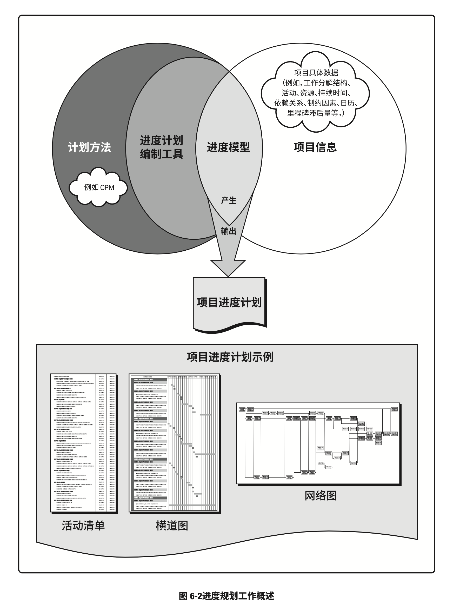
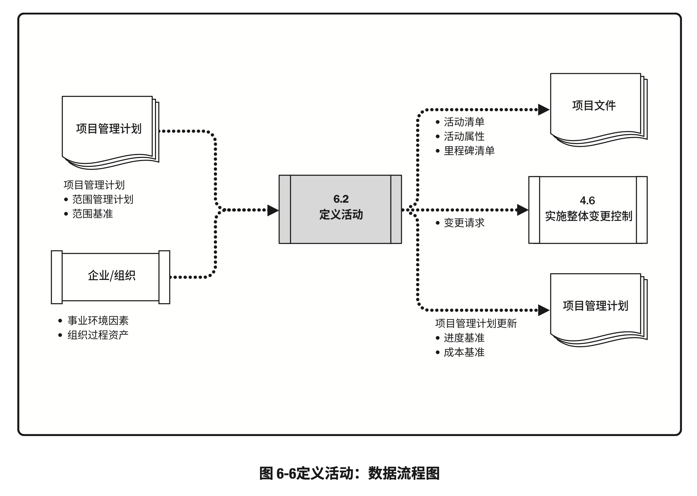
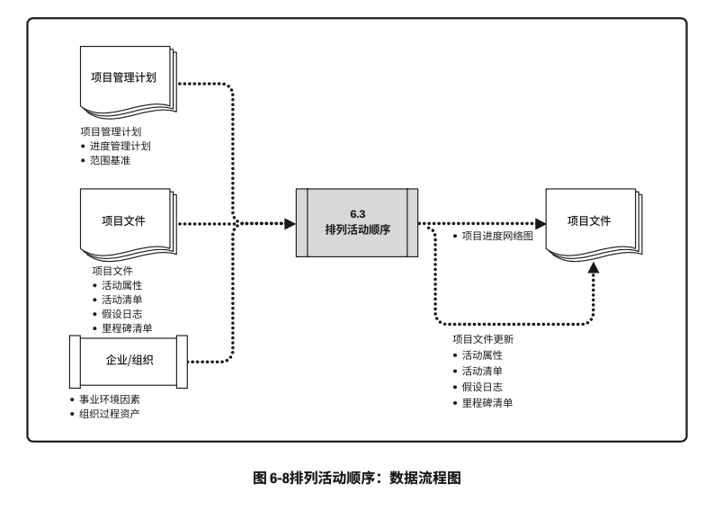
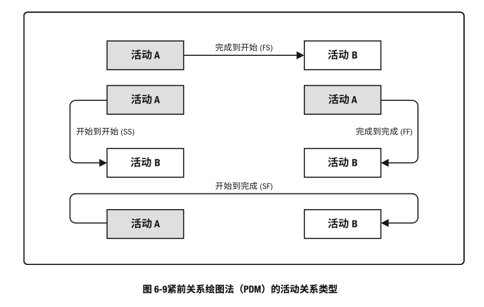
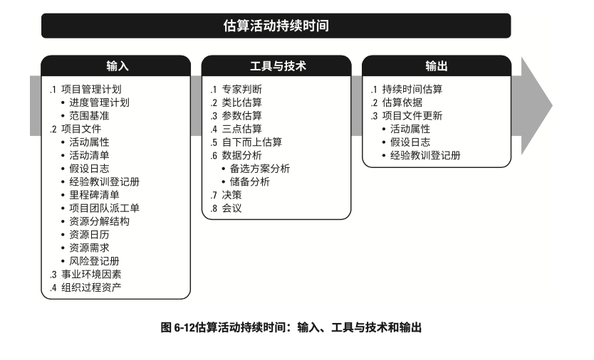

# 项目进度管理

- 项目进度管理包括为管理项目按时完成所需的各个过程。其过程包括：
	- 规划进度管理：为规划、编制、管理、执行和控制项目进度而制定政策、程序和文档的过程
	- 定义活动：识别和记录为完成项目可交付成果而需采取的具体行动的过程
	- 排列活动顺序：识别和记录项目活动之间的关系的过程
	- 估算活动持续时间：根据资源估算的结果，估算完成单项活动所需工作时段数的过程
	- 制定进度计划：分析活动顺序、持续时间、资源需求和进度制约因素，创建项目进度模型，从而落实项目执行和监控的过程
	- 控制进度：监督项目状态，以更新项目进度和管理进度基准变更的过程
- 项目进度管理的各个过程
	
- 虽然在本《PMBOK®️指南》中，各项项目进度管理过程以界限分明和相互独立的形式出现，但在实践中它们会以本指南无法全面详述的方式相互交叠和相互作用。

### 项目进度管理的核心概念

- 项目进度计划提供详尽的计划，说明项目如何以及何时交付项目范围中定义的产品、服务或成果，是一种用于沟通和管理相关方期望的工具，为绩效报告提供了依据
- 项目管理团队选择进度计划方法，例如关键路径法或敏捷方法。
- 之后，项目管理团队将项目特定数据，如活动、计划日期、持续时间、资源、依赖关系和制约因素等输入进度计划编制工具，以创建项目进度模型。
	- 这件工作的成果就是项目进度计划
- 进度计划工作的概览，展示如何结合进度计划编制方法、编制工具及项目进度管理各过程的输出来创建进度模型。
	
- 在小型项目中，定义活动、排列活动顺序、估算活动持续时间及制定进度模型等过程之间的联系非常密切，以至于可视为一个过程，能够由一个人在较短时间内完成，
	- 但本章仍然把这些过程分开介绍，因为每个过程所用的工具和技术各不相同。
- 有关某些过程的更详细描述，请参见《进度计划实践标准》
- 在可能的情况下，应在整个项目期间保持项目详细进度计划的灵活性，使其可以随着知识的获得、对风险理解的加深，以及增值活动的设计而调整。

### 项目进度管理的发展趋势和新兴实践

- 全球市场瞬息万变，竞争激烈，具有很高的不确定性和不可预测性，很难定义长期范围，因此，为应对环境变化，根据具体情景有效采用和裁剪开发实践就日益重要。
- 适应型规划虽然制定了计划，但也意识到工作开始之后，优先级可能发生改变，需要修改计划以反映新的优先级
- 有关项目进度计划方法的新兴实践包括（但不限于）：
	- 具有未完项的迭代型进度计划：这是一种基于适应型生命周期的滚动式规划。
		- 例如敏捷的产品开发方法
			- 这种方法将需求记录在用户故事中，然后在建造之前按优先级排序并优化用户故事，最后在规定的时间盒内开发产品功能。
			- 这一方法通常用于向客户交付增量价值，或多个团队并行开发大量内部关联较小的功能。
			- 适应型生命周期在产品开发中的应用越来越普遍，很多项目采用这种进度计划方法
			- 这种方法的好处在于，它允许在整个开发生命周期期间进行变更。
	- 按需进度计划：这种方法通常用于看板体系，基于制约理论和来自精益生产的拉动式进度计划概念，根据团队的交付能力来限制团队正在开展的工作。
		- 按需进度计划不依赖于以前为产品开发或产品增量制定的进度计划，而是在资源可用时立即从未完成项和工作序列中提取出来开展
		- 按需进度计划方法经常用于此类项目：在运营或持续环境中以增量方式研发产品，其任务可以被设计成相对类似的规模和范围，或者可以按规模和范围进行组合的工作。
		- 按需进度计划通常用于产品在运营和维护环境下以增量方式演进，且任务的规模或范围相对类似，或者，可以按照规模或范围对任务进行组合的项目

### 裁剪考虑因素

- 由于每个项目都是独特的，因此项目经理可能需要裁减项目进度管理过程。
- 裁减时应考虑的因素包括（但不限于）：
	- 生命周期方法：哪种生命周期方法最适合制定详细的进度计划
	- 资源可用性：影响资源可持续时间的因素是什么（如可用资源与其生产效率之间的相关性）？
	- 项目维度：项目复杂度、技术不确定性、产品新颖度、速度或进度跟踪（如挣值、完成百分比、“共黄绿”停止信号灯指示）如何影响预期的控制水平？
	- 技术支持：是否采用技术来制定、记录、传递、接受和存储项目进度模型的信息以及是否易于获取？
- 有关进度计划的更多信息，参阅《进度计划实践标准》

### 关于敏捷/适应型环境的考虑因素

- 适应型方法采用短周期来开展工作、审查结果，并在必要时做出调整。
	- 这些周期可针对方法和可交付成果的适用性提供快速反馈，
	- 通常表现为迭代型进度计划和拉动式按需进度计划，
	- 具体参见“项目进度管理的发展趋势和新兴实践”一节
- 在大型组织中，可能同时存在小规模项目和大规模项目举措，需要制定长期路线图，通过规模参数（如团队规模、地理分布、法规合规性、组织复杂性和技术复杂性）来管理这些项目集
	- 为管理大规模的、企业系统的、完整的交付生命周期，可能需要采用一系列技术，包括预测型方法、适应型方法或两种方法的混合。
	- 组织还可能需要结合几种核心方法，或采用已实践过的方法，并采纳来自传统技术的一些原则和实践
- 无论是采用预测型开发生命周期来管理项目，还是在适应型环境下管理项目，项目经理的角色都不变。但是，要成功实施适应型方法，项目经理需要了解如何高效使用相关的工具和技术

## 规划进度管理

- 规划进度管理是为规划、编制、管理、执行和控制项目进度而制定政策、程序和文档的过程。
- 本过程的主要作用是，为如何在整个项目期间管理项目进度提供指南和方向。
- 本过程仅开展一次或仅在项目的预定义点开展。
- 规划进度管理过程的输入、工具与技术和输出
	
- 规划进度管理过程的数据流程图
	

### 规划进度管理：输入

1. 项目章程
	- 项目章程中规定的总体里程碑进度计划会影响项目的进度管理
2. 项目管理计划
	- 项目管理计划组件包括（但不限于）：
		- 范围管理计划：范围管理计划描述如何定义和控制范围，并提供有关如何制定进度计划的信息
		- 开发方法：产品开发方法有助于定义进度计划方法、估算技术、进度计划编制工具以及用来控制进度的技术
3. 事业环境因素
	- 能够影响规划进度管理过程的事业环境因素包括（但不限于）：
		- 组织文化的结构
		- 团队资源可用性、技能以及物质资源可用性
		- 进度计划软件
		- 指南和标准，用于裁剪组织标准过程和程序以满足项目的特定要求
		- 商业数据库，如标准化的估算数据
4. 组织过程资产
	- 能够影响规划进度管理过程的组织过程资产包括（但不限于）：
		- 历史信息和经验教训知识库
		- 现有与制定进度计划以及管理和控制进度相关的正式和非正式的政策、程序和指南
		- 模板和表格
		- 监督和报告工具

### 规划进度管理：工具与技术

1. 专家判断
	- 应征求具备专业知识或以往类似项目中接受过相关培训的个人或小组的意见：
		- 进度计划的编制、管理和控制
		- 进度计划方法（如预测型或适应型生命周期）
		- 进度计划软件
		- 项目所在的特定行业
2. 数据分析
	- 适用于本过程的数据分析技术包括（但不限于）备选方法分析。
		- 备选方案分析：可包括确定采用哪些进度计划方法，以及如何将不同方法整合到项目中；此外，它还可以包括确定进度计划的详细程度、滚动式规划的持续时间，以及审查和更新频率。
		- 管理进度所需的计划详细程度与更新计划所需的时间量之间的平衡，应针对各个项目具体而言
3. 会议
	- 项目团队可能举行规划会议来制定进度管理计划。
	- 参会人员可能包括项目经理、项目发起人、选定的项目团队成员、选定的相关方、进度计划或执行负责人，以及其他必要人员

### 规划进度管理：输出

1. 进度管理计划
 - 进度管理计划：项目管理计划的组成部分，为编制、监督和控制项目进度建立准则和明确活动
 - 根据项目需要，进度管理计划可以是正式或非正式的，非常详细或高度概括的，其中应包括合适的控制临界值
 - 进度管理计划会规定：
	 - 项目进度模型制定：需要规定用于制定项目进度模型的进度规划方法论和工具
	 - 进度计划和发布的迭代长度：使用适应型生命周期时，应指定固定时间的发布时段、阶段和迭代。
		- 固定时间段：项目团队稳定地朝着目标前进的持续时间，它可以推动团队先处理基本功能，然后在时间允许的情况下再处理其他功能，从而尽可能减少范围蔓延
	 - 准确度：准确度定义了需要规定活动持续时间估算的可接受区间，以及允许的应急储备数量
	 - 计量单位：需要规定每种资源的计量单位，例如，用于测量时间的人时数、人天数或周数，用于计量数量的米、升、吨、千米或立方码
	 - 组织程序链接：工作分解结构为进度管理计划提供了框架，保证了与谷氨酸及相应进度计划的协调性
	 - 项目进度模型维护：需要规定在项目执行期间，将如何在进度模型中更新项目状态，记录项目进展
	 - 控制临界值：可能需要规定偏差临界值，用于监督进度绩效。它是在需要采取某种措施钱，允许出现的最大差异。
		 - 临界值通常用于偏离基准计划中的参数的某个百分数来表示
	 - 绩效测量规则：需要规定用于绩效测量的挣值管理（EVM）规则或其他测量规则。
		 - 例如，进度管理计划可能规定：
			 - 确定完成百分比的规则
			 - EVM技术，如基准法、固定公式法、完成百分比法等。更多信息，参阅《挣值管理实践标准》
			 - 进度绩效测量指标，如进度偏差（SV）和进度绩效指数（SPI），用来评价偏离原始进度基准的程度
	 - 报告格式：需要规定各种进度报告的格式和编制频率

## 定义活动

- 定义活动：识别和记录为完成项目可交付成果而须采取的具体行动的过程。
- 本过程的主要作用：将工作包分解为进度活动，作为对项目工作进行进度估算、规划、执行、监督和控制的基础
- 本过程需要在整个项目期间开展
- 定义活动过程的输入、工具与技术和输出
	
- 定义活动过程的数据流向图
	

### 定义活动：输入

1. 项目管理计划
	- 项目管理计划组件包括（但不限于）：
		- 进度管理计划：进度管理计划定义进度计划方法、滚动式规划的持续时间，以及管理工作所需的详细程度。
		- 范围基准：在定义活动时，需明确考虑范围基准中的项目WBS、可交付成果、制约因素和假设条件。
2. 事业环境因素
	- 影响定义活动过程的事业环境因素包括（但不限于）：
		- 组织文化的结构
		- 商业数据库中发布的商业信息
		- 项目管理信息系统（PMIS）
3. 组织过程资产
	- 能够影响定义活动过程的组织过程资产包括（但不限于）：
		- 经验教训知识库，其中包含以往类似项目的活动清单等历史信息
		- 标准化的流程
		- 以往项目中包含标准活动清单或部分活动清单的模板
		- 现有与活动规划相关的正式或非正式的政策、程序和指南，如进度规划方法论，在编制活动定义时应考虑这些因素

### 定义活动：工具与技术

1. 专家判断
	- 应征求了解以往类似项目和当前项目的个人或小组的专业意见
2. 分解
	- 分解：一种把项目范围和项目可交付成果逐步划分为更小、更便于管理的组成部分的技术。
	- 活动表示完成工作包所需的投入
	- 定义活动过程的最终输出是活动而不是可交付成果，
		- 可交付成果是创建WBS过程的输出
	- WBS、WBS词典和活动清单可依次或同时编制，其中WBS和WBS词典是制定最终活动清单的基础。
		- WBS中的每个工作包都需要分解成活动，以便通过这些活动来完成相应的可交付成果。
		- 让团队成员参与分解过程，有助于得到更好、更准确的结果。
3. 滚动式规划
	- 滚动式规划：一种迭代式规划的技术，即详细规划近期要完成的工作，同时在较高层级上粗略规划远期工作。
		- 它是一种渐进明细的规划方式，适用于工作包、规划包以及采用敏捷或瀑布式方法的发布规则。
		- 因此，在项目生命周期的不同阶段，工作的详细程序会有所不同。
			- 在早期的战略规划阶段，信息尚不明确，工作包只能分解到已知的详细水平
			- 而后，随着了解到更多的信息，近期即将实施的工作包就可以分解到具体的活动。
4. 会议
	- 会议可以是面对面或虚拟会议，正式或非正式会议。
	- 参会者可以是团队成员或主题专家，目的是定义完成工作所需的活动。

### 定义活动：输出

1. 活动清单
	- 活动清单包含项目所需的进度活动。
	- 对于使用滚动式规划或敏捷技术的项目，活动清单会在项目进展过程中得到定期更新。
	- 活动清单包括每个活动的标识及工作范围详述，使项目团队成员知道需要完成什么工作
2. 活动属性
	- 活动属性：每项活动所具有的多重性，用来扩充对活动的描述，活动属性随时间演进。
	- 在项目初始阶段，活动属性包括唯一活动标识（ID）、WBS标识和活动标签或名称
	- 在活动属性编制完成时，活动属性可能包括活动描述、紧前活动、紧后活动、逻辑关系、提前量和滞后量、资源需求、强制日期、制约因素和假设条件。
	- 活动属性可用于识别开展工作的地点、编制开展活动的项目日历，以及相关的活动类型。
	- 活动属性还可以用于编制进度计划。
		- 根据活动属性，可在报告中以各种方式对计划进度活动进行选择、排序和分类。
3. 里程碑清单
	- 里程碑：项目中重要时点或事件，里程碑清单列出了所有项目里程碑，并指明每个里程碑是强制性的（如合同要求）还是选择性的（如根据历史信息确定的）。
	- 里程碑的持续时间为零，因为它们代表的是一个重要时间点或事件
4. 变更请求
	- 一旦定义项目的基准后，在将可交付成果渐进明细为活动的过程中，可能会发现原本不属于项目基准的工作，这样就会提出变更请求。
	- 在这种情况下，应该通过实施整体变更控制过程对变更请求进行审查和处理。
5. 项目管理计划更新
	- 项目管理计划的任何变更都以变更请求的形式提出，且通过组织的变更控制过程进行处理。
	- 可能需要变更请求的项目管理计划组成部分包括（但不限于）：
		- 进度基准：在整个项目期间，工作包逐渐细化为活动。在这个过程中可能会发现原本不属于项目基准的工作，从而需要修改作为进度基准的一部分的交付日期或其他重要的进度里程碑。
		- 成本基准：在针对进度活动的变更获得批准后，需要对成本基准做出相应的变更。

## 排列活动顺序

- 排列活动顺序：识别和记录项目活动之间的关系的过程。
- 本过程的主要作用：定义工作之间的逻辑顺序，以便在既定的所有项目制约因素下获得最高的效率。
- 本过程需要在整个项目期间开展。
- 排列活动顺序过程的输入、工具与技术和输出
	
- 排列活动顺序过程的数据流程图
	
- 除了首尾两项，每项活动都至少有一项紧前活动和一项紧后活动，并且逻辑关系适当。
- 通过设计逻辑关系来创建一个切实的项目进度计划，可能有必要在活动之间使用提前量或滞后量，使项目进度计划更为切实可行
- 可以使用项目管理软件、手动技术或自动技术，来排列活动顺序。
- 排列活动顺序过程旨在将项目活动列表转化为图表，作为发布进度基准的第一步
	
### 排列活动顺序：输入

1. 项目管理计划
	- 项目管理计划组件包括（但不限于）：
		- 进度管理计划：规定了排列活动顺序的方法和准确度，以及所需的其他标准。
		- 范围基准：在排列活动顺序时，需明确考虑范围基准中的项目WBS、可交付成果、制约因素和假设条件。
2. 项目文件
	- 可作为本过程输入的项目文件包括（但不限于）：
		- 活动属性：活动属性中可能描述了事件之间的必然顺序或确定的紧前或紧后关系，以及定义的提前量与滞后量，和活动之间的逻辑关系。
		- 活动清单：活动清单列出了项目所需的、待排序的全部进度活动，这些活动的依赖关系和其他制约因素会对活动排序产生影响。
		- 假设日志：假设日志记录的假设条件和制约因素可能影响活动排序的方式、活动之间的关系，以及对提前量和滞后量的需求，并且有可能生成一个会影响项目进度的风险。
		- 里程碑清单：里程碑清单可能已经列出特定里程碑的实现日期，这可能影响活动排序的方式。
3. 事业环境因素
	- 能够影响排列活动顺序过程的事业环境因素包括（但不限于）：
		- 政府或行业标准
		- 项目管理信息系统（PMIS）
		- 进度规划工具
		- 组织的工作授权系统
4. 组织过程资产
	- 能够影响排列活动顺序过程的组织过程资产包括（但不限于）：
		- 项目组合与项目集规划，以及项目之间的依赖关系与关联
		- 现有与活动规划相关的正式和非正式的政策、程序和指南，如进度计划方法论，在确定逻辑关系时应考虑这些因素
		- 有助于加快项目活动网络图编制的各种模板；模板中可能会包括有助于排列活动顺序的，与活动属性有关的信息
		- 经验教训知识库，其中包含有助于优化排序过程的历史信息

### 排列活动顺序：工具与技术

1. 紧前关系绘图法
	- 紧前关系绘图法（PDM）：创建进度模型的一种技术，用节点表示活动，用一种或多种逻辑关系连接活动，以显示活动的实施顺序。
	- PDM包括四种依赖关系或逻辑关系。
		- 紧前活动：在进度计划的逻辑路径中，排在非开始活动前面的活动。
		- 紧后活动：在进度计划的逻辑路径中，排在某个活动后面的活动。
	- 这些关系的定义如下，并如图6-9所示
		- 完成到开始（FS）：只有紧前活动完成，紧后活动才能开始的逻辑关系。
			- 例如，只有完成装配PC硬件（紧前活动），才能开始在PC上安装操作系统（紧后活动）
		- 完成到完成（FF）：只有金钱活动完成，紧后活动才能完成的逻辑关系。
			- 例如，只有完成文件的编写（紧前活动），才能完成文件的编辑（紧后活动）
		- 开始到开始（SS）：只有紧前活动开始，紧后活动才能开始的逻辑关系。
			- 例如，开始地基浇灌（紧后活动），才能开始混凝土的找平（紧前活动）
		- 开始到完成（SF）：只有紧前活动开始，紧后活动才能完成的逻辑关系。
			- 例如，只有启动新的应付账款系统（紧前活动），才能关闭旧的应付账款系统（紧后活动）
		
2. 确定和整合依赖关系
	- 如下所述，依赖关系可能是强制或选择的，内部或外部的。
	- 这四种依赖关系可以组合成**强制性外部依赖关系**、**强制性内部依赖关系**、**选择性外部依赖关系**或**选择性内部依赖关系**。
	- 强制性依赖关系：法律或合同要求的或工作的内在性质决定的依赖关系，强制性依赖关系往往与客观限制有关。
		- 例如
			- 建筑项目中，只有在地基建成后，才能建立地面结构
			- 在电子项目中，必须先把原型制造出来，然后才能对其进行测试。
		- 强制性依赖关系又称**硬逻辑关系**或**硬依赖关系**
		- 技术依赖关系可能不是强制性的
		- 在活动排序过程中，项目团队应明确哪些关系是强制性依赖关系，不应把强制性依赖关系和进度计划编制工具中的进度制约因素相混淆。
	- 选择性依赖关系
		- 选择性依赖有时又称首选逻辑关系、优先逻辑关系或软逻辑关系。
		- 即便还有其他依赖关系可用，选择性依赖关系应基于具体应用领域的最佳实践或项目的某些特殊性质对活动顺序的要求来创建。
		- 例如，根据普遍公认的最佳实践，在建造期间，应先完成卫生管道工程，才能开始电器工程
			- 这个顺序并不是强制性的，两个工程可以同时（并行）开展工作，但如按先后顺序进行可以降低整体项目风险。
		- 应该对选择性依赖关系进行全面记录，因为它们会影响总浮动时间，并限制后续的进度安排。
		- 如果打算进行快速跟进，则应当审查相应的选择性依赖关系，并考虑是否需要调整或去除。
		- 在排列活动顺序过程中，项目团队应明确哪些依赖关系属于选择性依赖。
	- 外部依赖关系：项目活动与非项目活动之间的依赖关系，这些依赖关系往往不在项目团队的控制范围内。
		- 例如
			- 软件项目的测试活动取决于外部硬件的到货
			- 建筑项目的现场准备，可能要在政府的环境听证会之后才能开始
		- 在排列活动顺序过程中，项目管理团队应明确哪些依赖关系属于外部依赖关系。
	- 内部依赖关系：项目活动之间的紧前关系，通常在项目团队的控制之中。
		- 例如，只有机器组装完毕，团队才能对其测试，这是一个内部强制性依赖关系。
		- 在排列活动顺序过程中，项目管理团队应明确哪些依赖关系属于内部依赖关系。
3. 提前量和滞后量
	- 提前量：相对于紧前活动，紧后活动可以提前的时间量。
		- 例如，在新办公大楼建设项目中，绿化施工可以在尾工清单编制完成前2周开始，这就是带2周提前量的完成到开始的关系
		- 在进度计划软件中，提前量往往表示为负滞后量
			
	- 滞后量：相对于紧前活动，紧后活动需要推迟的时间量。
		- 例如，对于一个大型技术文档，编写小组可以在编写工作开始后15天，开始编辑文档草案，这就是带15天滞后量的开始到开始关系。（图6-10所示）
		- 图6-11中的项目进度网络图中，活动H和活动I之间就有滞后量，表示为SS+10（带10天滞后量的开始到开始的关系)，虽然图中并没有精确地时间刻度来表示滞后的量值。
			
	- 项目管理团队应明确哪些依赖关系中需要加入提前量或滞后量，以便准确地表示活动之间的逻辑关系。
	- 提前量和滞后量的使用不能替代进度逻辑关系，而且持续时间估算中不包括任何提前量或滞后量，同时还应该记录各种活动之间的相关的假设条件。
4. 项目管理信息系统
	- 项目管理信息系统包括进度计划软件
	- 这些软件有助于规划、组织和调整活动顺序，插入逻辑关系、提前和滞后值，以及区分不同类型的依赖关系。

### 排列活动顺序：输出

1. 项目进度网络图
	- 项目进度网络图：项目进度活动之间的逻辑关系（也叫依赖关系）的图形。
	- 项目进度网络图可手工或借助项目管理软件来绘制，可包括项目的全部细节，也可以只列出一项或多项概括性活动。
	- 项目进度网络图应附有简要文字描述，说明活动排序所使用的基本方法。
		- 在文字描述中，还应对任何异常的活动排序列做详细说明。
	- 带有多个紧前活动的活动代表路径汇聚，而带有多个紧后活动的活动则代表路径的分支。
	- 带汇聚和分支的活动受到多个活动的影响或能够影响多个活动，因此存在更大的风险。
	- I活动被称为“路径汇聚”，因为它拥有多个紧前活动，而K活动被称为“路径分支”，因为它拥有多个紧后活动。
2. 项目文件更新
	- 可在本过程更新的项目文件包括（但不限于）：
		- 活动属性：活动属性中可能描述了事件之间的必然顺序或确定的紧前或紧后关系，以及定义的提前量与滞后量，和活动之间的逻辑关系
		- 活动清单：在排列活动顺序时，活动清单可能会受到项目活动关系变更的影响。
		- 假设日志：根据活动的排序、关系确定以及提前量和滞后量，可能需要更新假设日志中的假设条件和制约因素，并且有可能生成一个会影响项目进度的风险。
		- 里程碑清单：在排列活动顺序时，特定里程碑的计划实现日期可能会受到项目活动关系变更的影响。

## 估算活动持续时间

- 估算活动持续时间是根据资源估算的结果，估算完成单项活动所需工作时段数的过程。
- 本过程的主要作用：确定并完成每个活动所需花费的时间量。
- 本过程需要在整个项目期间开展。
- 估算活动持续时间过程的输入、工具与技术和输出
	
- 估算活动持续时间过程的数据流程图
	
- 估算活动持续时间依据的信息包括：工作范围、所需资源类型与技能水平、估算的资源数量和资源日历
	- 而可能影响持续时间估算的其他因素包括对持续时间受到的约束、相关人力投入、资源类型（如固定持续时间、固定人力投入或工作、固定资源数量）以及采用的进度网络分析技术。
- 应该由项目团队中最熟悉具体活动的个人或小组提供持续时间估算的各种输入，对持续时间的估算也应该渐进明细，取决于输入数据的数量和质量。
	- 例如，在工程与设计项目中，随着数据越来越详细，越来越准确，持续时间估算的准确性和质量也会越来越高。
- 在本过程中，应该首先估算出完成活动所需的工作量和计划投入该活动的资源数量，然后结合项目日历和资源日历，据此估算完成活动所需的工作时段数（活动持续时间）。
- 在许多情况下，预计可用的资源数量以及这些资源的技能熟练度可能会决定活动的持续时间，更改分配到活动的主导性资源通常会影响持续时间，但这不是简单的“直线”或线性关系。
- 有时候因为工作的特性（即受到持续时间的约束、相关人力投入或资源数量），无论资源如何分配（如24小时应力测试），都需要花固定的时间才能完成工作。
- 估算持续时间时考虑的其他因素包括：
	- 收益递减规律：在保持其他因素不变的情况下，增加一个用于确定单位产出所需投入的因素（如资源）会最终达到一个临界点，在该点之后的产出或输出会随着增加这个因素而递减。
	- 资源数量：增加资源数量，使其达到初始量的两倍不一定能缩短一半的时间，因为这样做可能会因风险造成持续时间增加
		- 在某些情况下，如果增加太多活动资源，可能会因知识传递、学习曲线、额外合作等其他相关因素而造成持续时间增加
	- 技术进步：在确定持续时间估算时，这个因素也可能发挥重要作用。
		- 例如，通过采购最新技术，制造工厂可以提高产量，而这可能会影响持续时间和资源需求
	- 员工激励：项目经理还需要了解“学生综合征”（即拖延症）和帕金森定律
		- “学生综合征”：人们只有在最后一刻，即快到期限时才会全力以赴
		- 帕金森定律：只要还有时间，工作就会不断扩展，直到用完所有的时间
- 应该把活动持续时间估算所依据的全部数据与假设都记录在案

### 估算活动持续时间：输入

1. 项目管理计划
	- 项目管理计划组件包括（但不限于）：
		- 进度管理计划：进度管理计划规定了用于估算活动持续时间的方法和准确度，以及所需的其他标准。
		- 范围基准：范围基准包含WBS词典，后者包括可能影响人力投入和持续时间估算的技术细节
2. 项目文件
	- 可作为本过程输入的项目文件包括（但不限于）：
		- 活动属性：活动属性可能描述了确定的紧前或紧后关系、定义的提前量与滞后量以及可能影响持续时间估算的活动之间的逻辑关系
		- 活动清单：活动清单列出了项目所需的、待估算的全部进度活动，这些活动的依赖关系和其他制约因素会对持续时间估算产生影响
		- 假设日志：假设日志所记录的假设条件和制约因素有可能生成一个会影响项目进度的风险
		- 经验教训登记册：与人力投入和持续时间估算有关的经验教育登记册可以运用到项目后续阶段，以提高人力投入和持续时间估算的准确性。
		- 里程碑清单：里程碑清单中可能已经列出特定里程碑计划实现日期，这可能影响持续时间估算
		- 项目团队派工单：将合适的人员分派到团队，为项目配备人员
		- 资源分解结构：资源分解机构按照资源类别和资源类型，提供了已识别资源的层级结构
		- 资源日历：资源日历中的资源可用性、资源类型和资源性质，都会影响进度活动的持续时间。
		- 资源需求：估算的活动资源需求会对活动持续时间产生影响。
			- 对于大多数活动来说，所分配的资源能否达到要求，将对其持续时间有显著影响。
				- 例如，向某个活动新增资源或分配低技能资源，就需要增加沟通、培训和协调工作，从而可能导致活动效率或生产率下降，由此需要估算更长的持续时间
		- 风险登记册：单个项目风险可能影响资源的选择和可用性。
			- 风险登记册的更新包括在项目文件的更新中，见“规划风险应对”一节。
3. 事业环境因素
	- 能够影响估算活动持续时间过程的事业环境因素包括（但不限于）：
		- 持续时间估算数据库和其他参考数据
		- 生产率测量指标
		- 发布的商业信息
		- 团队成员的所在地
4. 组织过程资产
	- 能够影响估算活动持续时间过程的组织过程资产包括（但不限于）：
		- 关于持续时间的历史信息
		- 项目日历
		- 估算政策
		- 进度规划方法论
		- 经验教训登记册

### 估算活动持续时间：工具与技术

1. 专家判断
	- 应征求具备以下专业知识或接受过相关培训的个人或小组的意见：
		- 进度计划的编制、管理和控制
		- 有关估算的专业知识
		- 学科或应用知识
2. 类比估算
	- 类比估算：一种使用相似活动或项目的历史数据，来估算当前活动或项目的持续时间或成本的技术。
	- 类比估算以过去类似项目的参数值（如持续时间、预算、规模、重量和复杂性等）为基础，来估算未来项目的同类参数或指标。
	- 在估算持续时间时，类比估算技术以过去类似项目的实际持续时间为依据，来估算当前项目的持续时间。
		- 这是一种粗略的估算方法，有时需要根据项目复杂性方面的已知差异进行调整，在项目详细信息不足时，就经常使用类比估算来估算项目持续时间。
	- 相对于其他估算技术，类比估算通常成本较低、耗时较少，但准确性也较低。
	- 类比估算可以针对整个项目或项目中的某个部分进行，或可以与其他估算方法联合使用。
	- 如果以往活动是本质上而不是表面上类似，并且从事估算的项目团队成员具备必要的专业知识，那么类比估算就最为可靠。
3. 参数估算
	- 参数估算：一种基于历史数据和项目参数，使用某种算法来计算成本或持续时间的估算技术。
	- 它是指利用历史数据之间的统计关系和其他变量（如建筑施工中的平方英尺），来估算诸如成本、预算和持续时间等活动参数。
	- 把需要实施的工作量乘以完成单位工作量所需的工时，即可计算出持续时间。
		- 例如，对于设计项目，将图纸的张数乘以每张图纸所需的工时；
		- 或者对于电缆项目，将电缆的长度乘以铺设每米电缆所需的工时。
			- 如果所用的资源每小时能够铺设25米电缆，那么铺设1000米电缆的持续时间是40小时（1000米除以25米/小时）
	- 参数估算的准确性取决于参数模型的成熟度和基础数据的可靠性。
	- 且参数进度估算可以针对整个项目或项目中的某个部分，并可以与其他估算方法联合使用
4. 三点估算
	- 通过考虑估算中的不确定性和风险，可以提高持续时间估算的准确性。
	- 使用三点估算有助于界定活动持续时间的近似区间。
	- 最可能时间（tM）：基于最可能获得的资源、最可能获得的资源生产率、对资源可用时间的现实预计、资源对其他参与者的可能依赖关系及可能发生的各种干扰等，所估算的活动持续时间。
	- 最乐观时间（tO）：基于活动的最好情况所估算的活动持续时间
	- 最悲观时间（tP）：基于活动的最差情况所估算的活动持续时间
	- 基于持续时间在三种估算值区间内的假定分布情况，可计算期望持续时间tE。
		- 一个常用公式为三角分布：tE=(tO+tM+tP)/3
	- 历史数据不充分或使用判断数据时，使用三角分布，基于三点的假定分布估算出期望持续时间，并说明期望持续时间的不确定区间
5. 自下而上估算
	- 自下而上估算：一种估算项目持续时间或成本的方法，通过从下而上逐层汇总WBS组成部分的估算而得到项目估算。
	- 如果无法以合理的可信度对活动持续时间进行估算，则应将活动的工作进一步细化，然后估算具体的持续时间，接着再汇总这些资源需求估算，得到每个活动的持续时间。
	- 活动之间可能存在或不存在会影响资源利用的依赖关系
		- 如果存在，就应该对相应的资源使用方式加以说明，并记录在活动资源需求中。
6. 数据分析
	- 可用作本过程的数据分析技术包括（但不限于）：
		- 备选方案分析
			- 备选方案分析用于比较不同的资源能力或技能水平、进度压缩技术、不同工具，以及关于资源的创建、租赁和购买决策。
			- 这有助于团队权衡资源、成本和持续时间变量，以确定完成项目工作的最佳方式。
		- 储备分析
			- 储备分析用于确定项目所需的应急储备量和管理储备。
			- 在进行持续时间估算时，需考虑应急储备（有时称为“进度储备”），以应对进度方面的不确定性。
			- 应急储备是包含在进度基准中的一段持续时间，用来应对已经接受的已识别风险。
			- 应急储备与“已知-未知”风险相关，需要加以合理估算，用于完成未知的工作量。
			- 应急储备可取活动持续时间估算值的某一百分比或某一固定时间段，亦可把应急储备从各个活动中剥离出来并汇总。
			- 随着项目信息越来越明确，可以动用、减少或取消应急储备，应该在项目进度文件中清楚地列出应急储备。
			- 也可以估算项目进度管理所需要的管理储备，
				- 管理储备：为管理控制的目的而特别留出来的项目预算，用来应对项目范围中不可预见的工作。
				- 管理储备用来应对会影响项目的“未知-未知”风险，它不包括在进度基准中，但属于项目总持续时间的一部分。
				- 依据合同条款，使用管理储备可能需要变更进度基准。
7. 决策
	- 适用于本过程的决策技术包括（但不限于）投票。
		- 举手表决是从投票方法衍生出来的一种形式，经常用于敏捷项目中。
		- 采用这种技术时，项目经理会让团队成员针对某个决定示意支持程度，举拳头表示不支持，伸五个手指表示完全支持，伸出三个以下手指的团队成员有机会与团队讨论其反对意见。
		- 项目经理会不断进行举手表决，直到整个团队达成共识（所有人都伸出三个以上手指）或同意进度下一决定。
8. 会议
	- 项目团队可能会召开会议来估算活动持续时间。
	- 如果采用敏捷方法，则有必要举行冲刺或迭代计划会议，以讨论按优先级排序的产品未完项（用户故事），并决定团队在下一个迭代中会致力于解决哪个未完项。
	- 然后团队将用户故事分解为按小时估算的底层级任务，然后根据团队在持续时间（迭代）方面的能力确认估算可行。
	- 该会议通常在迭代的第一天举行，参会者包括产品负责人、开发团队和项目经理，会议结果包括迭代未完项、假设条件、关注事项、风险、依赖关系、决定和行动。

### 估算活动持续时间：输出

1. 持续时间估算
	- 持续时间估算是对完成某项活动、阶段或项目所需的工作时段数的定量评估，其中并不包括任何滞后量，但可指出一定的变动区间，例如：
		- 2周±2天，表明活动至少需要8天，最多不超过12天（假定每周工作5天）
		- 超过3周的概率为15%，表明该活动将在3周内（含3周）完工的概率为85%。
2. 估算依据
	- 持续时间估算所需的支持信息的数量和种类，因应用领域而异。
	- 不论其详细程度如何，支持性文件都应该清晰、完整地说明持续时间是如何得出的。
	- 持续时间估算的支持信息包括：
		- 关于估算依据的文件（如估算是如何编制的）
		- 关于全部假设条件的文件
		- 对估算区间的说明（如“±10%”），以指出预期持续时间的所在区间
		- 对最终估算的置信水平的说明
		- 有关影响估算的单个项目风险的文件
3. 项目文件更新
	- 可在本过程更新的项目文件包括（但不限于）：
		- 活动属性：本过程输出的活动持续时间估算将记录在活动属性中
		- 假设日志：这包括为估算持续时间而制定的假设条件
			- 如资源的技能水平、可用性、以及估算依据，此外还记录了进度计划方法论和进度计划编制工具所带来的的制约因素。
		- 经验教训登记册：在更新经验教训登记册时，可以增加能够有效和高效地估算人力投入和持续时间的技术。

## 制定进度计划
### 制定进度计划：输入

1. 项目管理计划
2. 项目文件
3. 协议
4. 事业环境因素
5. 组织过程资产

### 制定进度计划：工具与技术

1. 进度网络分析
2. 关键路径法
3. 资源优化
4. 数据分析
5. 提前量和滞后量
6. 进度压缩
7. 项目管理信息系统
8. 敏捷发布规划

### 制定进度计划：输出

1. 进度基准
2. 项目进度计划
3. 进度数据
4. 项目日历
5. 变更请求
6. 项目管理计划更新
7. 项目文件更新

## 控制进度
### 控制进度：输入

1. 项目管理计划
2. 项目文件
3. 工作绩效数据
4. 组织过程资产

### 控制进度：工具与技术

1. 数据分析
2. 关键路径法
3. 项目管理信息系统
4. 资源优化
5. 提前量和滞后量
6. 进度压缩

### 控制进度：输出

1. 工作绩效信息
2. 进度预测
3. 变更请求
4. 项目管理计划更新
5. 项目文件更新
 