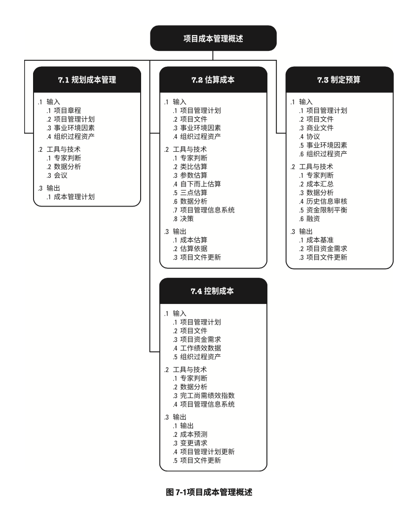

# 项目成本管理

- 项目成本管理包括为使项目在批准的预算内完成而对成本进行规划、估算、预算、融资、筹资、管理和控制的各个过程，从而确保项目在批准的预算内完工。
- 项目成本管理过程包括：
	- 规划成本管理：确定如何估算、预算、管理、监督和控制项目成本的过程
	- 估算成本：对完成项目活动所需货币资源进行近似估算的过程
	- 制定预算：汇总所有单个活动或工作包的估算成本，建立一个批准的成本基准的过程
	- 控制成本：监督项目状态，以更新项目成本和管理成本基准变更的过程。
- 项目成本管理的各个过程
	
- 虽然在本《PMBOK®️指南》中各项目成本管理过程以界限分明和相互独立的形式出现，但在实践中它们会以本指南无法全面详述的方式相互交叠和相互作用。
	- 这些过程不仅彼此相互作用，而且还与其他知识领域中的过程相互作用。
- 在某些项目，特别是范围较小的项目中，成本估算和成本预算之间的联系非常紧密，以至于可视为一个过程，由一个人在较短的时间内完成。但本章仍然把两个过程分开来介绍，因为它们所用的工具和技术各不相同。
- 对成本的影响力在项目早期最大，因此尽早定义范围就至关重要。

### 项目成本管理的核心概念

- 项目成本管理重点关注完成项目活动所需资源的成本，同时也应考虑项目决策对项目产品、服务或成果的使用成本、维护成本和支持成本的影响。
	- 例如，限制设计审查的次数可降低项目成本，但可能增加由此带来的产品运营成本
- 成本管理的另一个方面是认识到不同的相关方会在不同的时间，用不同的方法测算项目成本。
	- 例如，对于某采购品，可在做出采购决策、下达订单、实际交货、实际成本发生或进行项目会计记账时，测算其成本。
- 在很多组织中，预测和分析项目产品的财务效益是在项目之外进行的，但对于有些项目，如固定资产投资项目，可在项目成本管理中进行这项预测和分析工作。
	- 在这种情况下，项目成本还需使用其他过程和许多通用财务管理技术，如投资回报率分析、现金流贴现分析和投资回收期分析等。

### 项目成本管理的发展趋势和新兴实践

- 在项目成本管理的实践中，通过对挣值管理（EVM）的扩展，引入挣得进度（ES）这一概念。
- ES是EVM理论和实践的延伸。
	- 挣得进度理论用ES和实际时间（AT）替代了传统EVM所使用的进度偏差测量指标（挣值-计划价值），使用这种替代方法计算进度偏差ES-AT，
		- 如果挣得进度大于0，则表示项目进度提前了；
		- 换句话说，在某个给定的时间点，项目的挣值大于计划值。
	- 使用挣得进度测量指标的进度绩效指数为ES与AT之比，表示完成项目的工作效率。
	- 此外，挣得进度理论通过挣得进度、实际时间和估算持续时间，提供了预测项目完成日期的计算公式。

### 裁剪考虑因素

- 由于每个项目都是独特的，项目经理因此可能需要裁剪项目成本管理过程。裁剪时应考虑的因素包括（但不限于）：
	- 知识管理：组织是否拥有易于使用的、正式的知识管理体系和财务数据库，并要求项目经理使用？
	- 估算和预算：组织是否有正式或非正式的，与成本估算和预算相关的政策、程序和指南？
	- 挣值管理：组织是否采用挣值管理来管理项目？
	- 敏捷方法的使用：组织是否采用敏捷方法管理项目？这对成本估算有什么影响？
	- 治理：组织是否拥有正式或非正式的审计和治理政策、程序和指南？

### 关于敏捷/适应型环境的考虑因素

- 对易变性高、范围并未完全明确、经常发生变更的项目，详细的成本计算可能没有多大帮助。
	- 在这种情况下，可以采用轻量级估算方法快速生成对项目人力成本的高层级预测，在出现变更时容易调整预测；
	- 而详细的估算适用于采用准时制的短期规划
- 如果易变的项目也遵循严格的预算，通常需要更频繁地更改范围和进度计划，以始终保持在成本制约因素之内。

## 规划成本管理

- 规划成本管理：确定如何估算、预算、管理、监督和控制项目成本的过程
- 本过程的主要作用：在整个项目期间为如何管理项目成本提供指南和方向
- 本过程仅开展一次或仅在项目的预定于点开展
- 规划成本管理过程的输入、工具与技术和输出
	
- 规划成本管理过程的数据流向图
	
- 应该在项目规划阶段的早期就对成本管理进行工作规划，建立各成本管理过程的基础框架，以确保各过程的有效性以及各过程之间的协调性。
- 成本管理计划是项目管理计划的组成部分，其过程及工具与技术应记录在成本管理计划中。

### 规划成本管理：输入

1. 项目章程
	- 项目章程规定了预先批准的财务资源，可据此确定详细的项目成本。
	- 项目章程所规定的的项目审批要求，也对项目成本管理有影响
2. 项目管理计划
	- 项目管理计划组件包括（但不限于）：
		- 进度管理计划：进度管理计划确定了编制、监督和监控项目进度的准则和活动，同时也提供了影响成本估算和管理的过程及控制方法。
		- 风险管理计划：风险管理计划提供了识别、分部须个花不低于风险的方法，同时也提供了影响成本估算和管理的过程及控制方法。
3. 事业环境因素
	- 能够影响成本管理过程的事业环境因素包括（但不限于）：
		- 能够影响成本管理的组织文化和组织结构
		- 市场条件：决定着在当地及全球市场上可获得哪些产品、服务和成果
		- 货币汇率：用于换算发生在多个国家的项目成本
		- 发布的商业信息：经常可以从商业数据库中获取资源成本费率及相关信息，而这些数据库动态跟踪具有相应技能的人力资源的成本数据，也提供材料与设备的标准成本数据；还可以从卖方公布的价格清单中获取相关信息。
		- 项目管理信息系统：可为管理成本提供多种方案
		- 不同地区的生产率差异：可能会对项目成本造成巨大影响
4. 组织过程资产
	- 能够影响规划成本管理过程的组织过程资产包括（但不限于）：
		- 财务控制程序（如定期报告、必须的费用与支付审查、会计编码及标准合同条款等）
		- 历史信息和经验教训知识库
		- 财务数据库
		- 现有的正式和非正式的与成本估算和预算有关的政策、程序和指南

### 规划成本管理：工具与技术

1. 专家判断
	- 应征求具备以下专业知识或接受过相关培训的个人或小组的意见
		- 以往类似项目
		- 来自行业、学科和应用领域的信息
		- 成本估算和预算
		- 挣值管理
2. 数据分析
	- 适用于本过程的数据分析技术包括（但不限于）：
		- 备选方案分析
			- 备选方案分析可包括
				- 审查筹资的战略方法，如：
					- 自筹资金
					- 股权投资
					- 借贷投资
					- 等等..
				- 还可以包括对筹集项目资源的方法的考量，如
					- 自制
					- 采购
					- 租用或租赁
3. 会议
	- 项目团队可能举行规划会议来制定成本管理计划。
	- 参会者可能包括：
		- 项目经理
		- 项目发起人
		- 选定的项目团队成员
		- 选定的相关方
		- 项目成本负责人
		- 以及其他必要人员

### 规划成本管理：输出

1. 成本管理计划
	- 成本管理计划：项目管理计划的组成部分，描述将如何规划、安排和控制项目成本
	- 成本管理过程及其工具与技术应记录在成本管理计划中
	- 例如，成本管理计划中规定：
		- 计量单位：需要规定美中资源的计量单位，例如用于测量时间的人时数、人天数或周数，用于计量数量的米、升、吨、千米或立方码，或者用货币表示的总价
		- 精确度：根据活动范围和项目规模，设定成本估算向上或向下取整的程度（例如995.59美元取整为1000美元）
		- 准确度：为活动成本估算规定一个可接受的区间（如±10%），其中可能包括一定数量的应急储备。
		- 组织程序链接：工作分解结构为成本管理计划提供了框架，以便据此规范地开展成本估算、预算和控制。
			- 在项目成本核算中使用的WBS组成部分，称为控制账户（CA），每个控制账户都有唯一的编码或账号，直接与执行组织的会计制定相联系。
		- 控制临界值：可能需要规定偏差临界值，用于监督成本绩效。
			- 它是在需要采取某种措施前，允许出现的最大差异，通常用于偏离基准计划的百分数来表示
		- 绩效测量规则：需要规定用于绩效测量的挣值管理（EVM）规则。
			- 例如，成本管理计划应该：
				- 定义WBS中用于绩效测量的控制账户
				- 确定拟用的EVM技术（如加权里程碑法、固定公式法、完成百分比法等）
				- 规定跟踪方法，以及用于计算项目完工估算（EAC）的EVM公式，该公式计算出的结果可用于验证通过自下而上方法得出的完工估算。
		- 报告格式：需要规定各种成本报告的格式和编制频率
		- 其他细节：关于成本管理活动的其他细节包括（但不限于）：
			- 对战略筹资方案的说明
			- 处理汇率波动的程序
			- 记录项目成本的程序
	- 关于挣值管理的更多信息，参见《挣值管理实践标准》（第二版）

## 估算成本

- 估算成本：对完成项目工作所需资源成本进行近似估算的过程
- 本过程的主要作用：确定项目所需的资金
- 本过程应根据需要在项目期间定期开展
- 估算成本过程的输入、工具及技术和输出
	
- 估算成本过程的数据流向图
	
- 成本估算是对完成活动所需资源的可能成本的量化评估，是在某特定时点们根据已知信息所做出的的成预测
- 在估算成本时，需要识别和分析可用于启动与完成项目的备选成本方案
- 需要权衡备选成本方案并考虑风险，如比较自制成本与外购成本、购买成本与租赁成本及多种资源共享方案，以优化项目成本
- 通常用某种货币单位（如美元、欧元、日元等）进行成本估算，但有时也可采用其他计量单位，如人时数或人天数，以消除通货膨胀的影响，便于成本比较。
- 在项目过程中，应该随着更详细信息的呈现和假设条件的验证，对成本估算进行审查和优化。
- 在项目生命周期中，项目估算的准确性亦将随着项目的进展而逐步提高。
	- 例如，在启动阶段可得出项目的粗略量级估算（Rough Order of Magnitude, ROM），其区间为-25%到+75%；
	- 之后，随着信息越来越详细，确定性估算的区间可缩小至-5%+10%。
- 某些组织已经制定出相应的指南，规定何时进行优化，以及每次优化所要达到的置信度或准确度
- 进行成本估算，应该考虑向项目收费的所有资源，包括（但不限于）人工、材料、设备、服务、设施，以及一些特殊的成本种类，如通货膨胀补贴、融资成本或应急成本。
- 成本估算可在活动层级呈现，也可以汇总形式呈现。

### 估算成本：输入

1. 项目管理计划
	- 项目管理计划组件包括（但不限于）：
		- 成本管理计划：成本管理计划描述了可使用的估算方法以及成本估算需要达到的准确度和精确度
		- 质量管理计划：质量管理计划描述了项目管理团队为实现一系列项目质量目标所需要的活动和资源
		- 范围基准：范围基准包括项目范围说明书、WBS和WBS词典：
			- 项目范围说明书：范围说明书反映了因项目资金支出的周期而产生的资金制约因素，或其他财务假设设条件和制约因素。
			- 工作分解结构，WBS：指明了项目全部可交付成果及其各组成部分之间的相互关系。
			- WBS词典：在WBS词典和相关的详细工作说明书中，列明了可交付成果，并描述了为产出交付成果，WBS各组成部分所需进行的工作
2. 项目文件
	- 可作为本过程输入的项目文件包括（但不限于）：
		- 经验教训登记册：项目早期与制定成本有关的经验教训可以运用到项目后期阶段，以提高成本估算的准确度和精确度。
		- 项目进度计划：进度计划包括项目可用的团队和实物资源的类型、数量和可用时间长短。
			- 如果资源成本取决于使用时间的长短，并且成本出现季节波动，则持续时间估算会对成本估算产生影响。
			- 进度计划还为包含融资成本（包括利息）的项目提供有用信息
		- 资源需求：资源需求明确了每个工作包或活动所需的资源类型和数量
		- 风险登记册：风险登记册包含了已识别并按优先级顺序排列的单个项目风险的详细信息，以及针对这些风险采取的应对措施。
			- 风险登记册还提供了可用于估算成本的详细信息
3. 事业环境因素
	- 会影响估算成本过程的事业环境因素包括（但不限于）：
		- 市场条件：可以从市场上获得什么产品、服务和成果，可以从谁那里、以什么条件获得。
			- 地区和/或全球性的供求情况会显著影响资源成本
		- 发布的商业信息：经常可以从商业数据库中获取资源成本费率及相关信息，而这些数据库动态跟踪具有相应技能的人力资源的成本数据，也提供材料与设备的标准成本数据；还可以从卖方公布的价格清单中获取相关信息。
		- 汇率和通货膨胀率：对于持续多年、涉及多种货币的大规模项目，需要了解汇率波动和通货膨胀，并将其纳入估算成本过程。
4. 组织过程资产
	- 会影响估算成本过程的组织过程资产包括（但不限于）：
		- 成本估算政策
		- 成本估算模板
		- 历史信息和经验教训知识库

### 估算成本：工具与技术

1. 专家判断
	- 应征求具备以下专业知识或接受过相关培训的个人或小组的意见：
		- 以往类似项目
		- 来自行业、学科和应用领域的信息
		- 成本估算方法
2. 类比估算
	- 成本类比估算使用以往类似项目的参数值或属性来估算。
	- 项目的参数值和属性包括（但不限于）：
		- 范围
		- 成本
		- 预算
		- 持续时间
		- 规模指标（如尺寸、重量）
	- 类比估算以这些项目参数值或属性为基础来估算当前项目的同类参数或指标
3. 参数估算
	- 参数估算是指利用历史数据之间的统计关系和其他变量（如建筑施工中的平方英尺），来进行项目工作的成本估算，参数估算的准确性取决于参数模型的成熟度和基础数据的可靠性。
	- 参数估算可以针对整个项目或项目中的某个部分，并可与其他估算方法联合使用
4. 自下而上估算
	- 自下而上估算是对工作组成部分进行估算的一种方法。
	- 首先对单个工作包或活动的成本进行最具体、细致的估算，然后把这些细节性成本向上汇总或“滚动”到更高层次，用于后续报告和跟踪。
	- 自下而上估算的准确性及其本身所需的成本，通常取决于单个活动或工作包的规模或其他属性。
5. 三点估算
	- 通过考虑估算中的不确定性与风险，使用三种估算值来界定活动成本的近似区间，可以提高单点成本估算的准确性：
		- 最可能成本（cM）：对所需活动的工作和相关费用进行比较现实的估算，所得到的活动成本
		- 最乐观成本（cO）：基于活动的最好情况所得到的成本
		- 最悲观成本（cP）：基于活动的最差情况所得到的成本
	- 基于活动成本在三种估算值区间的假定分布情况，使用公式来计算预期成本（cE）。
	- 两种常用的公式是三角分布和贝塔分布，其计算公式分别为：
		- 三角分布：cE = (cO + cM + cP)/3
		- 贝塔分布：cE = (cO + 4cM + cP)/6
	- 基于三点的假定分布计算出期望成本，并说明期望成本的不确定区间
6. 数据分析
	- 使用与估算成本过程的数据分析技术包括（但不限于）：
		- 备选方案分析
			- 备选方案分析是一种对已识别的可选方案进行评估的技术，用来决定选择哪种方案或使用何种方法来执行项目工作。
			- 例如，评估购买和制造可交付成果分别对成本、进度、资源和质量的影响。
		- 储备分析
			- 为应对成本的不确定性，成本估算可以包括应急储备（有时称为“应急费用”）。
			- 应急储备是包含在成本基准内的一部分预算，用来应对已识别的风险
			- 应急储备还通常是预算的一部分，用来应对哪些会影响项目的“已知-未知”风险。
				- 例如，可以预知有些项目可交付成果需要返工，却不知道返工的工作量是多少。
				- 可以预留应急储备来应对这些未知数量的返工工作。
			- 小至某个具体活动，大到整个项目，任何层级都可以有其应急储备
			- 应急储备可取成本估算值的某一百分比、某个固定值，或者通过定量分析来确定
		- 质量成本：
			- 在估算时，可能要用到关于质量成本的各种假设，这包括对以下情况进行评估：
				- 是为大到要求而增加投入，还是承担不符合要求而造成的成本
				- 是寻求短期成本降低，还是承担产品生命周期后期频繁出现问题的后果
7. 项目管理信息系统
	- 项目管理信息系统可包括电子表单、模拟软件以及统计分析工具，可用来辅助成本估算。
	- 这些工具能简化某些成本估算技术的使用，使人们能快速考虑多种成本估算方案
8. 决策
	- 适用于估算成本过程的决策技术包括：
		- 投票：投票是为达成某种期望结果，而对多个未来行动方案进行评估的过程
	- 这些技术可以调动团队成员的参与，提高估算的准确性，并提高对估算结果的责任感。

### 估算成本：输出

1. 成本估算
	- 成本估算包括对完成项目工作可能需要的成本、应对已识别风险的应急储备，以及应对计划外工作的管理储备的量化估算
	- 成本估算可以是汇总的或详细分列的。
	- 成本估算应覆盖项目所使用的全部资源，包括（但不限于）：
		- 直接人工
		- 材料
		- 设备
		- 服务
		- 设施
		- 信息技术
		- 以及一些特殊的成本种类，如：
			- 融资成本（包括利息）
			- 通货膨胀补贴
			- 汇率
			- 成本应急储备
	- 如果间接成本也包含在项目估算中，则可在活动层次或更高层次上计列间接成本
2. 估算依据
	- 成本估算所需的支持信息的数量和种类，因应用领域而异，不论其详细程度如何，支持性文件都应该清晰、完整地说明成本估算是如何得出的
	- 成本估算的支持信息可包括：
		- 关于估算依据的文件（如估算是如何编制的）
		- 关于全部假设条件的文件
		- 关于各种已知制约因素的文件
		- 有关已识别的、在估算成本时应考虑的风险文件
		- 对估算区间的说明（如“10,000美元±10%”就说明了预期成本的所在区间）
		- 对最终估算的置信水平的说明
3. 项目文件更新
	- 可在本过程更新的项目文件包括（但不限于）：
		- 假设日志：在成本估算过程中可能会做出新的假设、识别新的制约因素，或者重新审查和修改已有的假设条件或制约因素。假设日志应根据这些新信息做出相应更新
		- 经验教训登记册：有效和高效地估算成本的技术，需要更新在经验教训登记册中
		- 风险登记册：在估算成本过程中选择和商定风险应对措施时，可能需要更新风险登记册

## 制定预算
### 制定预算：输入

1. 项目管理计划
2. 项目文件
3. 商业文件
4. 协议
5. 事业环境因素
6. 组织过程资产

### 制定预算：工具与技术

1. 专家判断
2. 成本汇总
3. 数据分析
4. 历史信息审核
5. 资金限制平衡
6. 融资

### 制定预算：输出

1. 成本基准
2. 项目资金需求
3. 项目文件更新

## 控制成本
### 控制成本：输入

1. 项目管理计划
2. 项目文件
3. 项目资金需求
4. 工作绩效数据
5. 组织过程资产

### 控制成本：工具与技术

1. 专家判断
2. 数据分析
3. 完工尚需绩效质数
4. 项目管理信息系统

### 控制成本：输出

1. 工作绩效信息
2. 成本预测
3. 变更请求
4. 项目管理计划更新
5. 项目文件更新
