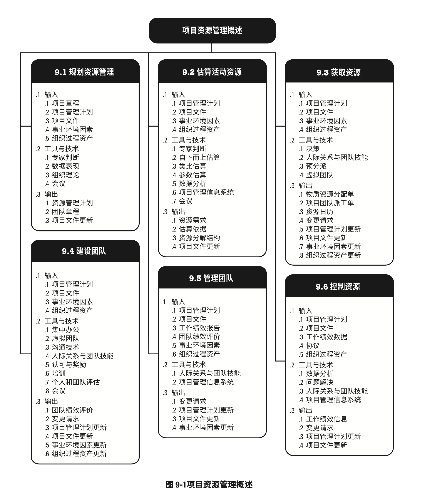
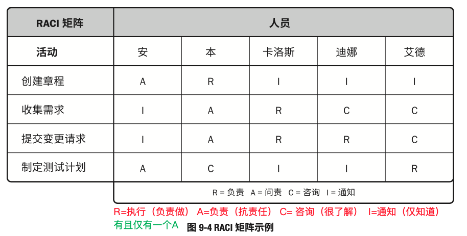
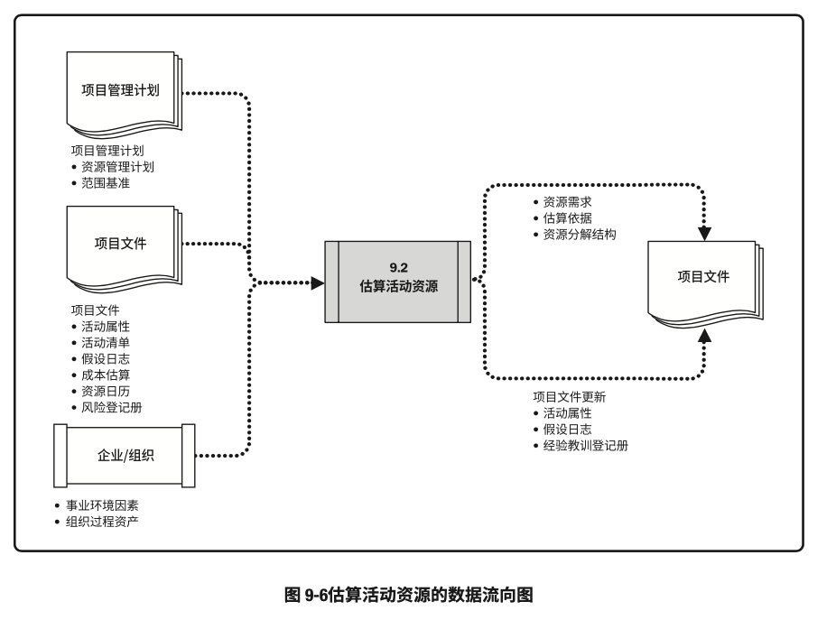
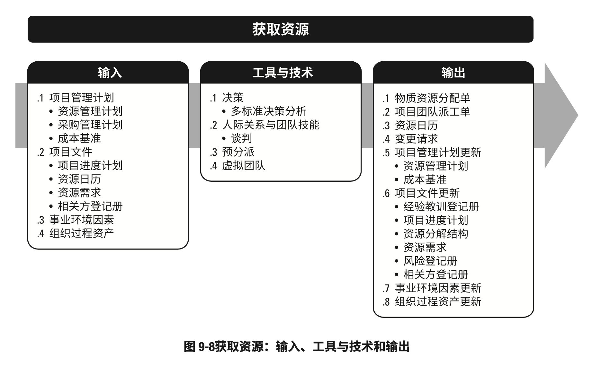

# 项目资源管理

- 项目资源管理包括识别、获取和管理所需资源以成功完成项目的各个过程，这些过程有助于确保项目经理和项目团队在正确的时间和地点使用正确的资源。
- 项目资源管理过程包括：
	- 规划资源管理：定义如何估算、获取、管理和利用实物以及团队项目资源的过程
	- 估算活动资源：估算执行项目所需的团队资源，以及材料、设备和用品的类型和数量的过程
	- 获取资源：获取项目所需的团队成员、设施、设备、材料、用品和其他资源的过程
	- 建设团队：提高工作能力，促进团队成员互动，改善团队整体氛围，以提高项目绩效的过程
	- 管理团队：跟踪团队成员工作表现，提供反馈，解决问题并管理团队变更，以优化项目绩效的过程
	- 控制资源：确保按计划为项目分配实物资源，以及根据资源使用计划监督资源实际使用情况，并采取必要纠正措施的过程。
- 项目资源管理的各个过程
	
- 虽然在本《PMBOK®️指南》中，各项目资源管理过程以界限分明和相互独立的形式出现，但在实践中它们会以本指南无法全面详述的方式相互交叠和相互作用。
- 团队资源管理相对于实物资源管理，对项目经理提出了不同的技能和能力要去。
	- 实物资源包括设备、材料、设施和基础设施，而团队资源或人员指的是人力资源。
- 项目团队成员可能具备不同的技能，可能是全职或兼职的，可能随项目进展而增加或减少。
- 项目资源管理与项目相关方管理之间有重叠部分，本节则重点关注组成项目团队的部分相关方。

### 项目资源管理的核心概念

- 项目团队由承担特定角色和职责的个人组成，他们为实现项目目标而共同努力。
- 项目经理因此应在获取、管理、激励和增强项目团队方面投入适当的努力。
- 尽管项目团队成员被分派了特定的角色和职责，但让他们全员参与项目规划和决策仍是有益的。
- 团队成员参与规划阶段，既可以使他们对项目规划工作贡献专业技能，又可以增强他们对项目的责任感。
- 项目经理既是项目团队的领导者又是项目团队的管理者。
- 除了项目管理活动，例如启动、规划、执行、监控和关闭各个项目阶段，项目经理还负责建设高效的团队。
- 项目经理应留意能够影响团队的不同因素，例如：
	- 团队环境
	- 团队成员的地理位置
	- 相关方之间的沟通
	- 组织变更管理
	- 内外部政治氛围
	- 文化问题和组织的独特性
	- 其他可能改变项目绩效的因素
- 作为领导者，项目经理还负责积极培养团队技能和能力，同时提高并保持团队的满意度和积极性，项目经理还应留意并支持专业与道德行为，确保所有团队成员都遵守这些行为。
- 实物资源管理着眼于有效和高效的方式，分配和使用成功完成项目所需的实物资源，如材料、设备和用品。
	- 为此，组织应当拥有如下数据：
		- （当前和合理的未来的）资源需求
		- （可能满足这些需求的）资源配置
		- 资源供应
- 不能有效管理和控制资源是项目成功完成的风险来源。
	- 例如：
		- 未能确保关键设备或基础设施按时到位，可能会推迟最终产品的制造
		- 订购低质量材料可能会损害产品质量，导致大量召回或返工
		- 保存太多库存可能会导致高运营成本，使组织盈利下降；另一方面，如果库存量太低，就可能无法满足客户需求，同样会造成组织盈利下降。

### 项目资源管理的趋势和新兴实践

- 项目管理风格正在从管理项目的命令和控制结构，转向更加协作和支持性的管理方法，通过将决策权分配给团队成员来提高团队能力。
- 此外，现代的项目资源管理方法致力于寻求优化资源使用
- 有关项目资源管理的趋势和新兴实践包括（但不限于）：
	- 资源管理方法
		- 过去几年，由于关键资源稀缺，在某些行业出现了一些普遍的趋势，涌现出很多关于精益管理、准时制（JIT）生产、Kaizen（持续改善）、全员生产维护（TPM）、约束理论等方法的文献资料。
		- 项目经理应确定执行组织是否采用了一种或多种资源管理同居，从而对项目做出相应的调整。
	- 情商（EI）
		- 项目经理应提升内在（如自我管理和自我意识）和外在（如关系管理）能力，从而提高个人情商。
		- 研究表明，提高项目团队的情商或情绪能力可提高团队效率，还可以降低团队成员离职率。
	- 自组织团队
		- 随着敏捷方法在IT项目中的应用越来越普遍，自组织团队（无需集中管控运作）越来越多。对于拥有自组织团队的项目，“项目经理”（可能不称为“项目经理”）的角色主要是为团队创造环境、提供支持并信任团队可以完成工作。
		- 成功的自组织团队通常由通用的专才而不是主题专家组成，他们能够不断适应变化的环境并采纳建设性反馈。
	- 虚拟团队/分布式团队
		- 项目全球化推动了对虚拟团队的需求的增长。这些团队成员致力于同一个项目，却分布在不同的地方。
		- 沟通技术（如电子邮件、电话会议、社交媒体、网络会议和视频会议等）的使用，使虚拟团队变得可行。
		- 虚拟团队管理有独特的优势
			- 例如能够利用项目团队的专业技术，即使相应的专家不再同一地理区域；
			- 将在家办公的员工纳入团队
			- 以及将行动不便或者残疾人纳入团队
		- 而虚拟团队管理面临的挑战主要在于沟通，包括可能产生孤立感、团队成员之间难以分享知识和经验、难以跟进进度和生产率，以及可能存在时区和文化的差异。

### 裁剪考虑因素

- 由于每个项目都是独特的，项目经理需要裁剪项目资源管理过程。
- 裁剪时应考虑的因素包括（但不限于）：
	- 多元化：团队多元化背景是什么？
	- 物理位置：团队成员和实物资源的物理位置在哪里？
	- 行业特定资源：所在行业需要哪些特殊资源？
	- 团队成员的获得：如何获得项目团队成员？项目团队资源是全职还是兼职？
	- 团队管理：如何管理项目团队建设？组织是否有管理团队建设的工具或是否需要创建新工具？是否存在有特殊需求的团队成员？是否需要为团队提供有关多元化管理的特别培训？
	- 生命周期方法：项目采用哪些生命周期方法？

### 在敏捷或适应型环境中需要考虑的因素

- 易变性高的项目得益于最大限度地集中和协作的团队结构，例如用友通才的自组织团队
- 协作旨在提高生产率和促进创新的问题解决方式。
- 协作型团队可以促进不同工作活动的加速整合、改善沟通、增加知识分享，以及提供工作分配的灵活性和其他优势
- 虽然协作的优势也适用于其他项目环境，协作型团队对于易变性高且快速变化的项目成功而言通常是至关重要的，因为集中分配任务和决策所需的时间更少
- 对于易变性高的项目，实物和人力资源规划的可预测性要低得多。
	- 在这些环境中，关于快速供应和精益方法的协议，对于控制成本和实现进度而言至关重要。

## 规划资源管理

- 规划资源管理：定义如何估算、获取、管理和利用团队以及实物资源的过程。
- 本过程的主要作用：根据项目类型和复杂程度确定适用于项目资源的管理方法和管理程度。
- 本过程仅开展一次或仅在项目的预定义点开展。
- 规划资源管理过程的输入、工具与技术和输出
	
- 规划资源管理过程的数据流向图
	
- 资源规划管理用于确定和识别一种方法，以确保项目的成功完成有足够的可用资源。
- 项目资源可能包括团队成员、用品、材料、服务和设施
- 有效的资源规划需要考虑稀缺资源的可用性和竞争，并编制相应的计划
- 这些资源可以从组织内部资产获得，或者通过采购过程从组织外部获取。
- 其他项目可能在统一时间和地点竞争项目所需的相同资源，从而对项目成本、进度、风险、质量和其他项目领域造成显著影响

### 规划资源管理：输入

1. 项目章程
	- 项目章程提供项目的高层级描述和要求，此外还包括可能影响项目资源管理的关键相关方名单、里程碑概况，以及预先批准的财务资源
2. 项目管理计划
	- 项目管理计划组件包括（但不限于）：
		- 质量管理计划：质量管理计划有助于定义项目所需的资源水平，以实现和维护已定义的质量水平并达到项目测量指标
		- 范围基准
			- 范围基准识别了可交付成果，决定了需要管理的资源的类型和数量
3. 项目文件
	- 可作为本过程输入的项目文件包括（但不限于）：
		- 项目进度计划：项目进度计划提供了所需资源的时间轴
		- 需求文件：需求文件指出了项目所需的资源的类型和数量，并可能影响管理资源的方式
		- 风险登记册：风险登记册包含可能影响资源规划的各种威胁和机会的信息
		- 相关方登记册：相关方登记册有助于识别对项目所需资源有特别兴趣或影响的那些相关方，以及会影响资源使用偏好的相关方
4. 事业环境因素
	- 能够影响规划资源管理过程的事业环境因素包括（但不限于）：
		- 组织文化和结构
		- 设施和资源的地理分布
		- 现有资源的能力和可用性
		- 市场条件
5. 组织过程资产
	- 能够影响规划资源管理过程的组织过程资产包括（但不限于）：
		- 人力资源政策和程序
		- 物质资源管理政策和程序
		- 安全政策
		- 安保政策
		- 资源管理计划模板
		- 类似项目的历史信息

### 规划资源管理：工具与技术

1. 专家判断
	- 应征求具备以下专业知识或接受过相关培训的个人或小组的意见
		- 协调组织内部的最佳资源
		- 人才管理和员工发展
		- 确定为实现项目目标所需的初步投入水平
		- 根据组织文化确定报告要求
		- 根据经验教训和市场条件，评估获取资源所需的提前量
		- 识别与资源获取、留用和遣散计划有关的风险
		- 遵循适用的政府和工会法规
		- 管理卖方和物流工作，确保在需要时能够提供材料和日用品
2. 数据表现
	- 适用于本过程的数据表现技术包括（但不限于）：
		- 图表
			- 数据表现有多种格式来记录和阐明团队成员的角色与职责。
				- 大多数格式属于层级型、矩阵型或文本型。
				- 有些项目人员安排可以在子计划（如风险、质量或沟通管理计划）中列出
			- 无论用什么方式记录团队成员的角色，目的都是要确保每个工作包都有明确的负责人，确保全体团队成员都清除地理解其角色和职责。
			- 层级型可用于表示高层级角色，而文本型则适合用于记录详细职责
			- 团队成员的角色与职责记录工具
				- 层级型：可以采用传统的组织结构，自上而下显示各种职位及其相互关系
					- 工作分解结构（WBS）：WBS用来显示如何把项目可交付成果分解为工作包，有助于明确高层级的职责
					- 组织分解结构（OBS）：WBS显示项目可交付成果的分解，而OBS则按照组织现有的部门、单元或团队排列，并在每个部门下列出项目活动或工作包。
						- 运营部门（如信息技术部或采购部）只需要找到其所在的OBS位置，就能看到自己的全部项目职责
					- 资源分解结构：资源分解结构是按资源类别和类型，对团队和实物资源的层级列表，用于规划、管理和控制项目工作。
						- 每向下一个层次都代表队资源的更详细描述，直到信息细到可以与工作分解结构（WBS）相结合，用来规划和监控项目工作。
				- 责任分配矩阵
					- 责任分配矩阵展示项目资源在各个工作包中的任务分配。
						- 矩阵图表的一个例子是职责分配矩阵（RAM），它显示了分配给每个工作包的项目资源，用于说明工作包或活动与项目团队成员之间的关系。
						- 在大型项目中，可以制定多个层次的RAM。
							- 例如，高层次的RAM可定义项目团队、小组或部门负责WBS中的哪部分工作，而低层次的RAM则可在各小组内为具体活动分配角色、职责和职权。
					- 矩阵图能反映与每个人相关的所有活动，以及与每项活动相关的所有人员，它也可确保一项任务都只有一个人负责，从而避免职权不清。
					- RAM的一个例子是RACI（执行、负责、咨询和知情）矩阵
						
						- 图中最左边的一列表示有待完成的工作（活动）。
					- 分配给每项工作的资源可以是个人或小组，项目经理也可根据项目需要，选择“领导”或“资源”等适用词汇，来分配项目责任。
					- 如果团队是由内部和外部人员组成，RACI矩阵对明确划分角色和职责特别有用
				- 文本型
					- 如果需要详细描述团队成员的职责，就可以采用文本型。
					- 文本型文件通常以概述的形式，提供诸如职责、职权、能力和资格等方面的信息。
					- 这种文件有多种名称，如职位描述、角色——职责——职权表，该文件可作为未来项目的模板，特别是在根据当前项目的经验教训对其内容进行更新之后。
3. 组织理论
	- 组织理论阐述个人、团队和组织部门的行为方式。
	- 有效利用组织理论中的常用技术，可以节约规划资源管理过程的时间、成本及人力投入，提高规划工作的效率。
	- 此外，可以根据相关的组织理论灵活使用领导风格，以适应项目生命周期中团队成熟度的变化。
	- 重要的是要认识到，组织的结构和文化影响项目组织结构
4. 会议
	- 项目团队可召开会议来规划项目资源管理

### 规划资源管理：输出

1. 资源管理计划
	- 作为项目管理计划的一部分，资源管理计划提供了关于如何分类、分配、管理和释放项目资源的指南。
	- 资源管理计划可以根据项目的具体情况分为团队管理计划和实物资源管理计划。
	- 资源管理计划能包括（但不限于）：
		- 识别资源：用于识别和量化项目所需的团队和实物资源的方法
		- 获取资源：关于如何获取项目所需的团队和实物资源的指南
		- 角色与职责
			- 角色：在项目中，某人承担的职务或分配给某人的职务，如土木工程师、商业分析师和测试协调员
			- 职权：使用项目资源、做出决策、签字批准、验收可交付成果并影响他人开展项目工作的权力
				- 例如，下列事项都需要有明确职权的人来做决策
					- 选择活动的实施方法
					- 质量验收标准
					- 如何应对项目偏差
				- 当个人的职权水平与职权相匹配时，团队成员就能最好地开展工作。
			- 职责：为完成项目活动，项目团队成员必须履行的职责和工作
			- 能力：为完成项目活动，项目团队成员需要具备的技能和才干。
				- 如果项目团队成员不具备所需的能力，就不能有效地履行职责。
				- 一旦发现成员的能力与职责不匹配，就应主动采取措施，如安排培训、招募新成员、调整进度计划或工作范围
		- 项目组织图
			- 项目组织图以图形方式展示项目团队成员及其报告关系。
			- 基于项目的需要，项目组织图可以是正式或非正式的，非常详细或高度概括的。
				- 例如，一个3000人的灾害应急团队的项目组织图，要比仅有20人的内部项目的组织图详尽得多
		- 项目团队资源管理：关于如何定义、配备、管理和最终遣散项目团队资源的指南
		- 培训：针对项目成员的培训策略
		- 团队建设：建设项目团队的方法
		- 资源控制：依据需要确保实物资源充足可用、并为项目需求优化实物资源采购，而采用的方法。
			- 包括有关整个项目生命周期期间的库存、设备和用品管理的信息。
		- 认可计划：将给予团队成员哪些认可和奖励，以及何时给予
2. 团队章程
	- 团队章程是为团队创建团队价值观、共识和工作指南的文件。
	- 团队章程可能包括（但不限于）：
		- 团队价值观
		- 沟通指南
		- 决策标准和过程
		- 冲突处理过程
		- 会议指南
		- 团队共识
	- 团队章程对项目团队成员的可接受行为确定了明确的期望
	- 尽早认可并遵守明确的规则，有助于减少误解，提高生产力；讨论诸如行为规范、沟通、决策、会议礼仪等领域，团队成员可以了解彼此重要的价值观
	- 由团队制定或参与制定的团队章程可发挥最佳效果
		- 所有项目团队成员都分担责任，确保遵守团队章程中规定的规则。
	- 可定期审查和更新团队章程，确保团队始终了解团队基本规则，并指导新成员融入团队。
3. 项目文件更新
	- 可在本过程更新的项目文件包括（但不限于）：
		- 假设日志：更新假设日志时可增加关于实物资源的可用性、物流要求和位置信息以及团队资源的技能集和可用性的假设条件
		- 风险登记册：关于团队和实物资源可用性的风险，以及其他已知资源的相关风险，更新在风险登记册中

## 估算活动资源

- 估算活动资源：估算执行项目所需的团队资源，以及材料、设备和用品的类型和数量的过程
- 本过程的主要作用：明确完成项目所需的资源种类、数量和特性
- 本过程应根据需要在整个项目期间定期开展
- 估算活动资源过程的输入、工具与技术和输出
	
- 估算活动资源过程的数据流向图
	
- 估算活动资源过程与其他过程紧密相关
	- 例如估算成本过程
		- 例如：
			- 建筑项目团队需要熟悉当地建筑法规
				- 这类知识常可从当地卖方获取，但是如果内部劳动力资源对不常用或专门的建筑技术缺乏经验，那么支付额外费用聘请咨询专家，可能就是了解当地建筑法规的最有效的方法
			- 汽车设计团队需要熟悉最新的自动装配技术
				- 这些必要的知识可以通过聘请顾问、派设计人员参加机器人技术研讨会，或者邀请制造人员加入项目团队等方式来获取

### 估算活动资源：输入

1. 项目管理计划
	- 项目管理计划组件包括（但不限于）：
		- 资源管理计划：资源管理计划定义了识别项目所需 不同资源的方法，还定义了量化各个活动所需的资源并整合这些信息的方法
		- 范围基准：范围基准识别了实现项目目标所需的项目和产品范围，而范围决定了对团队和实物资源的需求。
2. 项目文件
	- 可作为本过程输入的项目文件包括（但不限于）：
		- 活动属性：活动属性为估算活动清单中每项活动所需的团队和实物资源提供了主要数据来源
			- 这些属性的例子包括：
				- 资源需求
				- 强制日期
				- 活动地点
				- 假设条件
				- 制约因素
		- 活动清单：活动清单识别了需要资源的活动
		- 假设日志：假设日志可能包含有关生产力因素、可用性、成本估算以及工作方法的信息，这些因素会影响团队和实物资源的性质和数量
		- 成本估算：资源成本从数量和技能水平方面会影响资源选择
		- 资源日历：资源日历识别了每种具体资源可用时的工作日、班次、正常营业的上下班时间、周末和公共假日。
			- 在规划活动期间，潜在的可用资源信息（如团队资源、设备和材料）用于估算资源可用性。
			- 资源日历还规定了在项目期间确定的团队和实物资源何时可用、可用多久。这些信息可以在活动或项层面建立，这考虑了诸如资源经验和/或技能水平以及不同地理位置等属性。
		- 风险登记册：风险登记册描述了可能影响资源选择和可用性的各个风险
3. 事业环境因素
	- 能够影响估算活动资源过程的事业环境因素包括（但不限于）：
		- 资源的位置
		- 资源可用性
		- 团队资源的技能
		- 组织文化
		- 发布的估算数据
		- 市场条件
4. 组织过程资产
	- 能够影响估算活动资源过程的组织过程资产包括（但不限于）：
		- 关于人员配备的政策和程序
		- 关于用品和设备的政策与程序
		- 关于以往项目中类似工作所使用的资源类型的历史信息

### 估算活动资源：工具与技术

1. 专家判断
	- 应征求具备团队和物质资源的规划和估算方面的专业知识或接受过相关培训的个人或小组的意见
2. 自下而上估算
	- 团队和实物资源在活动级别上估算，然后汇总成工作包、控制账户和总体项目层级上的估算。
3. 类比估算
	- 类比估算将以往类似项目的资源相关信息作为估算未来项目的基础。
	- 这是一种快速估算方法，适用于项目经理只能识别WBS的几个高层级的情况下
4. 参数估算
	- 参数估算基于历史数据和项目参数,使用某种算法或历史数据与其他变量之间的统计关系,来计算活动所需的资源数量。
		- 例如，如果一项活动需要4000个小时的编码时间，而且需要在1年之内完成，则需要两个人来编码（每人每年付出2000小时）。
	- 参数估算的准确性取决于参数模型的成熟度和基础数据的可靠性。
5. 数据分析
	- 使用于本过程的数据分析技术包括（但不限于）：
		- 备选方案分析
			- 备选方案分析是一种对已识别的可选方案进行评估的技术，用来决定选择哪种方案或使用何种方法来执行项目工作。
			- 很多活动有多个备选的实施方案，例如使用能力或技能水平不同的资源、不同规模或类型的机器、不同的工具（手工或自动），以及关于资源自制、租赁或购买的决策。
			- 备选方案分析有助于提供在定义的制约因素范围执行项目活动的最佳方案
6. 项目管理信息系统（PMIS）
	- 项目管理信息系统可以包括资源管理软件，这些软件有助于规划、组织与管理资源库，以及编制资源估算。
	- 根据软件的复杂程度，可以确定资源分解结构、资源可用性、资源费率和各种资源日历，有助于优化资源使用。
7. 会议
	- 项目经理可以和职能经理一起举行规划会议，以估算每项活动所需的资源、支持型活动（LoE）、团队资源的技能水平，以及所需材料的数量。
	- 参会者可能包括项目经理、项目发起人、选定的项目团队成员、选定的相关方，以及其他必要人员。

### 估算活动资源：输出

1. 资源需求
	- 资源需求识别了各个工作包或工作包中每个活动所需的资源类型和数量，可以汇总这些需求，以估算每个工作包、每个WBS分支以及整个项目所需的资源
	- 资源需求描述的细节数量与具体程度因应用领域而异
	- 而资源需求文件也可以包含为确定所用资源的类型、可用性和所需数量所做的假设。
2. 估算依据
	- 资源估算所需的支持信息的数量和种类，因应用领域而异。
	- 但不论其详细程度如何，支持型文件都应该清晰完整地说明资源估算是如何得出的。
	- 资源估算的支持信息可包括：
		- 估算方法
		- 用于估算的资源，如以往类似项目的信息
		- 与估算有关的假设条件
		- 已知的制约因素
		- 估算范围
		- 估算的置信水平
		- 有关影响估算的已识别风险的文件
3. 资源分解结构
	- 资源分解结构：资源依类别和类型的层级展现。
		
	- 资源类别包括（但不限于）：
		- 人力
		- 材料
		- 设备
		- 用品
	- 资源类型则包括：
		- 技能水平
		- 要求证书
		- 等级水平
		- 适用于项目的其他类型
	- 在规划资源管理过程中，资源分解结构用于指导项目的分类活动。
	- 在这一过程中，资源分解结构是一份完整的文件，用于获取和监督资源
4. 项目文件更新
	- 可在本过程更新的项目文件包括（但不限于）：
		- 活动属性：活动属性依据资源需求而更新
		- 假设日志：关于项目所需资源的类型和数量的假设条件，更新在假设日志中。
			- 此外，任何资源制约因素，包括集体劳资协议、连续工作时间、计划休假等，也应当相应更新。
		- 经验教训登记册：能够有效和高效地估算资源的技术，以及有关那些无效或低效的技术信息，更新在经验教训登记册中

## 获取资源

- 获取资源：获取项目所需的团队、设施、设备、材料、用品和其他资源的过程。
- 本过程的主要作用：概述和指导资源的选择，并将其分配给相应的活动。
- 本过程应根据需要在整个项目期间定期开展
- 获取资源过程的输入、工具与技术和输出
	
- 获取资源过程的数据流向图
	
- 项目所需资源可能来自项目执行组织的内部或外部。
	- 内部资源由职能经理或资源经理负责获取（分配）
	- 外部资源则是通过采购过程获得
- 因为集体劳资协议、分包商人员使用、矩阵型项目环境、内外部报告关系或其他原因，项目管理团队可能或可能不对资源选择有直接控制权。
- 重要的是，在获取项目资源的过程中应该注意下列事项：
	- 项目经理或项目团队应进行有效谈判，并影响那些为项目提供所需团队和实物资源的人员。
	- 不能获得项目所需资源时，可能会影响项目进度、预算、客户满意度、质量和风险；资源或人员能力不足时会降低项目成功的概率，最坏的情况可能导致项目取消。
	- 如因制约因素（如经济因素或其他项目对资源的占用）而无法获得所需团队资源，项目经理或项目团队可能不得不使用也许能力和成本不同的替代资源。
		- 在不违反法律、规章、强制性规定或其他具体标准的前提下可以使用替代资源。
- 在项目规划阶段，应该对上述因素加以考虑并做出适当安排。
- 项目经理或项目管理团队应该在项目进度计划、项目预算、项目风险计划、项目质量计划、培训计划及其他相关项目管理计划中，说明缺少所需资源的后果。

### 获得资源：输入

1. 项目管理计划
	- 项目管理计划组件包括（但不限于）：
		- 资源管理计划：资源管理计划为如何获取项目资源提供指南
		- 采购管理计划：采购管理计划提供了关于将从项目外部获取的资源的信息，包括如何将采购与其他项目工作整合起来以及涉及资源采购工作的相关方。
		- 成本基准：成本基准提供了项目活动的总体预算
2. 项目文件
	- 可作为本过程输入的项目文件包括（但不限于）：
		- 项目进度计划：项目进度计划展示了各项活动及其开始和结束日期，有助于确定需要提供和获取资源的时间
		- 资源日历：资源日历记录了每个项目资源在项目中的可用时间段。
			- 编制出可靠的进度计划，应依据对各个资源的可用性和时间限制（包括时区、工作时间、休假时间、当地节假日、维护计划和其他项目的工作时间）的良好了解。
			- 资源日历需要在整个项目过程中渐进明细的更新
			- 资源日历是本过程的输出，在重复本过程时随时可用
		- 资源需求：资源需求识别了需要获取的资源
		- 相关方登记册：相关方登记册可能会发现相关方对项目特定资源的需求或期望，在获取资源过程中应加以考虑。
3. 事业环境因素
	- 能够影响获取资源过程的事业环境因素包括（但不限于）：
		- 现有组织资源信息
			- 包括可用性、能力水平、以及有关团队资源和资源成本的以往经验
		- 市场条件
		- 组织结构
		- 地理位置
4. 组织过程资产
	- 能够影响获取资源过程的组织过程资产包括（但不限于）：
		- 有关项目资源的采购、配置和分配的政策和程序
		- 历史信息和经验教训知识库

### 获得资源：工具与技术

1. 决策
	- 适用于获取资源过程的决策技术包括（但不限于）：
		- 多标准决策分析
			- 选择标准常用于选择项目的实物资源或项目团队
			- 使用多标准决策分析工具制定出标准，用于对潜在资源进行评级或打分
				- 例如，在内部和外部团队资源之间进行选择
			- 根据标准的相对重要性对标准进行加权
				- 加权值可能因资源类型的不同而发生变化
			- 可使用的选择标准包括：
				- 可用性：确认资源能否在项目所需时段内为项目所用
				- 成本：确认增加资源的成本是否在规定的预算内
				- 能力：确认团队成员是否提供了项目所需的能力
			- 有些标准对团队资源来说是独特的，包括：
				- 经验：确认团队成员具备项目成功所需的相关经验
				- 知识：团队成员是否掌握关于客户、执行过的类似项目和项目环境细节的相关知识
				- 技能：确认团队成员拥有使用项目工具的相关技能
				- 态度：团队成员能否与他人协同工作，以形成有凝聚力的团队
				- 国际因素：团队成员的位置、时区和沟通能力
2. 人际关系与团队技能
	- 适用于本过程的人际关系与团队技能包括（但不限于）：
		- 谈判：
			- 很多项目需要针对所需资源进行谈判，
			- 项目管理团队需要与下列各方谈判：
				- 职能经理：确保项目在要求的时限内获得最佳资源，直到完成职责
				- 执行组织中的其他项目管理团队：合理分配稀缺或特殊资源
				- 外部组织的供应商：提供合适的、稀缺的、合格的、经过认证的或其他特殊的团队或实物资源
					- 特别需要注意与外部谈判有关的政策、惯例、流程、指南、法律及其他标准
			- 在资源分配谈判中，项目管理团队影响他人的能力很重要，如同在组织中的政治能力一样重要。
				- 例如，说服职能经理，让他/她看到项目具有良好的前景，会影响他/她把最佳资源分配给这个项目而不是竞争项目
3. 预分派
	- 预分派：事先确定项目的实物或团队资源，
	- 可在下列情况下发生：
		- 在竞标过程中承诺分派特定人员进行项目工作
		- 项目取决于特定人员的专有技能
		- 在完成资源管理计划的前期工作之前，制定项目章程过程或其他过程已经指定了某些团队成员的工作分派
4. 虚拟团队
	- 虚拟团队的使用为招募团队成员提供了新的可能性。
	- 虚拟团队可以定义为具有共同目标、在完成角色人物的过程中很少或没有时间面对面工作的一群人。
	- 现代沟通技术（如电子邮件、电话会议、社交媒体、网络会议和视频会议等）使虚拟团队成为可行。
	- 虚拟团队模式使人们有可能：
		- 在组织内部地处不同地理位置的员工之间组建团队
		- 为项目团队增加特殊技能，即使相应的专家不在同一地理区域
		- 将在家办公的员工纳入团队
		- 在工作班次、工作小时或工作日不同的员工之间组件团队
		- 将行动不便或者残疾人纳入团队
		- 执行那些原本会因差旅费用过高而被搁置或取消的项目
		- 节省员工所需的办公室和所需实物设备的开支
	- 在虚拟团队的环境中，沟通规划变得日益重要。
	- 可能需要花更多时间，来设定明确的期望、促进沟通、制定冲突解决方法、召集人员参与决策、理解文化差异，以及共享成功喜悦。

### 获得资源：输出

1. 实物资源分配单
	- 实物资源分配单记录了项目将使用的材料、设备、用品、地点和其他实物资源
2. 项目团队派工单
	- 项目团队派工单记录了团队成员及其在项目中的角色和职责，包括项目团队名录，还需要把人员姓名插入项目管理计划的其他部分，如项目组织图和进度计划
3. 资源日历
	- 在资源日历识别了每种具体资源可用时的工作日、班次、正常营业的上下班时间、周末和公共假期。
	- 在规划活动期间，潜在的可用资源信息（如团队资源、设备和材料）用于估算资源可用性
	- 资源日历规定了项目期间确定的团队和实物资源何时使用、可用多久。
	- 这些信息可以在活动或项目层面建立，这考虑了诸如资源经验和/或技能水平以及不同地理位置等属性。
4. 变更请求
	- 如果获取资源过程中出现变更请求（例如影响了进度），或者推荐措施、纠正措施或预防措施影响了项目管理计划的任何组成部分或项目文件，项目经理应提交变更请求，且应该通过实施整体变更控制过程对变更请求进行审查和处理。
5. 项目管理计划更新
	- 项目管理计划的任何变更都以变更请求的形式提出，且通过组织的变更控制过程进行处理。
	- 开展本过程可能导致项目管理计划更新的内容包括（但不限于）：
		- 资源管理计划：更新资源管理计划，以反映获取项目资源的实际经验，包括在项目早期获取资源的经验教训，这些经验会影响项目后期的资源获取过程。
		- 成本基准：在项目资源采购期间，成本基准可能发生变更。
6. 项目文件更新
	- 可在本过程更新的项目文件包括（但不限于）：
		- 经验教训登记册：项目中遇到的挑战、本可以规避这些挑战的方法，以及良好的获取资源的方式更新在经验教训登记册中
		- 项目进度计划：所需资源的可用性可能会导致项目进度变更
		- 资源分解结构：在本过程获取的资源应记录到资源分解结构中
		- 资源需求：可更新资源需求文件，以反映获取的项目资源
		- 风险登记册：本过程中识别的新风险记录在风险登记册中，并通过风险管理过程进行管理
		- 相关方登记册：增加的任何相关方，以及在本过程中获得的有关现有相关方的新信息更新在相关方登记册中
7. 事业环境因素更新
	- 需要更新的事业环境因素包括（但不限于）：
		- 组织内资源的可用性
		- 组织已使用的消耗资源的数量
8. 组织过程资产更新
	- 作为获取资源过程的结果，需要更新的组织过程资产包括（但不限于）有关采购、配置和分配资源的文件

## 建设团队

### 建设团队：输入

1. 项目管理计划
2. 项目文件
3. 事业环境因素
4. 组织过程资产

### 建设团队：工具与技术

1. 集中办公
2. 虚拟团队
3. 沟通技术
4. 人际关系与团队技能
5. 认可与奖励
6. 培训
7. 个人和团队评估
8. 会议

### 建设团队：输出

1. 团队绩效评价
2. 变更请求
3. 项目管理计划更新
4. 项目文件更新
5. 事业环境因素更新
6. 组织过程资产更新

## 管理团队

### 管理团队：输入

1. 项目管理计划
2. 项目文件
3. 工作绩效报告
4. 团队绩效评价
5. 事业环境因素
6. 组织过程资产

### 管理团队：工具与技术

1. 人际关系与团队技能
2. 项目管理信息系统（PMIS）

### 管理团队：输出

1. 变更请求
2. 项目管理计划更新
3. 项目文件更新
4. 事业环境因素更新

## 控制资源

### 控制资源：输入

1. 项目管理计划
2. 项目文件
3. 工作绩效数据
4. 协议
5. 组织过程资产

### 控制资源：工具与技术

1. 数据分析
2. 问题解决
3. 人际关系与团队技能
4. 项目管理信息系统（PMIS）

### 控制资源：输出

1. 工作绩效信息
2. 变更请求
3. 项目管理计划更新
4. 项目文件更新