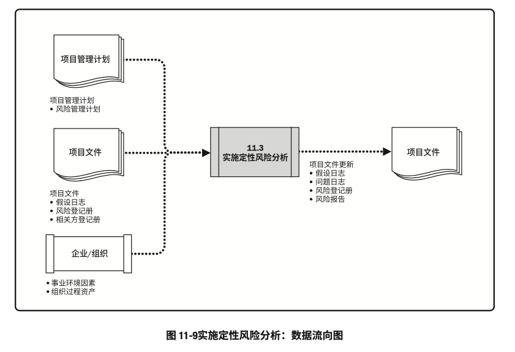
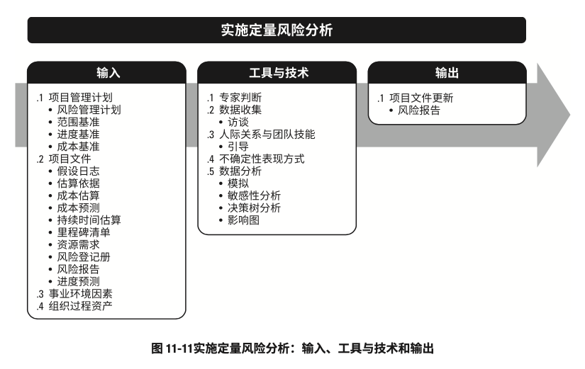
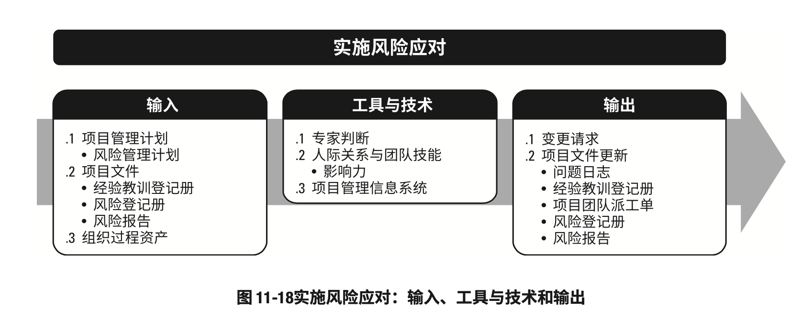
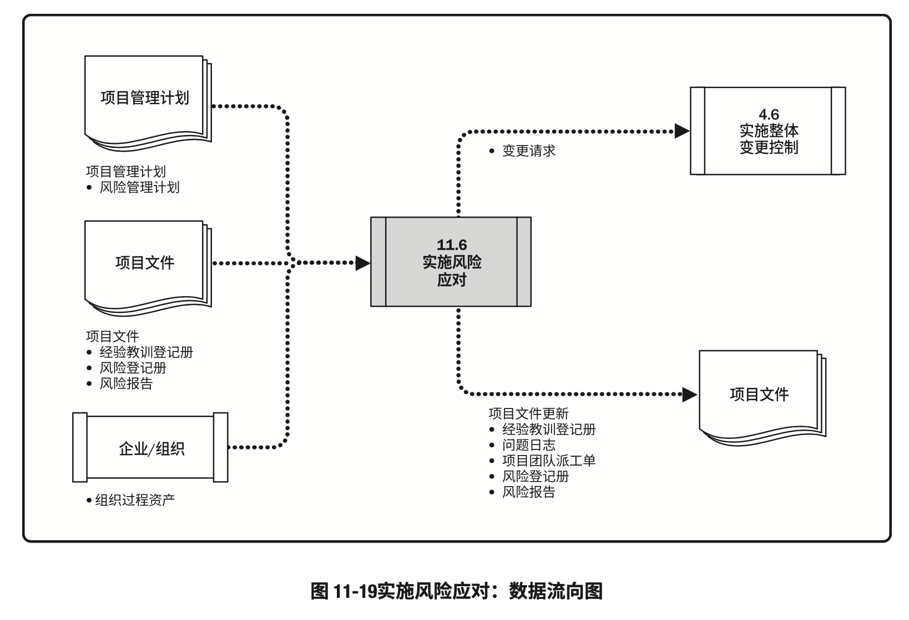

# 项目风险管理

- 项目风险管理包括规划风险管理、识别风险、开展风险分析、规划风险应对、实施风险应对和监督风险的各个过程。
- 项目风险管理的目标在于提高正面风险的概率和（或）影响，降低风险的概率和（或）影响，从而提高项目成功的可能性
- 项目风险管理的过程是：
	- 规划风险管理：定义如何实施项目风险管理活动的过程
	- 识别风险：识别单个项目风险，以及整体项目风险的来源，并记录风险特征的过程
	- 实施定性风险分析：通过评估单个项目风险发生的概率和影响以及其他特征，对风险进行优先级排序，从而为后续分析或行动提供基础的过程
	- 实施定量风险分析：就已识别的单个项目风险和其他不确定性来源对整体项目目标的综合影响进行定量分析的过程
	- 规划风险应对：为处理整体项目风险敞口，以及应对单个项目风险，而制定可选方案、选择应对策略并商定应对行动的过程
	- 实施风险应对：执行商定的风险应对计划的过程
	- 监督风险：在整个项目期间，监督商定的风险应对计划的实施、跟踪已识别的风险、识别和分析新风险，以及评估更显管理有效性的过程
- 项目风险管理的各个过程
	
- 虽然在本《PMBOK®️指南》中，各项目管理风险过程以界限分明和相互独立的形式出现，但在实践中它们会以本指南无法全面详述的方式相互交叠和相互作用

### 项目风险管理的核心概念

- 既然项目是为交付收益而开展的、具有不同复杂程度的独特性工作，那么自然就会充满风险。
- 开展项目，不仅要面对各种制约因素和假设条件，而且还要应对可能相互冲突和不断变化的相关方期望
- 组织应该有目的地以可控方式去冒项目风险，以便平衡风险和回报，并创造价值
- 项目风险管理旨在识别和管理未被其他项目管理过程所管理的风险。
	- 如果不妥善管理，这些风险有可能导致项目偏离计划，无法达成既定的项目目标
	- 因此项目风险管理的有效性直接关于项目成功与否
- 每个项目都在两个层面上存在风险。
	- 每个项目都有会影响项目达成目标的单个风险，
	- 以及由单个项目风险和不确定性的其他来源联合导致的整体项目风险。
		- 考虑整体项目风险，也非常重要。
- 项目风险管理过程同时兼顾这两个层面的风险。他们的定义如下：
	- 单个项目风险：一旦发生，会对一个或多个项目目标产生正面或负面影响的不确定事件或条件。
	- 整体项目风险：是不确定性对项目整体的影响，是相关方面临的项目结果正面和负面变异区间
		- 它源于包含单个风险在内的所有不确定性
- 一旦发生，单个风险会对项目目标产生正面或负面的影响
- 项目风险管理旨在利用或强化正面风险（机会），规避或减轻负面风险（威胁）。
- 未妥善管理的威胁可能引发各种问题，如工期延误、成本超支、绩效不佳或声誉受损。
- 把我好机会则能够获得众多好处，如工期缩短、成本节约、绩效改善或剩余提升
- 整体项目风险也有正面或负面之分。管理整体项目风险旨在通过削弱负面变异的驱动因素，加强正面变异的驱动因素，以及最大化实现整体项目目标的概率，把项目风险敞口保持在可接受的范围之内。
- 因为风险会在项目生命周期内持续发生，所以，项目风险管理过程也应不断迭代开展。
	- 在项目规划期间，就应该通过调整项目策略对风险做初步处理。
	- 接着，应该随着项目进展，监督和管理风险，确保项目处于正轨，并且突发性风险也得到处理
- 有效管理特定项目的风险，项目团队需要知道，相对于要追求的项目目标，可接受的风险敞口究竟是多大
	- 这通常用可测量的风险临界值来定义。
	- 风险临界值反映了组织相关方的风险偏好程度，是项目目标的可接受的变异程度
	- 应该明确规定风险临界值，并传达给项目团队，同时反映在项目的风险影响级别中定义

### 项目风险管理的发展趋势和新兴实践

- 项目风险管理的关注面正在扩大，以便确保考虑所有类型的风险，并在更广泛的背景中理解项目风险
- 项目风险管理的发展趋势和新兴实践包括（但不限于）：
	- 非事件类风险：大多数项目只关注作为可能发生或不发生的不确定性未来事件的风险。
		- 例如：
			- 关键卖方可能在项目期间停业
			- 客户可能在设计完成后变更需求
			- 或分包商可能对标准化操作流程进行优化
		- 不过，识别并管理非事件类风险的意识正在不断加强。
		- 非事件类风险有两种主要类型：
			- 变异性风险：已规划事件、活动或决策的某些关键方面存在不确定性，就导致变异性风险。
				- 例如
					- 生产率可能高于或低于目标值
					- 测试发现的错误数量可能多余或少于预期
					- 或施工阶段可能出现反常的天气情况
			- 模糊性风险：对未来可能发生，存在不确定性。知识不足可能影响项目达成目标的能力。
				- 例如，
					- 不太了解需求或技术解决方案的要素
					- 反馈框架的未来发展
					- 或项目内在的系统复杂性
		- 变异性项目可通过蒙特卡洛分析加以处理，
			- 即：
				1. 用概率分布表示变异的可能区间
				2. 然后才去行动去缩小可能结果的区间。
		- 管理模糊性风险，则需要先定义认知或理解不足之处，进而通过获取外部专家意见或以最佳实践为标杆来填补差距。
			- 也可以采用增量开发、原型搭建或模拟等方法来处理模糊性风险
	- 项目韧性
		- 随着对所谓“未知-未知”因素的已知的增强，人们也越来越明确地指导确实存在突发性风险。
		- 这种风险只有在发生后才能被发现。
		- 可以通过加强项目韧性来应对突发性风险。
		- 这就要求每个项目
			- 除了为已知风险列出具体风险预算，还要为突发性风险预留合理的应急预算和时间
			- 采用灵活的项目过程，包括强有力的变更管理，以便在保持朝着项目目标推进的正确方向的同时，应对突发性风险
			- 授权目标明确且值得信赖的项目团队在商定限制范围内完成工作
			- 经常留意早期预警信号，以尽早识别突发性风险
			- 明确征求相关方意见，以明确为应对突发性风险而可以调整项目范围或策略的领域
	- 整合式风险管理
		- 项目存在于组织背景中，可能是项目集或项目组合的一部分。
		- 在项目、项目集、项目整合和组织这些层面上，都存在风险。
		- 应该在适当的层面上承担和管理风险。
			- 在较高层面识别出的某些风险，将授权给项目团队去管理了
			- 而在较低层面识别出的某些风险，又可能上交给较高层面去管理（如果在项目之外管理最有效）
		- 应该采用协调式企业级风险管理方法，来确保所有层面的风险管理工作的一致性和连贯性。
			- 这样就能使项目集合项目组合的结构具有风险效率，有利于在给定的风险敞口水平下创造最大的整体价值。

### 裁剪时需要考虑的因素

- 因为每个项目都是独特的，所以有必要对项目风险管理过程的应用方式进行裁剪。
- 裁剪时应考虑的因素包括（但不限于）：
	- 项目规模：由预算、持续时间、范围或团队人数所体现的项目规模，要求采取更详细的风险管理方法吗？或者项目小到只需要用简化的风险管理过程吗？
	- 项目复杂性：由高水平创新、新技术采用、商务安排、界面或外部依赖关系导致的项目复杂性提高，是否要求采用更稳健的风险管理方法？或者项目是否简单到只需要用简化的风险管理过程？
	- 项目重要性：项目的战略重要性有多大？项目的风险级别因旨在创造突破机会、夫妇组织经营的重大障碍或涉及重大产品创新而提高了吗？
	- 开发方法：它是否是瀑布式项目，风险管理过程可以相继或重复开展；或者此项目是否采用敏捷型方法，需在每个重复过程的开始阶段以及执行期间处理风险
- 根据上述需要考虑的因素来裁剪项目风险管理过程，这是规划风险管理过程的一部分工作。
- 裁剪结果将被记录在风险管理计划中。

### 在敏捷或适应型环境中需要考虑的因素

- 从本质上讲，越是变化的环境就存在越多的不确定性和风险。
- 要应对快速变化，就需要采用适应型方法管理项目，即：
	- 通过跨职能项目团队和经常审查增量式工作产品，来加快知识分享，确保对风险的认知和管理。
- 在选择每个迭代期的工作内容时，应该考虑风险；在每个迭代期间应该识别、分析和管理风险
- 此外，应该根据对当前风险敞口的理解和加深，定期更新需求文件，并随项目进展重新排列工作优先级

## 规划风险管理

- 规划风险管理：定义如何实施项目风险管理活动的过程。
- 本过程的主要作用：确保风险管理的水平、方法和可见度与项目风险程度，以及项目对组织和其他相关方的重要程度相匹配
- 本过程仅开展一次或仅在项目的预定义点开展
- 规划风险管理过程的输入、工具与输出和输出
	
- 规划风险管理过程的数据流向图
	
- 规划风险管理过程在项目构思阶段就应开始，并在项目早期完成。
- 在项目生命周期的后期，可能有必要重新开展本过程
	- 例如
		- 在发生重大阶段变更时
		- 在项目范围显著变化时
		- 或者后续风险管理有效性进行审查且确定需要调整项目风险管理过程时

### 规划风险管理：输入

1. 项目章程
	- 项目章程记录了高层级的项目描述和边界、高层级的需求和风险
2. 项目管理计划
	- 在规划项目风险管理时，应该考虑所有已批准的子管理计划，使风险管理计划与之相协调；同时，其他项目管理计划组件中所列出的方法论可能也会影响规划风险管理过程
3. 项目文件
	- 可作为本过程输入的项目文件包括（但不限于）：
		- 相关方登记册：相关方登记册包含项目相关方的详细信息，并概述其在项目中的角色和对项目风险的态度；可用于确定项目风险管理的角色和职责，以及为项目设定风险临界值
4. 事业环境因素
	- 会影响规划风险管理过程的事业环境因素包括（但不限于）：
		- 由组织或关键相关方设定的整体风险临界值
5. 组织过程资产
	- 会影响规划风险管理过程的组织过程资产包括（但不限于）：
		- 组织的风险政策
		- 风险类别，可能用风险分解结构来表示
		- 风险概念和术语的通用定义
		- 风险描述的格式
		- 风险管理计划、风险登记册报告的模板
		- 角色与职责
		- 决策所需的职权级别
		- 经验教训知识库，其中包含以往类似项目的信息

### 规划风险管理：工具与技术

1. 专家判断
	- 应考虑具备以下专业知识或接受或相关培训的个人或小组的意见
		- 熟悉组织所采取的管理风险的方法，包括该方法所在的企业风险管理体系
		- 裁剪风险管理以适应项目的具体需求
		- 在相同领域的项目上可能遇到的风险类型
2. 数据分析
	- 可用于本过程的数据分析技术包括（但不限于）：
		- 相关方分析：可通过相关方分析确定项目相关方的风险偏好
3. 会议
	- 风险管理计划的编制可以是项目开工会议上的一项工作，或者可以举办专门的规划会来编制风险管理计划
	- 擦浴这可能包括项目经理、制定项目团队成员、关键相关方，或者负责管理项目风险管理过程的项目团队成员；如果需要，也可以邀请其他外部人员参加，包括客户、卖方和监管机构
	- 熟练的会议引导者能够帮助参会者专注于会议事项，就风险管理方法的关键方面达成共识，识别和克服偏见，以及解决任何可能出现的分歧
	- 在此类会议上确定开展风险管理活动的计划，并将其记录在风险管理计划中。

### 规划风险管理：输出

1. 风险管理计划
	- 风险管理计划：项目管理计划的组成部分，描述如何安排与实施风险管理活动。
	- 风险管理计划可以包括以下部分或全部内容：
		- 风险管理战略：描述用于管理本项目的风险的一般方法
		- 方法论：确定用于开展本项目的风险管理的具体方法、工具及数据来源
		- 角色与职责：确定每项风险管理活动的领导者、支持者和团队成员，并明确他们的职责
		- 资金：确定开展项目风险管理活动所需的资金，并制定应急储备和管理储备的使用方案
		- 时间安排：确定在项目生命周期中实施项目风险管理过程的时间和频率，确定风险管理活动并将其纳入项目进度计划
		- 风险类别：确定对单个项目风险进行分类的方式。
			- 通常借助风险分解图（RBS）来构建风险类别。
				- 风险分解结构：潜在风险来源的层级展现。
					
				- 风险分解结构有助于项目团队考虑单个项目风险的全部可能来源，对识别风险或归类已识别风险特别有用。
				- 组织可能有适用于所有项目的通用风险分解结构，也可能针对不同类型项目使用集中不同的风险分解结构框架，或者允许项目量身定制专用的风险分解结构。
			- 如果未使用风险分解结构，组织则可能采用某种常见的风险分类框架，既可以是简单的类别清单，也可以是基于项目目标的某种类别结构
		- 相关方风险偏好
			- 应在风险管理计划中记录项目关键相关方的风险偏好
			- 他们的风险偏好会影响规划风险管理过程的细节。
				- 特别是，应该针对每个项目目标，把相关方的风险偏好表述成可测量的风险临界值。
				- 这些临界值不仅将联合决定可接受的整体项目风险敞口水平，而且也用于制定概率和影响定义。
				- 以后将根据概率和影响定义，对单个项目风险进行评估和排序
		- 风险概率和影响定义
			- 根据具体项目环境，组织和关键相关方的风险偏好和临界值，来制定风险概率和影响定义。
			- 项目可能自行制定关于概率和影响级别的具体定义，或者用组织提供的通用定义作为出发点。
			- 应该根据拟开展项目风险管理过程的详细程度，来确定概率和影响级别的数量，即：
				- 更多级别（通常为五级）对应于更详细的风险管理方法，
				- 更少级别（通常为三级）对应于更简单的方法
			- 针对三个项目目标提供的概率和影响定义的示例
				
			- 通过将影响定义负面威胁（工期延误、成本增加和绩效不佳）和正面机会（工期缩短、成本节约和绩效改善），表格所示的量表可同时用于评估威胁和机会
		- 概率和影响矩阵
			- 组织可在项目开始前就确定优先级排序规则，并将其纳入组织过程资产，或者也可以为具体项目量身定制优先级排序规则。
			- 在常见的概率和影响矩阵中，会同时列出机会和威胁
				- 以正面影响定义机会
				- 以负面影响定义威胁
			- 概率和影响可以用描述性术语（如很高、高、中、地、和很低）或数字来表达。
				- 如果使用数值，就可以把两个数值相乘，得出每个风险的概率-影响分值，以便据此在每个优先级组别之内排列单个风险相对优先级。
				- 概率和影响矩阵的示例
					
		- 报告格式：确定将如何记录、分析和沟通项目风险管理过程的结果。在这一部分，描述风险登记册、风险报告以及项目风险管理过程的其他输出的内容和格式
		- 跟踪：跟踪是确定将如何记录风险活动，以及将如何审计风险的管理过程

## 识别风险

- 识别风险：识别单个项目风险以及整体项目风险的来源，并记录风险特征的过程
- 本过程的主要作用：记录现有的单个项目风险，以及整体项目风险的来源；同时，汇聚相关信息，以便使项目团队能够恰当应对已识别的风险。
- 本过程需要在整个项目期间开展
- 识别风险过程的输入、工具与技术和输入
	
- 识别风险过程的数据流向图
	
- 识别风险时，要同时考虑单个项目风险，以及整体项目风险的来源。
- 风险识别活动的参与者可能包括：
	- 项目经理
	- 项目团队成员
	- 项目风险专家（若已指定）
	- 客户
	- 项目团队外部的主题专家
	- 最终用户
	- 其他项目经理
	- 运营经理
	- 相关方
	- 组织内的风险管理专家
- 虽然这些人通常是风险识别活动的关键参与者，但是还应鼓励所有项目相关方参与单个项目风险识别工作。
- 项目团队的参与尤其重要，以便培养和保持他们对已识别单个项目风险、整体项目风险级别和相关风险应对措施的主人翁意识和责任感
- 应采取统一的风险描述格式，来描述和记录单个项目风险，以确保每个项目风险都被清楚、明确地理解，从而为有效的分析和风险应对措施制定提供支持。
- 可以在识别风险过程中为单个项目风险指定风险责任人，待实施定性风险分析过程确认。
	- 也可以识别和记录初步的风险应对措施，待规划风险应对过程审查和确认

### 识别风险：输入

1. 项目管理计划
	- 项目管理计划组件包括（但不限于）：
		- 需求管理计划：需求管理计划可能指出了特别有风险的项目目标
		- 进度管理计划：进度管理计划可能列出了手不确定性或模糊性影响的一些领域
		- 成本管理计划：成本管理计划可能列出了手不确定性或模糊性影响的一些领域
		- 质量管理计划：质量管理计划可能列出了手不确定性或模糊性影响的一些领域，或者关键假设可能引发风险的一些领域
		- 资源管理计划：资源管理计划可能列出了手不确定性或模糊性影响的一些领域，或者关键假设可能引发风险的一些领域
		- 风险管理计划：风险管理计划规定了风险管理的角色和职责，说明了如何将风险管理活动纳入预算和进度计划，并描述了风险类别（可用风险分解结构表述）
		- 范围基准：范围基准包括可交付成果及其验收标准，其中有些可能引发风险；还包括工作分解结构，可用作安排风险识别工作的框架
		- 进度基准：可以查看进度基准，找出存在不确定性或模糊性的里程碑日期和可交付成果交付日期，或者可能引发风险的关键假设条件
		- 成本基准：可以查看成本基准，找出存在不确定性或模糊性的成本估算或资金需求，或者关键假设可能引发风险的方面
2. 项目文件
	- 可作为本过程输入的项目文件包括（但不限于）：
		- 假设日志：假设日志所记录的假设条件和制约因素可能引发单个项目风险，还可能影响整体项目风险级别
		- 成本估算：成本估算是对项目成本的定量估算，理想情况下用区间表示，区间的大小预示着风险程度。
			- 对成本估算文件进行结构化审查，可能显示当前估算不足，从而引发项目风险
		- 持续时间估算：持续时间估算是对项目持续时间的定量估算，理想情况下用区间表示，区间的大小预示着风险程度
			- 对持续时间估算文件进行结构化审查，可能显示当前估算不足，从而引发项目风险
		- 问题日志：问题日志所记录的问题可能引发单个项目风险，还可能影响整体项目风险的级别
		- 经验教训登记册：可以查看与项目早期所识别的风险相关的经验教训，以确定类似风险是否可能在项目的剩余时间再次出现
		- 需求文件：需求文件列明了项目需求，使团队能够确定哪些需求存在风险
		- 资源需求：资源需求是对项目所需资源的定量评估，理想情况下用区间表示，区间的大小预示着风险程度。
			- 对资源需求文件进行结构化审查，可能显示当前估算不足，从而引发项目风险
		- 相关方登记册：相关方登记册规定了哪些个人或小组可能参与项目的风险识别工作，还会详细说明哪些个人适合扮演风险责任人角色
3. 协议
	- 如果需要从外部采购项目资源，协议所规定的里程碑日期、合同类型、验收标准和奖罚条款等，都可能造成威胁或创造机会
4. 采购文档
	- 如果需要从外部采购项目资源，就应该审查初始采购文档，因为从组织外部采购商品和服务可能提高或降低整体项目风险，并可能引发更多单个项目风险。
		- 随着采购文档在项目期间的不断更新，还应该审查最新的文档，
			- 例如，卖方绩效报告、核准的变更请求和与检查相关的信息
5. 事业环境因素
	- 会影响识别风险过程的事业环境因素包括（但不限于）：
		- 已发布的材料，包括商业风险数据库或核对单
		- 学术研究资料
		- 标杆对照成果
		- 类似项目的行业研究资料
6. 组织过程资产
	- 会影响识别风险过程的组织过程资产包括（但不限于）：
		- 项目文档，包括实际数据
		- 组织和项目的过程控制资料
		- 风险描述的格式
		- 以往类似项目的核对单

### 识别风险：工具与技术

1. 专家判断
	- 应考虑了解类似项目或业务领域的个人或小组的专业意见。
	- 项目经理应该选择相关专家，邀请他们根据以往经验和专业知识来考虑单个项目风险的方方面面，以及整体项目风险的各种来源。
	- 项目经理应该注意专家可能持有的偏见
2. 数据收集
	- 适用于本过程的数据收集技术包括（但不限于）：
		- 头脑风暴：头脑风暴的目标是获取一份全面的单个项目风险和整体项目风险来源的清单。
			- 通常由项目团队开展头脑风暴，同时邀请团队以外的多学科专家参与。
			- 可以采用自由或结构化的形式开展头脑风暴，在引导者的指引下产生各种创意。
			- 可以用风险类别（如风险分解结构）作为识别风险的框架。
			- 因为头脑风暴生成的创意并不成型，所以应该特别注意对头脑风暴识别的风险进行清晰描述
		- 核对单：核对单是包括需要考虑的项目、行动或要点的清单。
			- 它常被用作题型。
			- 基于从类似项目和其他信息来源积累的历史信息和知识来编制核对单。
			- 编制核对单，列出过去曾出现且可能与当前项目相关的具体单个项目风险，这是吸取已完成的类似项目的经验教训的有效方式。
			- 组织可能基于自己已完成的项目来编制核对单，或者可能采用特定行业的通用风险核对单。
			- 虽然核对单简单易用，但它不可能穷尽所有风险。所以必须确保不要用核对单来取代所需的风险识别工作；同时，项目团队也应该注意考察未在核对单中列出的事项。此外，还应该不时地审查核对单，增加新信息，删除或存档过时信息
		- 访谈：可以通过访谈对资深项目参与者、相关方和主题专家的访谈，来识别单个项目风险以及整体项目风险的来源
			- 应该在信任和保密的环境下开展访谈，以获得真实可信、不带偏见的意见
3. 数据分析
	- 适用于本过程的数据分析技术包括（但不限于）：
		- 根本原因分析：根本原因分析常用于发现导致问题的深层原因并制定预防措施。
			- 可以用问题陈述（如项目可能延误或超支）作为出发点，来探讨哪些威胁可能导致该问题，从而识别出相应的威胁。
			- 也可以用收益陈述（如提前交付或低于预算）作为出发点，来探讨哪些机会可能有利于实现该效益，从而识别出相应的机会
		- 假设条件和制约因素分析
			- 每个项目及其项目管理计划的构思和开发都基于一些列的假设条件，并受一系列制约因素的显示。
			- 这些假设条件和制约因素往往都已纳入范围基准和项目估算。
			- 开展假设条件和制约因素分析，来探索假设条件和制约因素的有效性，确定其中哪些会引发项目风险。
			- 从假设条件的不准确、不稳定、不一致或不完整，可以识别出威胁，通过清除或放松会影响项目或过程执行的制约因素，可以创造出机会
		- SWOT分析：这是对项目的优势、劣势、机会和威胁（SWOT）进行逐个检查。
			- 在识别风险时，它会将内部产生的风险包含在内，从而拓宽识别风险的范围。
			- 首先，关注项目、组织或一般业务领域，识别出组织和优势和劣势；然后找出组织优势可能为项目带来的机会，组织劣势可能造成的威胁。
			- 还可以分析组织优势能在多大程度上克服威胁，组织劣势是否会妨碍机会的产生
		- 文件分析：通过对项目文件的结构化审查，可以识别出一些风险。
			- 可供审查的文件包括（但不限于）：
				- 计划
				- 假设条件
				- 制约因素
				- 以往项目档案
				- 合同
				- 协议
				- 技术文件
			- 项目文件中的不确定性或模糊性，以及同一文件内部或不同文件之间的不一致，都可能是项目风险的指示信号
4. 人际关系与团队技能
	- 适用于本过程的人际关系与团队技能包括（但不限于）：
		- 引导：引导能提高用于识别单个项目风险和整体项目风险来源的许多技术的有效性。
			- 熟练的引导者可以帮助参会者专注于风险识别任务、准确遵循与技术相关的方法，有助于确保风险描述清晰、找到并克服偏见，以及解决任何肯能出现的分歧
5. 提示清单
	- 提示清单：关于可能引发单个项目风险以及可作为整体项目风险来源的风险类别的预设清单。
	- 在采用风险识别技术时，提示清单可作为框架用于协助项目团队形成想法。
	- 可以用风险分解结构底层的风险类别作为提示清单，来识别单个项目风险。
	- 某些常见的战略框架更适用于识别整体项目风险的来源，
		- 如：
			- PESTLE：政治、经济、社会、技术、法律、环境
			- TECOP：技术、环境、商业、运营、政治
			- VUCA：易变性、不确定性、复杂性、模糊性
6. 会议
	- 为开展风险识别工作，项目团队可能要召开专门的会议（通常称为风险研讨会）
	- 在大多数风险研讨会中，都会开展某种形式的头脑风暴。
	- 根据风险管理计划中对开展风险管理过程的要求，还有可能采用其他风险识别技术。
	- 配备一名经验丰富的引导者将会提高会议的有效性；确保适当的人员参加风险研讨会也至关重要。
	- 对于较大型项目，可能需要邀请项目发起人、主题专家、卖方、客户代表，或其他项目相关方参加会议
	- 而对于较小型项目，可能仅限部分项目团队成员参加

### 识别风险：输出

1. 风险登记册
	- 风险登记册记录已识别单个项目风险的详细信息。
	- 随着实施定性风险分析、规划风险应对、实施风险应对和监督风险等过程的开展，这些过程的结果也要记进风险登记册。
	- 取决于具体的项目变量（如规模和复杂性），风险登记册可能包含有限或广泛的风险信息
	- 当完成识别风险过程时，风险登记册内容可能包括（但不限于）：
		- 已识别风险的清单：在风险登记册中，每项单个项目风险都被赋予一个独特的标识号。
			- 要以所需的详细程度对已识别风险进行描述，确保明确理解。
			- 可以使用结构化的风险描述，来把风险本身与风险原因及风险影响区别开来
		- 潜在风险责任人：如果已在识别风险过程中识别出潜在的风险负责人，就要把该负责人记录到风险登记册中。随后将由实施定性风险分析过程进行确认
		- 潜在风险应对措施清单：如果已在识别风险过程中识别出某种潜在的风险应对措施，就要把它记录到风险登记册中。随后将由规划风险应对过程进行确认
	- 根据风险管理计划规定的风险登记册格式，可能还要记录关于每项已识别风险的其他数据，包括：
		- 简短的风险名称
		- 风险类别
		- 当前风险状态
		- 一项或多项原因
		- 一项或多项对目标的影响
		- 风险触发条件（显示风险即将发生的事件或条件）
		- 受影响的WBS组件
		- 以及时间信息：
			- 风险何时识别
			- 可能何时发生
			- 何时可能不再相关
			- 以及采取行动的最后期限
2. 风险报告
	- 风险报告提供关于整体项目风险的信息，以及关于已识别的单个项目风险的概述信息。
	- 在项目风险管理过程中，风险报告的编制是一项渐进式的工作。
	- 随着实施定性风险分析、实施定量风险分析、规划风险应对、实施风险应对和监督风险过程的完成，这些过程的结果也需要记录在风险登记册中。
	- 在完成识别风险过程时，风险报告的内容可能包括（但不限于）：
		- 整体项目风险的来源：说明那些是整体项目风险敞口的最重要驱动因素
		- 关于已识别单个项目风险的概述信息
			- 例如：
				- 已识别的威胁与机会的数量
				- 风险在风险类别中的分布情况
				- 测量指标和发展趋势
		- 根据风险管理计划中规定的报告要求，风险报告可能还包含其他信息
3. 项目文件更新
	- 可在本过程更新的项目文件包括（但不限于）：
		- 假设日志：在识别风险过程中，可能做出新的假设，识别出新的制约因素，或者现有假设条件或制约因素可能被重新审查或修改。应该更新假设日志，记录这些信息
		- 问题日志：应该更新问题日志，记录发现的新问题或当前问题的变化
		- 经验教训登记册：为了改善后期阶段或其他项目的绩效，更新经验教训登记册，记录关于行之有效的风险识别技术的信息。

## 实施定性风险分析

- 实施定性风险分析：通过评估单个项目风险发生的概率和影响以及其他特征，对风险进行优先级排序，从而为后续分析或行动提供基础的过程。
- 本过程的主要作用：重点关注高优先级的风险
- 本过程需要在整个项目期间开展
- 实施定性风险分析过程的输入、工具与技术和输出
	
- 实施定性风险分析过程的数据流向图
	
- 实施定性风险分析，使用项目风险的发生概率、风险发生时对项目目标的相应影响以及其他因素，来评估已识别单个项目风险的优先级。
- 这种估算基于项目团队和其他相关方对风险的感知程度，从而具有主观性
- 所以为了实现有效评估，就需要认清和管理本过程关键参与者对风险所持的态度
- 风险感知会导致评估已识别风险时出现偏见，所以应该注意找出偏见并加以纠正。
- 如果由引导者来引导本过程的开展，那么找出并纠正偏见是该引导者的一项重要工作。
- 同时，评估单个项目风险的现有信息的质量，也有助于澄清每个风险对项目的重要性的评估
- 实施定性风险分析能为规划风险应对过程确定单个项目风险的先对优先级。
- 本过程会为每个风险识别出负责人，以便由他们规划风险应对措施，并确保应对措施的实施。
- 如果需要开展实施定量风险分析过程，那么实施定性风险缝隙也能为其奠定基础
- 根据风险管理计划的规定，在整个项目生命周期中要定期开展实施定性风险分析过程。
- 在敏捷开发环境中，实施定性风险分析过程通常要在每次迭代开始前进行

### 实施定性风险分析：输入

1. 项目管理计划
	- 项目管理计划组件包括：
		- 风险管理计划
			- 本过程中需要特别注意的是风险管理的角色和职责、预算和进度活动安排，以及风险类别（通常在风险分解结构中定义）、概率和影响定义、概率和影响矩阵和相关方的风险临界值。
			- 通常已经在规划风险管理过程中把这些内容裁剪成适合具体项目的需要。
			- 如果还没有这些内容，则可以在实施定性风险分析过程中编制，并经项目发起人批准之后用于本过程
2. 项目文件
	- 可作为本过程输入的项目文件包括（但不限于）：
		- 假设日志：假设日志用于识别、管理和监督可能影响项目的关键假设条件和制约因素，它们可能影响对单个项目风险的优先级的评估
		- 风险登记册：风险登记册包括将在本过程评估的、每个已识别的单个项目风险的详细信息
		- 相关方登记册：它包括可能被指定为风险负责人的项目相关方的详细信息
3. 事业环境因素
	- 能够影响实施定性风险分析的事业环境因素包括（但不限于）：
		- 类似项目的汗液研究资料
		- 已发布的材料，包括商业风险数据库或核对单
4. 组织过程资产
	- 能够影响实施定性风险分析的组织过程资产包括（但不限于）：
		- 已完成的类似项目的信息

### 实施定性风险分析：工具与技术

1. 专家判断
	- 应考虑具备以下专业知识或接受过相关培训的个人或小组的意见：
		- 以往类似项目
		- 定性风险分析
	- 专家判断往往可通过引导式风险研讨会或访谈获取。
	- 应该注意专家可能持有偏见
2. 数据收集
	- 适用于本过程的数据收集技术包括（但不限于）：
		- 访谈：结构化或半结构化的访谈可用于评估单个项目风险的概率和影响，以及其他因素。
			- 访谈者应该营造信任和保密的访谈环境，以鼓励被访谈者提出诚实和无偏见的意见
3. 数据分析
	- 适用于本过程的数据分析系技术包括（但不限于）：
		- 风险数据质量评估
			- 风险数据是开展定性风险分析的基础。
			- 风险数据质量评估旨在评价关于单个项目风险的数据的准确性和可靠性
			- 使用低质量的风险数据，可能导致定性风险分析对项目来说基本没用
			- 如果数据质量不可接受，就可能需要收集更好的数据。
				- 可以开展问卷调查，了解项目相关方对数据质量各方面的评价，包括数据的完整性、客观性、相关性和及时性，进而对风险数据的质量进行综合评估
				- 可以计算这些方面的加权平均数，将其作为数据质量的总体分数
		- 风险概率和影响评估
			- 风险概率评估考虑的是特定风险发生的可能性，
			- 而风险影响评估考虑的是风险对一项或多项项目目标的潜在影响，
				- 如进度、成本、质量或绩效
			- 威胁将产生负面的影响，机会将产生正面的影响。
			- 要对每个已识别的单个项目风险进行概率和影响评估。
			- 风险评估可以采用访谈或会议形式，
				- 参加者将按照他们对风险登记册中所记录的风险类型的熟悉程度而定。
				- 项目团队成员和项目外部资深人员应该参加访谈或会议。
				- 在访谈或会议期间，评估每个风险的概率水平及其对每项目标的影响级别
			- 如果相关方对概率水平和影响级别的感知存在差异，则应对差异进行探讨。
			- 此外，还应记录相应的说明性细节
				- 例如，确定概率水平或影响级别所依据的假设条件
			- 应该采用风险管理计划中的概率和影响定义，来评估风险的概率和影响。
			- 低概率和影响风险将被列入风险登记册中的观察清单，以供未来监控
		- 其他风险参数评估：
			- 为了方面未来分析和行动，在对单个项目风险进行优先级排序时，项目团队可能考虑（除概率和影响以外的）其他风险特征。
			- 此类特征可能包括（但不限于）：
				- 紧迫性：为有效应对风险耳机必须采取应对措施的时间段。时间短就说明紧迫性高
				- 邻近性：风险在多长时间后悔影响一项或多项项目目标。时间短就说明邻近性高
				- 潜伏期：从风险发生到影响显现之间可能的时间段。时间短就说明潜伏期短
				- 可管理性：风险责任人（或责任组织）管理风险发生或影响的容易程度。如果容易管理，可控性就高
				- 可控性：风险责任人（或责任组织）能够控制风险后果的程度。如果后果很容易控制，可控性就高
				- 可监测性：对风险发生或即将发生进行监测的容易程度。如果风险发生很容易监测，可监测性就高
				- 连通性：风险与其他单个项目风险存在关联的程度大小。如果风险与多个其他风险存在关联，连通性就高
				- 战略影响力：风险对组织战略目标潜在的正面或负面影响。如果风险对战略目标有重大影响，战略影响力就大
				- 密切度：风险被一名或多名相关方认为要紧的程度。被认为很要紧的风险，密切度就高
			- 相对于仅评估概率和影响，考虑上述某些特征有助于进行更稳健的风险优先级排序
4. 人际关系与团队技能
	- 适用于本过程的人际关系与团队技能包括（但不限于）：
		- 引导
			- 开展引导，能够提高对单个项目风险的定性分析的有效性
			- 熟练的引导者可以帮助参会者专注于风险分析任务、准确遵循与技术相关的方法、就概率和影响评估达成共识、找到并克服偏见，以及解决任何可能出现的分歧
5. 风险分类
	- 项目风险可根据如下分类，确定哪些项目领域最容易被不确定性影响：
		- 风险来源：采用风险分解结构（RBS，图11-4）
		- 受影响的项目领域：采用工作分解结构（RBS，图5-12、5-13、5-14）
		- 共同的根本原因
		- 其他使用类别:
			- 项目阶段
			- 项目预算
			- 角色和职责
	- 应该在风险管理计划中规定用于项目的风险分类方法
	- 对风险进行分类，有助于把注意力和精力集中到风险敞口最大的领域，或针对一组相关的风险制定通用的风险应对措施，从而有利于更有效地开展风险应对。
6. 数据表现
	- 可用于本过程的数据表现技术包括（但不限于）：
		- 概率和影响矩阵
			- 概率和影响矩阵：把每个风险发生的概率和一旦发生对项目目标的影响映射起来的表格。
			- 此矩阵对概率和影响进行组合，以便于把单个项目风险划分成不同优先级组别。
			- 基于风险的概率和影响，对风险进行优先级排序，以便未来进一步分析并制定应对措施。
			- 采用风险管理计划中的风险概率和影响定义，逐一对单个项目风险的发生概率及其对一项或多项项目目标的影响（若发生）进行评估
			- 然后，基于所得到的概率和影响的组合，使用概率和影响矩阵，来为单个项目风险分配优先级别
			- 组织可针对每个项目目标（如成本、时间和范围）制定单独的概率和影响矩阵，并用他们来评估风险针对每个目标的优先级别。
			- 组织还可以用不同的方法为每个风险确定一个总体优先级别。
				- 即可综合针对不同目标的评估结果，也可采用最高优先级别（无论针对哪个目标），作为风险的总体优先级别
		- 层级图
			- 如果使用了两个以上的参数对风险进行分类，那就不能使用概率和影响矩阵，而需要使用其他图形。
			- 例如，气泡图能显示三维数据
				- 在气泡图中，把每个风险都绘制成一个气泡，并用X轴值、Y轴值和气泡大小来表示风险的三个参数
				- 气泡图示例
					
					- 其中X轴代表可监测性
					- Y轴代表邻近性，
					- 影响值则以气泡大小表示
7. 会议
	- 要开展定性风险分析，项目团队肯能要召开专门会议（通常称为风险研讨会），对已识别单个项目风险进行讨论。
	- 会议的目标包括审查已识别的风险、评估概率和影响（及其他可能的风险参数）、对风险进行分类和优先级排序。
	- 在实施定性风险分析过程中，要逐一为单个项目风险分配风险责任人。
		- 以后，将由风险责任人负责规划风险应对措施和报告风险管理工作的进展情况
	- 会议可从审查和确认拟使用的概率和影响量表开始。
	- 在会议讨论中，叶铿识别出其他风险。应该记录这些风险，供后续分析。
	- 配备一名熟练的引导者能够提高会议的有效性

### 实施定性风险分析：输出

1. 项目文件更新
	- 可在本过程更新的项目文件包括（但不限于）：
		- 假设日志：在实施定性风险分析过程中，可能做出新的假设，识别出新的制约因素，或者现有的假设条件或制约因素可能被重新审查和修改。应该更新假设日志，应记录这些信息新
		- 问题日志：应该更新问题日志，记录发现的新问题或当前问题的变化
		- 风险登记册：用实施定性风险分析过程生成的新信息，去更新风险登记册。
			- 风险登记册的更新内容可能包括：
				- 每项单个项目风险的概率和硬性评估
				- 优先级别或风险分值
				- 制定风险责任人
				- 风险紧迫性信息
				- 风险类别
				- 以及低优先级别的观察清单
				- 或需要进一步分析的风险
		- 风险报告：更新风险报告，记录最重要的单个项目风险（通常为概率和影响最高的风险）、所以已识别风险的优先级列表以及简要的结论

## 实施定量风险分析

- 实施定量风险分析：就已识别的单个项目风险和不确定性的其他来源对整体项目目标的影响进行定量分析的过程
- 本过程的主要作用：量化整体项目风险敞口，并提供额外的定量风险信息，以支持风险应对规划
- 本过程并非每个项目必须，但如果采用，它会在整个项目期间持续开展
- 实施定量风险分析过程的输入、工具与技术和输出
	
- 实施定量风险分析过程的数据流向图
	
- 并非所有项目都需要实施定量风险分析。
- 能否开展稳健的分析取决于是否有关于单个项目风险和其他不确定性来源的高质量数据，以及与范围、进度和成本相关的扎实项目基准。
- 定量风险分析通常需要运用专门的风险分析软件，以及编制和解释风险模式的专业知识，还需要额外的时间和成本投入。
- 项目风险管理计划会规定是否需要使用定量分析的项目，定量分析最可能适用于大型或复杂的项目、具有战略重要性的项目、合同要求进行定量分析的项目，或主要相关方要求进行定量分析的项目
- 通过评估所有单个项目风险和其他不确定性来源对项目结果的综合影响，定量风险分析就成为评估整体项目风险的唯一可靠的方法
- 在实施定量风险分析过程中，要使用被定性风险分析过程评估为对项目目标存在重大潜在影响的单个项目风险的信息
- 实施定量风险分析过程的输出，则要用作规划风险应对过程的输入，特别是要据此为整体项目风险和关键单个项目风险推荐应对措施。
- 定量风险分析也可以在规划风险应对过程之后开展，以分析已规划的应对措施对降低整体项目风险敞口的有效性

### 实施定量风险分析：输入

1. 项目管理计划
	- 项目管理计划组件包括（但不限于）：
		- 风险管理计划：风险管理计划确定项目是否需要定量风险分析，还会详述可用于分析的资源，以及预期的分析频率
		- 范围基准：范围基准提供了对单个项目风险和其他不确定性来源的影响开展评估的起始点
		- 进度基准：进度基准提供了对单个项目风险和其他不确定性来源的影响开展评估的起始点
		- 成本基准：成本基准提供了对单个项目风险和其他不确定性来源的影响开展评估的起始点
2. 项目文件
	- 可作为本过程输入的项目文件包括（但不限于）：
		- 假设日志：如果认为假设条件会引发项目风险，那么就应该把它们列作定量风险分析的输入。在定量风险分析期间，也可以建立模型来分析制约因素的影响
		- 估算依据：开展定量风险分析时，可以把用于项目规划的估算依据反映在所建立的变异性模型中。可能包括估算目的、分类、准确性、方法论和资料的来源
		- 成本估算：成本估算提供了对成本变化性进行评估的起始点
		- 成本预测：成本预测包括项目的完工尚需估算（ETC）、完工估算（EAC）、完工预算（BAC）和完工尚需绩效指数（TCP）。把这些预测指标与定量成本风险分析的结果进行比较，以确定与实现这些指标相关的置信水平
		- 持续时间估算：持续时间估算提供了对进度变化性进行评估的起始点
		- 里程碑清单：项目的重大事件决定着进度目标。把这些进度目标与定量进度风险分析的结果进行比较，以确定与实现这些目标相关的置信水平
		- 资源需求：资源需求提供了对变化性进行评估的起始点
		- 风险登记册：风险登记册包含了用作定量风险分析的输入的单个项目风险的详细信息
		- 风险报告：风险报告描述了项目风险的来源，以及当前的整体项目风险状态
		- 进度预测：可以将预测与定量进度风险分析的结果进行比较，以确定与实现预测目标相关的置信水平
3. 事业环境因素
	- 能够影响实施定量风险分析过程的事业环境因素包括（但不限于）：
		- 类似项目的行业研究资料
		- 已发布的材料，包括商业风险数据库或核对单
4. 组织过程资产
	- 能够影响实施定量风险分析过程的组织过程资产包括（但不限于）：
		- 已完成的类似项目的信息

### 实施定量风险分析：工具与技术

1. 专家判断
	- 应征求具备以下专业知识或接受过相关培训的个人或小组的意见：
		- 将单个项目风险和其他不确定性来源的信息转化成用于定量风险分析模型的数值输入
		- 选择最适当的方式表示不确定性，以便为特定风险或其他不确定性来源建立模型
		- 最适合项目环境的技术建立模型
		- 识别最适用于所选建模技术的工具
		- 解释定量风险分析的输出
2. 数据收集
	- 访谈：
		- 访谈可用于针对单个项目风险和其他不确定性来源，生成定量风险分析的输入。
		- 当需要向专家征求信息时，访谈尤其适用。
		- 访谈者应该营造信任和保密的访谈环境，以鼓励被访谈者提出诚实和无偏见的意见
3. 人际关系与团队技能
	- 适用于本过程的人际关系与团队技能包括（但不限于）：
		- 引导：
			- 在由项目团队成员和其他相关方参与的专门风险研讨会中，配备一名熟练的引导者，有助于更好地收集输入数据。
			- 可以通过阐明研讨会的目的，在参会者之间建立共识，确保持续关注人物，并以创新方式处理人际冲突或偏见来源，来改善引导式研讨会的有效性
4. 不确定性表现方式
	- 要开展定量风险分析，就需要建立能反映单个项目风险和其他不确定性来源的定量风险分析模型，并为之提供输入
	- 如果活动的持续时间、成本或资源是不确定的，就可以在模型中用概率分布来表示其数值的可能区间。
		- 概率分布可能有多种形式，最常用的有三角分布、正态分布、对数正态分布、贝塔分布、均因分布或离散分布。
		- 应该慎重选择用于表示活动数值的可能区间的概率分布形式
	- 单个项目风险可以用概率分布图表示，或者，也可以作为概率分支包括在姓梁分析模型中。
		- 在后一种情况下，应在概率分支上添加风险发生的时间和（或）成本影响，以及在特定模型中风险发生的概率情况。
		- 如果风险的发生与任何计划活动都没有关系，就最适合将其作为概率分支。
		- 如果风险之间存在相关性，例如有某个共同原因或逻辑依赖关系，那么应该在模型中考虑这种相关性
	- 其他不确定性来源也可用概率分支来表示，以描述贯穿项目的其他路径
5. 数据分析
	- 适用于本过程的数据分析技术包括（但不限于）：
		- 模拟
			- 在定量风险分析中，使用模型来模拟单个项目风险和其他不确定性来源的综合影响，以评估他们对项目目标的潜在影响
			- 模拟通常采用蒙特卡洛分析。
				- 对成本风险进行蒙特卡洛分析时，使用项目成本估算作为模型的输入；
				- 对进度风险进行蒙特卡洛分析时，使用进度网络图和持续时间估算作为模型的输入。
				- 开展综合定量成本-进度风险分析时，同时使用这两种输入。其输出就是定量风险分析模型
			- 用计算机软件数千次迭代运行定量风险分析模型。
				- 每次运行，都要随机选择输入值（如成本估算、持续时间估算或概率分支发生频率）。
				- 这些运行的输出构成了项目可能的结果（如项目结束日期、项目完工成本）的区间。
				- 典型的输出包括：表示模拟得到的定结果的次数的直方图，或表示获得等于或小于特定数值的结果的累积概率分布曲线（S曲线）。
				- 蒙特卡洛成本风险分析所得到的S曲线示例
					
			- 在定量进度风险分析中，还可以执行关键性分析，以确定风险模型的那些活动对项目关键路径的影响最大。
			- 对风险模型中的每一项活动计算关键性指标，
				- 即：在全部模拟中，该活动出现在关键路径上的频率，通常以百分比表示。
			- 通过关键性分析，项目团队就能够重点针对那些对项目整体进度绩效存在最大潜在影响的活动，来规划风险应对措施
		- 敏感性分析
			- 敏感性分析有助于确定哪些单个项目风险或其他不确定性来源对项目结果具有最大的潜在影响。
			- 它在项目结果变异与定量分线分析模型中的要素变异之间建立联系
			- 敏感性分析的结果通常用龙卷风图来表示。
				- 在该图中，标出定量风险分析模型中的每项要素与其能够影响项目结果之间的关联系数。
				- 这些要素可包括单个项目风险、易变的项目活动，或具体的不明确性来源。
				- 每个要素按关联强度降序排列，形成典型的龙卷风形状。
				- 龙卷风图示例
					
		- 决策树分析
			- 用决策树在若干备选行动方案中选择一个最佳方案。
			- 在决策树中，用不同的分支代表不同的决策或事件，即项目的备选路径。
			- 每个决策或事件都有相关的成本和单个项目风险（包括威胁和机会）
			- 决策树分支的终点表示沿特定路径发展的最终结果，可以是负面或正面的结果
			- 在决策树分析中，通过计算每条分支的预期货币价值，就可以选出最优的路径。
			- 决策树示例
				
		- 影响图
			- 影响图是不确定条件下决策制定的图形辅助工具
			- 它将一个项目或项目中的一种情境表现为一系列实体、结果和影响，以及它们之间的关系和相互影响。
				- 如果因为存在单个项目风险或其他不确定性来源而使影响图中的某些要素不确定，就在影响图中以区间或概率分布的形式表示这些要素；
				- 然后，借助模拟技术（如蒙特卡洛分析）来分析哪些要素对重要结果具有重大的影响。
				- 影响图分析，可以得出类似于其他定量分析的结果，如S曲线和龙卷风图

### 实施定量风险分析：输出

1. 项目文件更新
	- 可作为本过程输出的项目文件包括（但不限于）：
		- 风险报告：更新风险报告，反映定量风险分析的结果，通常包括：
			- 对整体项目风险敞口的评估结果：整体项目风险有两种主要的测量方式：
				- 项目成功的可能性：基于已识别的单个项目风险和其他不确定性来源，项目实现其主要目标（例如，既定的结束日期或中间里程碑、既定的成本目标）的概率
				- 项目固有的变异性：在开展定量分析之时，可能的项目结果的分布区间
			- 项目详细概率分析的结果：列出定量风险分析的重要输出，如S曲线、龙卷风图和关键性指标，以及对它们的叙述性解释。
				- 定量风险分析的详细结果可能包括：
					- 所需的应急储备，以达到实现目标的特定置信水平
					- 对项目关键路径有最大影响的单个项目风险或其他不确定性来源的清单
					- 整体项目风险的主要驱动因素，即：对项目结果的不确定性有最大影响的因素
			- 单个项目风险优先级清单：根据敏感性分析的结果，列出对项目造成最大威胁或产生最大机会的单个项目风险
			- 定量风险分析结果的趋势：随着在项目生命周期的不同时间重复开展定量风险分析，风险的发展趋势可能逐渐清晰。发展趋势会影响对风险应对措施的规划
			- 风险应对建议：风险报告可能根据定量风险分析的结果，针对整体项目风险敞口或关键单个项目风险提出应对建议。这些建议将成为规划风险应对过程的输入

## 规划风险应对

- 规划风险应对：为处理整体项目风险敞口，以及应对单个项目风险，而制定可选方案、选择应对策略并商定应对行动的过程。
- 本过程的主要作用：制定应对整体项目风险和单个项目风险的适当方法；本过程还将分配资源，并根据需要将相关活动添加进项目文件和项目管理计划。
- 本过程需要在整个项目期间开展
- 规划风险应对过程的输入、工具与技术和输出
	
- 规划风险应对过程的数据流向图
	
- 有效和适当的风险应对可以最小化单个威胁，最大化单个机会，并降低整体项目风险敞口；不恰当的风险应对则会适得其反
- 一旦完成对风险的识别、分析和排序，指定的风险责任人就应该编制计划，以应对项目团队认为足够重要的每项单个项目风险。
	- 这些风险会对项目目标的实现造成威胁或提供机会。
- 项目经理也应该思考如何针对整体项目风险的当前级别做出适当的应对
- 风险应对方案应该与风险的重要性相匹配、能经济有效地应对挑战、在当前项目背景下实现可行、能获得全体相关方的同意，并由一名责任人具体负责。
- 往往需要从几套方案中选出最优的风险应对方案。
- 应该为每个风险选择最可能有效的策略或策略组合。
- 可用结构化的决策技术来选择最适当的应对策略
- 对于大型或复杂项目，可能需要以数学优化模型或实际方案分析为基础，进行更加稳健的备选风险应对策略经济分析
- 要为实施商定的风险应对策略，包括主要策略和备用策略（若必要），制定具体的应对行动。
- 如果选定的策略并不完全有效，或者发生了已接受的风险，就需要制定应急计划（或弹回计划）。同时，也需要识别次生风险。
	- 次生风险：实施风险应对措施而直接导致的风险
- 往往需要为风险分配时间或成本应急储备，并可能需要说明动用应急储备的条件

### 规划风险应对：输入

1. 项目管理计划
	- 项目管理计划的组件包括（但不限于）：
		- 资源管理计划：资源管理计划有助于确定该如何协调用于风险应对的资源和其他项目资源
		- 风险管理计划：本过程会用到其中的风险管理角色和职责，以及风险临界值
		- 成本基准：成本基准包含了拟用于风险应对的应急资金的信息
2. 项目文件
	- 可作为本过程输入的项目文件包括（但不限于）：
		- 经验教训登记册：查看关于项目早期的风险应对的经验教训，确定类似的应对是否适用于项目后期
		- 项目进度计划：进度计划可用于确定如何同时规划商定的风险应对活动和其他项目活动
		- 团队派工单：项目团队派工单列明了可用于风险应对的人力资源
		- 资源日历：资源日历确定了潜在的资源何时可用于风险应对
		- 风险登记册：风险登记册包含了已识别并排序的、需要应对的单个项目风险的详细信息。
			- 每项风险的优先级有助于选择适当的风险应对措施。
				- 例如，针对高优先级的威胁或机会，可能需要采取优先措施和积极主动的应对策略；
				- 而针对低优先级的威胁和机会，可能只需要把它们列入风险登记册的观察清单部分，或者只需要为之增加应急储备，而不必采取主动的管理措施
			- 风险登记册列出了每项风险的指定风险责任人，还可能包含在早期的项目风险管理过程中识别的初步风险应对措施。
			- 风险登记册可能还提供有助于规划风险应对的、关于已识别风险的其他信息，包括根本原因、风险出发因素和预警信号、需要在短期内应对的风险，以及需要进一步分析的风险
		- 风险报告：风险报告中的项目整体风险敞口的当前级别，会影响选择适当的风险应对策略
			- 风险报告也可能按优先级顺序列出了单个项目风险，并对单个项目风险的分布情况进行了更多分析；这些信息都会影响风险应对策略的选择
		- 相关方登记册：相关方登记册列出了风险应对的潜在责任人
3. 事业环境因素
	- 能够影响规划风险应对过程的事业环境因素包括（但不限于）：
		- 关键相关方的风险偏好和风险临界值
4. 组织过程资产
	- 能够影响规划风险应对过程的组织过程资产包括（但不限于）：
		- 风险管理计划、风险的计策和风险报告的模板
		- 历史数据库
		- 类似项目的经验教训知识库

### 规划风险应对：工具与技术

1. 专家判断
	- 应征求具备以下专业知识的个人或小组的意见
		- 威胁应对策略
		- 机会应对策略
		- 应急应对策略
		- 整体项目风险应对策略
	- 可以就具体单个项目风险向特定主题专家征求意见，例如在需要专家的技术知识时。
2. 数据收集
	- 适用于本过程的数据收集技术包括（但不限于）：
		- 访谈：单个项目风险和整体项目风险的应对措施可以与风险责任人的结构化或半结构化的访谈中制定。
			- 必要时，也可以访谈其他相关方。
			- 访谈者应该营造信任和保密的访谈环境，以鼓励被访问者提出诚实和无偏见的意见。
3. 人际关系与团队技能
	- 适用于本过程的人际关系与团队技能包括（但不限于）：
		- 引导：开展引导，能够提高单个项目风险和整体项目风险应对策略制定的有效性。
			- 熟练的引导者可以帮助风险责任人理解风险、识别并比较备选的风险应对策略、选择适当的应对策略，以及找到并克服偏见
4. 威胁应对策略
	- 针对威胁，可以考虑下列五种备选策略：
		- 上报：如果项目团队或项目发起人认为某种威胁不在项目范围内，或提议的应对措施超出了项目经理的权限，就应该采用上报策略
			- 被上报的风险将在项目集层面、项目组合层面或组织的其他相关部门加以管理，而不在项目层面。
			- 项目经理确定应就威胁通知哪些人员，并向该人员或组织部门传达关于威胁的详细信息。
			- 对于被上报的威胁，组织中的相关人员必须愿意承担应对责任，这一点非常重要
			- 威胁通常要上报给其目标会受威胁影响的那个层级。
			- 威胁一旦上报，就不再由项目团队做进一步监督，虽然仍可出现在风险登记册中供参考
		- 规避
			- 风险规避：项目团队采取行动来消除威胁，或保护项目免受威胁的影响。
			- 它可能使用于发生概率较高，且具有严重负面影响的高优先级威胁。
			- 规避策略可能涉及变更项目管理计划的某些方面，或改变会受负面影响的目标，以便于彻底消除威胁，将它的发生概率降低到零。
			- 风险责任人也可以采取措施，来分离项目目标与风险万一发生的影响
			- 规避措施可能包括消除威胁的原因、延长进度计划、改变项目策略，或缩小范围。
			- 有些风险可以通过澄清需求、获取信息、改善沟通或取得专有技能来加以规避
		- 转移
			- 转移涉及到将应对威胁的责任转移给第三方，让第三方管理风险并承担威胁发生的影响。
			- 采用转移策略，通常需要向承担威胁的一方支付风险转移费用。
			- 风险转移可能需要通过一系列行动才得以实现，包括：
				- 购买保险
				- 使用履约保函
				- 使用担保书
				- 使用保证书等
				- 也可以通过	签订协议，把具体风险的归属和责任转移给第三方
		- 减轻
			- 风险减轻：采取措施来降低威胁发生的概率和（或）影响。
			- 提前采取减轻措施通常比威胁出现后尝试进行弥补更加有效
			- 减轻措施包括采用较简单的流程，进行更多次测试，或者选用更可靠的卖方。还可能涉及原型开发，以降低从实验台模型放大到实际工艺或产品中的风险
			- 如果无法降低概率，也许可以从决定风险严重性的因素入手，来减轻风险发生的影响。
				- 例如，在一个系统中加入冗余部件，可以减轻原始部件故障所造成的的影响
		- 接受
			- 风险接受：承认威胁存在，但不主动采取措施。
			- 此策略可用于低优先级威胁，也可以用于无法以任何其他方式加以经济有效地应对的威胁。
			- 接受策略又分为主动或被动方式。
				- 最常见的主动接受策略是建立应急储备，包括预留时间、资金或资源以应对出现的威胁
				- 被动接受策略则不会主动采取行动，而只是定期对威胁进行审查，确保其并未发生重大改变
5. 机会应对策略
	- 针对机会，可以考虑下列五种备选策略：
		- 上报：如果项目团队或项目发起人认为某机会不再项目范围内，或提议的应对措施超出了项目经理的权限，就应该取用上报策略。
			- 被上报的机会将在项目集层面、项目组合层面或组织的其他相关部门加以管理，而不在项目层面。
			- 项目经理确定应就机会通知哪些人员，并向该人员或组织部门传达关于该机会的详细信息。
			- 对于被上报的机会，组织中的相关人员必须愿意承担应对责任，这一点非常重要。
			- 机会通常要报给其目标会受该机会影响的那个层级
			- 机会一旦上报，就不再由项目团队做进一步监督，虽然仍可出现在风险登记册中供参考
		- 开拓：如果组织想确保把握住高优先级的机会，就可以选择开拓策略。
			- 此策略将特定机会的出现概率提高到100%，确保其肯定出现，从而获得与其相关的收益
			- 开拓措施可能包括：
				- 把组织中最有能力的资源分配给项目来缩短完工时间
				- 或采用全进技术或技术升级来节约项目成本并缩短项目持续时间
		- 分享：分享涉及到将应对机会的责任转移给第三方，使其享有机会所带来的的部分收益。
			- 必须仔细为已分享的机会安排新的风险责任人，让那些最有能力为项目抓住机会的人担任新的风险责任人
			- 采用风险分享策略，通常需要向承担机会应对责任的一方支付风险费用。
			- 分享措施包括建立合作关系、合作团队、特殊公司或合资企业来分享机会
		- 提高：提高策略用于提高机会出现的概率和（或）影响。
			- 提前采取提高措施通常比机会出现后尝试改善收益更加有效。
			- 通过关注其原因，可以提高机会出现的概率；如果无法提高概率，也许可以针对决定其潜在收益规模的因素来提高机会发生的影响。
			- 机会提高措施包括：
				- 为早日完成活动而增加资源
		- 接受：接受机会是指承认机会的存在，但不主动采取措施。
			- 此策略可用于低优先级机会，也可用于无法以任何其他方式加以经济有效地应对机会。
			- 接受策略又分为主动或被动方式
				- 最常见的主动接受策略是建立应急储备，包括预留时间、资金或资源，以便在机会出现时加以利用
				- 被动接受策略则不会主动采取行动，而只是定期对机会进行审查，确保其并未发生重大改变
6. 应急应对策略
	- 可以设计一些仅在特定事件发生时才采取的应对措施。
	- 对于某些风险，如果项目团队相信其发生会有充分的预警信号，那么就应该制定仅在某些预定条件出现时才执行的应对计划。
	- 应该定义并跟踪应急应对策略的触发条件，
		- 例如，
			- 未实现中间的里程碑，
			- 或获得卖方更高程度的重视
	- 采用此技术制定的风险应对计划，通常称为应急计划或弹回计划，其中包括已识别的、用于启动计划的触发条件
7. 整体项目风险应对策略
	- 风险应对措施的规划和实施不应只针对单个项目风险，还应针对整体项目风险。
	- 用于应对单个项目风险的策略以适用于整体项目风险：
		- 规避：如果整体项目风险有严重的负面影响，并已超出商定的项目风险临界值，就可以采用规避策略。
			- 此策略涉及采取集中行动，弱化不确定性对项目整体的负面影响，并将项目拉回到临界值以内。
			- 例如：取消项目范围中的高风险工作，就是一种整个项目层面的规避措施
			- 如果无法将项目拉回到临界值以内，则可能取消项目。这是最极端的风险规避措施，仅适用于威胁的整体级别在当前和未来都不可接受
		- 开拓：如果整体项目风险有显著的正面影响，并已超出商定的项目风险临界值，就可以采用开拓策略。
			- 此策略涉及采取集中行动，去获得不确定性对整体项目的正面影响。
			- 例如：在项目范围中增加高收益的工作，以提高项目对相关方的价值或效益；或者也可以与关键相关方协商修改项目的风险临界值，以便将机会包含在内
		- 转移或分享：如果整体项目风险的级别很高，组织无法有效加以应对，就可能需要让第三方代表组织对风险进行管理。
			- 若整体项目风险是负面的，就需要采用转移策略，这可能涉及支付风险费用
			- 如果整体项目风险高度正面，则由多方分享，以获得相关收益。
			- 整体项目风险的转移和分享策略包括（但不限于）：
				- 建立买方和卖方分享整体项目风险的协作式业务结构
				- 成立合资企业或特殊目的公司
				- 或对项目的关键工作进行分包
		- 减轻或提高：本策略涉及变更整体项目风险的级别，以优化实现项目目标的可能性。
			- 减轻策略适用于负面的整体项目风险，而提高策略适用于正面的整体项目风险。
			- 减轻或提高策略包括：
				- 重新规划项目
				- 改变项目范围和边界
				- 调整项目优先级
				- 改变资源配置
				- 调整交付时间等
		- 接受：即使整体项目风险已超出商定的临界值，如果无法针对整体项目风险采取主动的应对策略，组织可能选择继续按当前的定义推动项目进展。
			- 接受策略又分为主动或被动方式
				- 最常见的主动接受策略是为项目监理整体应急储备，包括预留时间、资金或资源，以便在项目风险超出临界值时使用
				- 被动接受策略则不会主动采取行动，而只是定期对整体项目风险的级别进行审查，确保其未发生重大改变
8. 数据分析
	- 可以考虑多种备选风险应对策略。
	- 可以用于选择首选风险应对策略的数据分析技术包括（但不限于）：
		- 备选方案分析：对备选风险应对方案的特征和要求进行简单比较，进而确定哪个应对方案最为适用
		- 成本收益分析：如果能够把单个项目风险的影响进行货币量化，那么就可以通过成本收益分析来确定备选风险应对策略的成本有效性。
			- 把应对策略将导致的风险影响级别变更除以策略的实施成本，所得到的比率，就代表了应对策略的成本有效性。比率越高，有效性就越高
9. 决策
	- 适用于风险应对策略选择的决策技术包括（但不限于）：
		- 多标准决策分析
			- 列入考虑范围的风险应对策略可能是一种或多种
			- 决策技术有助于对多种风险应对策略进行优先级排序
			- 多标准决策分析借助决策矩阵，提供建立关键决策标准、评估备选方案并加以评级，以及选择首选方案的系统分析方法。
			- 风险应对策略的选择标准可能包括（但不限于）：
				- 应对成本
				- 应对策略在改变概率和（或）影响方面的预计有效性
				- 资源可用性
				- 时间限制（紧迫性、邻近性和潜伏期）
				- 风险发生的影响级别
				- 应对措施对相关风险的作用
				- 导致的次生风险等
			- 如果原定的应对策略被证明无效，可在项目后期采取不同的应对策略

### 规划风险应对：输出

1. 变更请求
	- 规划风险应对后，可能会就成本基准和进度基准或项目管理计划的其他组件提出变更请求，应该通过实施整体变更控制过程对变更请求进行审查和处理
2. 项目管理计划更新
	- 项目管理计划的任何变更都以变更请求的形式提出，且通过组织的变更控制过程进行处理。
	- 可能需要变更的项目管理计划组件包括（但不限于）：
		- 进度管理计划
			- 对进度管理计划的变更包括：
				- 资源负荷和资源平衡变更
				- 或进度策略更新等
		- 成本管理计划
			- 对成本管理计划的变更包括：
				- 成本会计
				- 跟踪和报告变更
				- 以及预算策略和应急储备使用方法更新等
		- 质量管理计划
			- 对质量管理计划的变更包括：
				- 满足需求的方法
				- 质量管理方法
				- 或质量控制过程的变更等
		- 资源管理计划
			- 对资源管理计划的变更包括：
				- 资源配置变更
				- 以及资源策略更新等
		- 采购管理计划
			- 对采购管理计划的变更包括：
				- 自制或外购决策
				- 或合同类型的更改等
		- 范围基准
			- 如果商定的风险应对策略导致了范围变更，且这种变更已经获得批准，那么就要对范围基准做出相应的变更
		- 进度基准
			- 如果商定的风险应对策略导致了进度估算变更，且这种变更已经获得批准，那么就要对范围基准做出相应的变更
		- 成本基准
			- 如果商定的风险应对策略导致了成本估算变更，且这种变更已经获得批准，那么就要对范围基准做出相应的变更
3. 项目文件更新
	- 可在本过程更新的项目文件包括（但不限于）：
		- 假设日志：在规划风险应对过程中，可能做出新的假设、识别出新的制约因素，或者现有的假设条件或制约因素可能被重新审查和修改。应该更新假设日志，记录这些新信息。
		- 成本预测：成本预测可能因规划的风险应对策略而发生变更
		- 经验教训登记册：更新经验教训登记册，记录适用于项目的未来阶段或未来项目的风险应对信息。
		- 项目进度计划：可以把用于执行已商定的风险应对策略的活动添加到项目进度计划中
		- 项目团队派工单：一旦确定应对策略，应为每项与风险应对计划相关的措施分配必要的资源，包括用于执行商定的措施的具有适当资质和经验的人员（通常在项目团队中）、合理的资金和时间，以及必要的技术手段
		- 风险登记册：需要更新封信登记册，记录选择和商定的风险应该对措施
			- 风险登记册的更新可能包括（但不限于）：
				- 商定的应对策略
				- 实施所选应对策略所需的具体行动
				- 风险发生的出发条件、征兆和预警信号
				- 实施所选应对策略所需要的预算和进度活动
				- 应急计划，以及启动该计划所需的风险出发条件
				- 弹回计划，供风险发生且主要应对措施不足以应对时使用
				- 在采取预定应对措施之后仍然存在的残余风险，以及被有意接受的风险
				- 由实施风险应对措施而直接导致的次生风险
		- 风险报告：更新风险报告，记录针对当前整体项目风险敞口和高优先级风险的经商定的应对措施，以及实施这些措施之后的预期变化

## 实施风险应对

- 实施风险应对：执行商定的风险应对计划的过程。
- 本过程的主要作用：确保按计划执行商定的风险应对措施，来管理整体项目风险敞口、最小化单个项目威胁，以及最大化单个项目机会
- 本过程需要在整个项目期间开展
- 实施风险应对过程的输入、工具与输出和输出
	
- 实施风险应对过程的数据流向图
	
- 适当关注实施风险应对过程，能够确保已商定的风险应对措施得到实际执行
- 项目风险管理的一个常见问题是，项目团队努力识别和分析风险并制定应对措施，然后把经商定的应对措施记录在风险登记册和风险报告中，但是不采取实际行动去管理风险

### 实施风险应对：输入

1. 项目管理计划
	- 项目管理计划组件包括（但不限于）：
		- 风险管理计划：风险管理计划列明了与风险管理相关的项目团队成员和其他相关方和角色和职责。
			- 应根据这些信息为已商定的风险应对措施分配责任人。
			- 风险管理计划还会定义适用于本项目的风险管理方法论的项目程度，还会基于关键相关方的风险偏好规定项目的风险临界值。
			- 风险临界值代表了实施风险应对所需实现的可接受目标
2. 项目文件
	- 可作为本过程输入的项目文件包括（但不限于）：
		- 经验教训登记册：项目早期获得的与实施风险应对有关的经验教训，可用于项目后期提高本过程的有效性
		- 风险登记册：风险登记册记录了每项单个风险的商定风险应对措施，以及负责应对的指定责任人
		- 风险报告：风险报告包括对当前整体项目风险敞口的评估，以及商定的风险应对策略，还会描述重要的单个项目风险及其应对计划。
3. 组织过程资产
	- 能够影响实施风险应对过程的组织过程资产包括（但不限于）：
		- 已完成的类似项目的精要教训知识库，其中会说明特定风险应对的有效性

### 实施风险应对：工具与技术

1. 专家判断
	- 在确认或修改（如必要）风险应对措施，以及决定如何以最有效率和最有效果的方式加以实施时，应征求具备相应专业知识的个人或小组的意见
2. 人际关系与团队技能
	- 适用于本过程的人际关系与团队技能包括（但不限于）：
		- 影响力
			- 有些风险应对措施可能由直属项目团队以外的人员去执行，或由存在其他竞争性需求的人员去执行。
				- 这种情况下，负责引导风险管理过程的项目经理或人员就需要施展影响力，去鼓励指定的风险责任人采取所需的行动。
3. 项目管理信息系统
	- 项目管理信息系统可能包括进度、资源和成本软件，用于确保把商定的风险应对计划及其相关活动，连同其他项目活动，一并纳入整个项目

### 实施风险应对：输出

1. 变更请求
	- 实施风险应对后，可能会就成本基准和进度基准，或项目管理计划和其他组件提出变更请求。应该通过实施整体变更控制过程对变更请求进行审查和处理。
2. 项目文件更新
	- 可在本过程更新的项目文件包括（但不限于）：
		- 问题日志：作为实施风险应对过程的一部分，已识别的问题会被记录到问题日志中
		- 经验教训登记册：更新经验教训登记册，记录在实施风险应对时遇到的挑战、本可采用的规避方法，以及实施风险应对的有效方式
		- 项目团队派工单：一旦确定风险应对策略，应为每项与风险应对计划相关的措施分配必要的资源，包括用于执行商定的措施的具有适当自制和经验的人员、合理的资金和时间，以及必要的技术手段
		- 风险登记册：可能需要更新风险登记册，反映开展本过程所导致的对单个项目风险的已商定应对措施的任何变更
		- 风险报告：可能需要更新风险报告，反映开展本过程所导致的对整体项目风险敞口的已商定应对措施的任何变更

## 监督风险

### 监督风险：输入

1. 项目管理计划
2. 项目文件
3. 工作绩效数据
4. 工作绩效报告

### 监督风险：工具与技术

1. 数据分析
2. 审计
3. 会议

### 监督风险：输出

1. 工作绩效信息
2. 变更请求
3. 项目管理计划更新
4. 项目文件更新
5. 组织过程资产更新