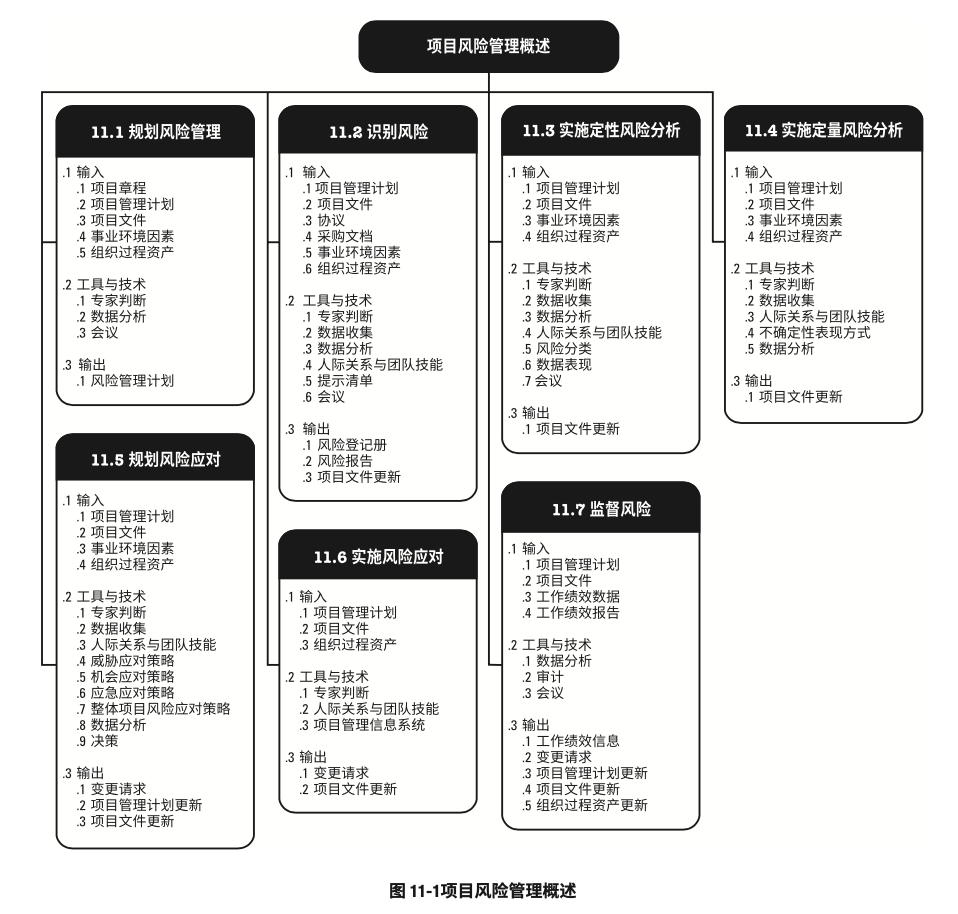
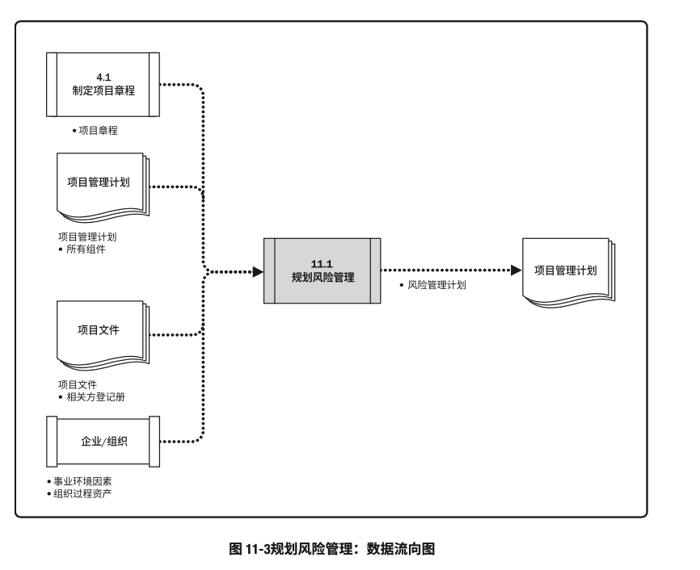
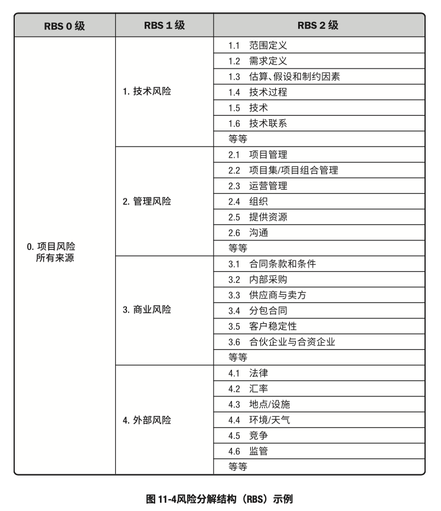
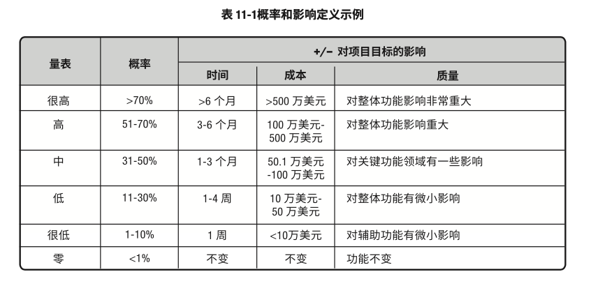

# 项目风险管理

- 项目风险管理包括规划风险管理、识别风险、开展风险分析、规划风险应对、实施风险应对和监督风险的各个过程。
- 项目风险管理的目标在于提高正面风险的概率和（或）影响，降低风险的概率和（或）影响，从而提高项目成功的可能性
- 项目风险管理的过程是：
	- 规划风险管理：定义如何实施项目风险管理活动的过程
	- 识别风险：识别单个项目风险，以及整体项目风险的来源，并记录风险特征的过程
	- 实施定性风险分析：通过评估单个项目风险发生的概率和影响以及其他特征，对风险进行优先级排序，从而为后续分析或行动提供基础的过程
	- 实施定量风险分析：就已识别的单个项目风险和其他不确定性来源对整体项目目标的综合影响进行定量分析的过程
	- 规划风险应对：为处理整体项目风险敞口，以及应对单个项目风险，而制定可选方案、选择应对策略并商定应对行动的过程
	- 实施风险应对：执行商定的风险应对计划的过程
	- 监督风险：在整个项目期间，监督商定的风险应对计划的实施、跟踪已识别的风险、识别和分析新风险，以及评估更显管理有效性的过程
- 项目风险管理的各个过程
	
- 虽然在本《PMBOK®️指南》中，各项目管理风险过程以界限分明和相互独立的形式出现，但在实践中它们会以本指南无法全面详述的方式相互交叠和相互作用

### 项目风险管理的核心概念

- 既然项目是为交付收益而开展的、具有不同复杂程度的独特性工作，那么自然就会充满风险。
- 开展项目，不仅要面对各种制约因素和假设条件，而且还要应对可能相互冲突和不断变化的相关方期望
- 组织应该有目的地以可控方式去冒项目风险，以便平衡风险和回报，并创造价值
- 项目风险管理旨在识别和管理未被其他项目管理过程所管理的风险。
	- 如果不妥善管理，这些风险有可能导致项目偏离计划，无法达成既定的项目目标
	- 因此项目风险管理的有效性直接关于项目成功与否
- 每个项目都在两个层面上存在风险。
	- 每个项目都有会影响项目达成目标的单个风险，
	- 以及由单个项目风险和不确定性的其他来源联合导致的整体项目风险。
		- 考虑整体项目风险，也非常重要。
- 项目风险管理过程同时兼顾这两个层面的风险。他们的定义如下：
	- 单个项目风险：一旦发生，会对一个或多个项目目标产生正面或负面影响的不确定事件或条件。
	- 整体项目风险：是不确定性对项目整体的影响，是相关方面临的项目结果正面和负面变异区间
		- 它源于包含单个风险在内的所有不确定性
- 一旦发生，单个风险会对项目目标产生正面或负面的影响
- 项目风险管理旨在利用或强化正面风险（机会），规避或减轻负面风险（威胁）。
- 未妥善管理的威胁可能引发各种问题，如工期延误、成本超支、绩效不佳或声誉受损。
- 把我好机会则能够获得众多好处，如工期缩短、成本节约、绩效改善或剩余提升
- 整体项目风险也有正面或负面之分。管理整体项目风险旨在通过削弱负面变异的驱动因素，加强正面变异的驱动因素，以及最大化实现整体项目目标的概率，把项目风险敞口保持在可接受的范围之内。
- 因为风险会在项目生命周期内持续发生，所以，项目风险管理过程也应不断迭代开展。
	- 在项目规划期间，就应该通过调整项目策略对风险做初步处理。
	- 接着，应该随着项目进展，监督和管理风险，确保项目处于正轨，并且突发性风险也得到处理
- 有效管理特定项目的风险，项目团队需要知道，相对于要追求的项目目标，可接受的风险敞口究竟是多大
	- 这通常用可测量的风险临界值来定义。
	- 风险临界值反映了组织相关方的风险偏好程度，是项目目标的可接受的变异程度
	- 应该明确规定风险临界值，并传达给项目团队，同时反映在项目的风险影响级别中定义

### 项目风险管理的发展趋势和新兴实践

- 项目风险管理的关注面正在扩大，以便确保考虑所有类型的风险，并在更广泛的背景中理解项目风险
- 项目风险管理的发展趋势和新兴实践包括（但不限于）：
	- 非事件类风险：大多数项目只关注作为可能发生或不发生的不确定性未来事件的风险。
		- 例如：
			- 关键卖方可能在项目期间停业
			- 客户可能在设计完成后变更需求
			- 或分包商可能对标准化操作流程进行优化
		- 不过，识别并管理非事件类风险的意识正在不断加强。
		- 非事件类风险有两种主要类型：
			- 变异性风险：已规划事件、活动或决策的某些关键方面存在不确定性，就导致变异性风险。
				- 例如
					- 生产率可能高于或低于目标值
					- 测试发现的错误数量可能多余或少于预期
					- 或施工阶段可能出现反常的天气情况
			- 模糊性风险：对未来可能发生，存在不确定性。知识不足可能影响项目达成目标的能力。
				- 例如，
					- 不太了解需求或技术解决方案的要素
					- 反馈框架的未来发展
					- 或项目内在的系统复杂性
		- 变异性项目可通过蒙特卡洛分析加以处理，
			- 即：
				1. 用概率分布表示变异的可能区间
				2. 然后才去行动去缩小可能结果的区间。
		- 管理模糊性风险，则需要先定义认知或理解不足之处，进而通过获取外部专家意见或以最佳实践为标杆来填补差距。
			- 也可以采用增量开发、原型搭建或模拟等方法来处理模糊性风险
	- 项目韧性
		- 随着对所谓“未知-未知”因素的已知的增强，人们也越来越明确地指导确实存在突发性风险。
		- 这种风险只有在发生后才能被发现。
		- 可以通过加强项目韧性来应对突发性风险。
		- 这就要求每个项目
			- 除了为已知风险列出具体风险预算，还要为突发性风险预留合理的应急预算和时间
			- 采用灵活的项目过程，包括强有力的变更管理，以便在保持朝着项目目标推进的正确方向的同时，应对突发性风险
			- 授权目标明确且值得信赖的项目团队在商定限制范围内完成工作
			- 经常留意早期预警信号，以尽早识别突发性风险
			- 明确征求相关方意见，以明确为应对突发性风险而可以调整项目范围或策略的领域
	- 整合式风险管理
		- 项目存在于组织背景中，可能是项目集或项目组合的一部分。
		- 在项目、项目集、项目整合和组织这些层面上，都存在风险。
		- 应该在适当的层面上承担和管理风险。
			- 在较高层面识别出的某些风险，将授权给项目团队去管理了
			- 而在较低层面识别出的某些风险，又可能上交给较高层面去管理（如果在项目之外管理最有效）
		- 应该采用协调式企业级风险管理方法，来确保所有层面的风险管理工作的一致性和连贯性。
			- 这样就能使项目集合项目组合的结构具有风险效率，有利于在给定的风险敞口水平下创造最大的整体价值。

### 裁剪时需要考虑的因素

- 因为每个项目都是独特的，所以有必要对项目风险管理过程的应用方式进行裁剪。
- 裁剪时应考虑的因素包括（但不限于）：
	- 项目规模：由预算、持续时间、范围或团队人数所体现的项目规模，要求采取更详细的风险管理方法吗？或者项目小到只需要用简化的风险管理过程吗？
	- 项目复杂性：由高水平创新、新技术采用、商务安排、界面或外部依赖关系导致的项目复杂性提高，是否要求采用更稳健的风险管理方法？或者项目是否简单到只需要用简化的风险管理过程？
	- 项目重要性：项目的战略重要性有多大？项目的风险级别因旨在创造突破机会、夫妇组织经营的重大障碍或涉及重大产品创新而提高了吗？
	- 开发方法：它是否是瀑布式项目，风险管理过程可以相继或重复开展；或者此项目是否采用敏捷型方法，需在每个重复过程的开始阶段以及执行期间处理风险
- 根据上述需要考虑的因素来裁剪项目风险管理过程，这是规划风险管理过程的一部分工作。
- 裁剪结果将被记录在风险管理计划中。

### 在敏捷或适应型环境中需要考虑的因素

- 从本质上讲，越是变化的环境就存在越多的不确定性和风险。
- 要应对快速变化，就需要采用适应型方法管理项目，即：
	- 通过跨职能项目团队和经常审查增量式工作产品，来加快知识分享，确保对风险的认知和管理。
- 在选择每个迭代期的工作内容时，应该考虑风险；在每个迭代期间应该识别、分析和管理风险
- 此外，应该根据对当前风险敞口的理解和加深，定期更新需求文件，并随项目进展重新排列工作优先级

## 规划风险管理

- 规划风险管理：定义如何实施项目风险管理活动的过程。
- 本过程的主要作用：确保风险管理的水平、方法和可见度与项目风险程度，以及项目对组织和其他相关方的重要程度相匹配
- 本过程仅开展一次或仅在项目的预定义点开展
- 规划风险管理过程的输入、工具与输出和输出
	
- 规划风险管理过程的数据流向图
	
- 规划风险管理过程在项目构思阶段就应开始，并在项目早期完成。
- 在项目生命周期的后期，可能有必要重新开展本过程
	- 例如
		- 在发生重大阶段变更时
		- 在项目范围显著变化时
		- 或者后续风险管理有效性进行审查且确定需要调整项目风险管理过程时

### 规划风险管理：输入

1. 项目章程
	- 项目章程记录了高层级的项目描述和边界、高层级的需求和风险
2. 项目管理计划
	- 在规划项目风险管理时，应该考虑所有已批准的子管理计划，使风险管理计划与之相协调；同时，其他项目管理计划组件中所列出的方法论可能也会影响规划风险管理过程
3. 项目文件
	- 可作为本过程输入的项目文件包括（但不限于）：
		- 相关方登记册：相关方登记册包含项目相关方的详细信息，并概述其在项目中的角色和对项目风险的态度；可用于确定项目风险管理的角色和职责，以及为项目设定风险临界值
4. 事业环境因素
	- 会影响规划风险管理过程的事业环境因素包括（但不限于）：
		- 由组织或关键相关方设定的整体风险临界值
5. 组织过程资产
	- 会影响规划风险管理过程的组织过程资产包括（但不限于）：
		- 组织的风险政策
		- 风险类别，可能用风险分解结构来表示
		- 风险概念和术语的通用定义
		- 风险描述的格式
		- 风险管理计划、风险登记册报告的模板
		- 角色与职责
		- 决策所需的职权级别
		- 经验教训知识库，其中包含以往类似项目的信息

### 规划风险管理：工具与技术

1. 专家判断
	- 应考虑具备以下专业知识或接受或相关培训的个人或小组的意见
		- 熟悉组织所采取的管理风险的方法，包括该方法所在的企业风险管理体系
		- 裁剪风险管理以适应项目的具体需求
		- 在相同领域的项目上可能遇到的风险类型
2. 数据分析
	- 可用于本过程的数据分析技术包括（但不限于）：
		- 相关方分析：可通过相关方分析确定项目相关方的风险偏好
3. 会议
	- 风险管理计划的编制可以是项目开工会议上的一项工作，或者可以举办专门的规划会来编制风险管理计划
	- 擦浴这可能包括项目经理、制定项目团队成员、关键相关方，或者负责管理项目风险管理过程的项目团队成员；如果需要，也可以邀请其他外部人员参加，包括客户、卖方和监管机构
	- 熟练的会议引导者能够帮助参会者专注于会议事项，就风险管理方法的关键方面达成共识，识别和克服偏见，以及解决任何可能出现的分歧
	- 在此类会议上确定开展风险管理活动的计划，并将其记录在风险管理计划中。

### 规划风险管理：输出

1. 风险管理计划
	- 风险管理计划：项目管理计划的组成部分，描述如何安排与实施风险管理活动。
	- 风险管理计划可以包括以下部分或全部内容：
		- 风险管理战略：描述用于管理本项目的风险的一般方法
		- 方法论：确定用于开展本项目的风险管理的具体方法、工具及数据来源
		- 角色与职责：确定每项风险管理活动的领导者、支持者和团队成员，并明确他们的职责
		- 资金：确定开展项目风险管理活动所需的资金，并制定应急储备和管理储备的使用方案
		- 时间安排：确定在项目生命周期中实施项目风险管理过程的时间和频率，确定风险管理活动并将其纳入项目进度计划
		- 风险类别：确定对单个项目风险进行分类的方式。
			- 通常借助风险分解图（RBS）来构建风险类别。
				- 风险分解结构：潜在风险来源的层级展现。
					
				- 风险分解结构有助于项目团队考虑单个项目风险的全部可能来源，对识别风险或归类已识别风险特别有用。
				- 组织可能有适用于所有项目的通用风险分解结构，也可能针对不同类型项目使用集中不同的风险分解结构框架，或者允许项目量身定制专用的风险分解结构。
			- 如果未使用风险分解结构，组织则可能采用某种常见的风险分类框架，既可以是简单的类别清单，也可以是基于项目目标的某种类别结构
		- 相关方风险偏好
			- 应在风险管理计划中记录项目关键相关方的风险偏好
			- 他们的风险偏好会影响规划风险管理过程的细节。
				- 特别是，应该针对每个项目目标，把相关方的风险偏好表述成可测量的风险临界值。
				- 这些临界值不仅将联合决定可接受的整体项目风险敞口水平，而且也用于制定概率和影响定义。
				- 以后将根据概率和影响定义，对单个项目风险进行评估和排序
		- 风险概率和影响定义
			- 根据具体项目环境，组织和关键相关方的风险偏好和临界值，来制定风险概率和影响定义。
			- 项目可能自行制定关于概率和影响级别的具体定义，或者用组织提供的通用定义作为出发点。
			- 应该根据拟开展项目风险管理过程的详细程度，来确定概率和影响级别的数量，即：
				- 更多级别（通常为五级）对应于更详细的风险管理方法，
				- 更少级别（通常为三级）对应于更简单的方法
			- 针对三个项目目标提供的概率和影响定义的示例
				
			- 通过将影响定义负面威胁（工期延误、成本增加和绩效不佳）和正面机会（工期缩短、成本节约和绩效改善），表格所示的量表可同时用于评估威胁和机会
		- 概率和影响矩阵
			- 组织可在项目开始前就确定优先级排序规则，并将其纳入组织过程资产，或者也可以为具体项目量身定制优先级排序规则。
			- 在常见的概率和影响矩阵中，会同时列出机会和威胁
				- 以正面影响定义机会
				- 以负面影响定义威胁
			- 概率和影响可以用描述性术语（如很高、高、中、地、和很低）或数字来表达。
				- 如果使用数值，就可以把两个数值相乘，得出每个风险的概率-影响分值，以便据此在每个优先级组别之内排列单个风险相对优先级。
				- 概率和影响矩阵的示例
					
		- 报告格式：确定将如何记录、分析和沟通项目风险管理过程的结果。在这一部分，描述风险登记册、风险报告以及项目风险管理过程的其他输出的内容和格式
		- 跟踪：跟踪是确定将如何记录风险活动，以及将如何审计风险的管理过程

## 识别风险

### 识别风险：输入

1. 项目管理计划
2. 项目文件
3. 协议
4. 采购文档
5. 事业环境因素
6. 组织过程资产

### 识别风险：工具与技术

1. 专家判断
2. 数据收集
3. 数据分析
4. 人际关系与团队技能
5. 提示清单
6. 会议

### 识别风险：输出

1. 风险登记册
2. 风险报告
3. 项目文件更新

## 实施定性风险分析

### 实施定性风险分析：输入

1. 项目管理计划
2. 项目文件
3. 事业环境因素
4. 组织过程资产

### 实施定性风险分析：工具与技术

1. 专家判断
2. 数据收集
3. 数据分析
4. 人际关系与团队技能
5. 风险分类
6. 数据表现
7. 会议

### 实施定性风险分析：输出

1. 项目文件更新

## 实施定量风险分析

### 实施定量风险分析：输入

1. 项目管理计划
2. 项目文件
3. 事业环境因素
4. 组织过程资产

### 实施定量风险分析：工具与技术

1. 专家判断
2. 数据收集
3. 人际关系与团队技能
4. 不确定性表现方式
5. 数据分析

### 实施定量风险分析：输出

1. 项目文件更新

## 规划风险应对

### 规划风险应对：输入

1. 项目管理计划
2. 项目文件
3. 事业环境因素
4. 组织过程资产

### 规划风险应对：工具与技术

1. 专家判断
2. 数据收集
3. 人际关系与团队技能
4. 威胁应对策略
5. 机会应对策略
6. 应急应对策略
7. 整体项目风险应对策略
8. 数据分析
9. 决策

### 规划风险应对：输出

1. 变更请求
2. 项目管理计划更新
3. 项目文件更新

## 实施风险应对

### 实施风险应对：输入

1. 项目管理计划
2. 项目文件
3. 组织过程资产

### 实施风险应对：工具与技术

1. 专家判断
2. 人际关系与团队技能
3. 项目管理信息系统

### 实施风险应对：输出

1. 变更请求
2. 项目文件更新

## 监督风险

### 监督风险：输入

1. 项目管理计划
2. 项目文件
3. 工作绩效数据
4. 工作绩效报告

### 监督风险：工具与技术

1. 数据分析
2. 审计
3. 会议

### 监督风险：输出

1. 工作绩效信息
2. 变更请求
3. 项目管理计划更新
4. 项目文件更新
5. 组织过程资产更新