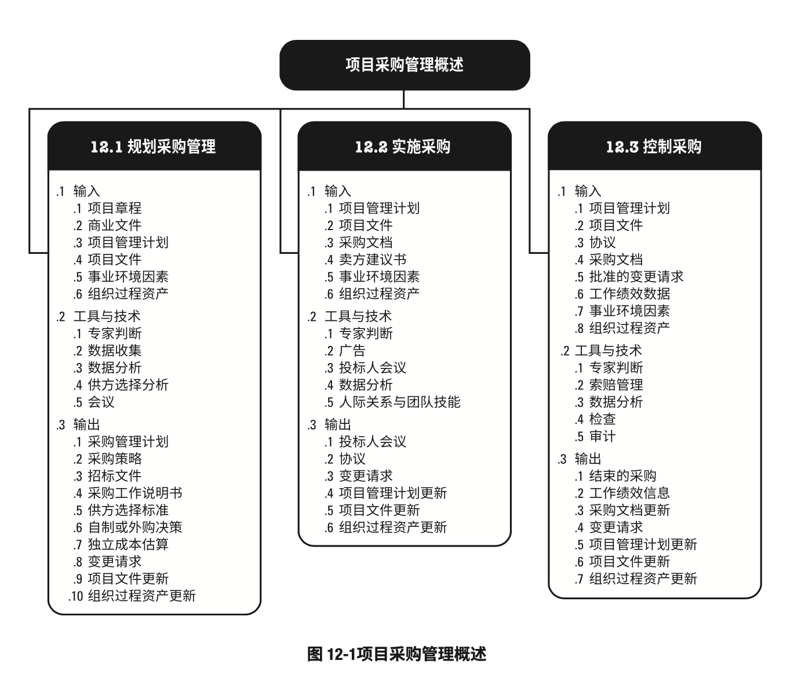
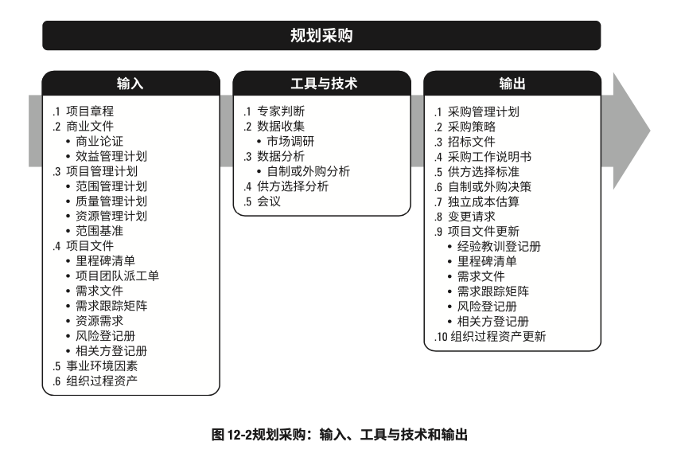
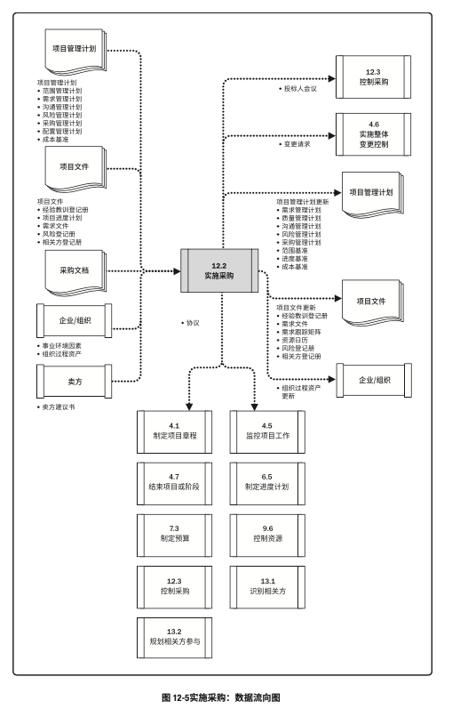

# 项目采购管理

- 项目采购管理包括从项目团队外部采购或获取所需产品、服务或成果的各个过程。
- 项目采购管理包括编制和管理协议所需的管理和控制过程
	- 例如，合同、订购单、协议备忘录（MOA），或服务水平协议（SLA）。
- 被授权采购项目所需货物和（或）服务的人员可以是项目团队、管理层或组织采购部（如果有）的成员
- 项目采购管理过程包括：
	- 规划采购管理：记录项目采购决策、明确采购方法，以及识别潜在卖方的过程
	- 实施采购：获取卖方答应、选择卖方并授予合同的过程
	- 控制采购：管理采购关系、监督合同绩效、实施必要的变更和纠偏，以及关闭合同的过程
- 虽然在本指南中，采购过程以界限分明和相互独立的形式出现，但在实践中，采购过程相当复杂且相互作用，还与其他知识领域的过程相互作用。
- 本指南无法全面详述这些相互作用
- 本章以从项目外部获取货物或服务的视角来叙述采购过程
- 项目采购管理的各个过程
	
- 虽然在本《PMBOK®️指南》中，各项目采购管理过程以界限分明和相互独立的形式出现，但在实践中它们会以本指南无法全面详述的方式相互交叠和相互作用。

### 项目采购管理的核心概念

- 与采购过程相关的重大法律义务和惩罚，通常超出大多数其他的项目管理过程
- 虽然项目经理不必成为采购管理法律法规领域的专家，但应该对采购过程有足够的了解，以便做出与合同及合同关系相关的明智决定
- 通常情况下，项目经理无权签署对组织有约束力的法律协议，这项工作仅由具备相关职权的人员执行
- 项目采购管理过程涉及到用协议来描述买卖双方之间的关系
- 协议可以很简单，如以特定人工单价购买所需工时，也可以很复杂，如多年的国际施工合同。
- 合同签署的方法和合同本身应体现可交付成果或所需人力投入的简单性或复杂性，其书写形式也应符合当地、所在国或国际法中关于合同签署的规定
- 合同应明确说明预期的可交付成果和结果，包括从卖方到买方的任何知识转移
- 合同中未规定的任何事项则不具法律强制力。
- 开展国际合作的项目经理应牢记，无论合同规定如何详尽，文化和当地法律对合同及其可执行均有影响
- 采购合同包括条款和条件，也可以包括买方就卖方实施工作或应交付产品的其他规定。
- 在与采购办公室协作确保遵守组织的采购政策的同时，项目管理团队必须确定所有采购都能满足项目的具体需要。
- 因应用领域不同，协议可以是合同、服务水平协议（SLA）、谅解备忘录、协议备忘录（MOA）或订购单
- 大多数组织都有相关的书面政策和程序，来专门定义采购规则，并规定谁有权代表组织签署和管理协议
- 在世界各地，组织虽然用不同的名称来称呼负责采购的单位或部门，如购买部、合同部、采购部或收购部，但其实际职责大同小异
- 虽然所有项目文件可能都要经过某种形式的审查与批准，但是，鉴于其法律约束力，合同或协议需要经过更多的审批程序，而且通常会涉及到法务部。
- 在任何情况下，审批程序的主要目标都是确保合同充分描述将由卖方提供的产品、服务或成果，且符合法律法规关于采购的规定
- 通过把描述产品、服务或成果的文件作为独立的附件或附录，以便合同正文始终标准化的法律合同用语
- 在复杂项目中，可能需要同时先后管理多个合同。
	- 在这种情况下，不同的合同的生命周期可在项目生命周期的任何阶段开始与结束
- 买卖关系是采购组织与外部组织之间的关系，可存在与项目的许多层次上
- 因应用领域不同，
	- 卖方可以是承包商、供货商、服务提供商或供应商
	- 买方可能是最终产品的所有人、分包商、收购机构、服务需求者或购买方。
- 在合同生命周期，卖方首先是投标人，然后是中标人，之后是签约供应商或供货商
- 中标人可将所承揽的工作当作一个项目加以管理。
	- 在这种情况下：
		- 买方就变成了承包商、供应商及服务提供商的客户，因此也就是卖方的关键项目相关方
		- 卖方的项目管理团队就需要关注工作执行或服务提供所涉及的所有过程
		- 对于卖方来说，合同条款和条件以及采购工作说明书（SOW）都是其许多管理过程的重要输入。
			- 在合同中，可实际列出各种输入（如，主要可交付成果、关键里程碑、成本目标），或者可限制项目团队的选择余地（如，在IT整合项目中，关于人员配备的决定往往要征得买方的批准）。
			- 另外，采购工作说明书可能使用其他名称，如技术工作说明书
		- 卖方本身也可能成为更底层级的产品、服务和材料分包商及供应商的买方
- 本节假设项目所需物品或服务的买方是项目团队，或者是组织内某个部门，同时假设卖方是为项目提供物品或服务的一方，且通常来自执行组织外部。
	- 在某些项目上，卖方可能是项目执行组织内部但属于项目外部的某个小组或部门。
	- 在大型复杂的项目上，卖方可能在授予合同后才成为整合式项目团队的一部分
- 在小型组织或初创企业，以及未设置购买、合同或采购部门的组织，项目经理可以拥有采购职权，能够直接谈判并签署合同（分散式采购）。
- 在更成熟的组织中，有专设部门开展实际的采购和合同签署工作，即采购、谈判和签署合同（集中式采购）
- 在签署国际合作时，应该在合同中明确规定对合同的法律管辖权。
- 在大多数情况下，卖方是受正式合同关系约束的外部承包商。

### 采购管理的发展趋势和新兴实践

- 在不同行业各方面（软件工具、风险、过程、物流和技术）的一些重大趋势，会影响项目的成功率。
- 项目采购管理的发展趋势和新兴实践包括（但不限于）：
	- 工具的改进
		- 用于管理项目采购和项目执行的工具已经取得重大发展
		- 现在
			- 买方能够使用在线工具集中发布采购广告；
			- 卖方也能够使用在线工具集中查找采购文件，并直接在线填写。
		- 在施工、工程和基础设施领域，建筑信息模型（BIM）软件的应用日益广泛，为工程项目节省了大量时间和资金。
		- 它能够大幅减少施工索赔，从而降低成本、缩短工期，因此世界各地的主要公司和政府都开始要求在大型项目中使用BIM
	- 更先进的风险管理
		- 在风险管理领域日益流行的一个趋势，就是在编制合同时准确地将具体风险分配给最有能力对其加以管理的一方。
		- 没有任何承包商有能力管理项目的所有风险，买方因而必须接受承包商无法掌控的风险
			- 例如
				- 采购方公司政策的不断变化
				- 法规要求的不断变化
				- 以及项目以外的其他风险
		- 在合同中可以明确规定风险管理是合同工作的一部分
	- 变化中的合同签署实践
		- 在过去的几年时间内，超大型项目的数量显著增加，尤其是在基础设施建设和工程项目领域。数十亿美元的项目现在已十分常见
		- 大部分此类项目都要求与多个国家的多家承包商签署国际合同，因此肯定比仅使用当地承包商的项目具有更大的风险
		- 承包商越来越重视在采购过程中与客户开展密切合作，以便对批量采购或有其他特殊关系的客户给予折扣优惠
		- 对于此类项目来说，为了减少执行过程中的问题和索赔，采用国际公认的标准合同范本也日益普遍
	- 物流和供应链管理
		- 因为如此多的大型工程、施工和基础设施建设项目都由多家跨国承包商来完成，材料物理管理对于项目成功完成至关重要
		- 对采购周期较长的产品，制造环节和运输（到项目现场）环节都是项目进度的决定因素
		- 在IT领域，有些产品可能需要提前2至3个月订购；
		- 在复杂的施工项目上，订购时间可能需要提前1-2年，甚至更长
		- 在这些项目上，可能需要在签订合同之前就采购这些订购周期长的产品，以便项目如期完成。
		- 在最终产品的最终设计完成之前，就可能需要根据总体设计中已确定的要求开始订购采购周期较长的材料、用品或设备。
		- 供应链管理也是承包商的项目团队日益重视的一个领域
		- 在项目早期，不仅要明确主要的采购渠道，通常还需要明确次要和备选渠道。
		- 全球很多国家会要求跨国承包商至少向当地供应商采购一定比例的材料和用品
	- 技术和相关方关系
		- 公共资助的项目正在受越来越多的关注。
		- 基础设施和商业建设项目正日益采用包括网络摄像（webcams）在内的技术，以改善与相关方的沟通和关系
		- 在施工期间，施工现场会安装一台或多台网络摄像机，定期更新并发布到公开的网站上，方便所有相关方在互联网上查看项目进展。
		- 另外，视频资料可以存储，有助于在索赔发生时进行分析
		- 有些项目显示，使用网络摄像机记录现场情况，能够避免对事实的分歧，从而能够把与现场施工有关的争议降到最低程度
	- 试用采购
		- 并非每一个卖方都能很好地适应买方组织的环境，因此在决定大批量采购前，有些项目会试用多个候选卖方，向他们采购少量的可交付成果和工作产品。
		- 这样一来，买方可以在推进项目工作的同时，对潜在合作伙伴进行评估

### 裁剪时需要考虑的因素

- 因为每个项目都是独特的，所以项目经理需要裁剪项目采购管理过程。
- 裁剪时应考虑的因素包括（但不限于）：
	- 采购的复杂性：只开展一次主要的采购，或者需要在不同时间向不同卖方进行多次采购（会提高采购的复杂性）？
	- 物理地点：买方和卖方在同一或邻近地点，或者位于不同时区、国家或大洲？
	- 治理和法规环境：组织的采购政策是否和当地相关的法律法规兼容？当地的法律法规会如何影响合同审计工作？
	- 承包商的可用性：是否具备工作执行能力的承包商可供选择？

### 在敏捷或适应型环境中需要考虑的因素

- 在敏捷环境中，可能需要与特定卖方协作来扩充团队。
- 这种协作关系能够营造风险共担式采购模型，让买方和卖方共担项目风险和共享项目奖励
- 在大型项目上，可能针对某些可交付成果采用适应型方法，而对其他部分则采用更稳定的方法。
	- 在这种情况下，可以通过主体协议，如主要服务协议（MSA），来管辖整体协作关系，而将适应型工作写入附录或补充文件。这样一来，变更只针对适应性工作，而不会对主体协议造成影响。

## 规划采购管理

- 规划采购管理：记录项目采购决策、明确采购方法，及识别潜在卖方的过程
- 本过程的主要作用：确定是否从项目外部获取货物和服务，如果是，则还要确定将在什么时间、以什么方式获取什么货物和服务。
- 获取和服务可从执行组织的其他部门采购，或者从外部渠道采购。
- 本过程仅开展一次或仅在项目的预定义点开展
- 规划采购管理过程的输入、工具与技术和输出
	
- 规划采购管理过程的数据流向图
	
- 应该在规划采购管理过程的早期，确定与采购有关的角色和职责。
- 项目经理确保在项目团队中配备具有所需采购专业知识的人员。
- 采购过程的参与者可能包括购买部或采购部的人员，以及采购组织法务部的人员。
	- 这些人员的职责也应该记录在采购管理计划中
- 典型的步骤可能有：
	1. 准备采购工作说明书（SOW）或工作大纲（TOR）
	2. 准备高层级的成本估算，制定预算
	3. 发布招标广告
	4. 确定合格卖方的短名单
	5. 准备并发布招标文件
	6. 由卖方准备并提交建议书
	7. 对建议书开展技术（包括质量）评估
	8. 对建议书开展成本评估
	9. 准备最终的综合评估报告（包括质量及成本），选出中标建议书
	10. 结束谈判，买方和卖方签署合同
- 项目进度计划对规划采购管理过程中的采购策略制定有重要影响
- 在制定采购管理计划时所做出的决定也会影响项目进度计划。
- 在开展制定进度计划过程、估算活动资源过程以及自制或外购决策制定时，都会考虑这些决定

### 规划采购管理：输入

1. 项目章程
	- 项目章程包括：
		- 目标
		- 项目描述
		- 总体里程碑
		- 以及预先批准的财务资源
2. 商业文件
	- 商业文件包括：
		- 商业论证：采购策略需要和商业论证保持一致，以确保商业论证的有效性
		- 收益管理计划：收益管理计划描述应在何时产出具体的项目收益，这将影响采购日期和合同条款的确定
3. 项目管理计划
	- 项目管理计划组件包括（但不限于）：
		- 范围管理计划：范围管理计划说明如何在项目的实施阶段管理承包商的工作范围
		- 质量管理计划：质量管理计划包含项目需要遵循的行业标准与准则。
			- 这些标准与准则应写入招标文件
				- 如建议邀请书，并将最终在合同中引用。
			- 这些标准与准则也可用于供应商资格预审，或作为供应商甄选标准的一部分
		- 资源管理计划：资源管理计划包括关于那些资源需要采购或租赁的信息，以及任何可能影响采购的假设条件或制约因素
		- 范围基准：范围基准包含范围说明书、WBS和WBS词典。
			- 在项目早期，项目范围可能仍要继续演进。
			- 应该针对项目范围中已知的工作，编制工作说明书（SOW）和工作大纲（TOR）
4. 项目文件
	- 可作为本过程输入的项目文件包括（但不限于）：
		- 里程碑清单：重要里程碑清单说明卖方需要在何时交付成果
		- 项目团队派工单：项目团队派工单包含关于项目团队技能和能力的信息，以及他们可用于支持采购活动的时间。
			- 如果项目团队不具备开展采购活动的能力，则需要外聘人员或对现有人员进行培训，或者二者同时进行
		- 需求文件：需求文件可能包括：
			- 卖方需要满足的技术要求
			- 具有合同和法律意义的需求
				- 如健康、安全、安保、绩效、环境、保险、知识产权、同等就业机会、执照、许可证，以及其他非技术要求
		- 需求跟踪矩阵：需求跟踪矩阵将产品需求从其来源连接到能够满足需求的可交付成果
		- 资源需求：资源需求包含关于某些特定需求的信息
			- 例如，可能需要采购的团队及实物资源
		- 风险登记册：风险登记册列明风险清单，以及风险分析和风险应对规划的结果。
			- 有些风险可以通过采购协议转移给第三方
		- 相关方登记册：相关方登记册提供有关项目参与者及其项目利益的详细信息，包括监管机构、合同签署人员和法务人员。
5. 事业环境因素
	- 能够影响规划采购管理过程的事业环境因素包括（但不限于）：
		- 市场条件
		- 可从市场获得的产品、服务和成果
		- 卖方，包括其以往绩效或声誉
		- 关于产品、服务和成果的典型条款和条件，或适用于特定行业的典型条款和条件
		- 特殊的当地要求
			- 例如关于雇用当地员工或卖方的法规要求
		- 关于采购的法律建议
		- 合同管理系统，包括合同变更控制程序
		- 已有的多层级供应商系统，其中列出了基于以往经验而预审合格的卖方
		- 财务会计和合同支付系统
6. 组织过程资产
	- 组织使用的各种合同协议类型也会影响规划采购管理过程的决策
	- 能够影响规划采购管理过程的组织过程资产包括（但不限于）：
		- 预先批准的卖方清单：经过适当审查的卖方清单可以简化招标所需的步骤，并缩短卖方甄选过程的时间
		- 正式的采购政策、程序和指南：大多数组织都有正式的采购政策和机构。如果没有，项目团队就应该配备相关的资源和专业技能，来实施采购活动。
		- 合同类型
			- 所有法律合同关系通常可分为总价和成本补偿两大类。
				- 此外，还有第三种常用的混合类型，即工料合同。
			- 下文将分别讨论上述几类较常用的合同类型。
			- 但在实践中，单次采购合同使用两种或更多合同类型的情况并不罕见
			- 合同类型分类：
				- 总价合同
					- 此类合同为既定产品、服务或成果的采购设定一个总价。
					- 这种合同已明确定义需求，且不会出现重大范围变更的情况下使用。
					- 总价合同的类型包括：
						- 固定价格（FFP）
							- FPP是最常用的合同类型。
							- 大多数买方都喜欢这种合同，因为货物采购的价格在一开始就已确定，并且不允许改变（除非工作范围发生变更）
						- 总价加激励费用（FPIF）
							- 这种总价合同为买方和卖方提供了一定的灵活性，允许一定的绩效偏离，并对实现既定目标给予相关的财务奖励（通常取决于卖方的成本、进度或技术绩效）。
							- FPIF合同中会设置价格上限，高于此价格上限的全部成本将由卖方承担。
						- 总价加经济价格调整（FPEPA）
							- 这种合同适用于两种情况：
								- 卖方履约期将跨越几年时间
								- 或将以不同货币支付价款
							- 它是总价合同的一种类型，但合同中包含了特殊条款，允许根据条件变化，如通货膨胀、某些特殊商品的成本增加（或降低），以实现确定的方式对合同价格进行最终调整
				- 成本补偿合同
					- 此类合同向卖方支付为完成工作而发生的全部合法实际成本（可报销成本），外加一笔费用作为卖方的利润。
					- 这种合同适用于：工作范围预计会在合同执行期间发生重大变更。
					- 成本补偿合同又可分为：
						- 成本加固定费用（CPFF）
							- 为卖方报销履行合同工作所发生的一切可列支成本，并向卖方支付一笔固定费用。
							- 该费用以项目初始估算成本的某一百分比计列。
							- 除非项目范围发生变更，否则费用的金额维持不变
						- 成本加激励费用（CPIF）
							- 为卖方报销履行合同工作所发生的一切可列支成本，并在卖方达到合同规定的绩效目标时，向卖方支付预先确定的激励费用
							- 在CPIF合同中，如果最终成本低于或高于原始估算成本，则买方和卖方需要根据事先商定的成本分摊比例来分享节约部分或分摊超支部分。
								- 例如，基于卖方的实际成本，按照80/20的比例分担（分享）超过（低于）目标成本的部分
						- 成本加奖励费用（CPAF）
							- 为卖方报销一切合法成本，但只有在卖方满足合同规定的、某些笼统主观的绩效标准的情况下，才向卖方支付大部分费用。
							- 奖励费用完全由买方根据自己对卖方绩效的主观判断来决定，并且通常不允许申诉。
				- 工料合同（T&M）：
					- 工料合同（又称时间和手段合同），是兼具成本补偿合同和总价合同特点的混合型合同
					- 这种合同往往适用于：无法快速编制出准确的工作说明书的情况下扩充人员、聘用专家或寻求外部支持。

### 规划采购管理：工具与技术

1. 专家判断
	- 应征求具备以下专业知识或接受过相关培训的个人或小组的意见：
		- 采购与购买
		- 合同类型和合同文件
		- 法规及合规性
2. 数据收集
	- 适用于本过程的数据收集技术包括（但不限于）：
		- 市场调研：
			- 市场调研包括考察行业情况和具体卖方的能力。
			- 采购团队可以运用从会议、在线评论和各种其他渠道得到的信息，来了解市场情况
			- 采购团队也可以调整具体的采购目标，以便在平衡与**有能力提供所需材料或服务的卖方的范围**有关的风险的同时，利用成熟技术
3. 数据分析
	- 适用于本过程的数据分析技术包括（但不限于）：
		- 自制或外购分析
			- 自制或外购分析用于确定某项工作或可交付成果最好由团队自行完成还是应该从外部采购。
			- 制定自制或外购决策时应考虑的因素包括：
				- 组织当前的资源配置及其技能和能力
				- 对专业技术的需求
				- 不愿承担永久雇用的义务
				- 以及对独特技术专长的需求
			- 还要评估与每个自制或外购决策相关的风险
			- 在自制或外购分析中，可以使用回收期、投资回报率（ROI）、内部报酬率（IRR）、现金流贴现、净现值（NPV）、收益成本（BCA）或其他分析技术，来确定某种货物或服务时应该在项目内部自制，还是从外部购买
4. 供方选择分析
	- 在确定选择方法前，有必要审查项目竞争性需求的优先级。
	- 由于竞争性选择方法可能要求卖方在事前投入大量时间和资源，因此，应该在采购文件中写明评估方法，让投标人了解将会被如何评估。
	- 常用的选择方法包括：
		- 最低成本
			- 最低成本法适用于标准化或常规采购。
			- 此类采购有成熟的实践标准，有具体明确的预期成果，可以用不同成本来取得
		- 仅凭资质
			- 仅凭资质的选择方法适用于采购价值相对较小，不值得花时间和成本开展完整选择过程的情况
			- 买方会确定短名单，然后根据可信度、相关资质、经验、专业知识、专长领域和参考资料选择最佳的投标人
		- 基于质量或技术方案得分
			- 邀请一些公司提交建议书，同时列明技术和成本详情；如果技术建议书可以接受，再邀请他们进行合同谈判
			- 采用此方法，会先对技术建议书进行评估，考察技术方案的质量。
			- 如果经过谈判，证明他们的财务建议书是可接受的，那么就会选择技术建议书得分最高的卖方
		- 基于质量和成本
			- 在基于质量和成本的方法中，成本也是用于选择卖方的一个考虑因素。
			- 一般而言，如果项目的风险和（或）不确定性较高，相对于成本而言，质量就应该是一个关键因素
		- 独有来源
			- 买方要求特定卖方准备技术和财务建议书，然后针对建议书开展谈判。
			- 由于没有竞争，因此仅在有适当理由时才可采用此方法，而且应将其视为特殊情况
		- 固定预算
			- 固定预算法要求在建议邀请书中向受邀的卖方披露可用预算，然后在此预算内选择技术建议书得分最高的卖方。
			- 因为有成本限制，所以卖方会在建议书中调整工作的范围和质量，以适应该预算。
			- 买方应该确保固定预算与工作说明书相符，且卖方能够在该预算内完成相关任务。
			- 此方法仅适用于工作说明书定义精确、预期不会发生变更，而且预算固定且不得超出的情况
5. 会议
	- 不借助与潜在投标人的信息交流会，仅靠调研也许还不能获得制定采购策略所需的具体信息。
	- 采购方与潜在投标人合作，有利于卖方以互惠的方法提供产品或服务，从而使采购方从中受益。
	- 会议可用于确定管理和监督采购的策略

### 规划采购管理：输出

1. 采购管理计划
	- 采购管理计划包含要在采购过程中开展的各种活动
	- 它应该记录是否要开展国际竞争性招标、国内竞争性招标、当地招标等。
	- 如果项目由外部资助，资金的来源和可用性应符合采购管理计划和项目进度计划的规定
	- 采购管理计划可能包括以下内容：
		- 如何协调采购与项目的其他工作
			- 例如，项目进度计划制定和控制
		- 开展重要采购活动的时间表
		- 用于管理合同的采购测量指标
		- 与采购有关的相关方角色和职责；如果执行组织有采购部，项目团队拥有的职权和受到的限制
		- 可能影响采购工作的制约因素和假设条件
		- 司法管辖权和付款货币
		- 是否需要编制独立估算，以及是否应将其作为评价标准
		- 风险管理事项，包括对履约保函或保险合同的要求，以减轻某些项目风险
		- 拟使用的预审合格的卖方（如果有）
	- 根据每个项目的需要，采购管理计划可以是正式或非正式的，非常详细或高度概括的
2. 采购策略
	- 一旦完成自制或外购分析，并决定从项目外部渠道采购，就应该制定一套采购策略。
	- 应该在采购策略中规定项目交付方法、具有法律约束力的协议类型，以及如何在采购阶段推动采购进展
		- 支付方法：对专业服务项目或建筑施工项目，应该采用不同的交付方法
			- 专业服务项目的交付方法包括：
				- 买方或服务提供方不得分包
				- 买方或服务提供方可以分包
				- 买方和服务提供方设立合资企业
				- 买方或服务提供方仅充当代表
			- 而工业或商业施工项目的交付方法包括（但不限于）：
				- 交钥匙式
				- 设计-建造（DB）
				- 设计-招标-建造（DBB）
				- 设计-建造-运用（DBO）
				- 建造-拥有-运营-转让（BOOT）
				- 及其他
		- 合同支付类型：合同支付类型与项目交付方法无关，需要与采购组织的内部财务系统相协调
			- 它们包括（但不限于）以下合同类型及其变种：
				- 总价
				- 固定总价
				- 成本加奖励费用
				- 成本加激励费用
				- 工料
				- 目标成本
				- 及其他
			- 总价合同适用于工作类型可预知、需求能清晰定义且不太可能变更的情况
			- 成本补偿合同适用于工作不断演进、很可能变更或未明确定义的情况
			- 激励和奖励费用可用于协调买方和卖方的目标
		- 采购阶段：采购策略也可以包括与采购阶段有关的信息，这种信息可能包括：
			- 采购工作的顺序安排或阶段划分，每个阶段的描述，以及每个阶段的具体目标
			- 用于监督的采购绩效指标和里程碑
			- 从一个阶段过渡到下一个阶段的标准
			- 用于追踪采购进展的监督和评估计划
			- 向后续阶段转移知识的过程
3. 招标文件
	- 招标文件用于向潜在卖方征求建议书
	- 如果主要依据价格来选择卖方（如购买商业或标准产品时），通常就是用标书、投标或报价等术语
	- 如果其他考虑因素（如技术能力或技术方法）至关重要，则通常使用建议书之类的术语。
	- 具体使用的采购术语也可能因行业或采购地点而异
	- 取决于所需的货物或服务，招标文件可以是信息邀请书、报价邀请书、建议邀请书，或其他适当的采购文件。
	- 使用不同文件的条件如下：
		- 信息邀请书（RFI）：如果需要卖方提供关于拟采购货物和服务的更多信息，就是用信息邀请书。
			- 随后一般还会使用报价邀请书或建议邀请书
		- 报价邀请书（RFQ）：如果需要供应商提供关于将如何满足需求和（或）将需要多少成本的更多信息，就使用报价建议书
		- 建议邀请书（RFP）：如果项目中出现问题且解决方法难以确定，就使用建议邀请书。
			- 这是最正式的“邀请书”文件，需要遵守与内容、时间表，以及卖方应答有关的严格的采购规则
	- 买方拟定的采购文件不仅应便于潜在卖方做出准确、完整的应答，还要便于买方对卖方应答进行评价。
	- 采购文件会包括规定的应答格式、相关的采购工作说明书，以及所需的合同条款
	- 采购文件的复杂和详细程度应与采购的价值及相关的风险相符。
	- 采购文件既需要具备足够详细的信息，以确保卖方做出已知且适当的应答，同时它又要有足够的灵活度，让卖方为满足相同的要求而提出更好的建议
4. 采购工作说明书
	- 依据项目范围基准，为每次采购编制工作说明书（SOW），仅对将要包含在相关合同中的那一部分项目范围进行定义。
	- 工作说明书会充分详细地描述拟采购的产品、服务或成果，以便潜在卖方确定是否有能力提供此类产品、服务或成果。
	- 根据采购品的性质、买方的需求，或拟采用的合同形式，工作说明书的详细程度会有较大不同。
	- 工作说明书的内容包括：
		- 规格
		- 所需数量
		- 质量水平
		- 绩效数据
		- 履约期间
		- 工作地点
		- 其他要求
	- 采购工作说明书应力求清晰、完整和简练。
	- 它需要说明所需的附加服务，
		- 例如，报告绩效，或对采购品的后续运营支持
	- 在采购过程中，应根据需要对工作说明书进行修订，直到它成为所签协议的一部分
	- 对于服务采购，可能会用“工作大纲（TOR）”这个术语。
	- 与采购工作说明书类似，工作大纲通常包括以下内容：
		- 承包商需要执行的任务，以及所需的协调工作
		- 承包商必须达到的适用标准
		- 需要提交批准的数据
		- 由买方提供给承包商的，将用于合同履行的全部数据和服务的详细清单（若适用）
		- 关于初始成果提交和审查（或审批）的进度计划
5. 供方选择标准
	- 在确定评估标准时，买方要努力确保选出的建议书将将提供最佳质量的所需服务。
	- 供方选择标准可能包括（但不限于）：
		- 能力和潜力
		- 产品成本和生命周期成本
		- 交付日期
		- 技术专长和方法
		- 具体的相关经验
		- 由于响应工作说明书的工作方法和工作计划
		- 关键员工的资质、可用性和胜任力
		- 公司的财务稳定性
		- 管理经验
		- 知识转移计划，包括培训计划
	- 针对国际项目，评估标准还可包括“本地内容”要求
		- 例如，在提议的关键员工中要有本国人
	- 针对不同的标准，可以用数值分数、颜色代码 或书面描述，来说明卖方满足采购组织需求的程度。
	- 这些标准的加权系统的组成部分，可据此以加权打分的方法排列所有建议书的顺序，以便确定谈判的顺序，并与某个卖方签订合同
6. 自制或外购决策
	- 通过自制或外购分析，做出某项特定工作最好由项目团队自己完成，还是需要从外部渠道采购的决策
7. 独立成本估算
	- 对于大型的采购，采购组织可以自行准备独立估算，或聘用外部专业估算师做出成本估算，并将其作为评价卖方报价的对照基准
	- 如果二者之间存在明显差异，则可能表明采购工作说明书存在缺陷或模糊，或者潜在卖方误解了或未能完全响应采购工作说明书
8. 变更请求
	- 关于采购货物、服务或资源的决策，可能导致变更请求
	- 规划采购期间的其他决策，也可能导致变更请求
	- 对项目管理计划及其子计划和其他组件的修改可能导致会影响采购行为的变更请求
	- 应该通过实施整体变更控制过程对变更请求进行审查和处理
9. 项目文件更新
	- 可在本过程更新的项目文件包括（但不限于）：
		- 经验教训登记册：更新经验教训登记册，记录任何与法规和合规性、数据收集、数据分析和供方选择分析相关的经验教训
		- 里程碑清单：重要里程碑清单说明卖方需要在何时交付成果
		- 需求文件：需求文件可能包括：
			- 卖方需要满足的技术要求
			- 具有合同法律意义的需求，如健康、安全、安保、绩效、环境、保险、知识产权、同等就业机会、执照、许可证，以及其他非技术要求
		- 需求跟踪矩阵：需求跟踪矩阵将产品需求从其来源连接到能满足需求的可交付成果
		- 风险登记册：取决于卖方的组织、合同的持续时间、外部环境、项目交付方法、所选合同类型，以及最终商定的价格，任何被选中的卖方都会带来特殊的风险
		- 相关方登记册：更新相关方登记册，记录任何关于相关方的补充信息，尤其是监管机构、合同签署人员，以及法务人员的信息
10. 组织过程资产更新
	- 作为规划采购管理过程的结果，需要更新的组织过程资产包括（但不限于）：
		- 关于合格卖方的信息

- 对于采购次数少且相对简单的项目，作为本过程输出的有些文件可以合并。
- 不过，对于采购规模较大、较复杂，而且大部分工作需要承包商完成的项目，就需要使用几种不同类型的文件
- 采购中常用的文件类型及其部分内容

	|采购管理计划|采购策略|工作说明书|招标文件|
	|:-:|:-:|:-:|:-:|
	|采购工作将与其他项目工作协调和整合，特别是资源、进度计划和预算工作 关键采购活动的时间表 用于管理合同的采购指标 所有相关方的职责 采购假设和制约因素 法律管辖和支付货币 独立估算信息 风险管理事项 预审合格卖方（若适用）|采购交付方法   协议诶性 采购阶段|采购项目描述   规格、质量要求和绩效指标 所需附加服务描述 验收方法和验收标准 绩效数据和其他所需报告 质量 履约时间和地点 货币；支付进度计划 担保|信息邀请书（RFI） 报价邀请书（RFQ） 建议邀请书（RFP）|

- 鉴于采购的法律性质，不应把上表的内容看成规定性描述，而只应该把它们看成关于所需文件的类型和内容的总体大纲，用于指导实施采购工作。
- 组织、环境和法律规定会决定项目具体需要的文件类型和内容

## 实施采购

- 实施采购：获取卖方应答、选择卖方并授予合同的过程
- 本过程的主要作用：选定合格卖方并签署关于货物或服务交付的法律协议
- 本过程的最后成果是签订的协议，包括正式合同
- 本过程应根据需要在整个项目期间定期开展
- 实施采购过程的输入、工具与技术和输出
	
- 实施采购过程的数据流向图
	

### 实施采购：输入

1. 项目管理计划
	- 项目管理计划组件包括（但不限于）：
		- 范围管理计划：范围管理计划描述如何管理总体工作范围，包括由买方负责的工作范围
		- 需求管理计划：需求管理计划描述将如何分析、记录和管理需求。它可能还包括卖方将如何管理按协议规定应该实现的需求
		- 沟通管理计划：沟通管理计划描述买方和卖方之间如何开展沟通
		- 风险管理计划：风险管理计划是项目管理计划的组成部分，描述如何安排和实施项目风险管理活动
		- 采购管理计划：采购管理计划包含在实施采购过程中应该开展的活动
		- 配置管理计划：配置管理计划定义了哪些是配置项，哪些配置项需要正式变更控制，以及针对这些配置项的变更控制过程。
			- 它包括卖方开展配置管理的形式和过程，以便与买方采取的方法保持一致
		- 成本基准：成本基准 包括用于开展采购的预算，用于管理采购过程的成本，以及用于管理卖方的成本
2. 项目文件
	- 可作为本过程输入的项目文件包括（但不限于）：
		- 经验教训登记册：在项目早期获取的实施采购有关的经验教训，可用于项目后期阶段，以提高本过程的效率
		- 项目进度计划：项目进度计划确定项目活动的开始和结束日期，包括采购活动。
			- 它还会规定承包商最终的交付日期
		- 需求文件：需求文件可能包括：
			- 卖方需要满足的要求
			- 具有合同和法律意义的需求，如健康、安全、安保、绩效、环境、保险、知识产权、同等就业机会、执照、许可证，以及其他非技术要求
		- 风险登记册：取决于卖方的组织、合同的持续时间、外部环境、项目交付方法、所选合同类型，以及最终商定的价格，任何被选中的卖方都会带来特殊的风险
		- 相关方登记册：此文件包含与已识别相关方有关的所有详细信息
3. 采购文档
	- 采购文档是用于达成法律协议的各种书面文件，其中可能包括当前项目启动之前的较旧文件。
	- 采购文档可包括：
		- 招标文件：招标文件包括发给卖方的信息邀请书、建议邀请书、报价邀请书，或其他文件，以便卖方编制应答文件
		- 采购工作说明书：采购工作说明书（SOW）向卖方清晰地说明目标、需求及成果，以便卖方据此做出量化应答
		- 独立成本估算：独立估算可由内部或外部人员编制，用于评价投标人提交的建议书的合理性
		- 供方选择标准：此类标准描述如何评估投标人的建议书，包括评估标准和权重。
			- 为了减轻风险，买方可能决定与多个卖方签署协议，以便在单个卖方出问题并影响整体项目时，降低由此导致的损失。
4. 卖方建议书
	- 卖方为响应采购文件包而编制的建议书，其中包含的基本信息将被评估团队用于选定一个或多个投标人（卖方）
	- 如果卖方将提交价格建议书，最好要求他们将价格建议书与技术建议书分开
	- 评估团队会根据供方选择标准审查每一份建议书，然后选出最能满足采购组织需求的卖方
5. 事业环境因素
	- 能够影响实施采购过程的事业环境因素包括：
		- 关于采购的当地法律和法规
		- 确保主要采购涉及当地卖方的当地法律和法规
		- 制约采购过程的外部经济环境
		- 市场条件
		- 以往与买方合作的相关经验，包括正反两面
		- 之前使用的协议
		- 合同管理系统
6. 组织过程资产
	- 能够影响实施采购过程的组织过程资产包括（但不限于）：
		- 预审合格的优先卖方清单
		- 会影响卖方选择的组织政策
		- 组织中关于协议起草及签订的具体模板或指南
		- 关于付款申请和支付过程的财务政策和程序

### 实施采购：工具与技术

1. 专家判断
	- 应征求具备以下专业知识或接受过相关培训的个人或小组的意见：
		- 建议书评估
		- 技术或相关主题事宜
		- 相关的职能领域
			- 如财务、工程、设计、开发、供应链管理等
		- 行业监管环境
		- 法律法规和合规性要求
		- 谈判
2. 广告
	- 广告：就产品、服务或成果与用户或潜在用户进行的沟通
	- 在大众出版物（如指定的报纸）或专门行业出版物上刊登广告，往往可以扩充现有的潜在卖方名单。
	- 大多数政府机构都要求公开发布采购广告，或在网上公布拟签署的政府合同的信息
3. 投标人会议
	- 投标人会议（又称承包商会议、供应商会议或投标前会议）是：卖方提交建议书之前，在买方和潜在卖方之间召开的会议，其目的是确保所有潜在投标人对采购要求都有清楚且一致的理解，并确保没有任何投标人会得到特别优待
4. 数据分析
	- 适用于本过程的数据分析技术包括（但不限于）：
		- 建议书评估：对建议书进行评估，确定它们是否对包含在招标文件、采购工作说明书、供方选择标准和其他文件，都做出了完整且充分的响应
5. 人际关系与团队技能
	- 适用于本过程的人际关系与团队技能包括：
		- 谈判：谈判是为达成协议而进行的讨论
			- 采购谈判是指在合同签署之前，对合同的结构、各方的权利和义务，以及其他条款加以澄清，以便双方达成共识。
			- 最终的文件措辞应该反映双方达成的全部一致意见。
			- 谈判以签署买方和卖方均可执行的合同文件或其他正式协议而结束

### 实施采购：输出

1. 选定的卖方
	- 选定的卖方是在建议书评估或投标评估中被判断为最有竞争力的投标人
	- 对于较复杂、高价值和高风险的采购，在授予合同签，要把选定的卖方报给组织高级管理人员审批
2. 协议
	- 合同是对双方都有约束力的协议。
	- 它强制卖方提供规定的产品、服务或成果，强制买方向卖方支付相应的报酬。
	- 合同建立了受法律保护的买卖双方的关系
	- 协议文本的主要内容会有所不同，可包括（但不限于）：
		- 采购工作说明书或主要的可交付成果
		- 进度计划、里程碑，或进度计划中规定的日期
		- 绩效报告
		- 定价和支付条款
		- 检查、质量和验收标准
		- 担保和后续产品支持
		- 激励和惩罚
		- 下属分包商批准
		- 一般条款和条件
		- 变更请求处理
		- 终止条款和替代争议解决方法
3. 变更请求
	- 通过实施整体变更控制过程，来审查和处理对项目管理计划及其子计划和其他组件的变更请求
4. 项目管理计划更新
	- 项目管理计划的任何变更都以变更请求的形式提出，且通过组织的变更控制过程进行处理。
	- 可能需要变更的项目管理计划组件包括（但不限于）：
		- 需求管理计划：项目需求可能因卖方的要求而变更
		- 质量管理计划：卖方可能提出备选质量标准或备选解决方案，从而影响质量管理计划中规定的质量管理方法
		- 沟通管理计划：在选定卖方后，需要更新沟通管理计划，记录卖方的沟通需求和方法
		- 风险管理计划：每个协议和卖方都会带来独特的风险，从而需要更新风险管理计划。具体的风险应该记录到风险登记册中
		- 采购管理计划：可能需要基于合同谈判和签署的结果，而更新采购管理计划
		- 范围基准：在执行采购活动时，需明确考虑范围基准中的项目工作分解结构和可交付成果。
			- 本过程可能导致对任何一个或全部可交付成果的变更
		- 进度基准：如果卖方交付成果方面的变更影响了项目的整体进度绩效，则可能需要更新并审批基准进度计划，以反映当前的期望
		- 成本基准：在项目交付期间，承包商的材料价格和人力价格可能随外部经济环境而频繁变动。这种变动需要反映到成本基准中
5. 项目文件更新
	- 可在本过程更新的项目文件包括（但不限于）：
		- 经验教训登记册：更新经验教训登记册，记录在实施采购期间所遇到的挑战、本可采取的规避方法，以及有效的方法
		- 需求文件：需求文件可能包括：
			- 卖方需要满足的要求
			- 具有合同和法律意义的需求，如健康、安全、安保、绩效、环境、保险、知识产权、同等就业机会、执照、许可证，以及其他非技术要求
		- 需求跟踪矩阵：随着将卖方纳入项目计划，可能需要根据特定卖方的能力，变更需求登记册及跟踪矩阵
		- 资源日历：可能需要根据卖方的可用性更新与进度计划有关的资源日历
		- 风险登记册：取决于卖方的组织、合同的持续时间、外部环境、项目交付方法、所选合同类型，以及最终商定的价格，每个被选中的卖方都会带来特殊的风险。
			- 在合同签署过程中，应该对风险登记册进行变更，以反映每个卖方带来的具体风险
		- 相关方登记册：此文件包含与已识别相关方有关的所有详细信息
			- 与具体卖方签订协议后，需要更新相关方登记册
6. 组织过程资产更新
	- 可在实施采购过程更新的组织过程资产包括：
		- 潜在和预审合格的卖方清单
		- 与卖方合作的相关经验，包括正反两方面

## 控制采购

- 控制采购：管理采购关系，监督合同绩效，实施必要的变更和纠偏，以及关闭合同的过程。
- 本过程的主要作用：确保买卖双方履行法律协议，满足项目需求
- 本过程应根据需要在整个项目期间开展
- 控制采购过程的输入、工具与技术和输出
 	
- 控制采购过程的数据流向图
	
- 买方和卖方都出于相似的目的来管理采购合同，每方都必须确保双方履行合同义务，确保各自的合法权利得到保护
- 合同关系的法律性质，要求项目管理团队必须了解在控制采购期间所采取的任何行动的法律后果
- 对于有多个供应商的较大项目，合同管理的一个重要方面就是管理各个供应商之间的沟通
- 鉴于其法律意义，很多组织都将合同管理视为独立于项目的一种组织职能
- 虽然采购管理员可以是项目团队成员，但通常还向另一个部门的经理报告
- 在控制采购过程中，需要把适当的项目管理过程应用于合同关系，并且需要整合这些过程的输出，以用于对项目的整体管理
- 如果涉及多个买方，以及多种产品、服务或成果，就往往需要在多个层级上开展这种整合
- 合同管理活动可能包括：
	- 收集数据和管理项目记录，包括维护对实体和财务绩效的详细记录，以及建立可测量的采购绩效指标
	- 完善采购计划和进度计划
	- 建立与采购相关的项目数据的收集、分析和报告机制，并为组织编制定期报告
	- 监督采购环境，以便引导或调整实施
	- 向卖方付款
- 控制措施的质量，包括采购审计的独立性和可信度，是采购系统可靠性的关键决定因素。
- 组织的道德规范、内部法律顾问和外部法律咨询，包括持续的反腐计划，都有助于实现适当的采购控制
- 在控制采购过程中，需要开展财务管理工作，包括监督向卖方付款。
	- 这是要确保合同中的支付条款得到遵循，确保按合同规定，把付款与卖方的工作进展联系起来
	- 需要重点关注的一点是，确保向卖方的付款与卖方实际已完成的工作量之间有密切关系
	- 如果合同规定了基于项目输出及可交付成果来付款，而不是基于项目输入（如工时），那么就可以更有效地开展采购控制
- 在合同收尾前，若双方达成共识，可以根据协议中的变更控制条款，随时对协议进行修改
	- 通常要书面记录对协议的修改

### 控制采购：输入

1. 项目管理计划
	- 项目管理计划组件包括（但不限于）：
		- 需求管理计划：需求管理计划描述将如何分析、记录和管理承包商需求
		- 风险管理计划：风险管理计划描述将如何安排和实施由卖方引发的项目风险管理活动
		- 采购管理计划：采购管理计划规定了控制采购过程中需要开展的活动
		- 变更管理计划：变更管理计划包含关于如何处理由卖方引发的变更的信息
		- 进度基准：如果卖方的进度拖后影响了项目的整体进度绩效，则可能需要更新并审批进度计划，以反映当前的期望
2. 项目文件
	- 可作为本过程输入的项目文件包括（但不限于）：
		- 假设日志：假设日志记录了采购过程中做出的假设
		- 经验教训登记册：在项目早期获得的经验教训可供项目未来使用，以改进承包商绩效和采购过程
		- 里程碑清单：重要里程碑清单说明卖方需要在何时交付成果
		- 质量报告：质量报告用于识别不合规的卖方过程、程序和产品
		- 需求文件：需求文件可能包括：
			- 卖方需要满足的技术要求
			- 具有合同和法律意义的需求
				- 如健康、安全、安保、绩效、环境、保险、知识产权、同等就业机会、执照、许可证，以及其他非技术要求
		- 需求跟踪矩阵：需求跟踪矩阵将产品需求从其来源连接到能够满足需求的可交付成果
		- 风险登记册：取决于卖方的组织、合同的持续时间、外部环境、项目交付方法、所选合同类型，以及最终商定的价格，任何被选中的卖方都会带来特殊的风险
		- 相关方登记册：相关方登记册包括关于已识别相关方的信息
			- 例如，合同团队成员、选定的卖方、合同签署的专员，以及参与采购的其他相关方
3. 协议
	- 协议是双方达成的谅解，包括对各方义务的一致理解
	- 对照相关协议，确认其中的条款和条件的遵守情况
4. 采购文档
	- 采购文档包含用于管理采购过程的完整支持性记录，包括工作说明书、支付信息、承包商工作绩效信息、计划、图纸和其他往来函件
5. 批准的变更请求
	- 批准的变更请求可能包括对合同条款和条件的修改
		- 例如，修改采购工作说明书、定价，以及对产品、服务或成果的描述
	- 与采购相关的任何变更，在通过控制采购过程实施之前，都需要以书面形式正式记录，并取得正式批准
	- 在复杂的项目和项目集中，变更请求可能由参与项目的卖方提出，并对参与项目的其他卖方造成影响
	- 项目团队应该有能力识别、沟通和解决会影响多个买方的工作的变更
6. 工作绩效数据
	- 工作绩效数据包含与项目状态有关的卖方数据
		- 例如，技术绩效，已启动、进展中或已结束的活动，以产生或投入的成本。
		- 工作绩效数据还可能包括已向卖方付款的情况
7. 事业环境因素
	- 能够影响控制采购过程的事业环境因素包括（但不限于）：
		- 合同变更控制系统
		- 市场条件
		- 财务管理和应付账款系统
		- 采购组织的道德规范
8. 组织过程资产
	- 能够影响控制采购过程的组织过程资产包括（但不限于）：
		- 采购政策

### 控制采购：工具与技术

1. 专家判断
	- 应征求具备以下专业知识或接受过相关培训的个人或小组的意见：
		- 相关的职能领域，如财务、工程、设计、开发、供应链管理等
		- 法律法规和合规性要求
		- 索赔管理
2. 索赔管理
	- 如果买卖双方不能就变更补偿达成一致意见，或对变更是否发生存在分歧，那么被请求的变更就成为有争议的变更或潜在的推定变更，此类有争议的变更称为索赔
	- 如果不能妥善解决，它们会成为争议并最终引发申诉
	- 在整个合同生命周期中，通常会按照合同条款对索赔进行记录、处理、监督和管理
	- 如果合同双方无法自行解决索赔问题，则可能不得不按合同中规定的程序，用替代争议解决方法（ADR）去处理
	- 谈判是解决所有索赔和争议的首选方法
3. 数据分析
	- 用于监督和控制采购的数据分析技术包括（但不限于）：
		- 绩效审查：对战协议，对质量、资源、进度和成本绩效进行测量、比较和分析，以审查合同工作的绩效。
			- 其中包括确定工作包提前或落后于进度进度计划、超出或低于预算，以及是否存在资源或质量问题
		- 挣值分析（EVM）：计算进度和成本偏差，以及进度和成本绩效指数，以确定偏离目标的程度
		- 趋势分析：趋势分析可用于编制关于成本绩效的完工估算（EAC），以确定绩效是正在改善还是恶化。
4. 检查
	- 检查是指对承包商正在执行的工作进行结构化审查，可能涉及对可交付成果的简单审查，或对工作本身的实地审查
	- 在施工、工程和基础设施建设项目中，检查包括买方和承包商联合巡检现场，以确保上方对正在进行的工作有共同的认识
5. 审计
	- 审计是对采购过程的结构化审查
	- 应该在采购合同中明确规定与审计有关的权力和义务
	- 买方的项目经理和卖方的项目经理都应该关注审计结果，以便对项目进行必要调整

### 控制采购：输出

1. 采购关闭
	- 买方通常通过其授权的采购管理员，向卖方发出合同已完成的正式书面通知
	- 关于正式管理采购的要求，通常已在合同条款和条件中规定，并包括在采购管理计划中
	- 一般而言，这些要求包括：
		- 已按时按质量按技术要求交付全部可交付成果，没有未决索赔或发票，全部最终款项已经付清
	- 项目管理团队应该在关闭采购之前批准所有的可交付成果
2. 工作绩效信息
	- 工作绩效信息是卖方正在履行的工作的绩效情况，包括与合同要求相比较的可交付成果完成情况和技术绩效达成情况，以及与SOW预算相比较的已完成工作的成本产生和认可情况
3. 采购文档更新
	- 采购文档更新可包括用于支持合同的全部进度计划、已提出但未批准的合同变更，以及已批准的变更请求
	- 采购文档还包括由卖方编制的技术文件，以及其他工作绩效信息
		- 例如，可交付成果的状况、卖方绩效报告和担保、财务文件（包括发票和支付记录），以及与合同相关的检查结果
4. 变更请求
	- 在控制采购过程中，可能提出对项目管理计划及其子计划和其他组件的变更请求
		- 例如，成本基准、进度基准和采购管理计划
	- 应该通过实施整体变更控制过程对变更请求进行审查和处理
	- 已提出而未解决的变更，可能包括买方发布的指示或卖方采取的行动，而对方认为该指示或行动已构成对合同的推定变更
	- 因为双方可能对推定变更存在争议，并可能引起一方向一方索赔，所以通常应该在项目往来函件中对推定变更进行专门识别和记录
5. 项目管理计划更新
	- 项目管理计划的任何变更都以变更请求的形式提出，且通过组织的变更控制过程进行处理
	- 可能需要变更的项目管理计划组件包括（但不限于）：
		- 风险管理计划：每个协议和卖方都会带来独特的风险，因此可能需要更新风险管理计划
			- 如果在执行合同期间发生重大意外风险，则风险管理计划可能需要更新
			- 应该把具体的风险记录到风险登记册中
		- 采购管理计划：采购管理计划包含在采购过程中需要开展的活动
			- 可能需要基于卖方执行工作的绩效情况，对采购管理计划进行更新
		- 进度基准：如果卖方的重大进度变更影响到了项目的整体进度绩效，则可能需要更新并审批基准进度计划，以反映当前的期望
			- 买方应该注意某个卖方的进度拖延，可能对其他卖方的工作造成连锁影响
		- 成本基准：在项目交付期间，承包商的材料价格和人力价格可能随外部经济环境而频繁变动。这种变动需要反映到成本基准中
6. 项目文件更新
	- 可在本过程更新的项目文件包括（但不限于）：
		- 经验教训登记册：更新经验教训登记册，记录能有效维护采购工作的范围、进度和成本的技术。
			- 对于出现的偏差，经验教训登记册应该记录曾采取的纠正措施及其有效性
			- 如果已经发生索赔，则应记录相关信息以避免重蹈覆辙，其他关于如何改善采购过程的信息也应记录在内
		- 资源需求：随着承包商的工作进展，可能因工作执行不符合原定计划而需要变更资源需求
		- 需求跟踪矩阵：更新需求跟踪矩阵，记录已实现的需求
		- 风险登记册：取决于卖方的组织、合同的持续时间、外部环境、项目交付方法、所选合同类型，以及最终商定的价格，每个被选中的卖方都会带来特殊的风险
			- 随着早期风险的过时以及新风险的出现，在项目执行期间对风险登记册进行变更
		- 相关方登记册：随着执行阶段的工作进展，承包商和供应商可能发生变更，应该把承包商和供应商变更情况记录在相关方登记册中
7. 组织过程资产更新
	- 作为控制采购过程的结果，需要更新的组织过程资产包括（但不限于）：
		- 支付计划和请求：所有支付都应按合同条款和条件机型
		- 卖方绩效评估文件：卖方绩效评估文件由买方准备，用于记录卖方继续执行当前合同工作的能力，说明书否允许卖方承接未来项目，或对卖方现在的项目执行工作或过去的执行工作进行评级
		- 预审合格卖方清单更新：预审合格卖方清单是以前已经通过资格审查（获得批准）的潜在卖方的清单。
			- 因为卖方可能因绩效不佳而被取消资格并从清单中删除，所以应该根据控制采购过程的结果来更新这个清单
		- 经验教训知识库：经验教训应该归档到经验教训知识库中，以改善未来项目的采购工作
			- 在合同执行终了时，应把采购的实际成果与原始采购管理计划中的预期进行比较
			- 应该在经验教训中说明项目目标是否达成；若未达成，则说明原因
		- 采购文档：应该准备好带索引的全套合同文档，包括已关闭的合同，并将其纳入最终的项目档案