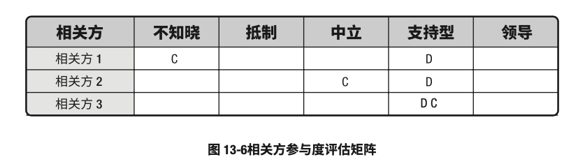

# 项目相关方管理

- 项目相关方管理包括用于开展下列工作的各个过程
	- 识别能够影响项目或会受项目影响的人员、团体或组织
	- 分析相关方对项目的期望和影响
	- 制定合适的管理策略来有效调动相关方参与项目决策和执行
- 用于这些过程分析相关方期望，评估他们对项目或受项目影响的程度，以及制定策略来有效引导相关方支持项目决策、规划和执行
- 这些过程能够支持项目团队的工作
- 项目相关方管理的过程是
	- 识别相关方：识别相关方是定期识别项目相关方，分析和记录他们的利益、参与度、相互依赖性、影响力和对项目成功的潜在影响的过程
	- 规划相关方参与：规划相关方参与是根据相关方的要求、期望、利益和对项目的潜在影响，制定项目相关方参与项目的方法的过程
	- 管理相关方参与：管理相关方参与是与相关方进行沟通和协作，以满足其需求与期望，处理问题，并促进相关方合理参与的过程
	- 监督相关方参与：监督项目相关方关系，并通过修订参与策略和计划来引导相关方合理参与项目的过程
- 项目相关方管理的各个过程
	
- 虽然在本《PMBOK®️指南》中，各项目相关方管理过程以界限分明和相互独立的形式出现，但在实践中它们会以本指南无法全面详述的方式相互交叠和相互作用

### 项目相关方管理的核心概念

- 每个项目都有相关方。他们会受项目的积极或消极影响，或者能对项目施加积极或消极的影响
- 有些相关方影响项目工作或成果的能力有限，而有些相关方可能对项目及其期望成果有重大影响
- 关于重大项目灾难的学术研究及分析强调了结构化方法对识别所有相关方、进行相关方优先级排序，以及引导相关方参与的重要性
- 项目经理和团队正确识别并合理引导所有相关方参与的能力，能决定着项目的成败
- 为提高成功的可能性，应该在项目章程被批准、项目经理被委任，以及项目团队开始组建之后，尽早开始识别相关方并引导相关方参与
- 相关方满意度应作为项目目标加以识别和管理
- 有效引导相关方参与的关键是重视与所有相关方保持持续沟通（包括团队成员），以理解他们的需求和期望、处理所发生的问题、管理利益冲突，并促进相关方参与项目决策和活动
- 为实现项目收益，识别相关方和引导相关方参与的过程需要迭代开展
- 虽然在项目相关方管理中仅对这些过程讨论一次，但是，应该经常开展识别相关方、排列其优先级以及引导其参与等活动
- 至少要在以下时点开展这些活动
	- 项目进入其生命周期的不同阶段
	- 当前相关方不再与项目工作有关，或者在项目的相关方社区中出现了新的相关方成员
	- 组织内部或更大区域的相关方社区发生重大变化

### 项目相关方管理的发展趋势和新兴实践

-	“相关方”一词的外延正在扩大，从传统意义上的员工、供应商和股东扩展到涵盖各式群体，包括监管机构、游说团队、环保人士、金融组织、媒体，以及那些自认为是相关方的人员（他们认为自己会受项目工作或成果的影响）
- 项目相关方管理的发展趋势和新兴实践包括（但不限于）：
	- 识别所有相关方，而非在限定范围内
	- 确保所有团队成员都涉及引导相关方参与的活动
	- 定期审查相关方社区，往往与单个项目风险的审查并行开展
	- 应用“共创”概念，咨询最受项目工作或成果影响的相关方。
		- 该概念的重点是，将团队内受影响的相关方视为合作伙伴
	- 关注与相关方有效参与程度有关的正面及负面价值
		- 正面价值：相关方（尤其是强大相关方）对项目的更积极支持所带来的的效益
		- 负面价值：因相关方未有效参与而造成的真实成本，包括产品召回、组织信誉损失或项目信誉损失

### 裁剪时需要考虑的因素

- 因为每个项目都是独特的，所以项目经理需要裁剪项目相关方管理过程
- 裁剪时应考虑的因素包括（但不限于）：
	- 相关方多样性：现有多少相关方？相关方群体的文化多样性如何？
	- 相关方关系的复杂性：相关方社区内的关系有多复杂？相关方或相关方群体加入的网络越多，与其相关的信息或误传网络就越复杂
	- 沟通技术：有哪些可用的沟通技术？为了实现技术的最大价值，目前采用怎样的支持机制？

### 在敏捷或适应型环境中需要考虑的因素

- 高度变化的项目更需要项目相关方的有效互动和参与
- 为开展及时且高效的讨论及决策，适应型团队会直接与相关方互动，而不是通过层层的管理级别
- 客户、用户和开发人员在动态的共创过程中交换信息，通常能实现更高的相关方参与和满意程度
- 在整个项目期间保持与相关方社区的互动，有利于降低风险、建立信任和尽早做出项目调整，从而节约成本，提高项目成功的可能性
- 为加快组织内部和组织之间的信息分享，敏捷方法提倡高透明度
	- 例如，
		- 邀请所有相关方参与项目会议和审查
		- 或将项目工件发布到公共空间，
	- 其目的在于让各方之间的不一致和依赖关系，或者不断变化的项目有关的其他问题，都尽快浮现

## 识别相关方

- 识别相关方：定期识别项目相关方，分析和记录他们的利益、参与度、相互依赖性、影响力和对项目成功的潜在影响的过程。
- 本过程的主要作用：使项目团队能够建立对每个相关方或相关方群体的适度关注
- 本过程应根据需要在整个项目期间定期开展
- 识别相关方过程的输入、工具与技术和输出
	
- 识别相关方过程的数据流向图
	
- 本过程通常在编制和批准项目章程之前或同时首次开展
- 本过程需要在必要时重复开展，至少应该在每阶段开始时，以及项目或组织出现重大变化时重复开展
- 每次重复开展本过程，都应该通过查阅项目管理计划组件及项目文件，来识别有关的项目相关方

### 识别相关方：输入

1. 项目章程
	- 项目章程会列出关键相关方清单，还可能包含与相关方职责有关的信息
2. 商业文件
	- 在首次开展识别相关方过程时，商业文件和收益管理计划是项目相关方信息的来源
		- 商业论证：商业论证确定项目目标，以及受项目影响的相关方的最初清单
		- 收益管理计划：收集管理计划描述了如何实现商业论证中所属收益
			- 它可能指出将从项目成果交付中获益并因此被视为相关方的个人及群体
3. 项目管理计划
	- 在首次识别相关方时，项目管理计划并不存在
	- 不过，一旦编制完成，项目管理计划组件包括（但不限于）：
		- 沟通管理计划
			- 沟通与相关方参与之间存在密切联系。
			- 沟通管理计划中的信息是了解项目相关方的主要依据
		- 相关方参与计划：相关方参与计划确定了用于有效引导相关方参与的管理策略和措施
4. 项目文件
	- 并非任何项目文件都将成为首次识别相关方的输入
	- 然而，需要在整个项目期间识别相关方
	- 项目经历启动阶段以后，将会生成更多项目文件，用于后续的项目阶段
	- 可作为本过程输入的项目文件包括（但不限于）：
		- 变更日志：变更日志可能引入新的相关方，或改变相关方与项目的现有关系的性质
		- 问题日志：问题日志所记录的问题可能为项目带来新的相关方，或改变现有相关方的参与类型
		- 需求文件：需求文件可以提供关于潜在相关方的信息
5. 协议
	- 协议的各方都是项目相关方，还可涉及其他相关方
6. 事业环境因素
	- 能够影响识别相关方过程的事业环境因素包括（但不限于）：
		- 组织文化、政治氛围，以及治理框架
		- 政府或行业标准（法规、产品标准和行为规范）
		- 全球、区域或当地的趋势、实践或习惯
		- 设施和资源的地理分布
7. 组织过程资产
	- 能够影响识别相关方过程的组织过程资产包括（但不限于）：
		- 相关方登记册模板和说明
		- 以往项目的相关方登记册
		- 经验教训知识库，包括与相关方偏好、行动和参与有关的信息

### 识别相关方：工具与技术

1. 专家判断
	- 应征求具备以下专业知识或接受过相关培训的个人或小组的意见
		- 理解组织内的政治和权力结构
		- 了解所在组织和其他受影响组织（包括客户及其他组织）的环境和文化
		- 了解项目所在行业或项目可交付成果类型
		- 了解个体团队成员的贡献和专长
2. 数据收集
	- 适用于本过程的数据收集技术包括（但不限于）：
		- 问卷和调查：问卷和调查可以包括一对一调查、焦点小组讨论，或其他大规模信息收集技术
		- 头脑风暴：用于识别相关方的头脑风暴技术包括头脑风暴和头脑写作
			- 头脑风暴：一种通用的数据收集和创意技术，用于向小组征求意见，如团队成员或主题专家
			- 头脑写作：头脑风暴的改良形式，让个人参与者有时间在小组创意讨论开始前单独思考问题
				- 信息可通过面对面小组会议收集，或在由技术支持的虚拟环境中收集
3. 数据分析
	- 适用于本过程的数据分析技术包括（但不限于）：
		- 相关方分析
			- 相关方分析会产生相关方清单和关于相关方的各种信息，
				- 例如，在组织内的位置、在项目中的角色、与项目的利害关系、期望、态度（对项目的支持程度），以及对项目信息的兴趣。
			- 相关方的利害关系可包括（但不限于）以下各条的组合
				- 兴趣：个人或群体会受与项目有关的决策或成果的影响
				- 权利（合法权利或道德权利）：
					- 国家的法律框架可能已就相关方的合法权利做出规定，如职业健康和安全。
					- 道德权利可能涉及保护历史遗迹或环境的可持续性
				- 所有权：人员或群体对资产或财产拥有的法定所有权
				- 知识：专业知识有助于更有效地达成项目目标和组织成果，或有助于了解组织的权力结构，从而有益于项目
				- 贡献：提供资金或其他资源，包括人力资源，或者以无形方式为项目提供支持
					- 例如，宣传项目目标，或在项目与组织权力结构及政治之间扮演缓冲角色
		- 文件分析：评估现有项目文件及以往项目的经验教训，以识别相关方和其他支持性信息
4. 数据表现
	- 适用于本过程的数据表现技术包括（但不限于）：
		- 相关方映射分析/表现：相关方映射分析和表现是一种利用不同方法对相关方进行分类的方法
			- 对相关方进行分类有助于团队与已识别的项目相关方建立关系
			- 常见的分类方法包括：
				- 权力利益方格、权力影响方格，或作用影响方格
					- 基于相关方的职权级别（权力）、对项目成果的关系程度（利益）、对项目成果的影响能力（影响），或改变项目计划或执行的能力，每一种方格都可用于对相关方进行分类。
					- 对于小型项目、相关方与项目的关系很简单的项目，或相关方之间的关系很简单的项目，这些分类模型非常实用
				- 相关方立方体
					- 这是上述模型的改良形式
					- 本立方体把上述方格中的要素组合成三维模型，项目经理和团队可据此分析相关方并引导相关方参与项目。
					- 作为一个多维模型，它将相关方视为一个多维实体，更好地加以分析，从而有助于沟通策略的制定
				- 凸显模型
					- 通过评估相关方的权力（职权级别或对项目成果的影响能力）、紧迫性（因时间约束或相关方对项目成果有重大利益诉求而导致需立即加以关注）和合法性（参与的适当性），对相关方进行分类。
					- 在凸显模型中，也可以用邻近性取代合法性，以便考察相关方参与项目工作的程度
					- 这种凸显模型用于复杂的相关方大型社区，或在相关方社区内部存在复杂的关系网络
					- 凸显模型可用于确定已识别相关方的相对重要性
				- 影响方向
					- 可以根据相关方对项目工作或项目团队本身的影响方向，对相关方进行分类。
					- 可以把相关方分类为：
						- 向上：执行组织或客户组织、发起人和指导委员会的高级管理层
						- 向下：临时贡献知识或技能的团队或专家
						- 向外：项目团队外的相关方群体及其代表，如供应商、政府部门、公众、最终用户和监管部门
						- 横向：项目经理的同级人员，如其他项目经理或中层管理人员，他们与项目经理竞争稀缺项目资源或者合作共享资源或信息
				- 优先级排序：如果项目有大量相关方、相关方社区的成员频繁变化，相关方和项目团队成员之间或相关方社区内部的关系复杂，可能有必要对相关方进行优先级排序
5. 会议
	- 会议可用于在重要项目相关方之间达成谅解。
	- 既可以召开引导式研讨会、指导式小组讨论会，也可以通过电子或媒体技术进行虚拟小组讨论，来分享想法和分析数据

### 识别相关方：输出

1. 相关方登记册
	- 相关方登记册是识别相关方过程的种主要输出。
	- 它记录关于已识别相关方的信息，包括（但不限于）：
		- 身份信息：姓名、组织职位、地点、联系方式，以及在项目中扮演的角色
		- 评估信息：主要需求、期望、影响项目成果的潜力，以及相关方最能影响或冲击的项目生命周期阶段
		- 相关方分类：用内部或外部，作用、影响、权力或利益，上级、下级、外围或横向，或者项目经理选择的其他分类模型，进行分类的结果
2. 变更请求
	- 首次开展识别相关方过程，不会提出任何变更请求
	- 但随着在后续项目期间继续识别相关方，新出现的相关方或关于现有相关方的信息可能导致对产品、项目管理计划或项目文件提出变更请求
	- 应该通过实施整体变更控制过程对变更请求进行审查和处理
3. 项目管理计划更新
	- 在项目初始时识别相关方，不会导致项目管理计划更新
	- 但随着项目进展，项目管理计划的任何变更都以变更请求的形式提出，且通过组织的变更控制过程进行处理
	- 可能需要变更的项目管理计划组件包括（但不限于）：
		- 需求管理计划：新识别的相关方可能会影响规划、跟踪和报告需求活动的方式
		- 沟通管理计划：沟通管理计划记录相关方的沟通要求和已商定的沟通策略
		- 风险管理计划：如果相关方的沟通要求和已商定的沟通策略会影响管理项目风险的方法，就应在风险管理计划中加以反映
		- 相关方参与计划：相关方参与计划记录针对已识别相关方的商定的沟通策略
4. 项目文件更新
	- 可在本过程更新的项目文件包括（但不限于）：
		- 假设日志
			- 大量关于相对权力、利益和相关方参与度的信息，都是基于一定假设条件的
			- 应该在假设日志中记录这些假设条件
			- 此外，还要在假设日志中记录会影响与具体相关方互动的各种制约因素
		- 问题日志：本过程中产生的新问题应该记录到问题日志中
		- 风险登记册：风险登记册记录在本过程中识别，并通过风险管理过程加以管理的新风险

## 规划相关方参与

- 规划相关方参与：根据相关方的需求、期望、利益和对项目的潜在影响，制定相关方参与项目的方法和过程
- 本过程的主要作用：提供与相关方进行有效互动的可行计划
- 本过程需要根据需要在整个项目期间定期开展
- 规划相关方参与过程的输入、工具与技术和输出
	
- 规划相关方参与过程的数据流向图
	
- 为满足项目相关方的多样性信息需求，应该在项目生命周期的早期制定一份有效的计划；然后随着相关方社区的变化，定期审查和更新该计划
- 在通过识别相关方过程明确最初的相关方社区之后，就应该编制第一版的相关方参与计划，然后定期更新相关方参与计划，以反映相关方社区的变化。
- 会触发该计划更新的典型情况包括（但不限于）：
	- 项目新阶段开始
	- 组织结构或行业内部发生变化
	- 新的个人或群体成为相关方，现有相关方不再是相关方社区的成员，或特定相关方对项目成功的重要性发生变化
	- 当其他项目过程（如变更管理、风险管理或问题管理）的输出导致需要重新审查相关方参与策略
- 这些情况都可能导致已识别相关方的相对重要性发生变化

### 规划相关方参与：输入

1. 项目章程
	- 项目章程包含与项目目的、目标和成功标准有关的信息，在规划如何引导相关方参与项目时应该考虑这些信息
2. 项目管理计划
	- 项目管理计划组件包括（但不限于）：
		- 资源管理计划：资源管理计划可能包含关于团队成员及其他相关方的角色和职责的信息
		- 沟通管理计划：用于相关方管理的沟通策略以及用于实施策略的计划，既是项目相关方管理中的各个过程的输入，又会收录来自这些过程的相关信息
		- 风险管理计划：风险管理计划可能包含风险临界值或风险态度，有助于选择最佳的相关方参与策略组合
3. 项目文件
	- 可用作本过程输入的项目文件（尤其在初始规划之后）包括（但不限于）：
		- 假设日志：假设日志中关于假设条件和制约因素的信息，可能与特定相关方相关联
		- 变更日志：变更日志记录了对原始项目范围的变更。变更通常与具体相关方相关联，因为相关方可能是：变更请求的提出者，变更请求的审批者，或受变更实施影响者
		- 问题日志：为管理和解决问题日志中的问题，需要与受影响的相关方进行额外沟通
		- 项目进度计划：进度计划中的活动可能需要与具体相关方相关联，即把特定相关方制定为活动责任人或执行者
		- 风险登记册：风险登记册包含项目的已识别风险，它通常会把这些风险与具体相关方相关联，即把特定相关方指定为风险责任人或受风险影响者
		- 相关方登记册：相关方登记册提供项目相关方的清单，以及分类情况和其他信息
4. 协议
	- 在规划承包商及供应商参与时，通常涉及与组织内采购小组和（或）合同签署小组开展合作，以确保对承包商和供应商的有效管理
5. 事业环境因素
	- 能够影响规划相关方参与过程的事业环境因素包括（但不限于）：
		- 组织文化、政治氛围，以及治理框架
		- 人事管理政策
		- 相关方风险偏好
		- 已确立的沟通渠道
		- 全球、区域或当地的趋势、实践或习惯
		- 设施和资源的地理分布
6. 组织过程资产
	- 能够影响规划相关方参与过程的组织过程资产包括（但不限于）：
		- 企业的社交媒体、道德和安全政策及程序
		- 企业的问题、风险、变更和数据管理政策及程序
		- 组织对沟通的要求
		- 制作、交换、存储和检索信息的标准化指南
		- 经验教训知识库，包括与相关方偏好、行动和参与有关的信息
		- 支持有效相关方参与所需的软件工具

### 规划相关方参与：工具与技术

1. 专家判断
	- 应征求具备以下专业知识或接受过相关培训的个人或小组的意见
		- 组织内部及外部的政治和权力结构
		- 组织及组织外部的环境和文化
		- 相关方参与过程使用的分析和评估技术
		- 沟通手段和策略
		- 来自以往项目的关于相关方、相关方群体及相关方组织（他们可能参与过以往的类似项目）的特征的知识
2. 数据收集
	- 适用于本过程的数据收集技术包括（但不限于）：
		- 标杆对照：将相关方分析的结果与其他被视为世界级组织或项目的信息进行比较
3. 数据分析
	- 适用于本过程的数据分析技术包括（但不限于）：
		- 假设条件和制约因素分析：可能需要分析当前假设条件和制约因素，以合理裁剪相关方参与策略
		- 根本原因分析：开展根本原因分析，识别是什么根本原因导致了相关方对项目的某种支持水平，以便选择适当的策略改进其参与水平
4. 决策
	- 适用于本过程的决策技术包括（但不限于）：
		- 优先级排序或分级：应该对相关方需求以及相关方本身进行优先级排序或分级。具有最大利益和最高影响的相关方，通常应该排在优先级清单的最前面
5. 数据表现
	- 适用于本过程的数据表现技术包括（但不限于）：
		- 思维导图：思维导图用于对相关方信息、相互关系以及他们与组织的关系进行可视化整理
		- 相关方参与度评估矩阵
			- 相关方参与度评估矩阵用于将相关方当前参与水平与期望参与水平进行比较。
			- 对相关方参与水平进行分类的方式之一
				
					- C代表每个相关方的当前参与水平
					- 而D是项目团队评估出来的、为确保项目成功所必不可少的参与水平（期望的）
					- 应根据每个相关方的当前与期望参与水平的差距，开展必要的沟通，有效引导相关方参与项目
					- 弥合当前与期望参与水平的差距是监督相关方参与中的一项基本工作
			- 相关方参与水平可以分为如下：
				- 不了解型：不知道项目及其潜在影响
				- 抵制型：知道项目及其潜在影响，但抵制项目工作或成果可能引发的任何变更。
					- 此类相关方不会支持项目工作或项目成果
				- 中立型：了解项目，但既不支持，也不反对
				- 支持型：了解项目及其潜在影响，并且支持项目工作及其成果
				- 领导型：了解项目及其潜在影响，而且积极参与以确保项目取得成功
6. 会议
	- 会议用于讨论与分析规划相关方参与过程所需的输入数据，以便制定良好的相关方参与计划

### 规划相关方参与：输出

1. 相关方参与计划
	- 相关方参与计划是醒目管理计划的组成部分
	- 它确定用于促进相关方有效参与决策和执行的策略和行动
	- 基于项目的需要和相关方的期望，相关方参与计划可以是正式或非正式的，非常详细或高度概括的
	- 相关方参与计划可包括（但不限于）：
		- 调动个人或相关方参与的特定策略或方法

## 管理相关方参与

### 管理相关方参与：输入

1. 项目管理计划
2. 项目文件
3. 事业环境因素
4. 组织过程资产

### 管理相关方参与：工具与技术

1. 专家判断
2. 沟通技能
3. 人际关系与团队技能
4. 基本规则
5. 会议

### 管理相关方参与：输出

1. 变更请求
2. 项目管理计划更新
3. 项目文件更新

## 监督相关方参与

### 监督相关方参与：输入

1. 项目管理计划
2. 项目文件
3. 工作绩效数据
4. 事业环境因素
5. 组织过程资产

### 监督相关方参与：工具与技术

1. 数据分析
2. 决策
3. 数据表现
4. 沟通技能
5. 人际关系与团队技能
6. 会议

### 监督相关方参与：输出

1. 工作绩效信息
2. 变更请求
3. 项目管理计划更新
4. 项目文件更新