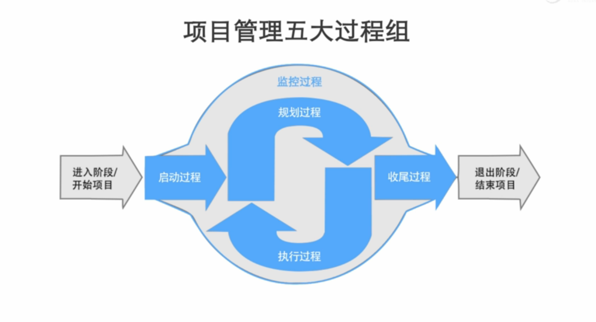

#引论
- 项目：为创造*独特的***产品**、**服务**或**成果**而进行的*临时性*工作
- 项目的分类
	- 研发项目：产品型的项目，交付一个有形的产品。
	- 交付项目：提供服务，根据客户的独特的需求量身定制一套系统
	- 变革项目：成果型项目，改变现有的管理模式、管理流程
- 企业的类型
	- 项目甲方：业主、需方、发包方、买方；出钱的；PMBOK在采购管理一章中是站在甲方项目经理的视角写的
	- 项目乙方：服务商、供方、承包方、卖方；挣钱的；PMBOK是站在乙方项目经理的视角写的。
- 企业的经营活动分类（管理的分类）
	- 项目：独特的阶段性的活动
	- 运营：公司里职能部门连续性、持续性的工作
- 项目的特征
	- 独特性：每个项目都是独一无二的
	- 临时性：有明确的开始和结束时间的阶段性的工作，有始有终
	- 不确定性：在项目的过程中有未知的知识领域和风险，项目是一个**渐进明细**的探索创新的过程
- 管理水平的高低!=产品的成功
- 项目的目标：在规定的**时间**内，在批准的**预算**内，完成事先确定的工作**范围**内的工作，并且达到预期的**质量**性能要求。
	- 时间和成本之间的关系：
		- 呈**微笑曲线**，时间越短成本越高，时间越长成本越高，而成本最低点对应的时间称为**最优工期**。
			- 导致呈微笑曲线的原因是：项目的成本分为**直接成本**和**间接成本**
				- 直接成本：项目中使用的耗材的成本，包括物资以及人力。
				- 间接成本：项目中产生的管理成本。随着时间的延长间接成本会逐渐增加。
			- 预算与微笑曲线相交的两点之间的时间称为**合理工期**。
				- 合理工期内能够完成项目则项目的成本就不会超出预算。
- 项目管理的高层次目标：
	- 实现组织（企业）战略目标
	- 相关方满意
	- 项目团队成员满意
	- H（Health，健康，保证相关方的健康）S（Safety，安全，不能出现安全事故）E（Environment，环境友好，不能影响环境）
- 项目管理目标的发展演变
	- 质量、进度、成本
	- 资源优化、各方满意、面向战略
	- 以人为本、社会责任、环境友好

- 彩蛋
	- PMP考试中的“词频”与“图谱”
		- 统计分布规律（知识点）
		- 归纳解题攻略（各题型）
			- 概念题（what）
			- 情景/场景题（how）
			- 计算题，十二例
		- 分析发展趋势（试题库）
			- 挣值分析
		- 还原心路历程（命题者）
	- 备考技巧：不背书，不刷题，准备答题记录本，PMBOK中寻找你的选择依据，训练美国人思维方式，还原出题人心路历程。
	- 项目管理“主要演员”
		- 高级管理层：项目经理的听头上司，汇报人
		- CCB：变更管理小组
		- PMO：项目管理办公室
		- 职能经理：职能部门经理
		- 发起人
		- 项目经理
		- 团队
		- 项目相关方0

- 组织级项目管理
	- 项目、项目集和项目组合
		- 战略：企业阶段性奋斗目标
		- 项目组合：为战略而组织在一起的项目
			- 为了实现战略目标而组合在一起管理的项目、项目集、子项目组合和运营工作。项目组合中的项目或项目集不一定依赖或直接相关。
		- 项目集：相关联的被协调管理的项目
			- 一组相互关联且被协调管理的项目、子项目集和项目集活动，以便获得分别管理无法获得的利益
		- 项目：为实现具体目标而计划的工作
- 如何区分项目集合项目组合管理

	|理论|范围|目的|管理要点|成功标准|
	|:-:|:-:|:-:|:-:|:-:|
	|管理成熟度模型|制度+流程+文化|管理环境|制度流程建设|企业成熟|
	|项目组合管理|项目+项目集+运营|健康发展|优先级|投资效益|
	|项目集管理|多项目|能力建设|逻辑管理|需求利益|
	|项目管理|单项目|产品实现|目标管理|质量、成本、进度|
	
- 项目与运营的区别
	
	|项目|运营|
	|:-:|:-:|
	|独一无二|重复多次|
	|时间有限|持续不断|
	|革命性|渐进性|
	|责权不均衡|责权均衡|
	|临时性组织|稳定性组织|
	|效果导向|效率导向|
	|风险（不确定性）|经验（确定性）|
	|针对性计划|标准化规范|

- 项目经理与职能主管的区别
	
	||项目经理|职能主管|
	|:-:|:-:|:-:|
	|扮演角色|"帅才"|"将才"|
	|知识结构|"通才"|"专才"|
	|管理方式|目标管理|过程管理|
	|工作方法|系统的方法|分析的方法|
	|责任权力|责大权小|权责相等|
	|主要任务|计划、组织、协调、指导|技术、流程、标准、规范|
	
- 彩蛋
	- 七宗罪
		1. 工作分出去，如同“肉包子打狗，有去无回” 
		2. 项目千头万绪，计划扑朔迷离
		3. 沟通隔靴搔痒，管控鞭长莫及
		4. 需求变幻莫测，变更层出不穷
		5. 传统工具专业高冷，普及应用困难重重
		6. 日志、记录、报告、总结、不堪重负
		7. 教训不断重演，经验难以沉淀
	- 破解七宗罪
		1. 凡事预则立，不预则废
		2. 进度优化
		3. 成本优化
		4. 资源优化

- 企业战略与项目管理
	- 战略管理：在正确的时间做正确的事儿
		- 企业管理金字塔
			- 愿景：希望企业发展成什么样
			- 使命：企业为何而存在，创立的初衷
			- 战略：阶段性的目标
			- 项目：企业战略落地的单元，企业利润的来源，企业跨部门协作的载体
	- 项目管理：把事儿做正确
- 组织项目管理成熟度提升
	- 科斯纳模型
		- 通用术语：使用专业知识和属于无障碍沟通
		- 通用过程：可被重复的行为
		- 单一方法：可以被定义的统一方法
		- 基准比较：标杆对照，可以预测的管理效果
		- 持续改进：每次都可以取得进步
	- 组织级项目管理
		- OPM3组织项目管理成熟模型
			- 通过知识沉淀、系统评估和持续改进三步组合，并循环迭代帮助企业持续提升项目管理成熟度。
			- 组织级项目管理
				- 项目组合管理
				- 项目集管理
				- 项目管理
			- 过程改进阶段
				- 持续改进
				- 可控制
				- 可测量
				- 标准化
			- 组织级项目管理成熟度三部曲
				- 知识：企业在项目管理中总结的模板、案例、经验教训及最佳实践。
				- 评估：由专业的评估师对企业项目管理的现状进行评估
				- 改进：按计划进行改进获得更高的项目管理成熟度
			- OPM3的目标：帮助组织通过开发其能力成功地，可靠地，按计划地选择并交付项目而实现其战略。

- 彩蛋
	- 项目管理的价值观和方法论
		- 未雨绸缪（计划、风险）
		- 防微杜渐（监控、纠正）
		- 资源集成（整合、采购）
		- 恰到好处（范围、质量）
		- 循规蹈矩（过程、制度）
		- 锲而不舍（目标、变更）
		- 积微成著（组织过程资产）
		- 公开透明（沟通、参与）
		- 同舟共济（共赢、诚信）
		- 各司其职（授权、平等）

- 项目的生命周期
	- 概念阶段
		- 需求识别
		- 可行性研究
		- 商业分析
	- 规划阶段
		- 解决方案
		- 规划设计
		- 预算编制
	- 实施阶段
		- 开发/施工
		- 需求实现
		- 执行与控制
	- 收尾阶段
		- 交付验收
		- 合同支付
		- 总结经验
- 项目生命周期类型
	- 预测型
	- 迭代型
	- 增量型
	- 适应型（敏捷性）
		- Scrum敏捷开发框架
		- 好处：客户随时可以变更需求，对需求变更的适应性强
- 项目生命周期与资源投入
	
- 项目生命周期的连续区间
	- <--预测型-迭代型-增量型-敏捷型-->
		
		|需求在开发钱预先确定|需求在交付期间定期细化|需求在交付期间频繁细化|
		|:-:|:-:|:-:|
		|针对最终可交付成果制定交付计划，然后在项目终了时一次性交付最终产品|分次交付整体产品的各种子集|频繁交付对客户有价值的各种子集（隶属于整体产品）|
		|尽量限制变更|定期把变更融入项目|在交付期间实时把变更融入项目|
		|关键相关方在特定里程碑时点参与|关键相关方定期参与|关键相关方持续参与|
		|通过对基本可告知情况编制详细计划而控制风险和成本|通过用新信息逐渐细化计划而控制风险和成本|随需求和制约因素的显现而控制风险和成本|
		
- STACEY矩阵
	
- 项目管理五大过程组

	
	
	- 启动过程
	- 规划过程
	- 执行过程
	- 监控过程
	- 收尾过程
- 每个过程组都包含**输入、工具与技术、输出**和**数据流向图**
- 五大过程组之间的相互作用
	
	
- 彩蛋
	- 项目管理知识体系的3个维度
		- 4阶段
		- 5过程组
		- 10知识领域
	- 项目的特点：变幻莫测
	- 计划是项目管理的核心思想

- 在项目的每个阶段都包含49个过程组，但对于不同的项目阶段需要对这49个过程组进行适当的裁剪。
- 十大知识领域之间的关系
	
- 项目的子计划
	
- 项目管理的心路历程
	
- 项目管理数据和信息
	
- 裁剪：根据项目阶段的具体情况对过程进行适当的取舍。
- 裁剪的对象
	- 49个过程
	- 过程的输入、工具技术、输出
	- 生命周期：阶段划分
	- 开发方法：增量/迭代、敏捷
- 裁剪需要考虑的因素
	- 范围、进度、成本、资源、质量、风向之间的相互制约
	- 项目环境
	- 组织文化
	- 相关方需求
- 项目商业文件
	- 项目商业论证：文档化的经济可行性研究报告，用来对尚缺乏充分定义的所选方案的收益进行有效性论证，是启动后续项目管理活动的依据。
	- 项目效益管理计划：对创造、提高和保持项目效益的过程进行定义的书面文件。
- 项目相关文件以及负责人
	- 组织负责人
		- 组织目标（战略）
	- 项目发起人
		- 项目商业论证
		- 项目章程
	- 项目经理
		- 项目效益管理计划
		- 项目计划
- 项目文件及项目生命周期
	
- 项目可行性研究包含的内容
	- 市场研究：项目的必要性
		- 市场现状调查
		- 资源条件评价
		- 建设规模与产品方案研究
		- 场址选择
	- 技术研究：技术上的可行性
		- 技术方案、设备方案和工程方案
		- 原材料燃料供应
		- 总图运输与公用辅助工程
		- 环境影响评价
		- 劳动安全卫生与消防
		- 组织机构与人力资源配置
		- 项目实施进度
	- 效益研究：经济上的合理性
		- 投资估算
		- 融资方案
		- 财务评价
		- 国民经济评价
		- 社会评价
		- 风险评价
		- 研究结论与建议
- 项目可行性研究的作用
	- 科学投资决策的依据
	- 编制计划、设计、施工及后评价的依据
	- 项目评估、资金筹措的依据
	- 提高投资效益的重要保障
- 财务测量指标
	- 静态评价法
		- 投资回报率ROI
			- 年平均利润/投资额
		- 投资回收期PBP
			- 1/ROI（当各年净现金流（利润）相等时可以使用上述公式，年收益相等，年平均利润不变）
			- 现金流变正的前一年+（现金流变正前一年的现金流的绝对值/现金流辩证那一年的现金流）
	- 动态评价法
		- 现值：当前的价值
		- 终值：未来的价值
		- 复利计算：
			- 终值=现值*(1+i)n
				- i：利息
				- n：年数
		- 折现计算
			- 现值=终值/(1+i)n
		- 净现值NPV
			- 计算
				1. 根据**收入**和**支出**计算出每年的**净现金流**
				1. 根据**净现金流**折现计算出**折现后的净现金流**
				2. 根据**折现后的净现金流**计算机**累计净现金流**
				3. 最后一年的累计净现金流则为NPV
			- 例子（设：利息：10%）
			
				|年份|0|1|2|3|4|5|
				|:-:|:-:|:-:|:-:|:-:|:-:|:-:|
				|收入||12.00|12.00|12.00|12.00|1212.00|
				|支出|-600.00|12.00|12.00|12.00|12.00|1212.00|
				|净现金流|-600.00|12.00|12.00|12.00|12.00|1212.00|
				|净现金流（折现）|-600.00|10.91|9.92|9.02|8.02|752.56|
				|累计净现金流|-600.00|-589.09|-579.17|-570.16|-561.96|**190.60**|
				
				- 静态PBP=5-1+(552-1212)=4.46年
				- 动态PBP=5-1+(561.96/752.56)=4.75年
				- 净现值BPV=190.60万元
			- NPV的含义：项目在偿还完银行本金和利息后能够带来的收益
		- 内部收益率IRR
			- IRR的含义：能够承受的最高的银行利息
			- 例子
			
				|年份|0|1|2|3|4|5|NPV|i|
				|:-:|:-:|:-:|:-:|:-:|:-:|:-:|:-:|:-:|
				|收入||12.00|12.00|12.00|12.00|1212.00|
				|支出|-600.00|12.00|12.00|12.00|12.00|1212.00|
				|净现金流|-600.00|12.00|12.00|12.00|12.00|1212.00|
				|净现金流（折现）1|-600.00|10.91|9.92|9.02|8.02|752.56|190.60|10%|
				|净现金流（折现）2|-600.00|10.62|9.40|8.32|7.36|657.83|93.53|13%|
				|净现金流（折现）3|-600.00|10.43|9.07|7.89|6.86|602.58|36.84|15%|
				|净现金流（折现）4|-600.00|10.34|8.92|7.69|6.63|577.05|10.63|16%|
				|净现金流（折现）5|-600.00|10.26|8.77|7.49|6.40|552.81|-14.27|17%|
			
				- (IRR-16%)/(17%-IRR)=10.63/14.27
				- IRR=16.43%
	- 效益成本比率BCR
		- BCR=效益/成本
		- 当BCR大于1的时候增加单位成本增加的效应不再明显。