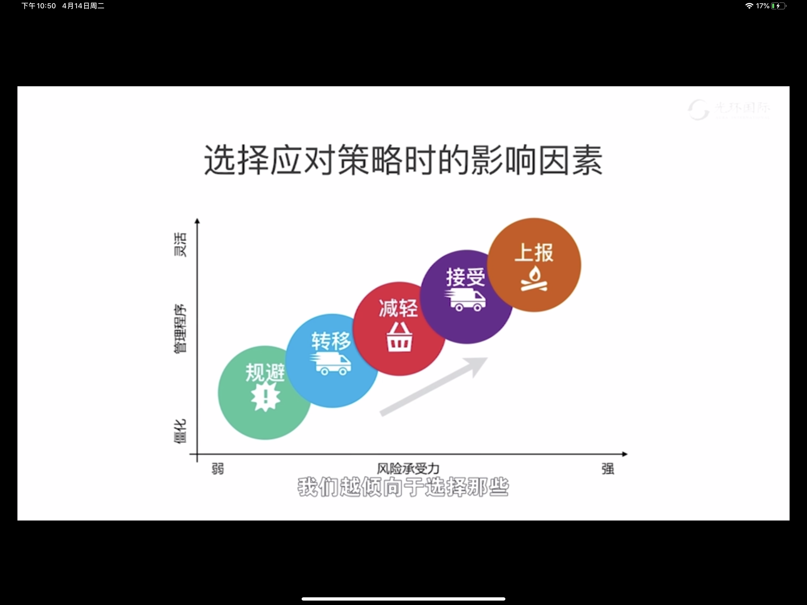
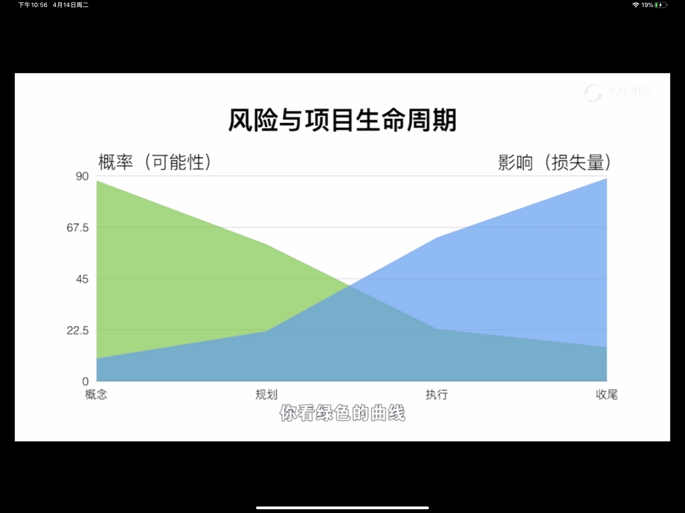

# 项目风险管理

- 风险的分类
	- 风险（坏事）
	- 机会（好事）
- 风险的属性
	- 概率
	- 影响
		- 有利影响
		- 负面影响
- 风险敞口（Risk Exposure）：在某个项目、项目集或项目组合中，针对任一特定对象，而适时作出的对所有风险的潜在影响的综合评估
	- 未加保护的风险，也称“风险暴露”
- 单个项目风险和整体项目风险
	- 风险近视症（《项目风险常见病诊治宝典》——Dr.戴维·希尔森（PMBOK第六版项目风险管理知识领域执笔人））
		- 只关注单个项目风险而忽略整体项目风险
		- 只关注项目局部风险而忽略项目全局风险
		- 只关注项目短期风险而忽略项目长期风险
		- 只关注项目战术风险而忽略项目战略风险
- 技术进步来带的项目风险
	- 变异性风险
	- 模糊性风险
		- 规避方法：提高项目韧性
- 项目韧性：项目遭受风险，或受到扰动时：（1）维持状态的能力（2）迅速恢复的能力（3）通过适应来更好地应对未来不确定性的能力
- 整合式风险管理
	- 项目经理解决项目风险
	- 项目集经理解决项目集风险
	- 项目组合经理解决项目组合风险
	- 组织管理层解决组织风险
- 项目风险的分类
	- 已知风险——未知风险
		- 未知风险
			- 已知-未知风险：概率和影响其一无法识别
			- 未知-未知风险：概率和影响都无法识别，或他人不承认
	- 内部风险——外部风险
	- 商业风险——可保险风险
		- 可保险风险：可以通过购买保险来转移风险的承担责任
		- 商业风险：不能购买保险来转移风险的承担责任
- 风险分解结构（RBS）
- 相关方的风险态度（风险临界值）
	- 偏好
	- 承受力
- 识别风险的方法
	- 头脑风暴法
	- 德尔菲法
	- 根本原因分析
	- 核对单分析
	- 假设分析
	- 鱼骨图
	- 系统流程图
	- 专家判断
		- 注意专家的偏见
		- 注重专家的直觉
	- 假设条件和制约因素分析
		- 制约因素：已确定，客观存在
		- 假设条件：不确定，经验推断
	- SWOT分析
		
		
- 管理项目风险
	- 提示清单（Prompt List）
		- For：单个项目风险
	- 战略框架（Strategy Framework）
		- For：整体项目风险
		- 常用框架1
			- Political政治/政策
			- Economic经济
			- Social社会
			- Technological技术
			- Legal法律
			- Environmental环境
		- 常用框架2
			- Technical技术
			- Environmental环境
			- Commercial商业/贸易风险
			- Operational运营
			- Political政治/政策
		- 常用框架3
			- Volatility多变的
			- Uncertainty不确定的
			- Complexity复杂的
			- Ambiguity模棱两可的
	- 层级图（气泡图）
		- 紧迫性
		- 邻近期
		- 潜伏期
		- 可管理型
		- 可控性
		- 可监测性
		- 连通性
		- 战略影响
		- 亲密度
- 风险的定性分析
	- 风险量表
	- 风险概率和影响矩阵
- 风险的定量分析
	- 模拟
		- 蒙特卡洛分析
	- 敏感性分析
		- 龙卷风图
	- 决策树
	- 影响图：影响图是由结点和有向弧组成的无环路的有向图，其中，结点代表所研究问题中的主要变量，有向弧表示变量间的各种相互关系
		
- 风险应对的工具和技术
	- 应急计划
	- 弹回计划
	- 权变措施
- 风险和资源的关系
	
	|风险的种类|应对措施|动用资源|成本基准|管理责任|
	|:-:|:-:|:-:|:-:|:-:|
	|已知|原计划|活动预算|√|团队成员|
	|已知-未知|应急计划|应急储备|√|项目经理|
	|未知-未知|权变措施|管理储备|×|高层管理者|

- 风险应对流程图
	
- 风险应对策略
	- 负面影响
		- 规避：改变计划
		- 转移：买保险、外包
		- 减轻：降低可能性、减小影响
		- 接受：预留储备
		- 上报：交由领导处理
	- 正面影响
		- 开拓：创造机会
		- 提高：扩大影响
		- 分享：合作
		- 接受：预留储备
		- 上报：交由领导处理
- 选择应对策略时的影响因素
	
- 风险与项目生命周期
	