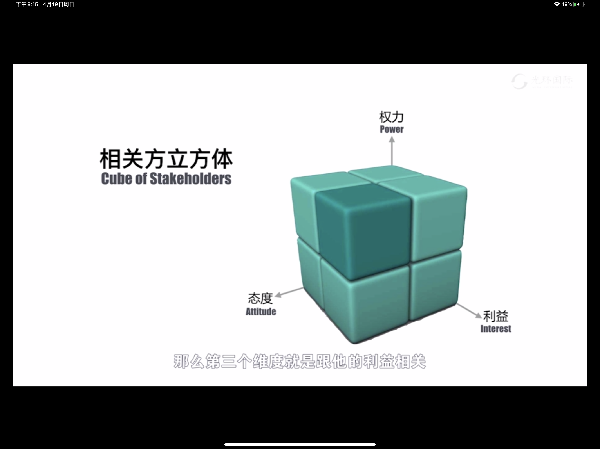
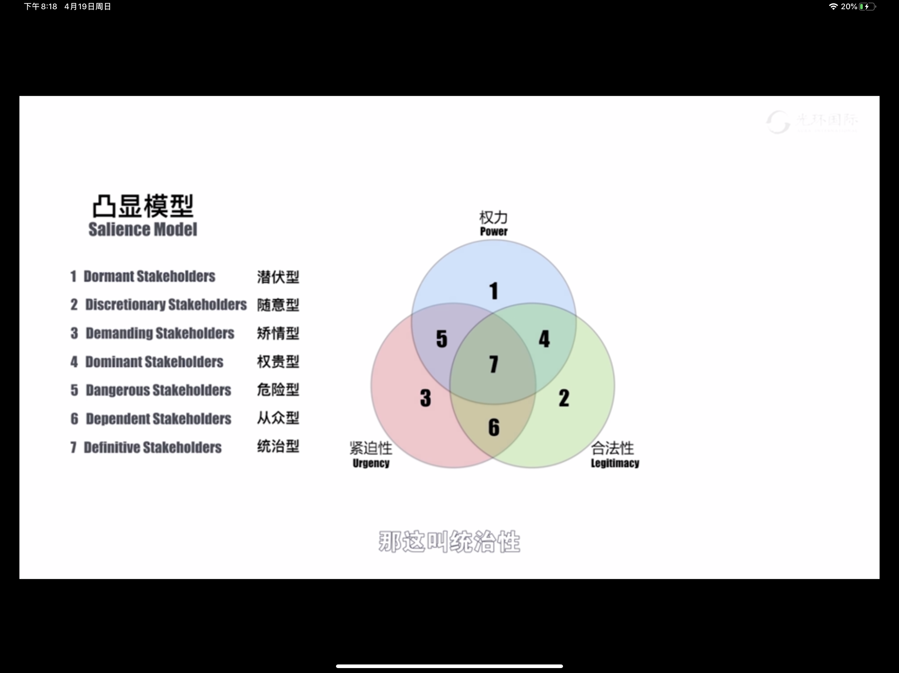

# 相关方管理

## 前沿做法

- 共创（Co-Create）

## 相关方管理要解决的问题

- 谁是你的相关方
- 他们有什么期望
- 他们的影响有多大
- 怎么调动他们的积极性
- 如何与他们沟通
- 怎么解决利益冲突

## 相关方分析

- 相关方的类型
	- 参与项目与否
		- 参与项目的人
		- 不参与项目的人
	- 受项目影响的相关方
		- 受正面影响
		- 受负面影响
	- 按距离由近及远
		- 内部：员工、职能部门经理等
		- 本地：媒体、政府等
		- 国内
		- 国际
	- 供应商/分包商
	- 项目团队
	- 客户/投资人
	- 职能经理
- 相关方影响力（0 - 4）
- 相关方态度（-2 - +2）
- 权力利益矩阵
	
	- 第一象限：严防死守（重点管理）
	- 第二象限：投其所好（令其满意）
	- 第三象限：保持关注（定期监督）
	- 第四象限：确保知会（及时告知）
- 相关方立方体
	
- 凸显矩阵
	
	
- 相关方影响方向

## 相关方登记册

- 相关方参与程度评估矩阵