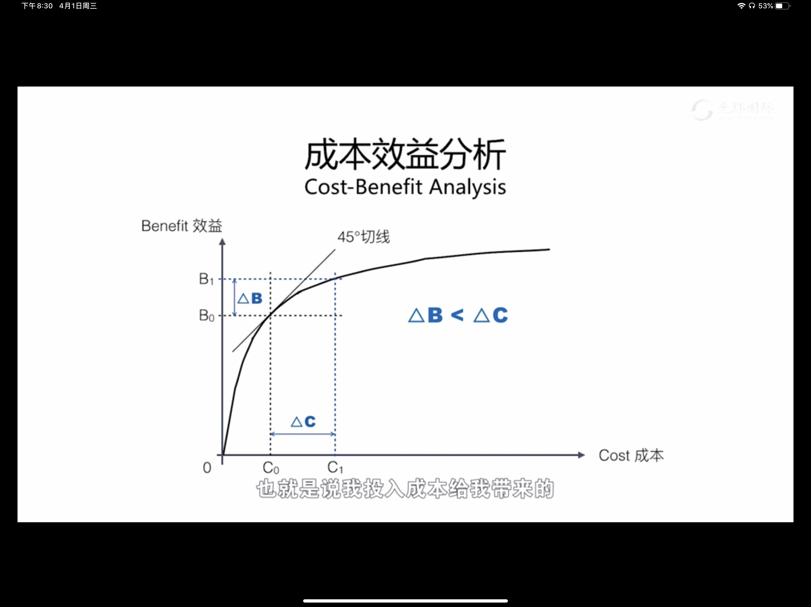
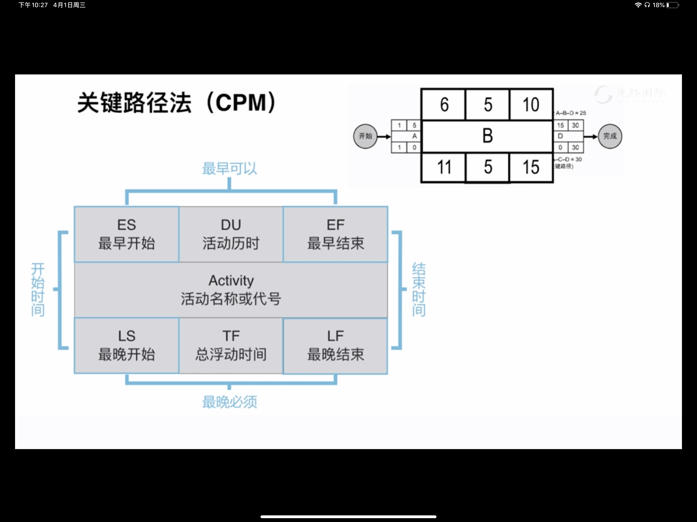
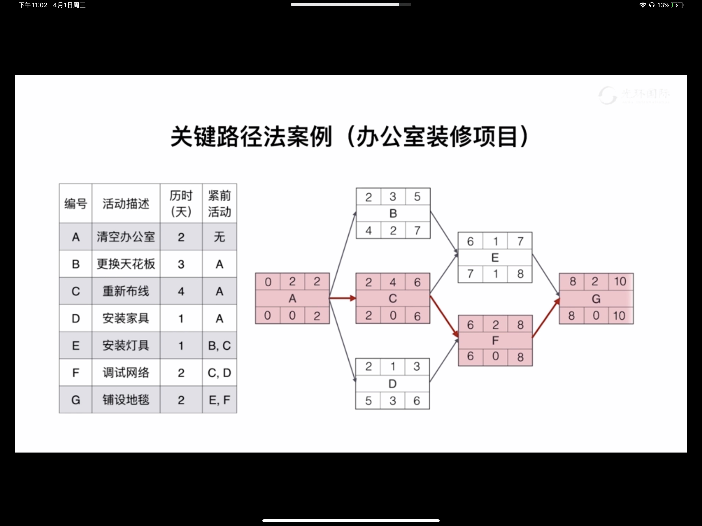
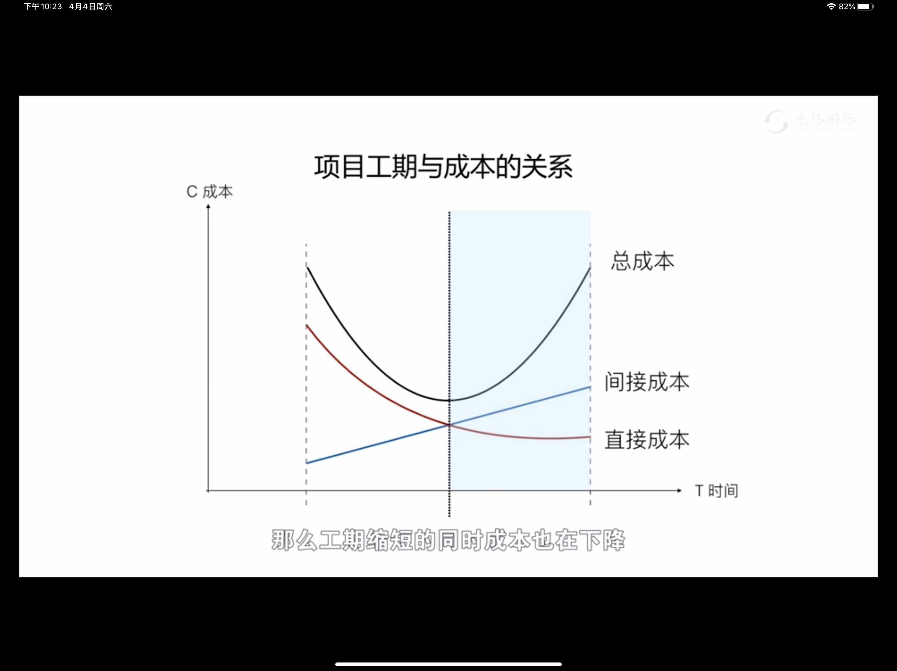

# 进度管理

## 进度模型

- 时间管理：怎么在一个合理的进度计划内完成我们项目当中所有的工作
- 时间的特征
	- 时间不等人
	- 投入有上限
	- 对谁都公平
- 时间管理的过程
	- 规划进度管理
	- 定义活动
	- 排列活动顺序
	- 估算活动持续时间
	- 制定进度计划
	- 控制进度
- 敏捷开发
	- 具有未完项的迭代进度计划
	- 敏捷发布规划
- 滚动式开发
	- 滚动式规则
		- 对近期要完成的工作详细规划
		- 渐进明细，从粗到细
		- 对远期工作只做概要性规划（规划包）

## 紧前关系绘图法PDM

- 活动之间的四种逻辑关系
	- FS（First-Start）：前面的工作结束，后面的工作才能开始
	- FF（First-First）：前面的工作结束，后面的工作才能结束
	- SS（Start-Start）：后面的工作开始，前面的工作就能开始
	- SF（Start-First）：后面的工作开始，前面的工作才能结束
- 活动之间的依赖关系
	- 内部依赖
	- 外部依赖
	- 强制性依赖
	- 选择性依赖
- 滞后量（Lag）&提前量（Lead）
- 前导图（Precedence Diagramming Method，PDM）

## 估算资源

- 学习曲线：随着产出量增多，单位产出所需要劳动时间会减少，单位生产成本会降低
	- 有经验的人完成一项工作所需要的时间和新手是不一样的
	
- 成本效益分析（边际效益递减规律）
	
- 资源日历

## 活动的历史估算

- 专家判断
	- 可能存在偏差
	- 可能判断失误
- 类比估算
	- 优点：经济高效
	- 缺点：可能不准
- 参数估算
	- 如模型成熟，参数准确。参数估算价值很大
- 三点估算
	- 期望值=Te=（O+4M+P）/6=（乐观时间+4*可能时间+悲观时间）/6
		- 时间储备/应急储备
	- 标准差（Sigma）=（P-O）/6=（悲观估计-乐观估计）/6
		- β曲线的稳定性
	- 三角分布
		- 期望值=（O+M+P）/3
	- 正态分布
		- 期望值±1倍标准差的概率是68.26%
		- 期望值±2倍标准差的概率是95.46%
		- 期望值±3倍标准差的概率是99.73%
- 自下而上的估算
	- 优点：估算精度高
	- 缺点：周期长成本高
- 五种估算方法对比
	
	||类比估算|参数估算|专家判断|三点估算|自下而上|
	|:-:|:-:|:-:|:-:|:-:|:-:|
	|成本|低|低|较低|较高|高|
	|准确度|低|依赖模型和参数的准确度|依赖于专家水平|较高|高|
	|活动|✅||✅|✅||
	|工作包|✅||✅|✅|✅|
	|子项目/项目|✅|✅||✅|✅|

## 储备分析

- 进度储备/安全时间/缓冲Buffer
- 估算工期=期望值+进度储备
- 安全时间的作用：应对风险
- 项目的风险
	- 已知风险
	- 未知风险
		- 已知-未知风险
		- 未知-未知风险（也包括即便已知可能发生，发起人不认可的风险）
- 风险的属性
	- 概率
	- 影响
- 应对风险的储备
	- 已知风险：多备份/多个备用计划
	- 已知-未知风险：打出提前量，准备应急计划
	- 未知-未知风险
- 储备分类
	- 应急储备
		- 项目经理支配
		- 用于应对已知-未知风险
		- 包含在成本基准内
	- 管理储备
		- 高层管理者支配
		- 用于应对未知-未知风险
		- 不包含在成本基准内

## 关键路径法CPM

|ES最早开始|DU活动历时|EF最早结束|
||Activity活动名称或代号||
|LS最晚开始|TF总浮动时间|LF最晚结束|

- ES+DU=EF
- LF-DU=LS
- LF-EF=TF
- LS-ES=TF

- 浮动时间最少的路径决定了总工期
- 关键路径上的活动的浮动时间可能是大于等于或小于0的
	- 等于0：没有浮动时间
	- 小于0：时间不够用，需要压缩工期
	- 大于0：有富余的时间，通常是活动设置有安全时间
- 关键路径决定了项目的总工期
- 关键路径所需要的时间最长
- 关键路径上的浮动时间最少
- 一个项目关键路径可以有多条
- 关键路径和非关键路径上的活动没有技术含量上的区别，只有对时间的不同约束
- 活动的延误可能导致关键路径变化
- 关键路径上的活动通过压缩可能将非关键路径变成关键路径

## 资源优化

- 资源平衡 Resource Level
	- 解决资源数量不够问题
	- 资源平衡可以解决资源不够的局部问题
	- 资源平衡可能导致工期延长
- 资源平滑 Resource Smooth：不影响工期的情况下，利用活动的浮动时间，通过调整活动的顺序来解决资源数量波动问题
	- 解决资源数量波动问题

## 压缩工期

- 快速跟进
	- 代价：增加风险
- 赶工
	- 代价：成本

## 进度计划

- 里程碑计划
	- 作用
		- 计划：分解为阶段性目标
		- 控制：强制约束，控制各阶段目标实现
		- 沟通：与管理层、干系人良好沟通
		- 责任：明确规定了项目各方的责任义务
		- 报告：简明、生动、通俗、实用
- 横道图（甘特图）
- 网络图
	- 单代号网络图（AON）4种逻辑关系
	- 双代号网络图（AOA）仅FS一种逻辑关系
		- 虚工作：不耗时间、不占资源、仅表示逻辑关系
	- 时标网络图

## 项目的3种浮动时间

- 自由浮动时间：活动的不影响后续工作最早可以开始时间的前提下，这项工作可以拖延的时间。
- 总浮动时间：在不影响项目总工期的前提下，活动可以拖延的总时间
- 项目浮动时间：在项目总工期的基础上还富余的时间

## 关键链法CCM

- 学生综合征：作业总会拖到最后完成
- 帕金森定律：工作会自动膨胀，占满所有可用时间
- 墨菲定律
	- 工作全都比你估计的时间要长
	- 你越担心的事情，越可能发生

1. 工期用三点估算法，使用50%的完成概率报工期
2. 活动时间不够时可以从项目缓冲中分配额外时间
3. 为解决路径汇聚风险，为非关键路径的活动主动添加接驳缓冲来增大汇聚活动的准时开始概率

## 燃尽图

- 参考燃尽线：理想情况下工作可以做完的情况
- 实际燃尽线：实际完成工作的情况
- 实际燃尽线在参考燃尽线上方表示进度拖延
	- 拖延需要尽快赶工
- 实际燃尽线在参考燃尽线下方表示进度超前
	- 超前可能有资源使用效率不高的情况、资源不饱和（计划太保守，本应该以更高的效率完成）