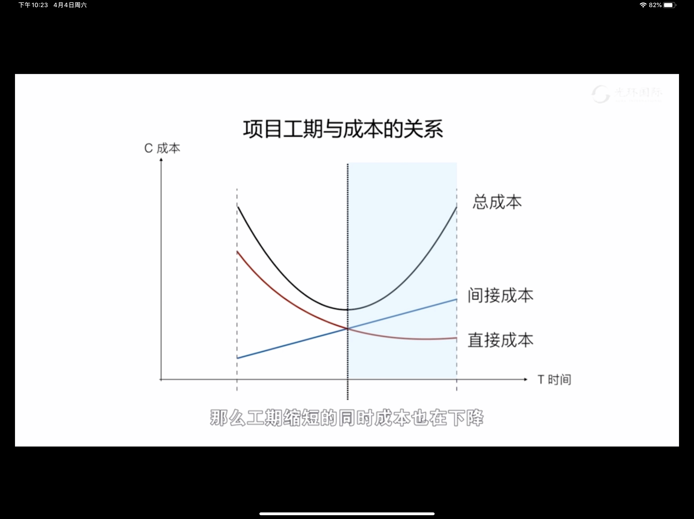

# 成本管理

- 成本管理的目标：在批准的预算内完成项目的工作

## 成本的分类

- 直接成本&间接成本
	
- 固定成本&可变成本
	
- 机会成本：在多个可选的**客观**机会中，当选择了一个机会，放弃了另外所有机会，放弃的所有机会当中能够带来的**最大**的**潜在收益**
- 沉没成本：已投入的成本
- 全生命周期成本：从项目的整个生命周期的角度去看待决策来带的对项目各阶段的成本变化，实现项目的成本最优。

## 项目的估算与预算

- 成本估算精确度等级

	|估算级别|项目阶段|目的|常用方法|估算精确度|
	|:-:|:-:|:-:|:-:|:-:|
	|粗略量级估算ROM（Rough Order of Magnitude）|启动阶段|可行性研究|类比估算|-25%~+75%|
	|预算级估算|规划阶段|编制预算|自下而上|-10%~25%|
	|确定性估算|规划阶段|签订合同|自下而上|-5%~+10%|

- 资金限制平衡：把项目资金支出计划与项目资金到位承诺进行对比，识别资金限制与计划支出之间的差异，必要时会调整工期、减少资源投入强度，以避免资金链断裂而导致项目失败。
	
- 项目预算的组成
	- 完工预算=成本基准
- 成本基准、支出与资金需求
	- 资金到位承诺=资金需求

	
## 挣值分析（Earned Value Method，EVM）

- 三个指标
	- PV（Planned Value 计划值）：计划单价*计划工作量
	- AC（Actual Cost 实际成本）：实际单价*实际工作量
	- EV（Earned Value 挣得值）：计划单价*实际工作量
- 两个偏差
	- 成本偏差：CV=EV-AC
		- >0：成本节约
		- <0：成本超支
	- 进度偏差：SV=EV-PV
		- >0：进度超前
		- <0：进度落后
	
- 挣值分析：挣值曲线及六个情况
	- 挣值曲线
		
	- 偏差的含义
		
		- 用钱来代表进度偏差：代表进度偏差的时间量等于该钱除以工作效率的时间；
	- 6种情况：
		
		|状态|状态说明|CV|SV|成本效率|应采取措施|助于理解|
		|:-:|:-:|:-:|:-:|:-:|:-:|:-:|
		|AC>PV>EV|进度落后，成本超支|<0|<0|很低|及时预警，全面强化成本绩效管理，必要时变更基准|（人活着钱花光了）|
		|AC>EV>PV|进度超前，成本超支|<0|>0|较低|降低成本，提高成本效率||
		|PV>AC>EV|进度落后，成本超支|<0|<0|较低|强化监督考核，加速项目，同时控制成本||
		|PV>EV>AC|进度落后，成本节约|>0|<0|较高|加大资源投入，采取激励措施，加速项目进展速度||
		|EV>PV>AC|进度超前，成本节约|>0|>0|很高|可以根据需要提前完成项目，或释放部分资源|（人死了钱没花光）
		|EV>AC>PC|进度超前，成本节约|>0|>0|较高|可适当抽调一部分人员加速其他进度较低的项目进展||

- 两个指数：用以比较多个项目之间的成本和进度
	- 成本绩效指数
		- CPI=EV/AC
			- <1.0成本超支
			- >1.0成本节约
	- 进度绩效指数
		- SPI=EV/PV
			- <1.0进度落后
			- >1.0进度超前
- 完工估算EAC
	- PB（Project Budget 项目预算）=BAC+管理储备
	- BAC（Budget at Completion 完工预算）=PMB（绩效测量基准）=CB（Cost Baeline 成本基准）
	- EAC（Estimate at Completion 完工估算）
		- 根据当前的评估时刻的状态，预测干完整个项目要花的总成本
		
		1. EAC=BAC/CPI：按当前实际单价继续直到完成项目（成本不纠正）
		2. EAC=AC+(BAC-EV)：AC是沉没成本，接下来的工作将按计划单价完成（成本纠正）
		3. EAC=AC+[(BAC-EV)/(CPI*SPI)]：接下来的工作都按当前的成本绩效和进度绩效完成（成本和季度都不纠正）
		
	- ETC（Estimate to Complete 完工尚需估算）=EAC-AC
	
	
	
- 完工尚需绩效指数TCPI（To-Comlete Performance Index）
	- TCPI0=(BAC-EV)/(BAC-AC)
		- 没干完的工作除以剩余的成本
	- TCPI1=(BAC-EV)/(EAC-AC)
		- 没干完的工作除以预测的完工估算的剩余量
			- 三种完工估算分别计算出来的TCPI：
				1. 当前成本绩效继续干的话需要单位成本需要被认可的比率
				2. 固定值1，按照计划成本效率继续干
				3. 延长进度，成本效率低，可被认可的单位成本最低
- 完工偏差：VAC=BAC-EAC
	
	
- 挣值的获得
	- 百分比法：每个工作包完成百分比累加
	- 50/50法：开始算一半，结束算一半
	- 20/80法：开始算20%，结束算80%
	- 0/100法：开始算0，结束算100%
	- 里程碑法：每个里程碑赋予不同的完成百分比
	- 容器法（主材消耗法）
- 挣得进度（ES，Earned Schedule）
	- SAC：完工进度
	- PAR计划完成速度=BAC/SAC
	- AT：实际时间
	- ES挣得进度=EV/PAR
	- TV偏差时间=ES-AT
	- TEAC：时间完工估算
		- TEAC=SAC-TV（已经耽误的时间是沉没成本，剩下的进度按计划完成速度进行）
		- TEAC=SAC/TPI（按照当前的时间绩效指数完成剩下的工作）
	- TVAC完工时间偏差=SAC-TEAC
	- TETC时间完工尚需估算=TEAC-AC
	- TPI时间绩效指数=ES/AT
	
	