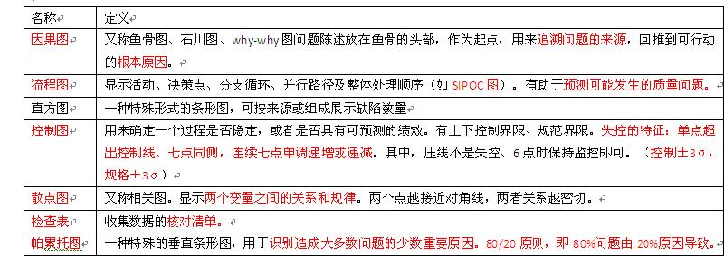

# 0316每日一题
### 题目
【正式学习阶段一】03.16群内习题

1. 项目经理发现产品可交付成果中存在缺陷，并希望识别根本原因。项目经理应采用哪种工具或方法【A】
	- A. 石川图
	- B. 帕累托图
	- C. 偏差和趋势分析
	- D. 直方图

2. 在检查一个产品批次期间，客户报告了一个缺陷。项目经理应使用什么来监测批次质量？【C】
	- A. 鱼骨图
	- B. 统计抽样
	- C. 控制图
	- D. 帕累托图

3. 由于出现多个质量问题，公司延期发布产品。项目经理应使用下列哪一项工具来说明产品质量问题的发生频率以及最常见的原因？【B】/A
	- A.直方图
	- B.因果图
	- C.控制图
	- D.统计抽样

4. 客户要求生产50000台风扇，制造公司的项目经理正在制定质量管理计划。项目经理应使用下列哪一项来减少缺陷并让产品质量达到最大化？【B】/A
	- A.帕累托图
	- B.控制图
	- C.因果图
	- D.直方图

5. 项目的可交付成果必须遵守法律指导方针。为了确保满足这些标准，项目经理为项目团队实施了有关这些指导方针的培训。
培训成本应归到下列哪一项？【A】
	- A.预防成本
	- B.评价成本
	- C.内部失败成本
	- D.外部失败成本

- 扩展资料（来自群-陈导）
	

            

### 答案
【正式学习阶段一】03.16群内习题

1. 项目经理发现产品可交付成果中存在缺陷，并希望识别根本原因。项目经理应采用哪种工具或方法？
	- A. 石川图
	- B. 帕累托图
	- C. 偏差和趋势分析
	- D. 直方图

	- 答案解析：A. 识别根本原因，用石川图。

2. 在检查一个产品批次期间，客户报告了一个缺陷。项目经理应使用什么来监测批次质量？
	- A. 鱼骨图
	- B. 统计抽样
	- C. 控制图
	- D. 帕累托图

	- 答案解析：C. 持续监控趋势，是否失控，使用控制图。

3. 由于出现多个质量问题，公司延期发布产品。项目经理应使用下列哪一项工具来说明产品质量问题的发生频率以及最常见的原因？
	- A.直方图
	- B.因果图
	- C.控制图
	- D.统计抽样

	- 答案解析：A. 直方图用数字和柱形的相对高度，直观地表示引发问题的最普遍的原因。

4. 客户要求生产50000台风扇，制造公司的项目经理正在制定质量管理计划。项目经理应使用下列哪一项来减少缺陷并让产品质量达到最大化？
	- A.帕累托图
	- B.控制图
	- C.因果图
	- D.直方图

	- 答案解析：A. 用来识别造成大多数问题的少数原因。

5. 项目的可交付成果必须遵守法律指导方针。为了确保满足这些标准，项目经理为项目团队实施了有关这些指导方针的培训。
培训成本应归到下列哪一项？
	- A.预防成本
	- B.评价成本
	- C.内部失败成本
	- D.外部失败成本

	- 答案解析：A. 参见PMBOK8.1.2.3；培训属于预防成本。