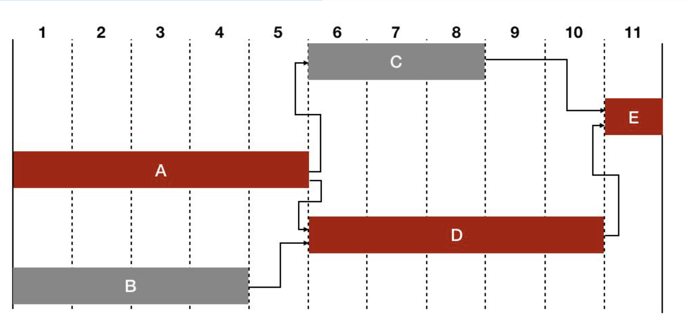

# PMP®远程第6章章节试题

6. [单选] 滞后的含义是：
The meaning of lag is:
	- A：不影响项目总工期的前提下，活动可以拖延的总时间；  
The total amount of time that activities can be delayed without affecting the overall project duration;
		- 是总浮动时间
	- B：不影响紧后工作最早开始时间的前提下，活动可以拖延的总时间；  
The total amount of time that activities can be delayed without affecting the earliest starting time of the tight work;
		- 是自由浮动时间
	- C：等待时间；  
waiting time;
		- 是滞后量
	- D：与紧前工作并行的时间。  
Time parallel to immediately preceding work.
		- 是提前量
	- 正确答案：C
	- 参考资料：
		- 自由浮动时间：活动的不影响后续工作最早可以开始时间的前提下，这项工作可以拖延的时间。
		- 总浮动时间：在不影响项目总工期的前提下，活动可以拖延的总时间
		- 提前量：相对于紧前活动，紧后活动可以提前的时间量。
		- 滞后量：相对于紧前活动，紧后活动需要推迟的时间量。
	- 做错原因：
		- 对定义模糊

10. [单选] 编制项目计划时项目经理发现资源已过载，但无法获得更多的资源，工期还有一定的余量，项目经理最好去：
The project resources had been overloaded but the project manager could not get more resources and there was still a certain amount of surplus in the project duration. What is the best thing for the project manager to do?
	- A：将非关键路径改为关键路径；  
Change the non-critical path to the critical path;
		- 将关键路径改为非关键路径并不能劫掠资源过载问题
	- B：快速跟进项目；  
Fast-tracking the project;
		- 快速跟进解决的是项目工期短缺的问题，题目中表明了工期还有一定余量
	- C：实施资源平衡；  
Implementation of resource level;
		- 资源平衡是解决资源过载问题的方法，而资源平衡可能会拖长项目的工期，也符合题目中提供的工期还有余量的情况
	- D：实施资源平滑。  
Implementation of resource smooth.
		- 资源平滑是解决资源波动问题的方法，不能解决资源过载问题。
	- 正确答案：C
	- 参考资料：
		- 资源平衡：为了在资源需求与资源供给之间取得平衡，根据资源制约因素对开始日期和完成日期进行调整的一种技术。
		- 资源平滑：对进度模型中的活动进行调整，从而使项目资源需求不超过预定的资源限制的一种技术。
		- 快速跟进：一种进度压缩技术，将正常情况下按顺序进行的活动或阶段改为至少是部分并行开展。
	- 做错原因：
		1. 审题不够彻底，把工期还有一定余量理解成工作还有一定的余量
		2. 概念理解不够彻底，没能够将工期的概念和资源平衡联系起来

13. [单选] 根据表格提供的信息，如果你需要将项目工期压缩1周，你首先应该压缩哪个活动？
According to the information provided in the table if you need to compress the project duration for one week which activity should you compress first?
66题目.png
	- A：活动 A  
Activity A
		- 活动A是最佳选择，因为压缩A活动可以将项目工期压缩1周，而且A在关键路径上，A也是关键路径上靠前的项目，压缩靠前的关键路径上的活动可以给后面的关键路径上的活动留有将来压缩的余地。
	- B：活动 B  
Activity B
		- B活动不在关键路径上，压缩B活动的工期并不能压缩项目的工期
	- C：活动 D  
Activity D
		- D活动虽然在项目的关键路径上，但并不是最佳选择，如果选择压缩B活动来压缩项目工期的话就会错过A活动，而将来可能永远没有机会压缩A活动。
	- D：活动 E  
Activity E
		- E活动本身需要1周的工期，不具备压缩1周的条件
	- 正确答案：A
	- 参考资料：
		- 解析：根据（图 66-1）我们可以看出 A-D-E 是关键路径，压缩工期首先要对关键路径下手，关键路径上有 ADE 三项活动，压缩哪个呢？ E 活动只有 1 周，再压缩 1 周是不可能的；A 和 D活动压缩哪个都可以实现工期缩短一周，这种情况下，应该压缩先发生的活动，那就是 A。 见（图 66-2），这样 D 活动还有机会留给以后需要的时候压缩，否则先压 D 的话，错过了 A，就再没有机会压缩 A 了。压缩 A 后，B 活动也在关键路径上了。
		
	- 做错原因：
		- 没有考虑到压缩D后将来没有机会压缩A的情况，以此可以学习到压缩工期优先选择关键路径上靠前的活动是最优的选择d